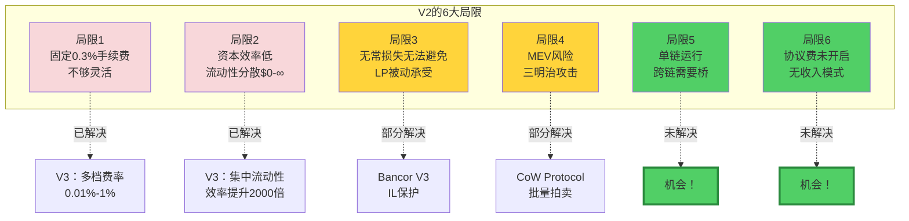
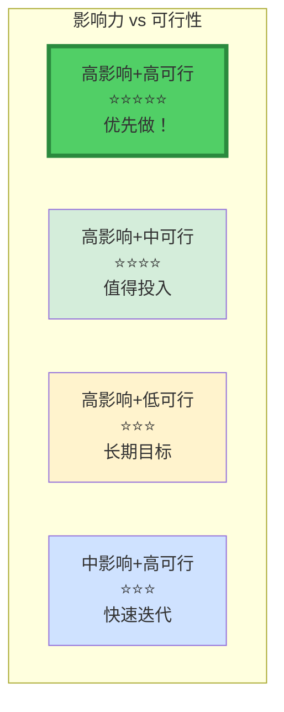
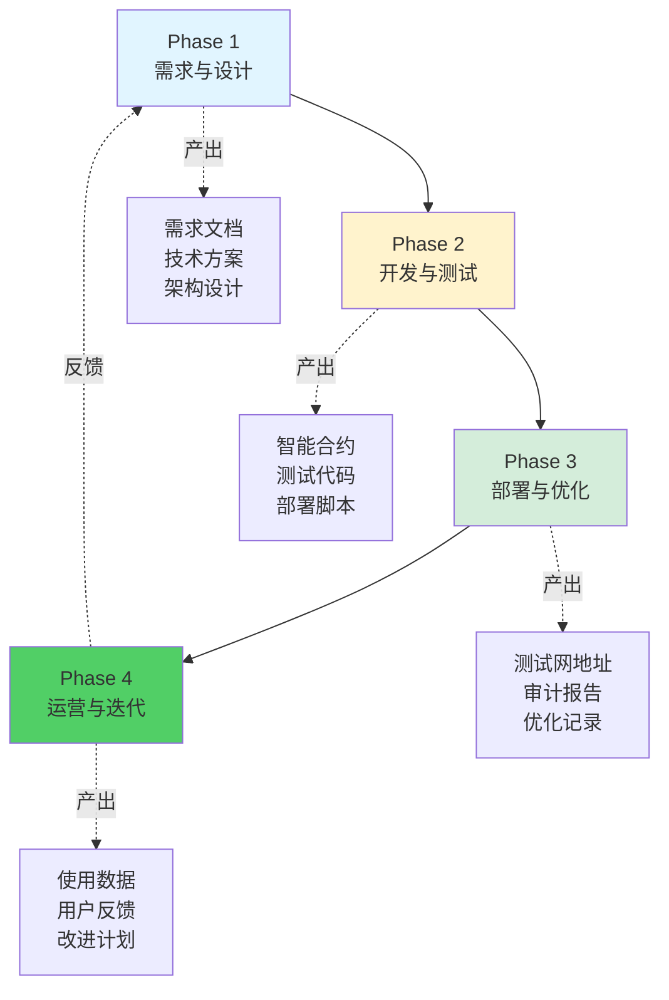
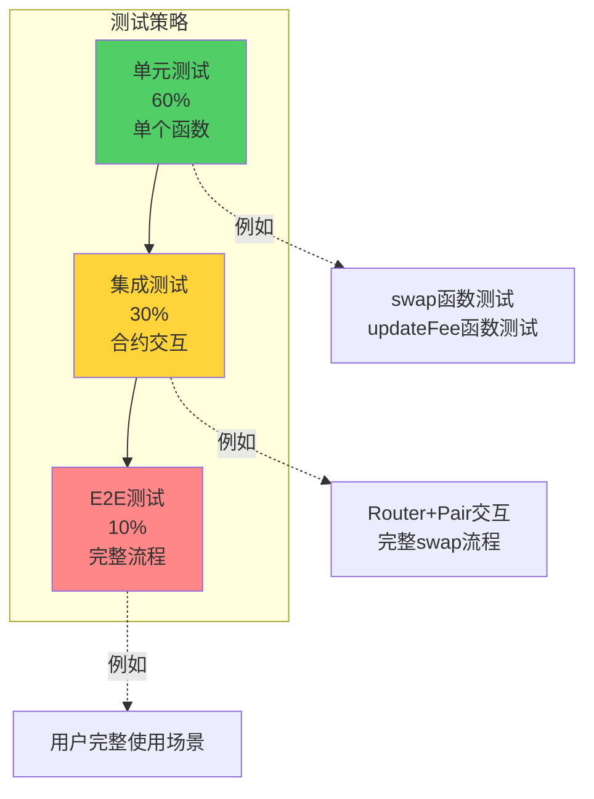
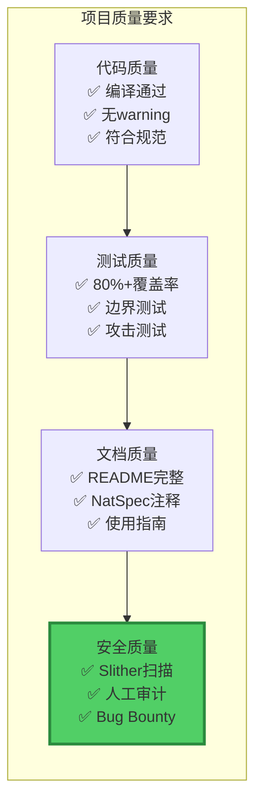

# 第5步：独立实战 - 创造（CREATE）

> 💡 **从Fork到创新：打造属于你的DeFi协议**
> 
> 这一步将理论转化为实践，从学习者变为创造者
> 
> ⏱️ 预计时间：2-8周（视项目复杂度）

---

## 📚 目录

1. [从Fork开始](#1-从fork开始)
2. [识别改进方向](#2-识别改进方向)
3. [项目实施框架](#3-项目实施框架)
4. [Uniswap V2改进项目库](#4-uniswap-v2改进项目库)
5. [完整实战案例](#5-完整实战案例)
6. [项目检查清单](#6-项目检查清单)

---

## 1. 从Fork开始

### 1.1 为什么从Fork开始？

```
站在巨人的肩膀上：

✅ 代码已经过验证
✅ 架构已经优化
✅ 安全已经审计
✅ 可以专注改进

vs 从零开始：
❌ 需要重新造轮子
❌ 容易出安全问题
❌ 耗时且低效
```

### 1.2 Fork流程

```bash
# 1. Fork Uniswap V2
git clone https://github.com/Uniswap/v2-core
cd v2-core

# 2. 创建你的项目
git remote rename origin upstream
git remote add origin <你的仓库>

# 3. 创建feature分支
git checkout -b feature/dynamic-fee

# 4. 开始改进！
```

---

## 2. 识别改进方向

### 2.1 Uniswap V2的已知局限



### 2.2 改进方向优先级

```
评估标准：

1. 影响力（用户价值）
   高：解决核心痛点
   中：改善用户体验
   低：锦上添花

2. 可行性（技术难度）
   高：可以在2-4周完成
   中：需要1-2个月
   低：需要>3个月

3. 创新性（差异化）
   高：市场上没有类似方案
   中：有参考但有改进
   低：已有成熟方案
```

**优先级矩阵：**



---

## 3. 项目实施框架

### 3.1 完整开发流程



### 3.2 Phase 1：需求与设计（Week 1）

**Day 1-2: 需求分析**

```markdown
## 需求文档模板

### 1. 项目概述
- 项目名称：DynamicFeeAMM
- 一句话描述：根据市场波动自动调整手续费的AMM
- 解决的问题：V2固定费率不够灵活

### 2. 用户分析
#### 目标用户1：稳定币交易者
- 需求：低手续费（<0.1%）
- 痛点：V2的0.3%太高
- 解决方案：稳定币对收0.05%

#### 目标用户2：波动币LP
- 需求：高收益补偿IL
- 痛点：V2的0.3%补偿不足
- 解决方案：波动币对收0.5-1%

### 3. 功能需求
- FR1：动态调整手续费
- FR2：基于波动率计算
- FR3：治理控制参数
- FR4：兼容V2 Router

### 4. 非功能需求
- NFR1：Gas效率（vs V2 +10%以内）
- NFR2：安全性（审计级别）
- NFR3：用户体验（无感知）
```

**Day 3-4: 技术方案设计**

```markdown
## 技术方案模板

### 1. 核心算法
\`\`\`
fee = f(volatility)

volatility = √(Σ(price_i - avgPrice)² / n)

fee_range = [minFee, maxFee]
```

### 2. 架构设计
```
DynamicFeeAMM (继承UniswapV2Pair)
├─ 新增：波动率计算
├─ 修改：swap函数（使用动态费率）
└─ 保持：其他逻辑不变
```

### 3. 接口定义
```solidity
interface IDynamicFeeAMM {
    function currentFee() external view returns (uint24);
    function updateFee() external;
    function getVolatility() external view returns (uint256);
}
```

### 4. 数据结构
```solidity
struct FeeConfig {
    uint24 minFee;
    uint24 maxFee;
    uint256 updateInterval;
}
```

### 5. 安全考虑
- 手续费范围限制
- 更新频率限制
- 治理控制机制
```

**Day 5-7: 原型验证**

```
□ 用Python/JavaScript实现算法原型
□ 模拟不同波动率场景
□ 验证手续费调整是否合理
□ 计算预期收益
```

---

### 3.3 Phase 2：开发与测试（Week 2）

**测试驱动开发（TDD）：**

```
先写测试，再写代码：

1. 写测试用例
   - 正常场景
   - 边界场景
   - 攻击场景

2. 运行测试（失败）
   - 测试失败是正常的

3. 编写实现
   - 让测试通过

4. 重构优化
   - 改进代码质量

5. 重复
   - 直到所有功能完成
```

**测试金字塔：**



---

## 4. Uniswap V2改进项目库

### 4.1 初级项目（1-2周）

#### **项目1.1：简单的动态手续费**

```solidity
// 最简实现
contract SimpleDynamicFeeAMM is UniswapV2Pair {
    uint24 public fee = 3000;  // 默认0.3%
    address public admin;
    
    function setFee(uint24 newFee) external {
        require(msg.sender == admin);
        require(newFee >= 10 && newFee <= 10000);  // 0.01%-1%
        fee = newFee;
    }
    
    // 修改swap使用动态费率
    function swap(...) external override {
        uint amountInWithFee = amountIn * (10000 - fee) / 10000;
        // ...
    }
}
```

**学习重点：**
- ✅ 如何修改V2源码
- ✅ 如何添加新参数
- ✅ 如何保持兼容性

---

#### **项目1.2：时间加权手续费**

```solidity
contract TimeWeightedFeeAMM is UniswapV2Pair {
    uint24 public baseFee = 3000;
    
    function getCurrentFee() public view returns (uint24) {
        uint256 timeElapsed = block.timestamp - lastSwapTime;
        
        // 交易越频繁，手续费越低（鼓励流动性）
        if (timeElapsed < 1 minutes) {
            return baseFee * 80 / 100;  // 0.24%
        } else if (timeElapsed < 10 minutes) {
            return baseFee;              // 0.3%
        } else {
            return baseFee * 120 / 100;  // 0.36%
        }
    }
}
```

**学习重点：**
- ✅ 基于时间的动态调整
- ✅ 激励机制设计

---

### 4.2 中级项目（2-4周）

#### **项目2.1：基于Chainlink的动态手续费**

```solidity
contract ChainlinkDynamicFeeAMM is UniswapV2Pair {
    AggregatorV3Interface public volatilityFeed;
    
    function updateFee() external {
        // 1. 从Chainlink获取波动率
        (, int256 volatility,,,) = volatilityFeed.latestRoundData();
        
        // 2. 计算手续费
        uint24 newFee;
        if (volatility < 1000) {
            newFee = 500;   // 低波动：0.05%
        } else if (volatility < 5000) {
            newFee = 3000;  // 中波动：0.3%
        } else {
            newFee = 10000; // 高波动：1%
        }
        
        currentFee = newFee;
    }
}
```

**学习重点：**
- ✅ 集成Chainlink预言机
- ✅ 外部数据处理
- ✅ 预言机安全性

---

#### **项目2.2：无常损失保护池**

```solidity
contract ILProtectionPool {
    // LP存款信息
    struct Deposit {
        uint256 lpAmount;
        uint256 depositPrice;
        uint256 depositTime;
    }
    
    mapping(address => Deposit) public deposits;
    
    // 保险资金池
    uint256 public insuranceFund;
    uint256 public constant INSURANCE_FEE = 100; // 1% APR
    
    function depositWithProtection(uint256 lpAmount) external {
        // 1. 收取保险费
        uint256 fee = lpAmount * INSURANCE_FEE / 10000 / 365;
        insuranceFund += fee;
        
        // 2. 记录存款信息
        deposits[msg.sender] = Deposit({
            lpAmount: lpAmount,
            depositPrice: getCurrentPrice(),
            depositTime: block.timestamp
        });
        
        lpToken.transferFrom(msg.sender, address(this), lpAmount);
    }
    
    function withdrawWithCompensation(uint256 lpAmount) external {
        Deposit memory deposit = deposits[msg.sender];
        
        // 1. 计算无常损失
        uint256 currentPrice = getCurrentPrice();
        uint256 il = calculateIL(deposit.depositPrice, currentPrice);
        
        // 2. 如果IL超过阈值，赔付
        if (il > 500) {  // IL > 5%
            uint256 compensation = lpAmount * il * 50 / 10000;  // 赔付50%
            require(insuranceFund >= compensation, "Insufficient fund");
            
            insuranceFund -= compensation;
            token.transfer(msg.sender, compensation);
        }
        
        // 3. 返还LP代币
        lpToken.transfer(msg.sender, lpAmount);
        delete deposits[msg.sender];
    }
    
    function calculateIL(uint256 priceOld, uint256 priceNow) 
        internal 
        pure 
        returns (uint256) 
    {
        // IL公式：2√r/(r+1) - 1
        uint256 r = priceNow * 1e18 / priceOld;
        uint256 sqrtR = sqrt(r);
        
        // 简化计算，返回百分比
        uint256 il = (2 * sqrtR * 10000 / (r + 1e18)) - 10000;
        return il > 10000 ? 10000 : il;  // 最大100%
    }
}
```

**学习重点：**
- ✅ 保险机制设计
- ✅ 无常损失计算
- ✅ 风险池管理

---

## 5. 完整实战案例：动态手续费AMM

### 5.1 项目规划（Week 1）

**Day 1-2: 需求分析**

```markdown
## 项目：DynamicFeeAMM

### 核心需求
让手续费根据市场波动自动调整

### 技术指标
- 稳定币对：0.05-0.1%
- 主流币对：0.2-0.5%
- 山寨币对：0.5-2%

### 成功标准
- Gas成本 < V2的110%
- 稳定币交易量增加30%+
- LP收益提升20%+
```

**Day 3-5: 技术设计**

```solidity
// 核心接口设计
interface IDynamicFeeAMM {
    // 查询当前手续费
    function currentFee() external view returns (uint24);
    
    // 手动触发更新（任何人可调用）
    function updateFee() external;
    
    // 查询历史波动率
    function getVolatility(uint256 period) external view returns (uint256);
    
    // 治理设置参数
    function setFeeParams(uint24 minFee, uint24 maxFee) external;
}
```

**Day 6-7: 编写测试**

```javascript
describe("DynamicFeeAMM", function() {
    it("应该根据波动率调整手续费", async function() {
        // 1. 初始状态：低波动，低手续费
        expect(await pair.currentFee()).to.equal(500);
        
        // 2. 模拟价格波动
        await simulateVolatility(2000);  // 20%波动
        
        // 3. 更新手续费
        await pair.updateFee();
        
        // 4. 验证手续费增加
        expect(await pair.currentFee()).to.equal(10000);  // 1%
    });
    
    it("应该在边界条件下正常工作", async function() {
        // 测试极端波动率
        // 测试手续费上下限
        // 测试连续调整
    });
});
```

---

### 5.2 开发实施（Week 2）

**完整合约实现：**

```solidity
// SPDX-License-Identifier: MIT
pragma solidity ^0.8.20;

import "./interfaces/IUniswapV2Pair.sol";
import "@chainlink/contracts/src/v0.8/interfaces/AggregatorV3Interface.sol";

contract DynamicFeeAMM {
    // 手续费配置
    uint24 public currentFee = 3000;  // 0.3%（默认）
    uint24 public minFee = 100;       // 0.01%
    uint24 public maxFee = 20000;     // 2%
    
    // 波动率追踪
    uint256 public lastPrice;
    uint256 public lastUpdateTime;
    uint256[24] public priceHistory;
    uint8 public priceHistoryIndex;
    
    // 治理
    address public governance;
    
    // Chainlink预言机（可选）
    AggregatorV3Interface public volatilityOracle;
    
    // ===== 核心函数 =====
    
    function updateFee() external {
        require(
            block.timestamp >= lastUpdateTime + 24 hours,
            "Too early to update"
        );
        
        // 1. 计算24小时波动率
        uint256 volatility = calculateVolatility();
        
        // 2. 根据波动率确定手续费
        uint24 newFee = calculateFeeFromVolatility(volatility);
        
        // 3. 限制在范围内
        if (newFee < minFee) newFee = minFee;
        if (newFee > maxFee) newFee = maxFee;
        
        // 4. 更新
        currentFee = newFee;
        lastUpdateTime = block.timestamp;
        
        // 5. 更新价格历史
        uint256 currentPrice = uint256(reserve1) * 1e18 / uint256(reserve0);
        priceHistory[priceHistoryIndex] = currentPrice;
        priceHistoryIndex = (priceHistoryIndex + 1) % 24;
        
        emit FeeUpdated(newFee, volatility);
    }
    
    function calculateVolatility() internal view returns (uint256) {
        uint256 sum = 0;
        uint256 avg = 0;
        
        // 1. 计算平均价格
        for (uint i = 0; i < 24; i++) {
            avg += priceHistory[i];
        }
        avg = avg / 24;
        
        // 2. 计算方差
        for (uint i = 0; i < 24; i++) {
            uint256 diff = priceHistory[i] > avg 
                ? priceHistory[i] - avg 
                : avg - priceHistory[i];
            sum += diff * diff;
        }
        
        // 3. 返回标准差（波动率）
        return sqrt(sum / 24);
    }
    
    function calculateFeeFromVolatility(uint256 volatility) 
        internal 
        pure 
        returns (uint24) 
    {
        // 波动率映射到手续费
        // volatility: 0-1000 → fee: 500 (0.05%)
        // volatility: 1000-5000 → fee: 3000 (0.3%)
        // volatility: >5000 → fee: 10000 (1%)
        
        if (volatility < 1000) {
            return 500;
        } else if (volatility < 5000) {
            // 线性插值
            return uint24(500 + (volatility - 1000) * 2500 / 4000);
        } else {
            return 10000;
        }
    }
    
    // ===== 修改的swap函数 =====
    
    function swap(
        uint amount0Out,
        uint amount1Out,
        address to,
        bytes calldata data
    ) external lock {
        // ... V2的逻辑
        
        // 关键修改：使用currentFee代替固定的997
        uint balance0Adjusted = balance0 * 10000 - amount0In * currentFee;
        uint balance1Adjusted = balance1 * 10000 - amount1In * currentFee;
        
        require(
            balance0Adjusted * balance1Adjusted >= 
            uint(reserve0) * uint(reserve1) * 10000**2,
            'K'
        );
        
        // ...
    }
}
```

---

### 5.3 部署与优化（Week 3）

```bash
# 1. 部署到测试网
npx hardhat run scripts/deploy.js --network sepolia

# 2. 验证合约
npx hardhat verify --network sepolia <合约地址> <构造函数参数>

# 3. 功能测试
npx hardhat test --network sepolia

# 4. Gas分析
npx hardhat test --gas-reporter
```

---

## 6. 项目检查清单

### 6.1 完成度检查

```
□ Phase 1：设计
  □ 需求文档
  □ 技术方案
  □ 架构图
  □ 接口定义

□ Phase 2：开发
  □ 核心合约
  □ 测试用例（>80%覆盖率）
  □ 部署脚本

□ Phase 3：质量
  □ Gas优化
  □ 安全审计
  □ 代码审查

□ Phase 4：部署
  □ 测试网部署
  □ 功能验证
  □ 文档完善

□ Phase 5：分享
  □ 开源到GitHub
  □ 写技术博客
  □ 社区分享
```

### 6.2 质量标准



---

## ✅ 成功标准

项目成功的标志：

```
技术层面：
✅ 代码可运行
✅ 测试全部通过
✅ Gas成本可接受
✅ 安全性验证

产品层面：
✅ 解决了真实问题
✅ 有用户愿意使用
✅ 创造了实际价值

学习层面：
✅ 掌握了新技能
✅ 理解了新概念
✅ 建立了作品集

最重要的：
✅ 从学习者变为创造者！
```

---

## 🎓 总结

**第5步是最关键的一步：**

```
前4步：理解别人的协议
第5步：创造自己的协议

前4步：被动学习
第5步：主动创造

前4步：知识积累
第5步：能力提升

只有完成第5步，
才算真正掌握了DeFi协议设计！
```

---

**现在，开始你的创造之旅吧！** 🚀

**推荐：** 从动态手续费AMM开始，2周完成第一个项目！

**加油！** 💪
