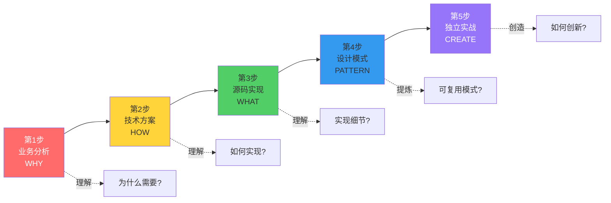
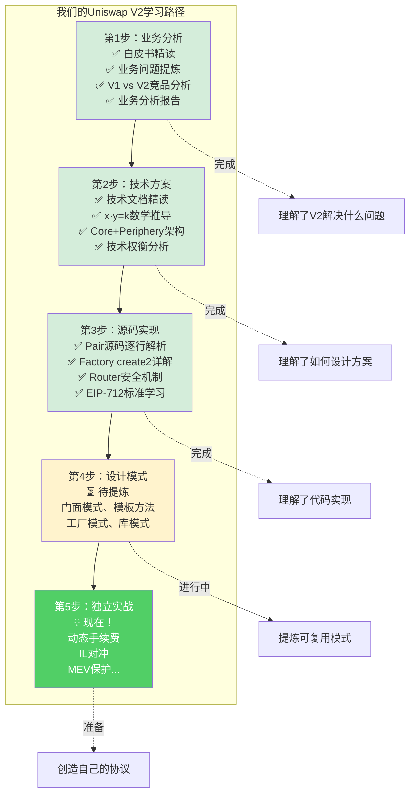
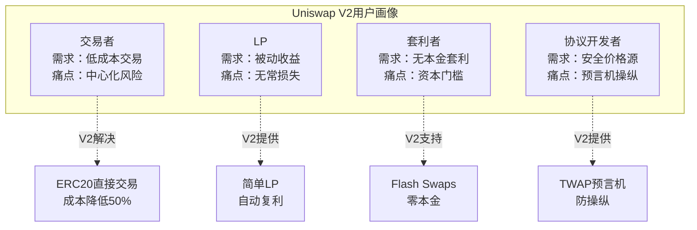
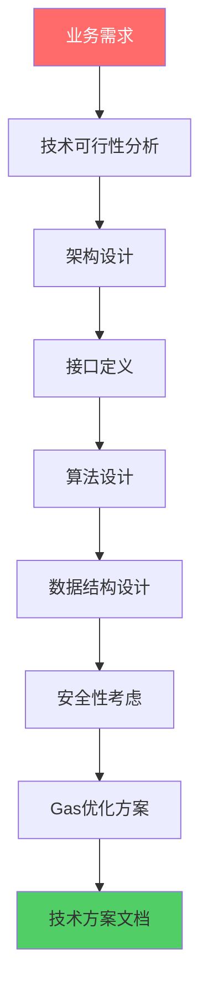
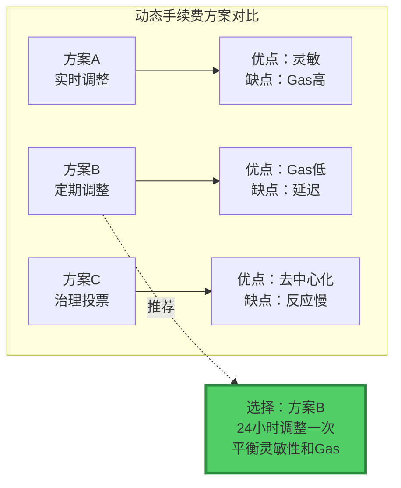
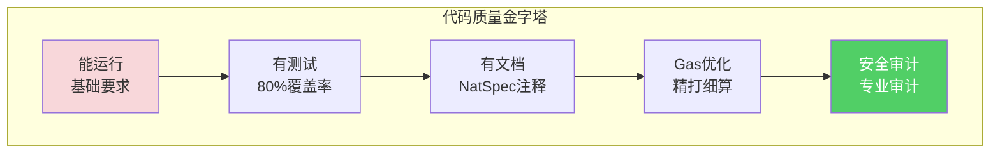
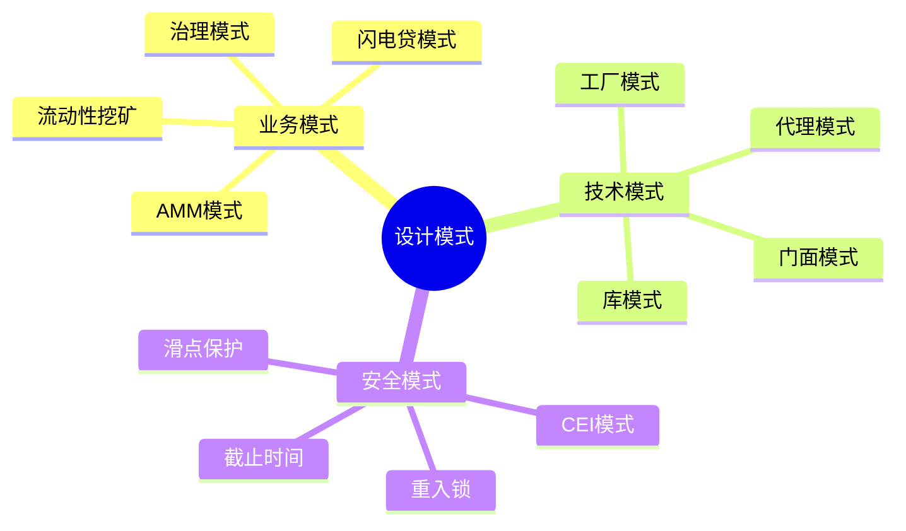
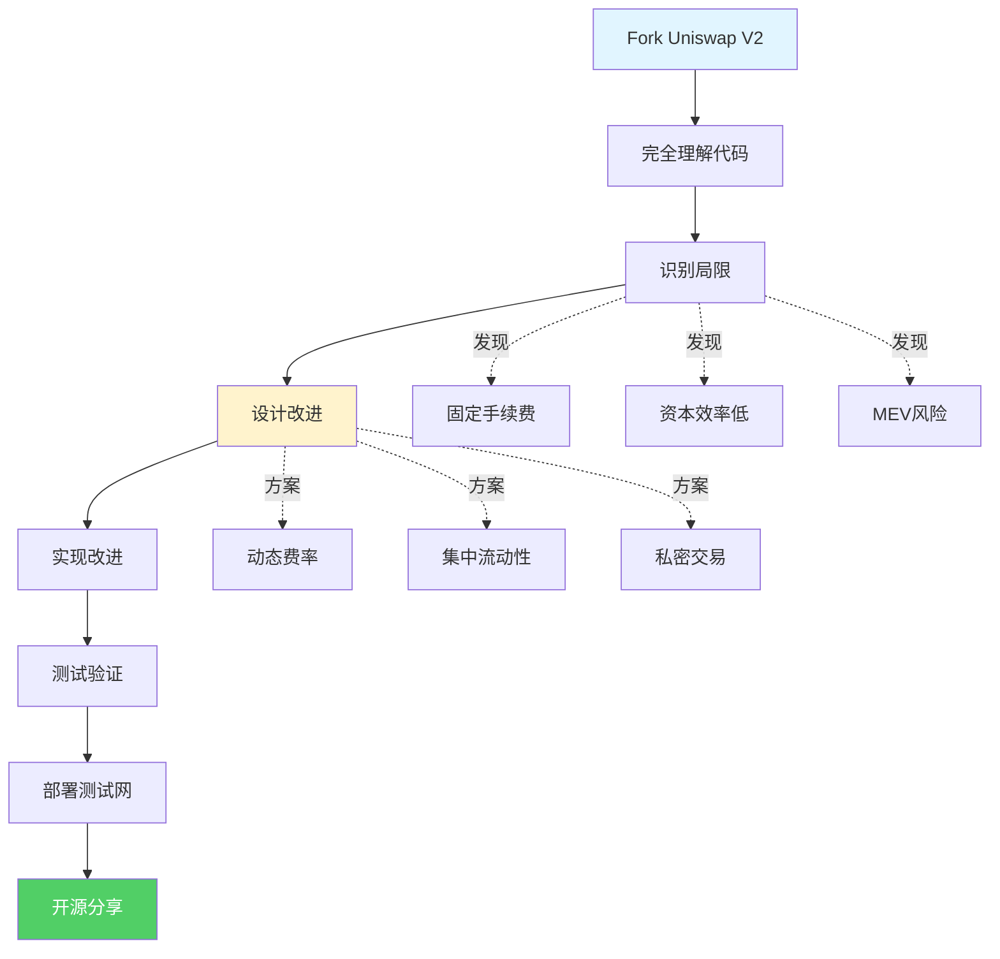
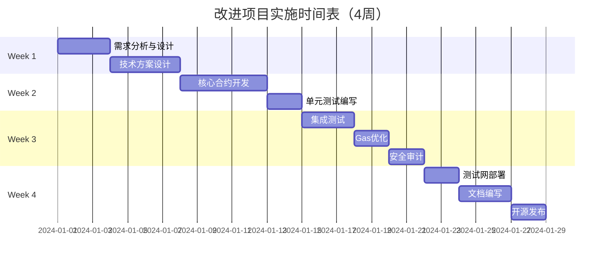

# 5步学习法详解

> 💡 **从业务到代码：系统化的DeFi协议学习方法**
> 
> 这是我们在Uniswap V2学习中实践的方法论
> 
> ⏱️ 预计学习时间：2小时理论 + 实践中不断应用

---

## 📚 目录

1. [5步学习法概览](#1-5步学习法概览)
2. [第1步：业务分析（WHY）](#2-第1步业务分析why)
3. [第2步：技术方案（HOW）](#3-第2步技术方案how)
4. [第3步：源码实现（WHAT）](#4-第3步源码实现what)
5. [第4步：设计模式（PATTERN）](#5-第4步设计模式pattern)
6. [第5步：独立实战（CREATE）](#6-第5步独立实战create)
7. [方法论应用案例](#7-方法论应用案例)

---

## 1. 5步学习法概览

### 1.1 核心思想



### 1.2 为什么是5步？

```
传统学习方法的问题：

只看源码（WHAT）：
❌ 知道怎么实现
❌ 不知道为什么这样设计
❌ 无法举一反三
❌ 只会照抄

5步学习法的优势：

WHY（业务）+ HOW（方案）+ WHAT（代码）：
✅ 理解设计动机
✅ 理解技术选择
✅ 理解实现细节

+ PATTERN（模式）+ CREATE（创造）：
✅ 提炼可复用知识
✅ 培养独立思考
✅ 能够创新改进

从理解到创造的完整路径！
```

### 1.3 以Uniswap V2为例



---

## 2. 第1步：业务分析（WHY）

> 🎯 **目标：理解为什么需要这个协议**

### 2.1 核心问题

```
在看任何代码之前，先回答3个问题：

1. 解决什么问题？
   用户的痛点是什么？

2. 为谁解决？
   目标用户是谁？

3. 如何创造价值？
   商业模式是什么？
```

### 2.2 业务分析工具

**工具1：用户画像**



**工具2：价值主张画布**

```
┌─────────────────────────────────────────────────┐
│        Uniswap V2 价值主张画布                   │
├──────────────────┬──────────────────────────────┤
│   产品与服务      │      收益创造者               │
├──────────────────┼──────────────────────────────┤
│• ERC20直接交易   │• 节省50%交易成本              │
│• TWAP预言机      │• 安全的链上价格源             │
│• Flash Swaps     │• 无需本金即可套利             │
│• 自动做市        │• 人人都能成为LP               │
├──────────────────┼──────────────────────────────┤
│   痛点缓解者      │      用户痛点                 │
├──────────────────┼──────────────────────────────┤
│• 去中心化        │• CEX中心化风险                │
│• 无需许可        │• 审查和KYC                   │
│• 永不停机        │• 交易时间限制                 │
│• 透明公开        │• 黑箱操作                     │
└──────────────────┴──────────────────────────────┘
```

### 2.3 实战练习：分析你的改进方向

**以动态手续费为例：**

```
业务分析问题清单：

□ 解决什么问题？
  → 稳定币交易手续费过高
  → 波动币交易风险补偿不足

□ 为谁解决？
  → 稳定币交易者（降低成本）
  → 波动币LP（增加收益）

□ 如何创造价值？
  → 吸引更多稳定币交易量
  → 减少LP的无常损失风险

□ 竞品对比？
  → Curve：0.04%固定费率
  → 你的方案：0.05-1%动态费率
  → 优势：更灵活，适应性强

□ 商业模式？
  → 手续费收入
  → 可能的协议费分成

□ 护城河？
  → 首个动态费率的AMM
  → 技术创新
  → 先发优势
```

---

## 3. 第2步：技术方案（HOW）

> 🎯 **目标：设计实现方案**

### 3.1 技术方案设计流程



### 3.2 架构设计模板

```
技术方案检查清单：

□ 核心算法是什么？
  动态手续费：fee = f(volatility)

□ 数据结构如何设计？
  - 存储波动率历史
  - 存储手续费历史

□ 合约如何分层？
  - Core：修改后的Pair
  - Periphery：兼容的Router

□ 如何保证安全？
  - 手续费范围限制（0.01%-2%）
  - 调整频率限制（每24小时）
  - 治理控制

□ 如何优化Gas？
  - 波动率计算用链下预言机
  - 手续费用uint24存储
  - 批量更新
```

### 3.3 技术权衡分析



---

## 4. 第3步：源码实现（WHAT）

> 🎯 **目标：将方案转化为代码**

### 4.1 实现清单

```
从技术方案到代码：

□ 编写核心合约
  - DynamicFeeAMM.sol
  - VolatilityOracle.sol

□ 编写接口
  - IDynamicFeeAMM.sol
  - IVolatilityOracle.sol

□ 编写Library
  - FeeCalculator.sol
  - VolatilityMath.sol

□ 编写测试
  - 单元测试
  - 集成测试
  - 模糊测试

□ 部署脚本
  - 部署顺序
  - 初始化参数
  - 验证脚本

□ 文档
  - README
  - API文档
  - 使用指南
```

### 4.2 代码质量标准



---

## 5. 第4步：设计模式（PATTERN）

> 🎯 **目标：提炼可复用的模式**

### 5.1 三类设计模式



### 5.2 从Uniswap V2提炼的模式

**业务模式：**

```
1. 双边市场模式
   - LP提供流动性
   - Trader消费流动性
   - 手续费连接双方

2. 数学定价模式
   - x·y=k自动定价
   - 无需人工干预
   - 透明可验证

3. 无需许可模式
   - 任何人可创建Pair
   - 任何人可提供流动性
   - 任何人可交易
```

**技术模式：**

```
1. 分层架构
   - Core不可变（安全）
   - Periphery可升级（灵活）

2. 工厂模式
   - Factory统一创建Pair
   - create2确定性部署

3. 门面模式
   - Router简化用户接口
   - 封装复杂逻辑
```

**安全模式：**

```
1. 检查-生效-交互（CEI）
   - 先检查条件
   - 再改变状态
   - 最后外部调用

2. 乐观执行
   - 先转账（Flash Swap）
   - 后验证
   - 失败回滚

3. 多重验证
   - deadline检查
   - 滑点保护
   - k值验证
```

---

## 6. 第5步：独立实战（CREATE）

> 🎯 **目标：创造属于你的协议**

### 6.1 从Fork到创新



### 6.2 创新方向思考框架

**问自己7个问题：**

```
1. V2最大的痛点是什么？
   → 资本效率低、固定费率

2. V3已经解决了什么？
   → 集中流动性、多档费率

3. V3没有解决什么？
   → MEV问题、IL问题、跨链问题

4. 我能在V2基础上改进什么？
   → 动态费率、IL对冲、MEV保护

5. 技术上可行吗？
   → 评估难度、所需时间

6. 有现成的参考吗？
   → Curve、Balancer、CoW Protocol

7. 独特价值是什么？
   → 你的方案比现有方案好在哪？
```

### 6.3 项目实施步骤



---

## 7. 方法论应用案例

### 7.1 案例：设计动态手续费AMM

让我用5步法演示如何设计这个项目：

#### **第1步：业务分析**

```
WHY - 为什么需要动态手续费？

问题：
- V2固定0.3%对所有代币对一视同仁
- 稳定币对：手续费过高，失去竞争力
- 波动币对：手续费过低，LP风险补偿不足

用户：
- 稳定币交易者：需要低手续费
- 波动币LP：需要高收益补偿IL
- 套利者：希望平衡各市场价格

价值：
- 吸引更多稳定币交易量
- 提高LP在波动市场的收益
- 优化整体资本效率
```

#### **第2步：技术方案**

```
HOW - 如何实现？

核心算法：
fee = baseF

ee + volatility × feeMultiplier

数据结构：
- 存储24小时价格数据（环形缓冲区）
- 存储当前手续费率（uint24）

架构设计：
- 继承UniswapV2Pair
- 新增VolatilityOracle模块
- 保持Router兼容

安全考虑：
- 手续费范围：0.01% - 2%
- 调整频率：每24小时
- 治理控制手续费参数

Gas优化：
- 批量更新价格数据
- 链下计算，链上验证
- 紧凑存储
```

#### **第3步：源码实现**

```solidity
// WHAT - 代码实现
contract DynamicFeeAMM is UniswapV2Pair {
    // 状态变量
    uint24 public currentFee = 3000;  // 0.3%（默认）
    uint256 public lastUpdateTime;
    uint256[24] public priceHistory;  // 24小时价格历史
    uint8 public priceIndex;
    
    // 更新手续费
    function updateFee() external {
        require(block.timestamp >= lastUpdateTime + 24 hours);
        
        // 1. 计算波动率
        uint256 volatility = calculateVolatility();
        
        // 2. 计算新手续费
        uint24 newFee;
        if (volatility < 100) {          // 波动率<1%
            newFee = 500;                 // 0.05%
        } else if (volatility < 1000) {  // 波动率<10%
            newFee = 3000;                // 0.3%
        } else {                          // 波动率>10%
            newFee = 10000;               // 1%
        }
        
        // 3. 更新
        currentFee = newFee;
        lastUpdateTime = block.timestamp;
        
        emit FeeUpdated(newFee, volatility);
    }
    
    // 修改swap函数使用动态费率
    function swap(...) external override lock {
        // 使用currentFee代替固定的997
        uint amountInWithFee = amountIn.mul(10000 - currentFee) / 10000;
        // ... 其他逻辑保持不变
    }
}
```

#### **第4步：设计模式**

```
PATTERN - 提炼模式

可复用的模式：

1. 动态参数模式
   - 任何固定参数都可以动态化
   - 根据市场条件调整
   - Curve、Balancer都在用

2. 预言机集成模式
   - 需要链下数据时
   - 集成Chainlink等预言机
   - 或自建TWAP

3. 治理参数模式
   - 重要参数由治理控制
   - 防止中心化风险
   - 平衡灵活性和安全性
```

#### **第5步：独立实战**

```
CREATE - 实现并改进

实施计划：

Week 1: 开发
□ 实现DynamicFeeAMM合约
□ 编写单元测试
□ 本地测试通过

Week 2: 优化
□ Gas优化
□ 安全审计
□ 边界测试

Week 3: 部署
□ 部署到Sepolia
□ 功能测试
□ 收集反馈

Week 4: 完善
□ 修复bug
□ 优化体验
□ 准备主网部署（可选）
```

---

## ✅ 学习检查清单

- [ ] 理解5步学习法的核心思想
- [ ] 掌握每一步的关键问题
- [ ] 能用5步法分析Uniswap V2
- [ ] 能用5步法设计新协议
- [ ] 知道如何提炼设计模式
- [ ] 掌握从Fork到创新的路径

---

## 🎓 总结

**5步学习法的精髓：**

```
第1步（WHY）：理解问题
第2步（HOW）：设计方案
第3步（WHAT）：编写代码
第4步（PATTERN）：提炼知识
第5步（CREATE）：创新创造

从被动学习 → 主动创造
从复制代码 → 独立设计
从理解别人 → 启发别人

这是成为优秀开发者的必经之路！
```

---

**下一步：** [业务思维基础](../14.1-业务思维基础/README.md) - 培养产品思维

**准备好开始你的创造之旅了吗？** 🚀💪
