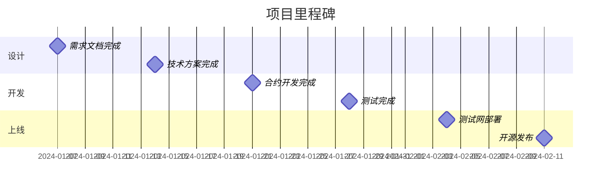

# 需求分析实战：改进Uniswap V2

> 💡 **手把手教你分析需求、设计方案**
> 
> 以"动态手续费AMM"为完整案例
> 
> ⏱️ 预计时间：4小时

---

## 📚 实战目标

通过完整的需求分析，你将能够：

✅ 识别Uniswap V2的改进机会
✅ 分析用户需求和痛点
✅ 设计解决方案
✅ 评估技术可行性
✅ 制定实施计划

---

## 1. 问题发现

### 1.1 从数据开始

**观察市场数据：**

```
Uniswap V2数据（2024）：
├─ 总TVL：$3-5B
├─ 日交易量：$1-2B
└─ 市场份额：20-25%

Curve数据（2024）：
├─ 总TVL：$4-6B
├─ 日交易量：$500M-1B
└─ 稳定币市场份额：>60%

对比发现：
⚠️ Curve在稳定币市场占优
⚠️ Uniswap稳定币交易量下降
⚠️ 原因：Curve手续费只有0.04%，Uniswap是0.3%
```

**用户反馈：**

```
Reddit/Twitter/Discord上的抱怨：

用户A："我swap USDC/USDT，
       Uniswap收0.3%，
       Curve只收0.04%，
       我为什么要用Uniswap？"

用户B："我提供SHIB/DOGE流动性，
       币价波动30%+，
       无常损失20%，
       0.3%手续费根本不够，
       我亏大了！"

→ 痛点清晰！
```

### 1.2 问题定义

**核心问题：**

```
Uniswap V2的固定0.3%手续费：
❌ 对稳定币对：手续费过高
❌ 对波动币对：手续费过低

结果：
📉 失去稳定币市场
📉 LP在波动市场亏损
📉 整体竞争力下降
```

---

## 2. 需求分析

### 2.1 用户角色定义

**角色1：稳定币交易者**

```markdown
## 用户画像：稳定币交易者

### 基本信息
- 典型用户：加密货币新手、机构
- 交易频率：高频（每天多次）
- 交易金额：$1K-$100K

### 需求
1. 低手续费（核心需求）⭐⭐⭐⭐⭐
2. 低滑点
3. 快速确认

### 痛点
1. Uniswap手续费0.3%太贵
2. 大额交易滑点高
3. 竞品Curve更便宜

### 解决方案
→ 稳定币对手续费降低到0.05-0.1%
→ 吸引交易量回流
```

**角色2：波动币LP**

```markdown
## 用户画像：波动币LP

### 基本信息
- 典型用户：DeFi老手、风险偏好者
- 持有时间：中长期（数周到数月）
- 投入金额：$5K-$500K

### 需求
1. 高收益补偿IL ⭐⭐⭐⭐⭐
2. 风险可控
3. 退出灵活

### 痛点
1. 无常损失巨大（>20%）
2. 0.3%手续费补偿不足
3. 整体亏损

### 解决方案
→ 波动币对手续费提高到0.5-1%
→ 提供更多收益补偿IL
```

### 2.2 需求优先级

```mermaid
graph TB
    subgraph "需求优先级（按影响力×紧迫性）"
        P0[P0：动态手续费核心功能<br/>影响：极高 | 紧迫：极高]
        P1[P1：治理控制参数<br/>影响：高 | 紧迫：中]
        P2[P2：Chainlink集成<br/>影响：中 | 紧迫：低]
        P3[P3：前端界面<br/>影响：中 | 紧迫：低]
    end
    
    P0 -.MVP.-> M[最小可行产品]
    P1 -.V1.0.-> V1[第一版]
    P2 -.V1.1.-> V11[迭代版]
    P3 -.V1.2.-> V12[完善版]
    
    style P0 fill:#ff8787
    style P1 fill:#ffd43b
    style M fill:#51cf66,stroke:#2b8a3e,stroke-width:3px
```

---

## 3. 解决方案设计

### 3.1 方案对比

| 方案 | 优点 | 缺点 | 评分 |
|------|------|------|------|
| **A：实时调整** | 灵敏 | Gas极高 | ⭐⭐ |
| **B：每24h调整** | Gas可控 | 有延迟 | ⭐⭐⭐⭐ |
| **C：治理投票** | 去中心化 | 反应太慢 | ⭐⭐ |
| **D：预言机驱动** | 准确 | 依赖外部 | ⭐⭐⭐ |

**选择：方案B（24小时调整）**

理由：
- Gas成本可接受
- 24小时足够反映趋势
- 避免被短期波动误导

---

## 4. 可行性分析

### 4.1 技术可行性

```
✅ 可行性高：

1. 基于V2修改
   - 只需修改swap函数
   - 新增updateFee函数
   - 其他逻辑不变

2. 技术风险低
   - 波动率计算简单
   - 手续费映射直接
   - 无复杂依赖

3. 实施周期短
   - 2周开发
   - 1周测试
   - 1周部署
```

### 4.2 经济可行性

```
预期收益：

假设吸引$50M稳定币TVL：
├─ 日交易量：$10M（20% turnover）
├─ 手续费：0.05%
├─ 日收入：$5K
└─ 年收入：$1.825M

vs V2（0.3%但只有$10M TVL）：
├─ 日交易量：$2M
├─ 手续费：0.3%
├─ 日收入：$6K
└─ 年收入：$2.19M

虽然单笔收益降低
但交易量增加5倍
总收入持平甚至更高！
```

---

## 5. 实施计划

### 5.1 Sprint规划（4周）

```
Sprint 1（Week 1）：设计与准备
□ Day 1-2：需求文档
□ Day 3-4：技术方案
□ Day 5：架构设计
□ Day 6-7：接口定义、测试计划

Sprint 2（Week 2）：核心开发
□ Day 8-9：DynamicFeeAMM合约
□ Day 10-11：VolatilityOracle
□ Day 12-13：单元测试
□ Day 14：集成测试

Sprint 3（Week 3）：优化与审计
□ Day 15-16：Gas优化
□ Day 17-18：安全审计
□ Day 19-20：边界测试
□ Day 21：修复问题

Sprint 4（Week 4）：部署与发布
□ Day 22-23：部署Sepolia
□ Day 24-25：功能测试
□ Day 26-27：文档编写
□ Day 28：开源发布
```

### 5.2 里程碑



---

## 6. 风险评估

### 6.1 风险识别

```
技术风险：
⚠️ 波动率计算不准确
⚠️ Gas成本过高
⚠️ 安全漏洞

缓解措施：
✅ 充分测试计算逻辑
✅ Gas优化和基准测试
✅ 专业审计

市场风险：
⚠️ 用户不接受
⚠️ LP流失
⚠️ 竞品抄袭

缓解措施：
✅ MVP快速验证
✅ 激励早期用户
✅ 持续创新

运营风险：
⚠️ 治理攻击
⚠️ 参数设置不当
⚠️ 流动性不足

缓解措施：
✅ 多签控制
✅ 时间锁
✅ 参数范围限制
```

---

## ✅ 需求分析检查清单

完成需求分析后，你应该能够：

- [ ] 清晰描述要解决的问题
- [ ] 定义3个以上目标用户画像
- [ ] 列出5个以上核心需求
- [ ] 设计至少2个备选方案
- [ ] 评估技术和经济可行性
- [ ] 制定4周实施计划
- [ ] 识别主要风险并制定对策

---

## 🎯 下一步

完成需求分析后：

**→ [02-博弈论建模](./02-博弈论建模.md)**

在那里你将学习：
- 如何分析利益相关方
- 如何设计激励机制
- 如何找到Nash均衡

---

**现在你有了完整的需求分析框架，可以开始设计你的项目了！** 🚀
