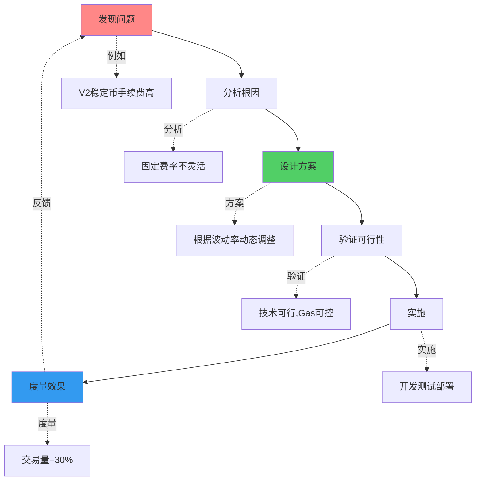
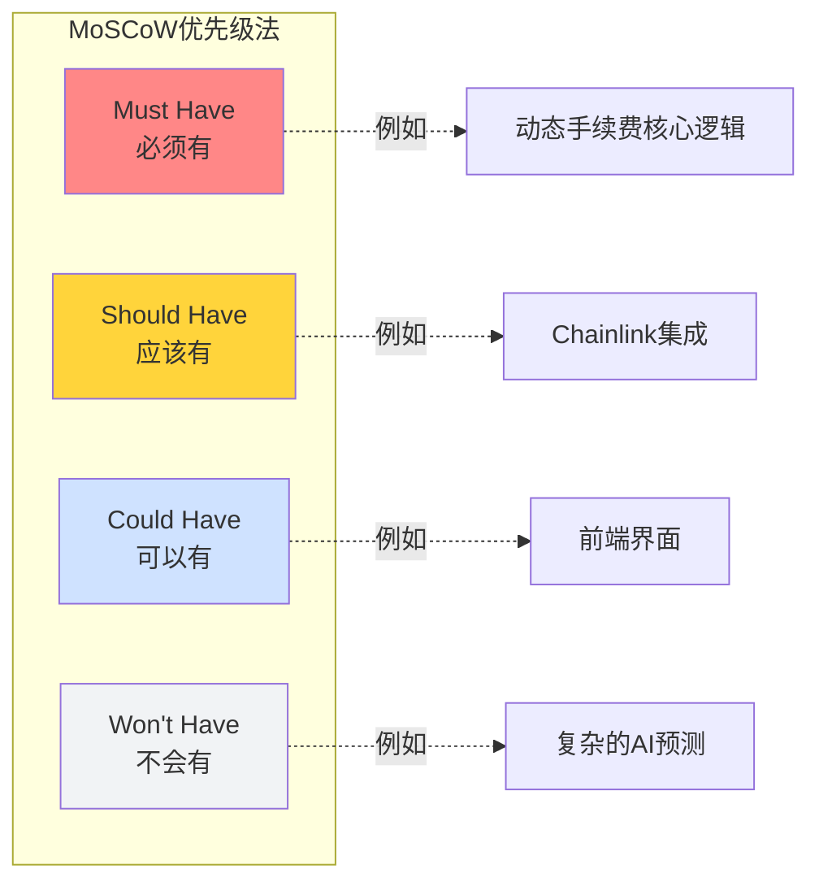
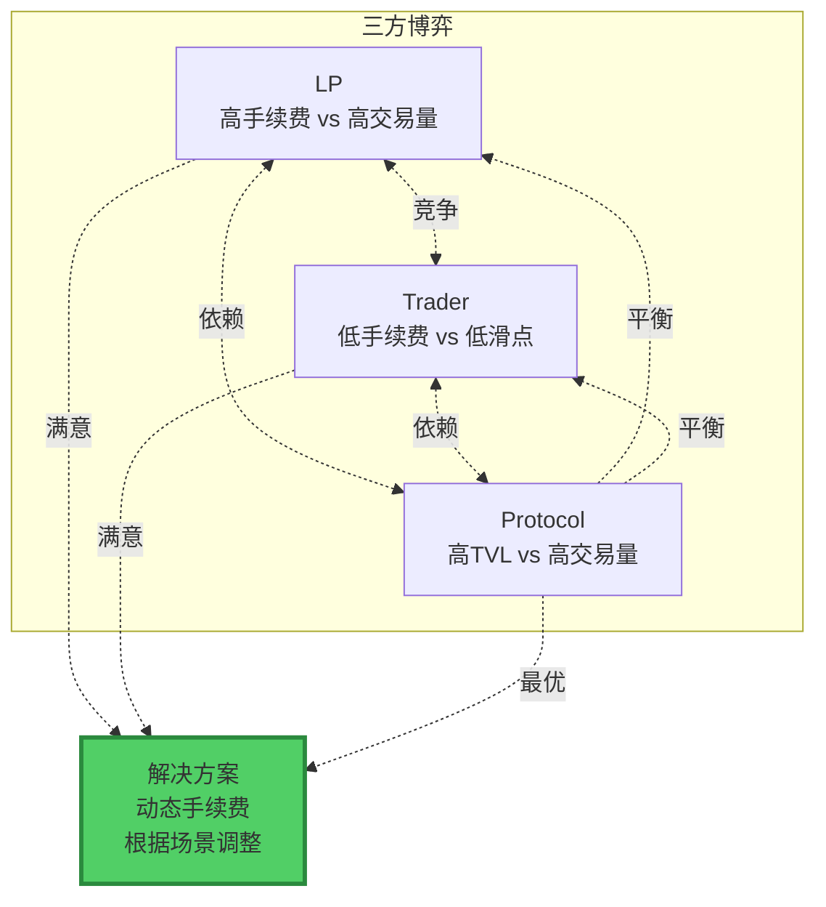
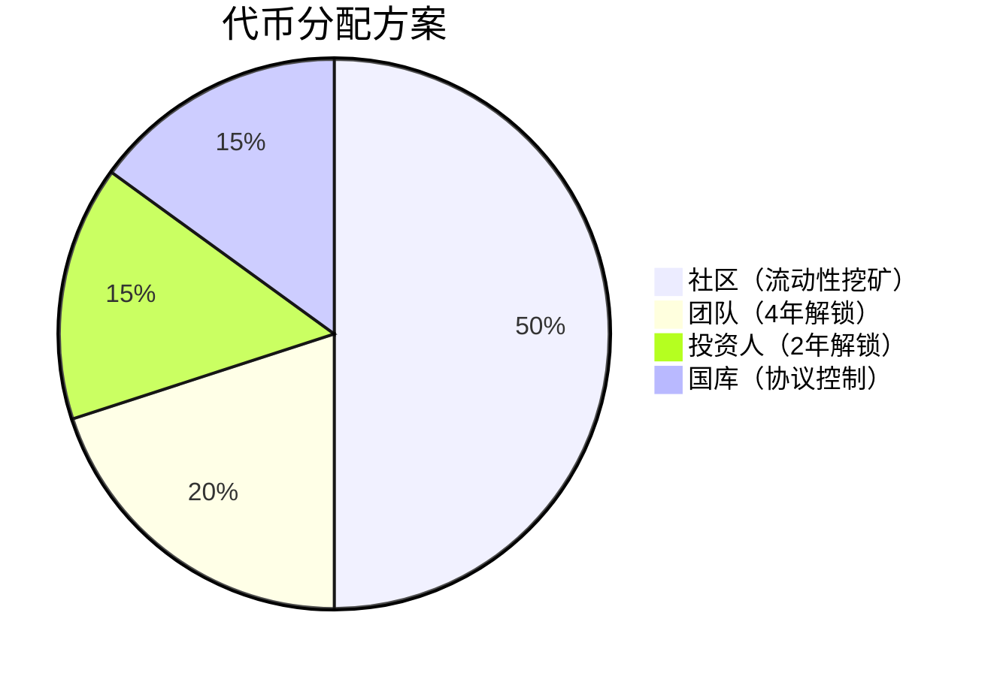
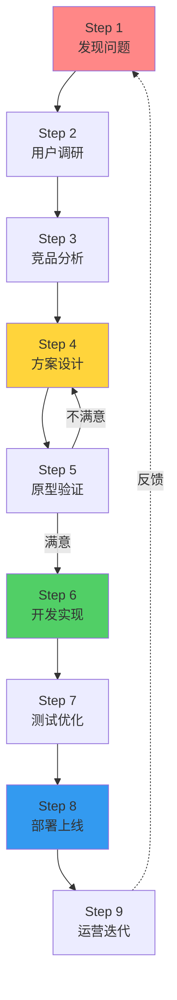

# 从0到1设计协议

> 💡 **实战指南：如何设计你的DeFi协议**
> 
> 基于你对Uniswap V2的理解，设计改进版本
> 
> ⏱️ 预计时间：理论2小时 + 实战2-4周

---

## 📚 目录

1. [设计思维框架](#1-设计思维框架)
2. [需求分析实战](#2-需求分析实战)
3. [博弈论建模](#3-博弈论建模)
4. [经济模型设计](#4-经济模型设计)
5. [完整设计流程](#5-完整设计流程)
6. [实战案例：动态手续费AMM](#6-实战案例动态手续费amm)

---

## 1. 设计思维框架

### 1.1 从问题到方案



### 1.2 设计的3个层次

```
Level 1：复制（Copy）
- Fork现有协议
- 不做改动
- 直接使用

Level 2：改进（Improve）
- Fork现有协议
- 优化某些功能  ← 你在这里
- 解决已知问题

Level 3：创新（Innovate）
- 全新的机制
- 解决未知问题
- 开创新范式

建议：
从Level 2开始
积累经验后再Level 3
```

---

## 2. 需求分析实战

### 2.1 用户需求挖掘

**以改进Uniswap V2为例：**

```
用户访谈（假设）：

稳定币交易者张三：
"我每天交易USDC/USDT，
V2收0.3%太贵了，
Curve只收0.04%，
我都去Curve交易了。"

→ 需求：降低稳定币手续费

波动币LP李四：
"我提供SHIB/ETH流动性，
SHIB波动太大，IL巨大，
0.3%手续费根本不够补偿，
我亏了20%。"

→ 需求：提高波动币手续费

套利者王五：
"我想做跨DEX套利，
但需要大量本金，
闪电贷很贵。"

→ 需求：（V2已解决：Flash Swaps）
```

**需求优先级排序：**



---

## 3. 博弈论建模

### 3.1 利益相关方分析

```
DeFi协议中的博弈：

参与方1：LP（流动性提供者）
- 目标：收益最大化
- 策略：选择高收益池
- 约束：承受无常损失

参与方2：Trader（交易者）
- 目标：成本最小化
- 策略：选择低手续费DEX
- 约束：滑点可接受

参与方3：Arbitrageur（套利者）
- 目标：利润最大化
- 策略：寻找价差
- 约束：Gas成本

参与方4：Protocol（协议）
- 目标：TVL和交易量最大化
- 策略：平衡手续费
- 约束：可持续发展
```

**博弈矩阵：**

```
手续费设置博弈：

                 LP期望  Trader期望
高手续费(1%)      ✅      ❌
中手续费(0.3%)    ⚠️      ⚠️
低手续费(0.05%)   ❌      ✅

Nash均衡点：
动态手续费！
- 稳定币：0.05%（满足Trader）
- 波动币：0.5-1%（满足LP）
- 双方都满意
```

**博弈论可视化：**



---

## 4. 经济模型设计

### 4.1 代币经济学（如果有代币）

```
如果你的协议需要代币：

用途设计：
1. 治理权
   - 投票决定手续费参数
   - 投票决定协议升级

2. 手续费分成
   - 持有代币获得协议收入分成
   - 激励长期持有

3. 质押激励
   - 质押代币获得额外收益
   - 提升协议安全性

分配设计：
- 团队：20%（4年解锁）
- 社区：50%（流动性挖矿）
- 投资人：15%（2年解锁）
- 国库：15%（协议控制）
```

**代币分配可视化：**



### 4.2 收入模型

```
动态手续费AMM的收入模型：

收入来源：
├─ 交易手续费（100%归LP）
└─ 可选协议费（如10%）

收入计算：
日交易量：$10M
平均手续费：0.3%
日手续费：$30K
年化：$10.95M

如果开启10%协议费：
协议年收入：$1.095M
LP年收入：$9.855M

分配方案：
├─ 50% → 代币持有者分红
├─ 30% → 国库（开发/营销）
└─ 20% → 回购销毁
```

---

## 5. 完整设计流程

### 5.1 设计流程图



### 5.2 每个阶段的产出

| 阶段 | 产出物 | 验收标准 |
|------|--------|----------|
| 需求分析 | 需求文档、用户画像 | 痛点清晰、需求明确 |
| 方案设计 | 技术方案、架构图 | 可行性验证通过 |
| 开发实现 | 智能合约、测试 | 测试覆盖率>80% |
| 部署优化 | 测试网合约、文档 | 功能正常、Gas优化 |
| 运营迭代 | 数据分析、改进计划 | 用户增长、问题修复 |

---

## 6. 实战案例：动态手续费AMM

### 6.1 完整PRD（产品需求文档）

```markdown
# 产品需求文档：DynamicFeeAMM

## 1. 项目概述
- 项目名称：DynamicFeeAMM
- 一句话描述：根据市场波动自动调整手续费的AMM
- 项目目标：提升资本效率，优化LP和Trader体验

## 2. 背景与动机
- Uniswap V2固定0.3%手续费
- 稳定币交易手续费过高
- 波动币交易LP风险补偿不足

## 3. 目标用户
### 3.1 稳定币交易者
- 特征：高频交易，对手续费敏感
- 需求：低手续费（<0.1%）
- 价值：节省交易成本

### 3.2 波动币LP
- 特征：承受高IL风险
- 需求：高手续费补偿（>0.5%）
- 价值：提升实际收益

## 4. 核心功能
### 4.1 动态手续费调整
- 基于24小时波动率
- 自动调整范围：0.05%-1%
- 每24小时更新一次

### 4.2 治理控制
- 可调整min/maxFee
- 可调整更新频率
- 需要治理投票

### 4.3 兼容性
- 兼容V2 Router
- 兼容V2 SDK
- 无缝迁移

## 5. 技术指标
- Gas成本：<V2的110%
- 安全性：通过专业审计
- 性能：支持>1000 TPS

## 6. 成功指标
- 稳定币日交易量 > $1M
- LP总锁仓价值 > $10M
- 用户满意度 > 80%

## 7. 时间计划
- Week 1: 设计
- Week 2: 开发
- Week 3: 测试
- Week 4: 部署
```

### 6.2 技术设计文档

```markdown
# 技术设计文档：DynamicFeeAMM

## 1. 系统架构

\`\`\`
DynamicFeeAMM (修改的Core)
├─ 继承UniswapV2Pair
├─ 新增：波动率追踪
├─ 新增：手续费调整逻辑
└─ 修改：swap函数使用动态费率

VolatilityOracle (新增模块)
├─ 计算波动率
├─ 存储价格历史
└─ 提供查询接口

DynamicFeeRouter (兼容的Periphery)
├─ 继承UniswapV2Router02
├─ 新增：手续费查询
└─ 保持：所有原有功能
\`\`\`

## 2. 核心算法

### 2.1 波动率计算
\`\`\`
volatility = √(Σ(price_i - avgPrice)² / n)

其中：
- price_i：第i小时的价格
- avgPrice：24小时平均价格
- n：样本数量（24）
\`\`\`

### 2.2 手续费映射
\`\`\`
if volatility < 1%:
    fee = 0.05%
elif volatility < 5%:
    fee = 0.05% + (volatility - 1%) × 0.0625
else:
    fee = 0.3% + (volatility - 5%) × 0.14
    fee = min(fee, 2%)  // 最高2%
\`\`\`

## 3. 数据结构

\`\`\`solidity
struct FeeConfig {
    uint24 minFee;        // 最小手续费（基点）
    uint24 maxFee;        // 最大手续费
    uint24 baseFee;       // 基础手续费
    uint16 feeMultiplier; // 波动率乘数
}

struct VolatilityData {
    uint256[24] priceHistory;
    uint8 currentIndex;
    uint256 lastUpdate;
}
\`\`\`

## 4. 关键接口

\`\`\`solidity
interface IDynamicFeeAMM {
    function updateFee() external returns (uint24 newFee);
    function getCurrentFee() external view returns (uint24);
    function getVolatility() external view returns (uint256);
    function setFeeConfig(FeeConfig memory config) external;
}
\`\`\`

## 5. Gas分析

| 操作 | V2 Gas | 动态Fee Gas | 差异 |
|------|--------|-------------|------|
| swap | 120K | 125K | +4.2% |
| updateFee | N/A | 50K | 新增 |
| mint | 130K | 132K | +1.5% |

## 6. 安全考虑

- 手续费范围限制
- 更新频率限制
- 治理控制关键参数
- 紧急暂停机制
```

---

## ✅ 设计检查清单

在开始编码前，确保完成：

```
□ 需求分析
  □ 明确目标用户
  □ 定义核心功能
  □ 量化成功指标

□ 技术方案
  □ 核心算法设计
  □ 架构设计
  □ 接口定义
  □ Gas分析

□ 博弈论分析
  □ 识别利益相关方
  □ 分析激励机制
  □ 找到Nash均衡

□ 经济模型
  □ 收入来源
  □ 成本结构
  □ 代币经济（如有）

□ 风险评估
  □ 技术风险
  □ 市场风险
  □ 监管风险
```

---

## 🎓 总结

从0到1设计协议的关键：

```
1. 问题驱动
   从真实痛点出发
   
2. 用户中心
   始终考虑用户价值
   
3. 技术可行
   方案必须能实现
   
4. 经济可持续
   商业模式要合理
   
5. 迭代优化
   持续改进完善

记住：
完成比完美重要
迭代比一步到位重要
用户反馈比自己想象重要
```

---

**现在，拿起键盘，开始设计你的协议！** 💪🚀

**推荐：** 使用提供的模板，2天完成你的设计文档！
