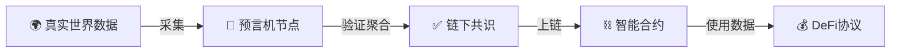
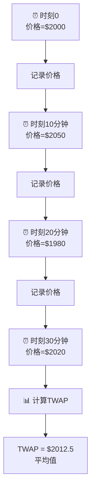
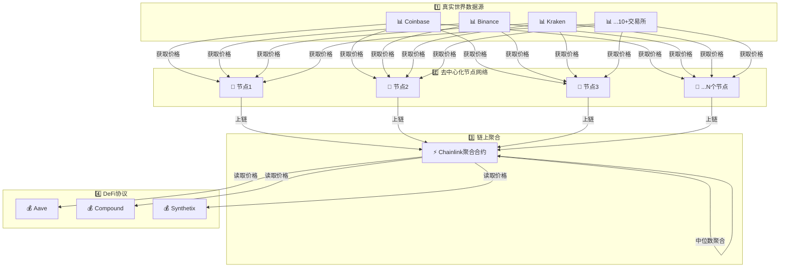
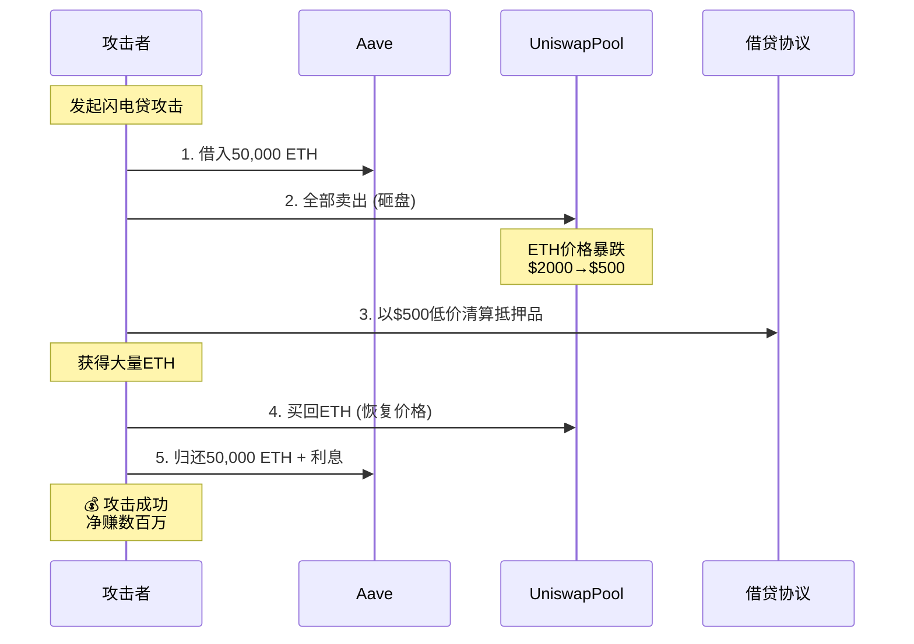

# 预言机基础概念 (Oracle Basics)

> 💡 **核心要点**
> - 预言机是DeFi的"眼睛"，连接链上与链下
> - 绝不能用DEX现货价格做预言机
> - Chainlink是去中心化预言机的黄金标准
> - TWAP可以防止瞬时操纵

⏱️ **学习时间**: 1小时  
⭐ **重要程度**: ⭐⭐⭐⭐

---

## 📚 目录

1. [什么是预言机](#1-什么是预言机)
2. [为什么DeFi需要预言机](#2-为什么defi需要预言机)
3. [预言机类型概述](#3-预言机类型概述)
4. [链上预言机-TWAP](#4-链上预言机-twap)
5. [链下预言机-Chainlink](#5-链下预言机-chainlink)
6. [预言机风险](#6-预言机风险)
7. [价格操纵攻击](#7-价格操纵攻击)

---

## 1. 什么是预言机？

### 1.1 核心定义

**预言机 (Oracle)** = 区块链与现实世界的桥梁

```
预言机的作用：
将链外数据 → 安全可靠地 → 传递到链上
```

### 1.2 生动比喻

```
区块链 = 一个密闭的房间
智能合约 = 房间里的机器人

问题：
机器人不知道外面发生了什么
- 现在几点？
- ETH价格多少？
- 天气如何？

预言机 = 一个信使
定期进入房间，告诉机器人外界信息
```

### 1.3 预言机工作流程



**流程说明：**
```
1. 真实世界：ETH在Coinbase交易价格=$2000
2. 预言机节点：多个节点独立获取价格数据
3. 链下共识：节点聚合数据，去除异常值
4. 上链：将可信数据写入区块链
5. 智能合约：读取并使用价格数据
```

---

## 2. 为什么DeFi需要预言机？

### 2.1 DeFi无法自知价格

区块链是封闭系统：
```
智能合约不能：
❌ 调用外部API
❌ 读取网页数据
❌ 获取实时价格
❌ 访问链外世界

智能合约只能：
✅ 读取链上数据
✅ 执行确定性计算
✅ 与其他合约交互
```

### 2.2 DeFi协议的核心需求

#### 借贷协议 (Aave, Compound)

```
需求：知道抵押品和借款的价格

场景：
用户抵押 10 ETH 借 USDC

协议必须知道：
- ETH价格是多少？ → 需要预言机
- 抵押率是否健康？ → 基于价格
- 是否需要清算？ → 基于价格

没有预言机 = 协议瘫痪！
```

#### 衍生品协议 (GMX, dYdX)

```
需求：实时资产价格

场景：
用户开10倍杠杆ETH多单

协议必须知道：
- 开仓价格 → 需要预言机
- 当前盈亏 → 需要实时价格
- 是否爆仓 → 基于价格

价格错误 = 用户损失！
```

#### 稳定币协议 (MakerDAO)

```
需求：抵押品价格

场景：
用户抵押ETH铸造DAI

协议必须知道：
- ETH价值 → 需要预言机
- 是否需要清算 → 基于价格
- DAI是否脱锚 → 需要价格

价格操纵 = 系统崩溃！
```

---

## 3. 预言机类型概述

### 3.1 分类维度

```
按数据来源:
├── 链上预言机 (On-chain Oracle)
└── 链下预言机 (Off-chain Oracle)

按中心化程度:
├── 中心化预言机 (单一来源)
└── 去中心化预言机 (多节点)

按实时性:
├── 推送式 (Push)
└── 拉取式 (Pull)
```

### 3.2 主流预言机对比

| 类型 | 代表 | 优点 | 缺点 | 适用场景 |
|------|------|------|------|---------|
| DEX现货价 | Uniswap | 简单、免费 | 易被操纵 | ❌ 不推荐 |
| TWAP | Uniswap V2/V3 | 抗短期操纵 | 有延迟 | ⚠️ 辅助使用 |
| Chainlink | Chainlink | 安全、可靠 | 需付费 | ✅ 推荐 |
| 自建预言机 | 项目自建 | 可控 | 中心化风险 | ❌ 高风险 |

---

## 4. 链上预言机-TWAP

### 4.1 什么是TWAP？

**TWAP = Time-Weighted Average Price = 时间加权平均价格**

```
不是某个瞬间的价格
而是一段时间内的平均价格

例如：
过去30分钟的平均ETH价格
```

### 4.2 工作原理



**计算方式：**

```
TWAP = (P₀·t₀ + P₁·t₁ + P₂·t₂ + ...) / 总时间

例如（简化）：
TWAP = (2000·10 + 2050·10 + 1980·10 + 2020·10) / 40
     = (20,000 + 20,500 + 19,800 + 20,200) / 40
     = 80,500 / 40
     = 2012.5
```

### 4.3 Uniswap V2的TWAP实现

```solidity
// Uniswap V2 价格累积
uint public price0CumulativeLast;
uint public price1CumulativeLast;
uint32 public blockTimestampLast;

function _update(uint balance0, uint balance1) private {
    uint32 blockTimestamp = uint32(block.timestamp % 2**32);
    uint32 timeElapsed = blockTimestamp - blockTimestampLast;
    
    if (timeElapsed > 0 && reserve0 != 0 && reserve1 != 0) {
        // 累积价格 * 时间
        price0CumulativeLast += uint(UQ112x112.encode(reserve1).uqdiv(reserve0)) * timeElapsed;
        price1CumulativeLast += uint(UQ112x112.encode(reserve0).uqdiv(reserve1)) * timeElapsed;
    }
    
    blockTimestampLast = blockTimestamp;
}
```

**获取TWAP：**

```solidity
function getPrice() external view returns (uint) {
    uint timeElapsed = block.timestamp - blockTimestampLast;
    uint priceCumulative = price0CumulativeLast;
    
    // TWAP = 价格累积差 / 时间差
    return (priceCumulative - priceCumulativeOld) / timeElapsed;
}
```

### 4.4 TWAP的优势

```
✅ 抗短期操纵
攻击者需要持续30分钟操纵价格
→ 成本极高
→ 大部分闪电贷攻击失效

✅ 链上原生
不需要外部依赖
完全去中心化

✅ 免费
不需要支付预言机费用
```

### 4.5 TWAP的劣势

```
❌ 延迟
反映的是过去30分钟平均价
市场剧烈波动时不够灵敏

❌ 仍可能被操纵
虽然成本高，但不是不可能
需要足够的流动性支撑

❌ 实现复杂
需要正确计算累积价格
容易出bug
```

---

## 5. 链下预言机-Chainlink

### 5.1 Chainlink是什么？

**Chainlink** = 去中心化预言机网络，是DeFi预言机的事实标准

```
特点：
✅ 去中心化 (多节点)
✅ 安全可靠 (密码学验证)
✅ 数据源广泛 (全球交易所)
✅ 被广泛采用 (DeFi头部协议)
```

### 5.2 Chainlink工作流程



**详细步骤：**

```
步骤1: 数据采集
├── Chainlink节点从多个数据源获取价格
├── Coinbase: $2000
├── Binance: $2005
├── Kraken: $1998
└── ...更多交易所

步骤2: 节点报价
├── 节点1报价: $2001
├── 节点2报价: $2003  
├── 节点3报价: $2000
└── ...共21个节点

步骤3: 链上聚合
├── 聚合合约收集所有报价
├── 去除异常值
├── 计算中位数
└── 最终价格: $2001

步骤4: 协议使用
└── DeFi协议调用 latestRoundData() 获取价格
```

### 5.3 Chainlink代码示例

```solidity
// SPDX-License-Identifier: MIT
pragma solidity ^0.8.26;

import "@chainlink/contracts/src/v0.8/interfaces/AggregatorV3Interface.sol";

contract PriceConsumer {
    AggregatorV3Interface internal priceFeed;
    
    /**
     * ETH/USD 价格喂价地址（主网）
     */
    constructor() {
        priceFeed = AggregatorV3Interface(
            0x5f4eC3Df9cbd43714FE2740f5E3616155c5b8419
        );
    }
    
    /**
     * 获取最新价格
     */
    function getLatestPrice() public view returns (int) {
        (
            uint80 roundId,
            int price,
            uint startedAt,
            uint timeStamp,
            uint80 answeredInRound
        ) = priceFeed.latestRoundData();
        
        // ✅ 验证数据有效性
        require(timeStamp > 0, "Round not complete");
        require(price > 0, "Invalid price");
        require(answeredInRound >= roundId, "Stale price");
        
        return price; // 返回价格 (8位小数)
    }
}
```

**使用示例：**

```solidity
contract LendingProtocol {
    PriceConsumer public priceOracle;
    
    function getCollateralValue(uint ethAmount) public view returns (uint) {
        int price = priceOracle.getLatestPrice();
        
        // price有8位小数，需要转换
        return ethAmount * uint(price) / 1e8;
    }
    
    function checkLiquidation(address user) public view returns (bool) {
        uint collateralValue = getCollateralValue(collateral[user]);
        uint borrowValue = borrows[user];
        
        // 健康因子 < 1 需要清算
        return collateralValue * 100 / borrowValue < 100;
    }
}
```

### 5.4 Chainlink的优势

```
✅ 去中心化
21+个独立节点
分布在全球各地

✅ 数据源广泛
聚合10+个顶级交易所
覆盖全球市场

✅ 安全可靠
密码学签名验证
防篡改机制

✅ 更新及时
价格变化>偏差阈值(如0.5%) → 自动更新
或定期更新(如1小时)

✅ 历史悠久
经过数百亿美元验证
头部协议都在用
```

### 5.5 Chainlink的成本

```
使用Chainlink需要付费:

方式1: 每次调用付费
└── 支付LINK代币

方式2: 订阅模式 (VRF V2)
└── 预付费，按需扣除

成本：
- 读取价格: 免费 (只读取聚合合约)
- VRF随机数: ~$2-5 每次
- 自定义外部适配器: 可协商

大部分DeFi协议:
只需读取价格 → 免费！
```

---

## 6. 预言机风险

### 6.1 价格操纵风险

#### ❌ 使用DEX现货价格（极度危险）

```
错误做法：
function getPrice() public view returns (uint) {
    (uint reserve0, uint reserve1,) = pair.getReserves();
    return reserve1 / reserve0; // ❌ 危险！
}

问题：
- 可被闪电贷瞬间操纵
- 低流动性池更危险
- 已导致数十亿美元损失
```

**攻击流程：**



#### ✅ 正确做法

```
方案1: 使用Chainlink
→ 去中心化，难以操纵

方案2: 使用TWAP  
→ 需要持续操纵30分钟，成本高

方案3: 多预言机验证
→ 对比多个来源，取中位数
```

### 6.2 中心化风险

```
如果预言机由单一实体控制：

风险1: 单点故障
预言机宕机 → 协议瘫痪

风险2: 恶意作为
项目方操纵价格 → 盗取资金

风险3: 被攻击
黑客攻击预言机 → 喂假数据

真实案例：
某些小项目使用自建预言机
→ 被黑客攻击
→ 喂送错误价格
→ 协议被掏空
```

### 6.3 数据时效性风险

```
问题：使用过时的价格数据

例如：
真实价格: $2000 (现在)
预言机价格: $1800 (1小时前)

后果：
- 不公平的清算
- 套利机会
- 用户损失
```

**防范：**

```solidity
function getPrice() public view returns (uint) {
    (
        ,
        int price,
        ,
        uint timeStamp,
        
    ) = priceFeed.latestRoundData();
    
    // ✅ 检查数据时效性
    require(
        block.timestamp - timeStamp < 3600, 
        "Price data too old"
    );
    
    return uint(price);
}
```

---

## 7. 价格操纵攻击

### 7.1 经典攻击案例

**攻击流程详解：**

```
目标协议：使用Uniswap现货价做预言机的借贷协议

初始状态：
├── Uniswap ETH/DAI池: 1000 ETH, 2M DAI
├── 借贷协议信任Uniswap价格
└── 攻击者准备闪电贷

攻击步骤：
┌─────────────────────────────────────┐
│ 1️⃣ 借入闪电贷                        │
│    Aave: 借50,000 ETH (无抵押)       │
│    条件: 同一交易内归还              │
├─────────────────────────────────────┤
│ 2️⃣ 操纵Uniswap价格                  │
│    卖出50,000 ETH → 换DAI            │
│    ETH价格: $2000 → $500 (暴跌)     │
├─────────────────────────────────────┤
│ 3️⃣ 利用虚假价格                     │
│    借贷协议查询价格: $500 ❌          │
│    攻击者以低价清算他人抵押品         │
│    或超额借贷                        │
├─────────────────────────────────────┤
│ 4️⃣ 恢复价格                         │
│    买回ETH，价格恢复$2000            │
├─────────────────────────────────────┤
│ 5️⃣ 归还闪电贷                       │
│    归还50,000 ETH + 0.09%利息        │
└─────────────────────────────────────┘

结果：
攻击者净赚: 数百万美元
借贷协议损失: 用户资金被盗
原因: 错误的预言机选择
```

### 7.2 真实案例

**案例1: Harvest Finance (2020)**
```
损失: $34M
原因: 使用Curve池现货价
攻击: 闪电贷操纵Curve价格
```

**案例2: Cream Finance (2021)**
```
损失: $130M
原因: 使用低流动性池价格
攻击: 操纵yUSD价格
```

**案例3: Mango Markets (2022)**
```
损失: $110M
原因: 价格预言机依赖单一来源
攻击: 在低流动性市场操纵价格
```

### 7.3 防范方法

#### ✅ 黄金法则

**绝对不要直接使用DEX现货价格做预言机！**

```
❌ 错误：
price = uniswapPair.getReserves()[1] / getReserves()[0];

✅ 正确：
price = chainlinkPriceFeed.latestRoundData();
```

#### ✅ 最佳实践

**1. 使用Chainlink等去中心化预言机**

```solidity
// 推荐做法
import "@chainlink/contracts/src/v0.8/interfaces/AggregatorV3Interface.sol";

contract SecureProtocol {
    AggregatorV3Interface public ethPriceFeed;
    
    constructor(address _priceFeed) {
        ethPriceFeed = AggregatorV3Interface(_priceFeed);
    }
    
    function getETHPrice() public view returns (uint256) {
        (, int256 price,,,) = ethPriceFeed.latestRoundData();
        require(price > 0, "Invalid price");
        return uint256(price);
    }
}
```

**2. 使用TWAP作为辅助**

```solidity
// 双重验证
function getPrice() public view returns (uint) {
    uint chainlinkPrice = getChainlinkPrice();
    uint twapPrice = getTWAPPrice();
    
    // 如果两个价格偏差<5%，使用Chainlink
    uint diff = abs(chainlinkPrice - twapPrice) * 100 / chainlinkPrice;
    require(diff < 5, "Price deviation too large");
    
    return chainlinkPrice;
}
```

**3. 多预言机验证**

```solidity
function getConsensusPrice() public view returns (uint) {
    uint chainlinkPrice = getChainlinkPrice();
    uint uniswapTWAP = getUniswapTWAP();
    uint bandPrice = getBandPrice();
    
    // 计算中位数
    uint median = getMedian([chainlinkPrice, uniswapTWAP, bandPrice]);
    
    // 确保偏差不大
    require(
        abs(chainlinkPrice - median) * 100 / median < 3,
        "Chainlink price anomaly"
    );
    
    return median;
}
```

**4. 设置断路器**

```solidity
uint public constant MAX_PRICE_CHANGE = 10; // 10%
uint public lastPrice;

function updatePrice() public {
    uint newPrice = getChainlinkPrice();
    
    if (lastPrice > 0) {
        uint change = abs(newPrice - lastPrice) * 100 / lastPrice;
        
        // 如果价格变化>10%，暂停协议
        require(change <= MAX_PRICE_CHANGE, "Circuit breaker triggered");
    }
    
    lastPrice = newPrice;
}
```

---

## 📊 预言机选择决策树

```
你需要价格预言机？
    │
    ├─→ 头部资产 (ETH, BTC, USDC)
    │   └─→ 用Chainlink ✅
    │       - 安全可靠
    │       - 已被验证
    │       - 免费读取
    │
    ├─→ 长尾资产 (小币种)
    │   ├─→ 有Chainlink喂价？
    │   │   ├─→ YES → 用Chainlink ✅
    │   │   └─→ NO → TWAP + 风险警告 ⚠️
    │   │
    │   └─→ 流动性如何？
    │       ├─→ 高 (>$10M) → TWAP可用 ⚠️
    │       └─→ 低 (<$10M) → 不建议使用 ❌
    │
    └─→ 稳定币价格
        └─→ USDC/USDT/DAI
            - 可以用Chainlink
            - 或简单的1:1假设
```

---

## ✅ 学习检查清单

完成本章后，你应该能够：

- [ ] 解释什么是预言机
- [ ] 说出为什么DeFi需要预言机
- [ ] 理解TWAP的原理和优缺点
- [ ] 知道Chainlink的工作流程
- [ ] 会使用Chainlink获取价格
- [ ] 理解预言机操纵攻击的流程
- [ ] 知道如何防范预言机风险
- [ ] 能画出预言机工作流程图

---

## 📚 学习资源

### 官方文档
- [Chainlink Docs](https://docs.chain.link/)
- [Chainlink Price Feeds](https://data.chain.link/)
- [Uniswap V3 Oracle](https://docs.uniswap.org/concepts/protocol/oracle)

### 必读文章
- [So you want to use a price oracle](https://www.paradigm.xyz/2020/11/so-you-want-to-use-a-price-oracle) by samczsun ⭐⭐⭐⭐⭐

### 真实攻击案例
- [Rekt - Price Oracle Manipulation](https://rekt.news/)
- [Harvest Finance Attack](https://medium.com/harvest-finance/harvest-flashloan-economic-attack-post-mortem-3cf900d65217)

---

## 🎯 下一步

理解了预言机基础后，继续学习：

1. ✅ **深入Chainlink** → `17-预言机篇/` 详细学习
2. ✅ **闪电贷攻击** → 理解攻击手法
3. ✅ **Uniswap V3 Oracle** → TWAP高级用法
4. ✅ **协议安全设计** → 如何正确使用预言机

---

## 💡 核心要点

### 记住这些

```
1. 预言机 = DeFi的眼睛
   没有预言机 = 协议瞎了

2. 绝不用DEX现货价
   易被闪电贷操纵

3. Chainlink是首选
   去中心化、安全、可靠

4. TWAP可防短期操纵
   但有延迟，需配合使用

5. 多重验证最安全
   Chainlink + TWAP + 断路器
```

### 预言机安全准则

```
✅ DO:
- 使用Chainlink等去中心化预言机
- 验证返回数据的时效性
- 使用TWAP作为辅助
- 设置价格变化断路器
- 多预言机交叉验证

❌ DON'T:
- 直接使用DEX现货价格
- 依赖单一数据源
- 忽略数据验证
- 使用低流动性池
- 信任未审计的预言机
```

---

**恭喜你掌握了预言机基础知识！** 🎉

预言机是DeFi安全的关键一环，理解它能让你避免很多风险！

准备好学习更多DeFi协议了吗？🚀

