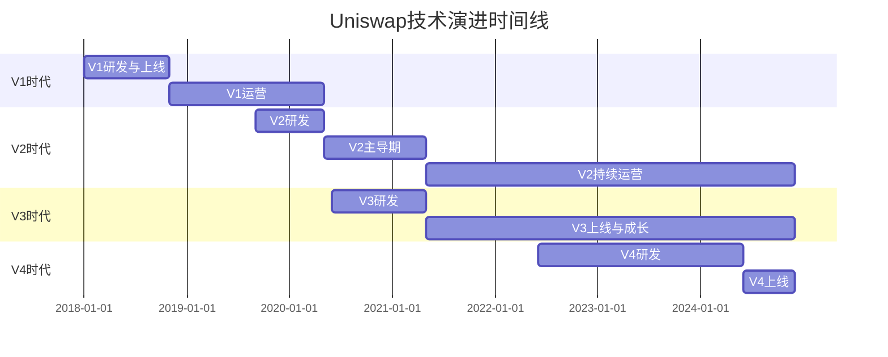

# Uniswap完整演进史 (V1 → V2 → V3 → V4)

> 💡 **一文看懂Uniswap的技术演进**
> 
> 从2018年最简单的AMM，到2024年最先进的模块化DEX
> 
> ⏱️ 预计学习时间：2小时

---

## 📚 目录

1. [V1：AMM的诞生（2018）](#1-v1amm的诞生2018)
2. [V2：工业标准（2020）](#2-v2工业标准2020)
3. [V3：集中流动性革命（2021）](#3-v3集中流动性革命2021)
4. [V4：模块化未来（2024）](#4-v4模块化未来2024)
5. [版本对比总结](#5-版本对比总结)
6. [技术演进时间线](#6-技术演进时间线)

---

## 1. V1：AMM的诞生（2018）

### 1.1 诞生背景

**创造者：Hayden Adams**

```
时间：2018年11月
背景：
- 当时DEX都是订单簿模式
- 0x、EtherDelta、IDEX等
- 流动性差、用户体验差
- Gas费高昂

Hayden的灵感来源：
→ Vitalik Buterin的博客文章（2017）
→ 提出了x·y=k的AMM概念
→ Hayden决定实现它
```

**开发过程：**
```
2017年底：Hayden失业，开始学习Solidity
2018年初：开始开发Uniswap
2018年7月：获得以太坊基金会$10万资助
2018年11月：Uniswap V1正式上线！

初始TVL：$30,000
现在回看：这是DeFi历史的转折点！
```

### 1.2 V1的核心创新 ⭐

#### 创新1：x·y=k公式

```
这是DeFi史上最重要的创新！

ETH × Token = k

第一次将AMM概念落地
→ 不需要订单簿
→ 不需要对手方
→ 任何人都能提供流动性
```

#### 创新2：极简设计

```solidity
// V1核心合约（简化）
contract UniswapV1Exchange {
    address public tokenAddress;
    
    // ✨ 核心函数1：ETH换Token
    function ethToTokenSwap(uint256 minTokens) public payable {
        uint256 tokenReserve = token.balanceOf(address(this));
        uint256 tokensBought = getInputPrice(
            msg.value,
            address(this).balance - msg.value,
            tokenReserve
        );
        
        require(tokensBought >= minTokens);
        token.transfer(msg.sender, tokensBought);
    }
    
    // ✨ 核心函数2：计算价格 (x·y=k)
    function getInputPrice(
        uint256 inputAmount,
        uint256 inputReserve,
        uint256 outputReserve
    ) public pure returns (uint256) {
        uint256 inputAmountWithFee = inputAmount * 997;
        uint256 numerator = inputAmountWithFee * outputReserve;
        uint256 denominator = (inputReserve * 1000) + inputAmountWithFee;
        return numerator / denominator;
    }
}
```

**代码特点：**
- 只有200行左右
- 非常简单易懂
- 完美实现x·y=k

#### 创新3：Factory模式

```
Uniswap V1 Factory:
- 任何人都可以创建交易对
- 每个ERC20都有一个ETH交易对
- 自动化部署

这开创了DeFi的"无需许可"范式！
```

### 1.3 V1的局限与弊端 ⚠️

#### 弊端1：所有交易都经过ETH

```
想用USDC买DAI？

V1路径：
USDC → ETH → DAI
       ↑
    必经中转站

问题：
❌ 多一次兑换 → 双倍手续费
❌ 多一次滑点 → 价格更差  
❌ Gas费更高 → 成本增加
```

#### 弊端2：资金效率极低

```
流动性分散在$0-$∞所有价格

实际交易：
只在当前价格±10%范围

结果：
90%的资金在闲置！
资本利用率<10%
```

**实例：**
```
池子TVL: $1M
实际有效流动性: ~$100K

如果集中在±10%区间:
有效流动性可达: $1M
效率提升10倍！
```

#### 弊端3：手续费固定

```
V1手续费: 固定0.3%

问题：
- 稳定币对：0.3%太高
- 波动币对：0.3%可能太低
- 无法灵活调整
```

#### 弊端4：功能单一

```
V1只能：
✅ ETH ↔ Token swap
✅ 提供流动性
✅ 移除流动性

不能：
❌ Token ↔ Token 直接交易
❌ 调整手续费
❌ 价格预言机
❌ 闪电贷
```

### 1.4 V1的历史意义

```
虽然有很多局限，但V1意义重大：

1. 首次实现AMM ⭐⭐⭐⭐⭐
   → 证明了x·y=k可行

2. 开创无需许可范式
   → 任何人都能创建交易对

3. 启发后续创新
   → SushiSwap、PancakeSwap等都fork了Uniswap

4. TVL成长
   2019年初: $10M
   2020年初: $100M
   
成功验证了AMM模式！
```

---

## 2. V2：工业标准（2020）

### 2.1 V2的诞生

```
发布时间：2020年5月
背景：
- V1已运行1.5年
- 证明了AMM可行
- 但局限明显
- DeFi Summer即将到来

目标：
→ 解决V1的所有痛点
→ 成为DEX的工业标准
```

### 2.2 V2的核心改进 ⭐

#### 改进1：ERC20 ↔ ERC20直接交易

```
V1: USDC → ETH → DAI (双跳)
      ↓       ↓
    0.3%手续费 0.3%手续费
    总成本: 0.6%

V2: USDC → DAI (直接)
      ↓
    0.3%手续费
    总成本: 0.3%

效率提升100%！
```

**实现方式：**
```
V1: 所有池子都是 ETH/Token
V2: 任意两个ERC20都能配对

例如：
- USDC/DAI ✅
- WBTC/ETH ✅
- LINK/UNI ✅
```

#### 改进2：价格预言机（TWAP）

```
V2新增：累积价格变量

price0CumulativeLast
price1CumulativeLast

作用：
→ 外部协议可以计算TWAP
→ 防止价格操纵
→ 为DeFi生态提供安全的价格源

意义：
这使得Uniswap不仅是DEX
还成为了预言机基础设施！
```

**代码实现：**
```solidity
// V2每次swap都会更新累积价格
function _update(uint balance0, uint balance1) private {
    uint32 timeElapsed = blockTimestamp - blockTimestampLast;
    
    if (timeElapsed > 0 && reserve0 != 0 && reserve1 != 0) {
        // 累积价格 * 时间
        price0CumulativeLast += uint(UQ112x112.encode(reserve1)
            .uqdiv(reserve0)) * timeElapsed;
        price1CumulativeLast += uint(UQ112x112.encode(reserve0)
            .uqdiv(reserve1)) * timeElapsed;
    }
}
```

#### 改进3：闪电兑换（Flash Swaps）

```
V2创新：先取代币，后付款！

传统swap:
1. 用户付USDC
2. 合约给ETH

Flash Swap:
1. 合约先给你ETH ✨
2. 你可以用ETH做任何事
3. 最后再还USDC（或还ETH）

应用场景：
- 套利
- 清算
- 抵押品互换
```

**代码示例：**
```solidity
function flashSwap() external {
    // 1. 先拿走ETH
    pair.swap(
        10 ether,  // 要的ETH
        0,         // 不要token1
        address(this),  // 发给自己
        bytes("flash") // 触发回调
    );
}

// 2. 回调函数
function uniswapV2Call(
    address sender,
    uint amount0,
    uint amount1,
    bytes calldata data
) external {
    // 这里你已经有10 ETH了！
    // 做任何你想做的事...
    
    // 3. 最后还款
    USDC.transfer(msg.sender, amountToRepay);
}
```

#### 改进4：协议费开关

```
V2设计了协议费机制：

当前：0.3%全给LP
未来可开启：
- 0.25%给LP
- 0.05%给协议

虽然一直未开启，但预留了升级空间
```

#### 改进5：更好的代码架构

```
V2分离为两层：

Core层 (核心):
├── UniswapV2Pair.sol (配对合约)
├── UniswapV2Factory.sol (工厂合约)  
└── UniswapV2ERC20.sol (LP代币)

Periphery层 (外围):
├── UniswapV2Router02.sol (路由合约)
└── UniswapV2Library.sol (工具库)

好处：
- 核心合约简单安全
- 外围合约提供便利功能
- 分层架构，易于审计
```

### 2.3 V2的弊端 ⚠️

虽然V2已经很优秀，但仍有局限：

#### 弊端1：资金效率仍然很低

```
问题未解决！

流动性仍分散在所有价格
资本利用率<10%

例如：
$1M流动性
实际有效: ~$100K

对比CEX订单簿：
$1M流动性
实际有效: ~$1M

差距10倍！
```

#### 弊端2：无法个性化LP策略

```
所有LP提供的流动性都一样：
- 价格范围: $0 - $∞
- 手续费: 0.3%
- 无法定制

LP想要：
❌ 选择价格区间（集中资金）
❌ 选择不同费率
❌ 定制化策略
```

#### 弊端3：大额交易滑点仍高

```
池子: $10M TVL

买$1M的ETH:
→ 滑点 ~10%
→ 仍然不适合大额

CEX:
→ 滑点 <0.5%
```

#### 弊端4：LP被动承受无常损失

```
价格在$1800-$2200波动:

V2 LP:
- 在$0-$∞提供流动性
- 大部分资金在$1800-$2200之外闲置
- 但仍承受全部无常损失

不合理！
```

### 2.4 V2的统治地位

```
尽管有局限，V2仍然：

TVL峰值（2021）: $10B+
日交易量: $1-2B
市占率: DEX领域50%+

成为：
✅ DEX的工业标准
✅ 被100+协议fork
✅ DeFi基础设施

证明：
简单就是美！
```

---

## 3. V3：集中流动性革命（2021）

### 3.1 V3的诞生

```
发布时间：2021年5月
背景：
- V2运行良好但资金效率低
- Curve证明了集中流动性的价值
- LP需要更灵活的工具

核心理念：
"让LP自己选择价格区间"

这是DEX历史上最大的创新！
```

### 3.2 V3的革命性创新 ⭐⭐⭐⭐⭐

#### 创新1：集中流动性（Concentrated Liquidity）

**核心概念：**

```
V2:
LP在$0-$∞提供流动性
资金分散，效率低

V3:
LP选择价格区间提供流动性
资金集中，效率高

例如：
ETH当前价格: $2000

V2 LP:
├── $0-$∞范围提供$10K
└── 有效流动性: ~$1K

V3 LP:
├── $1800-$2200范围提供$10K
└── 有效流动性: ~$100K

资金效率提升100倍！
```

**可视化对比：**

```
        流动性分布

V2:     所有价格均匀分布
Price
$∞   │ ███
     │ ███
$3000│ ███
$2000│ ███ ← 当前价格
$1000│ ███
$0   │ ███

V3:     集中在价格区间
Price
$∞   │
     │
$2200│ ████████████ ← 上界
$2000│ ████████████ ← 当前价格
$1800│ ████████████ ← 下界
$1000│
$0   │
```

#### 创新2：多档费率

```
V2: 固定0.3%

V3: LP选择费率
├── 0.01% - 超稳定币对 (USDC/USDT)
├── 0.05% - 稳定币对 (DAI/USDC)
├── 0.30% - 主流币对 (ETH/USDC) ← 最常用
└── 1.00% - 波动币对 (SHIB/ETH)

意义：
- 稳定币低费率 → 吸引更多交易
- 波动币高费率 → 补偿IL风险
```

#### 创新3：Range Orders（范围订单）

```
LP可以设置极窄价格区间：

例如：
当前ETH = $2000

设置区间:
$1999.5 - $2000.5

效果：
→ 类似限价单
→ 价格到达区间，自动成交
→ 价格离开区间，变成单币

这模糊了AMM和订单簿的界限！
```

#### 创新4：NFT LP Position

```
V2: LP代币是ERC20
所有LP一样，可互换

V3: LP代币是ERC721 (NFT)
每个LP Position都是独特的

原因：
- 不同价格区间
- 不同费率
- 不同的liquidity

每个Position都不同 → 必须用NFT
```

#### 创新5：预言机改进

```
V2: 需要外部合约计算TWAP
V3: 内置几何平均TWAP

优势：
- 更精确
- Gas效率更高
- 更难操纵
```

### 3.3 V3的弊端 ⚠️

#### 弊端1：复杂性大幅增加

```
V2代码：~500行
V3代码：~2000行

复杂度提升4倍！

影响：
❌ 学习曲线陡峭
❌ 审计成本高
❌ 潜在bug更多
❌ 集成困难
```

#### 弊端2：LP需要主动管理

```
V2: 
提供流动性 → 躺平赚钱 ✅

V3:
提供流动性 → 需要主动管理 ⚠️
- 价格离开区间 → 停止赚手续费
- 需要调整区间
- 类似期权做市

对LP要求高：
- 需要技术知识
- 需要持续监控
- 需要及时调整

散户望而却步！
```

#### 弊端3：Gas费增加

```
V3 swap:
Gas: ~120,000 (比V2贵40%)

V3 添加流动性:
Gas: ~200,000 (比V2贵80%)

原因：
- 逻辑更复杂
- 需要mint NFT
- tick bitmap操作

对小额交易不友好！
```

#### 弊端4：流动性碎片化

```
同一个ETH/USDC可能有多个池子：

├── 0.05%费率池
├── 0.3%费率池  
└── 1%费率池

每个池子的LP又分散在不同价格区间

结果：
流动性分散
→ 单个池子深度降低
→ 滑点可能更大

不如V2的统一流动性！
```

### 3.4 V3的市场表现

```
上线后：
- 资金效率确实提升
- 但TVL增长慢于V2

原因：
- 散户觉得太复杂
- 被动LP更喜欢V2
- 只有专业LP用V3

数据（2024）：
V2 TVL: $3B
V3 TVL: $2B

V2仍然是主力！
```

---

## 4. V4：模块化未来（2024）

### 4.1 V4的诞生

```
发布时间：2024年（计划）
背景：
- V3虽强大但不够灵活
- DeFi需要更多定制化
- Gas费仍然太高

核心理念：
"Hooks - 让任何人都能定制AMM"
```

### 4.2 V4的革命性创新 ⭐⭐⭐⭐⭐

#### 创新1：Hooks系统

**什么是Hooks？**

```
Hooks = 钩子函数 = 自定义插件

V4允许在交易的关键点插入自定义逻辑：

交易流程：
1. beforeInitialize()    ← Hook
2. 初始化池子
3. afterInitialize()     ← Hook
4. beforeSwap()          ← Hook  
5. 执行swap
6. afterSwap()           ← Hook
7. beforeAddLiquidity()  ← Hook
8. 添加流动性
9. afterAddLiquidity()   ← Hook
```

**Hooks示例：**

```solidity
// 例子1：动态手续费Hook
contract DynamicFeeHook is BaseHook {
    function beforeSwap(...) external override returns (bytes4) {
        // 根据波动率调整费率
        uint24 fee = calculateFee();
        pool.setFee(fee);
        
        return IHooks.beforeSwap.selector;
    }
}

// 例子2：限价单Hook
contract LimitOrderHook is BaseHook {
    function afterSwap(...) external override returns (bytes4) {
        // 检查是否触发限价单
        checkAndExecuteLimitOrders();
        
        return IHooks.afterSwap.selector;
    }
}

// 例子3：MEV保护Hook
contract MEVProtectHook is BaseHook {
    function beforeSwap(...) external override returns (bytes4) {
        // 检测三明治攻击
        require(!isSandwichAttack(), "MEV detected");
        
        return IHooks.beforeSwap.selector;
    }
}
```

**无限可能：**

```
Hooks可以实现：
✅ 动态手续费
✅ 限价单
✅ TWAMM (时间加权订单)
✅ MEV保护
✅ 链上KYC
✅ 自动复利
✅ ...任何你能想到的！

这让V4成为一个"DEX操作系统"！
```

#### 创新2：单例模式（Singleton）

```
V2/V3: 每个池子一个合约
1000个池子 = 1000个合约

V4: 所有池子共享一个合约！
1000个池子 = 1个合约

好处：
✅ 降低部署成本
✅ 多池交易gas更低  
✅ 更容易管理
```

#### 创新3：闪电记账（Flash Accounting）

```
V2/V3: 每笔swap都转账
Transfer gas: ~$5-10

V4: 记账系统
只记录欠款，最后结算
Transfer gas: ~$1-2

多池路由时优势巨大：

V2: USDC→ETH→WBTC→DAI
转账4次，gas: $20-40

V4: USDC→ETH→WBTC→DAI  
只记账，最后转1次，gas: $5-10

省75% gas费！
```

#### 创新4：原生ETH支持

```
V2/V3: 必须先wrap ETH → WETH
两步操作，两次gas

V4: 直接支持原生ETH
一步到位，省gas

这是向V1致敬！
```

### 4.3 V4的潜在弊端 ⚠️

#### 弊端1：复杂度爆炸

```
V2: ~500行
V3: ~2,000行
V4: ~3,000行 + Hooks

学习难度：
V2: ⭐⭐
V3: ⭐⭐⭐⭐
V4: ⭐⭐⭐⭐⭐

审计难度：
每个Hook都需要审计
潜在攻击面更大
```

#### 弊端2：Hooks安全风险

```
恶意Hook可以：
- 窃取用户资金
- 操纵价格
- DoS攻击
- 前门跑

用户需要：
→ 验证Hook代码
→ 检查Hook权限
→ 信任Hook开发者

中心化风险上升！
```

#### 弊端3：流动性更加碎片化

```
V2: 1个ETH/USDC池
V3: 4个ETH/USDC池 (不同费率)
V4: N个ETH/USDC池 (不同Hooks)

流动性分散加剧
→ 可能导致滑点反而更大
```

#### 弊端4：尚未经过时间考验

```
V4刚上线（2024）
- 代码未经充分验证
- 可能存在未知bug
- Hook生态不成熟

建议：
谨慎使用，小额为主
等待6-12个月观察
```

---

## 5. 版本对比总结

### 5.1 功能对比表

| 特性 | V1 | V2 | V3 | V4 |
|------|----|----|----|----|
| **上线时间** | 2018.11 | 2020.05 | 2021.05 | 2024 |
| **核心公式** | x·y=k | x·y=k | x·y=k | x·y=k |
| **交易对** | ETH/Token | ERC20/ERC20 | ERC20/ERC20 | ERC20/ERC20 |
| **手续费** | 0.3% | 0.3% | 0.01-1% | 可定制 |
| **LP代币** | ERC20 | ERC20 | NFT (ERC721) | NFT |
| **价格区间** | $0-$∞ | $0-$∞ | 可选 | 可选 |
| **预言机** | ❌ | TWAP | TWAP改进 | TWAP改进 |
| **闪电兑换** | ❌ | ✅ | ✅ | ✅ |
| **Hooks** | ❌ | ❌ | ❌ | ✅ |
| **代码复杂度** | ⭐ | ⭐⭐ | ⭐⭐⭐⭐ | ⭐⭐⭐⭐⭐ |
| **资金效率** | 低 | 低 | 极高 | 极高 |
| **Gas费** | 低 | 低 | 中 | 低-中 |

### 5.2 解决的核心问题

```
V1 → V2:
问题: ETH中转，双倍手续费
解决: 直接ERC20交易 ✅

V2 → V3:
问题: 资金效率低  
解决: 集中流动性 ✅

V3 → V4:
问题: 不够灵活
解决: Hooks系统 ✅

V4 → V5？
问题: 复杂度太高？
解决: 简化？或AI辅助？
```

### 5.3 各版本适用场景

| 版本 | 适合的人群 | 适合的场景 |
|------|-----------|-----------|
| **V2** | 普通用户、被动LP | 日常交易、长期LP、简单场景 |
| **V3** | 专业LP、聚合器 | 大额交易、主动管理、高频调整 |
| **V4** | 开发者、高级用户 | 定制化需求、创新实验 |

### 5.4 TVL与市占率

```
当前数据（2024）：

V2 TVL: $3.0B
V3 TVL: $2.0B  
V4 TVL: $0.5B (刚上线)

总TVL: $5.5B

市占率：
V2: 55%  ← 仍是主力！
V3: 36%
V4: 9%

结论：
简单的V2仍然最受欢迎
V3适合专业玩家
V4刚起步
```

---

## 6. 技术演进时间线

### 6.1 完整时间线



### 6.2 关键里程碑

```
2018年11月 - V1上线
└── 首个AMM DEX，TVL $30K

2019年5月 - V1 TVL突破$1M
└── 市场开始认可

2020年5月 - V2上线 ⭐
└── DeFi Summer开始

2020年9月 - UNI代币空投
└── 最成功的空投，$6B价值

2021年5月 - V3上线 ⭐⭐⭐
└── 集中流动性革命

2021年11月 - TVL峰值$10B+
└── Uniswap巅峰时刻

2024年6月 - V4上线 ⭐⭐
└── Hooks系统，新时代开启
```

### 6.3 技术演进逻辑

```
V1: 证明概念
"AMM可行吗？"
→ 答案: 可行！

V2: 完善功能
"如何更好用？"
→ 答案: 直接交易、预言机、闪兑

V3: 提升效率
"如何更高效？"
→ 答案: 集中流动性、多档费率

V4: 开放生态
"如何更灵活？"
→ 答案: Hooks系统

趋势：
从简单 → 复杂
从标准化 → 定制化
从被动 → 主动
```

---

## 📊 数据对比（2024）

### 6.1 TVL对比

```
协议         TVL        市占率
────────────────────────────────
Uniswap V2   $3.0B     20%
Uniswap V3   $2.0B     13%
Curve        $4.0B     27%  
PancakeSwap  $2.5B     17%
其他         $3.5B     23%

DEX总TVL: $15B
```

### 6.2 日交易量对比

```
V2: $500M-$1B
V3: $1B-$2B  ← V3交易量反超V2！
V4: $50M-$100M

为什么V3交易量高但TVL低？
→ 资金效率高！
→ 聚合器优先路由到V3
```

---

## 🎯 学习建议

### 优先级排序

```
必学（P0）：
✅ V2 - 工业标准，必须深入理解
   → 学习时间: 30小时
   → 重要程度: ⭐⭐⭐⭐⭐

重要（P1）：
✅ V3 - 未来趋势，需要掌握
   → 学习时间: 15小时
   → 重要程度: ⭐⭐⭐⭐

了解（P2）：
✅ V1 - 历史意义，快速过
   → 学习时间: 5小时
   → 重要程度: ⭐⭐

观望（P3）：
✅ V4 - 刚上线，先观察
   → 学习时间: 5小时
   → 重要程度: ⭐⭐⭐
```

### 学习路线

```
Week 1: V1快速了解
├── V1的创新
├── x·y=k原理
└── 为什么需要V2

Week 2-3: V2深度学习 ⭐⭐⭐
├── 白皮书精读
├── 源码逐行解析
├── Fork并改进
└── 这是重点！

Week 4: V3核心理解
├── 集中流动性原理
├── tick和position机制
└── 何时用V3

Week 5: V4了解
├── Hooks概念
├── 示例Hook
└── 未来展望
```

---

## 📚 学习资源

### 官方资源
- [Uniswap V1 Docs](https://docs.uniswap.org/contracts/v1/overview)
- [Uniswap V2 Whitepaper](https://uniswap.org/whitepaper.pdf) ⭐⭐⭐⭐⭐
- [Uniswap V3 Whitepaper](https://uniswap.org/whitepaper-v3.pdf)
- [Uniswap V4 Whitepaper](https://uniswap.org/whitepaper-v4.pdf)

### 源码
- [V1 Core](https://github.com/Uniswap/v1-contracts)
- [V2 Core](https://github.com/Uniswap/v2-core) ⭐⭐⭐⭐⭐
- [V3 Core](https://github.com/Uniswap/v3-core)
- [V4 Core](https://github.com/Uniswap/v4-core)

### 视频教程
- [Smart Contract Programmer - Uniswap V2](https://www.youtube.com/watch?v=Eh3faq2OcoI)
- [Uniswap V3 Explained](https://www.youtube.com/watch?v=ClWR1570UQw)

---

## ✅ 学习检查清单

完成本章后，你应该能够：

- [ ] 说出V1的诞生背景和创新点
- [ ] 解释V1为什么需要演进到V2
- [ ] 列举V2的5大改进
- [ ] 解释V3集中流动性的原理
- [ ] 理解V3为什么复杂
- [ ] 知道V4的Hooks是什么
- [ ] 对比4个版本的优缺点
- [ ] 知道学习哪个版本最重要

---

## 🎯 下一步

理解了Uniswap演进史后，深入学习：

1. ✅ **V1详细学习** → `01-Uniswap-V1/`
2. ✅ **V2完全解析** → `02-Uniswap-V2-核心重点/` ⭐⭐⭐⭐⭐
3. ✅ **V3架构** → `03-Uniswap-V3/`
4. ✅ **V4 Hooks** → `04-Uniswap-V4-最前沿/`

---

## 💡 核心要点

### 记住这些

```
1. V1开创了AMM
   x·y=k改变了世界

2. V2是工业标准
   必须深入学习

3. V3提升效率
   集中流动性是未来

4. V4开放生态
   Hooks = 无限可能

5. 技术不断演进
   但x·y=k仍是核心
```

### Uniswap的影响

```
直接影响：
- 100+ 协议 fork
- SushiSwap, PancakeSwap等
- AMM成为DEX主流

间接影响：
- 启发Curve优化稳定币
- 推动DeFi Summer
- 改变了金融行业

历史地位：
Uniswap = DeFi的iPhone
```

---

**恭喜你了解了Uniswap完整演进史！** 🎉

你现在理解了每个版本为什么存在、解决了什么问题、还有什么局限。

准备好深入学习V2源码了吗？那是最重要的一步！🚀💪
