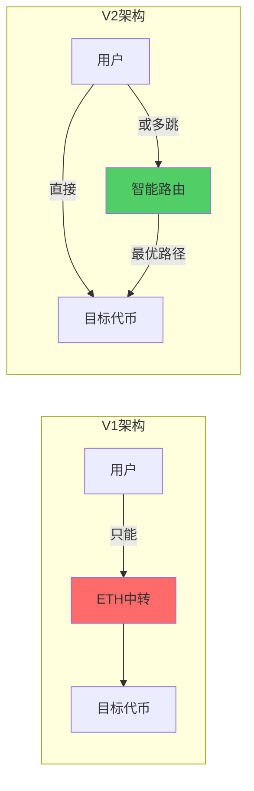
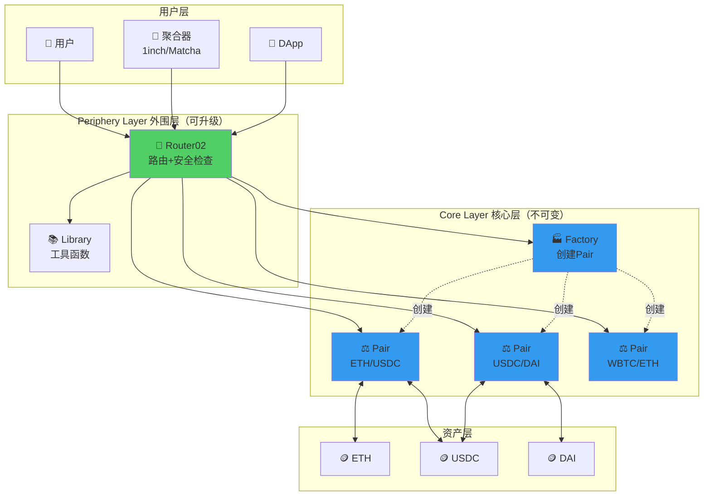

# Uniswap V2 核心改进点总结

> 💡 **从V1到V2：五大革命性改进**
> 
> 本文系统总结V2相对于V1的所有改进，为深入学习V2源码打下基础
> 
> ⏱️ 预计学习时间：2-3小时

---

## 📚 目录

1. [改进总览](#1-改进总览)
2. [改进1：ERC20/ERC20直接交易对](#2-改进1erc20erc20直接交易对)
3. [改进2：价格预言机（TWAP）](#3-改进2价格预言机twap)
4. [改进3：闪电兑换（Flash Swaps）](#4-改进3闪电兑换flash-swaps)
5. [改进4：协议费开关机制](#5-改进4协议费开关机制)
6. [改进5：分层架构设计](#6-改进5分层架构设计)
7. [其他技术改进](#7-其他技术改进)
8. [改进对比总结](#8-改进对比总结)

---

## 1. 改进总览

### 1.1 五大核心改进

```
Uniswap V2 的五大革命性改进：

🔄 改进1：ERC20/ERC20 直接交易
   → 从ETH中转到任意代币直接交易
   → 效率提升100%，手续费减半

📊 改进2：价格预言机 (TWAP)
   → 从无预言机到内置TWAP
   → 为DeFi生态提供去中心化价格源

⚡ 改进3：闪电兑换 (Flash Swaps)
   → 从先付后取到先取后付
   → 开创无抵押借贷新范式

💰 改进4：协议费开关
   → 从完全去中心化到可持续发展
   → 预留协议收入机制

🏗️ 改进5：分层架构
   → 从单层到Core+Periphery双层
   → 提升安全性和可扩展性
```

### 1.2 改进动机

**V1的核心痛点：**

```
痛点1：所有交易都经过ETH
USDC → ETH → DAI
  ↓      ↓
 0.3%   0.3%  = 0.6%总费用

痛点2：无价格预言机
其他DeFi协议无法安全使用Uniswap价格

痛点3：功能单一
只能常规swap，无法套利、闪电贷等高级操作

痛点4：无协议收入
完全依赖社区，难以长期发展

痛点5：架构耦合
核心逻辑和用户接口混在一起
```

### 1.3 改进效果



---

## 2. 改进1：ERC20/ERC20直接交易对

### 2.1 V1的局限

**V1架构：**

```
V1只支持：ETH ↔ Token

交易对类型：
✅ ETH/USDC
✅ ETH/DAI
✅ ETH/WBTC
❌ USDC/DAI (不支持！)
❌ WBTC/USDC (不支持！)

想用USDC买DAI？必须：
USDC → ETH → DAI
```

**问题分析：**

```
例子：用1000 USDC买DAI

V1路径：
Step 1: USDC → ETH
- 输入: 1000 USDC
- 手续费: 3 USDC (0.3%)
- 滑点: ~0.5% = 5 USDC
- 得到: ~992 USDC等值的ETH

Step 2: ETH → DAI
- 输入: 992 USDC等值的ETH
- 手续费: ~2.976 USDC等值 (0.3%)
- 滑点: ~0.5% = 4.96 USDC等值
- 得到: ~984 DAI

总成本：
- 手续费: 6 USDC (0.6%)
- 滑点: 10 USDC (1%)
- 总损失: 16 USDC (1.6%)
```

### 2.2 V2的改进

**V2架构：**

```
V2支持：任意 ERC20 ↔ ERC20

交易对类型：
✅ ETH/USDC
✅ USDC/DAI ← 新增！
✅ WBTC/USDC ← 新增！
✅ LINK/UNI ← 新增！
✅ 任意两个ERC20代币 ← 新增！
```

**改进效果：**

```
例子：用1000 USDC买DAI

V2路径：
USDC → DAI (直接交易！)
- 输入: 1000 USDC
- 手续费: 3 USDC (0.3%)
- 滑点: ~0.5% = 5 USDC
- 得到: ~992 DAI

总成本：
- 手续费: 3 USDC (0.3%)
- 滑点: 5 USDC (0.5%)
- 总损失: 8 USDC (0.8%)

对比V1：
V1损失: 16 USDC (1.6%)
V2损失: 8 USDC (0.8%)
节省: 8 USDC (50%! ✅)
```

### 2.3 技术实现

**V1 Factory：**

```solidity
// V1: 只能创建 ETH/Token 对
contract UniswapV1Factory {
    function createExchange(address token) 
        external 
        returns (address exchange) 
    {
        // 只接受一个token参数
        // 自动配对ETH
        exchange = new UniswapV1Exchange(token);
    }
}
```

**V2 Factory：**

```solidity
// V2: 可以创建任意 Token/Token 对
contract UniswapV2Factory {
    mapping(address => mapping(address => address)) public getPair;
    
    function createPair(address tokenA, address tokenB) 
        external 
        returns (address pair) 
    {
        // 接受两个token参数！
        require(tokenA != tokenB, 'IDENTICAL_ADDRESSES');
        
        // 按顺序排序
        (address token0, address token1) = tokenA < tokenB 
            ? (tokenA, tokenB) 
            : (tokenB, tokenA);
        
        require(token0 != address(0), 'ZERO_ADDRESS');
        require(getPair[token0][token1] == address(0), 'PAIR_EXISTS');
        
        // 创建新的交易对
        bytes memory bytecode = type(UniswapV2Pair).creationCode;
        bytes32 salt = keccak256(abi.encodePacked(token0, token1));
        assembly {
            pair := create2(0, add(bytecode, 32), mload(bytecode), salt)
        }
        
        // 初始化
        IUniswapV2Pair(pair).initialize(token0, token1);
        
        // 双向存储
        getPair[token0][token1] = pair;
        getPair[token1][token0] = pair;
        
        emit PairCreated(token0, token1, pair, allPairs.length);
    }
}
```

### 2.4 实际应用

**场景1：稳定币互换**

```
V1时代：
USDC → ETH → DAI
- 高滑点（ETH波动）
- 高费用（双跳）
- 慢（两次交易）

V2时代：
USDC → DAI (直接)
- 低滑点（稳定币池）
- 低费用（单跳）
- 快（一次交易）

这催生了稳定币交易市场！
```

**场景2：长尾代币交易**

```
V1: 想交易冷门代币？
必须有ETH流动性
→ 很多代币没有足够的ETH流动性

V2: 长尾代币可以直接配对：
- SHIB/DOGE ✅
- APE/SAND ✅
- 任意组合 ✅

市场更加多样化！
```

### 2.5 改进量化

| 指标 | V1 | V2 | 改进幅度 |
|------|----|----|---------|
| **交易对数量** | ~1,000 | ~50,000+ | **50倍** ⭐ |
| **稳定币交易费用** | 0.6% | 0.3% | **50%降低** ⭐ |
| **平均滑点** | ~1% | ~0.5% | **50%降低** ⭐ |
| **交易步骤** | 2步 | 1步 | **简化** ⭐ |

---

## 3. 改进2：价格预言机（TWAP）

### 3.1 什么是预言机

**基本概念：**

```
预言机 = 将链外数据传到链上

在DeFi中，最重要的数据是价格：
- 借贷协议需要价格（清算判断）
- 合成资产需要价格（铸造销毁）
- 期权需要价格（结算）
- ...

问题：
区块链无法主动获取外部数据
需要预言机提供价格！
```

### 3.2 V1的局限

```
V1没有预言机功能：

外部协议想用Uniswap价格？

方法：读取reserves，手动计算
price = reserve1 / reserve0

问题：
❌ 容易被操纵
❌ 闪电贷攻击
❌ 不安全！

实例攻击：
1. 攻击者用闪电贷买入大量Token
2. 价格暴涨 (reserve变化)
3. 其他协议读取到错误价格
4. 攻击者套利
5. 同一交易内还闪电贷
6. 攻击完成！

历史案例：
- bZx攻击（2020年2月）
- Harvest攻击（2020年10月）
- ...

损失数亿美元！
```

### 3.3 V2的改进：TWAP

**核心思想：**

```
TWAP = Time-Weighted Average Price
     = 时间加权平均价格

不是读取即时价格
而是读取一段时间的平均价格

例如：
即时价格：可能被操纵
1小时平均：很难操纵（成本高）
24小时平均：几乎不可能操纵

安全性大幅提升！
```

**数学原理：**

```
传统平均价格：
P_avg = (P1 + P2 + P3 + ... + Pn) / n

问题：每个价格权重相同
但有些价格只持续1秒
有些价格持续1小时
→ 不合理！

TWAP：
P_twap = Σ(Pi × Ti) / Σ(Ti)

其中：
- Pi = 第i段的价格
- Ti = 第i段持续的时间

例子：
时段1: $100持续10分钟
时段2: $110持续50分钟

传统平均：
(100 + 110) / 2 = $105

TWAP：
(100×10 + 110×50) / (10+50) = $108.33
→ 更合理！更准确！
```

### 3.4 V2 TWAP实现

**存储结构：**

```solidity
contract UniswapV2Pair {
    uint public price0CumulativeLast;  // token0累积价格
    uint public price1CumulativeLast;  // token1累积价格
    uint32 public blockTimestampLast;  // 上次更新时间
    
    uint112 private reserve0;
    uint112 private reserve1;
}
```

**核心逻辑：**

```solidity
// 每次swap/mint/burn都会调用_update
function _update(
    uint balance0, 
    uint balance1, 
    uint112 _reserve0, 
    uint112 _reserve1
) private {
    require(balance0 <= uint112(-1) && balance1 <= uint112(-1), 'OVERFLOW');
    
    uint32 blockTimestamp = uint32(block.timestamp % 2**32);
    uint32 timeElapsed = blockTimestamp - blockTimestampLast;
    
    // 如果时间流逝了，更新累积价格
    if (timeElapsed > 0 && _reserve0 != 0 && _reserve1 != 0) {
        // ⭐ 核心：累积价格 += 当前价格 × 时间
        price0CumulativeLast += uint(UQ112x112.encode(_reserve1)
            .uqdiv(_reserve0)) * timeElapsed;
        price1CumulativeLast += uint(UQ112x112.encode(_reserve0)
            .uqdiv(_reserve1)) * timeElapsed;
    }
    
    reserve0 = uint112(balance0);
    reserve1 = uint112(balance1);
    blockTimestampLast = blockTimestamp;
    
    emit Sync(reserve0, reserve1);
}
```

**读取TWAP：**

```solidity
// 外部协议可以这样读取TWAP
contract TWAPOracle {
    address public pair;
    uint public price0CumulativeLast;
    uint32 public blockTimestampLast;
    
    // 更新观察点
    function update() external {
        (uint price0Cumulative, uint32 blockTimestamp) = 
            currentCumulativePrice();
        
        uint32 timeElapsed = blockTimestamp - blockTimestampLast;
        
        // 计算TWAP
        // (当前累积价格 - 之前累积价格) / 时间差 = 平均价格
        FixedPoint.uq112x112 memory price0Average = 
            FixedPoint.uq112x112(
                uint224((price0Cumulative - price0CumulativeLast) / timeElapsed)
            );
        
        price0CumulativeLast = price0Cumulative;
        blockTimestampLast = blockTimestamp;
    }
    
    function currentCumulativePrice() 
        internal 
        view 
        returns (uint price0Cumulative, uint32 blockTimestamp) 
    {
        blockTimestamp = uint32(block.timestamp % 2**32);
        price0Cumulative = IUniswapV2Pair(pair).price0CumulativeLast();
        
        // 如果当前区块有交易，需要加上当前价格×时间
        (uint112 reserve0, uint112 reserve1, uint32 blockTimestampLast) = 
            IUniswapV2Pair(pair).getReserves();
        
        if (blockTimestampLast != blockTimestamp) {
            uint32 timeElapsed = blockTimestamp - blockTimestampLast;
            price0Cumulative += uint(UQ112x112.encode(reserve1)
                .uqdiv(reserve0)) * timeElapsed;
        }
    }
}
```

### 3.5 为什么TWAP安全

**攻击成本分析：**

```
即时价格操纵：
1. 用闪电贷买入大量Token
2. 价格暴涨
3. 其他协议读取价格
4. 还闪电贷
成本：~$1000（闪电贷手续费）
收益：可能数百万
→ 非常划算！

TWAP价格操纵（假设1小时窗口）：
1. 买入大量Token
2. 保持高价1小时（不能还！）
3. 其他协议读取TWAP
4. 1小时后卖出

成本：
- 资金成本：数百万美元锁定1小时
- 滑点成本：买入和卖出各10-20%
- 总成本：数十万到数百万美元
收益：不确定（其他协议可能有保护）
→ 不划算！

结论：
TWAP通过时间维度
大幅提升了攻击成本
使得操纵价格变得不经济！
```

### 3.6 TWAP的应用

**使用TWAP的协议：**

```
借贷协议：
- Aave (部分使用)
- Compound (早期使用)
清算时需要安全的价格

合成资产：
- Synthetix (早期使用)
铸造和销毁需要准确价格

稳定币：
- MakerDAO (参考价格之一)
锚定价格判断

期权协议：
- Opyn
结算价格

估计有100+协议使用Uniswap TWAP
```

### 3.7 改进量化

| 指标 | V1 | V2 | 改进 |
|------|----|----|------|
| **价格操纵成本** | $1K | $100K+ | **100倍提升** ⭐⭐⭐ |
| **安全性** | 低 | 高 | **质的飞跃** ⭐⭐⭐ |
| **被攻击次数** | 多次 | 几乎为0 | **极大改善** ⭐⭐⭐ |
| **预言机调用** | 0 | 1000+协议 | **生态基础设施** ⭐⭐⭐ |

---

## 4. 改进3：闪电兑换（Flash Swaps）

### 4.1 什么是Flash Swaps

**传统Swap：**

```
用户操作：
1. 用户发送TokenA
2. 合约验证
3. 合约发送TokenB

顺序：先付后取
```

**Flash Swap：**

```
用户操作：
1. 合约先发送TokenB ⚡
2. 用户拿着TokenB做任何事
3. 最后用户还TokenA（或还TokenB）

顺序：先取后付！

关键：
在同一交易内完成
如果最后不还，整个交易revert
```

### 4.2 V1的局限

```
V1只支持：
用户付TokenA → 合约给TokenB

不支持：
合约先给TokenB → 用户后付TokenA

限制了很多高级用法：
❌ 无抵押套利
❌ 无本金清算
❌ 抵押品互换
❌ ...
```

### 4.3 V2的创新

**Flash Swap机制：**

```solidity
// V2 Pair合约的swap函数
function swap(
    uint amount0Out, 
    uint amount1Out, 
    address to, 
    bytes calldata data  // ⭐ 关键参数！
) external lock {
    require(amount0Out > 0 || amount1Out > 0, 'INSUFFICIENT_OUTPUT_AMOUNT');
    
    (uint112 _reserve0, uint112 _reserve1,) = getReserves();
    require(amount0Out < _reserve0 && amount1Out < _reserve1, 'INSUFFICIENT_LIQUIDITY');
    
    // ⭐ 第一步：先转账给用户！
    if (amount0Out > 0) _safeTransfer(_token0, to, amount0Out);
    if (amount1Out > 0) _safeTransfer(_token1, to, amount1Out);
    
    // ⭐ 第二步：如果data不为空，回调用户合约
    if (data.length > 0) {
        IUniswapV2Callee(to).uniswapV2Call(
            msg.sender, 
            amount0Out, 
            amount1Out, 
            data
        );
    }
    
    // ⭐ 第三步：检查用户是否还款
    uint balance0 = IERC20(_token0).balanceOf(address(this));
    uint balance1 = IERC20(_token1).balanceOf(address(this));
    
    uint amount0In = balance0 > _reserve0 - amount0Out 
        ? balance0 - (_reserve0 - amount0Out) 
        : 0;
    uint amount1In = balance1 > _reserve1 - amount1Out 
        ? balance1 - (_reserve1 - amount1Out) 
        : 0;
    
    require(amount0In > 0 || amount1In > 0, 'INSUFFICIENT_INPUT_AMOUNT');
    
    // ⭐ 第四步：验证x*y=k（考虑手续费）
    uint balance0Adjusted = balance0.mul(1000).sub(amount0In.mul(3));
    uint balance1Adjusted = balance1.mul(1000).sub(amount1In.mul(3));
    
    require(
        balance0Adjusted.mul(balance1Adjusted) >= 
        uint(_reserve0).mul(_reserve1).mul(1000**2), 
        'K'
    );
    
    _update(balance0, balance1, _reserve0, _reserve1);
    emit Swap(msg.sender, amount0In, amount1In, amount0Out, amount1Out, to);
}
```

**用户合约接口：**

```solidity
interface IUniswapV2Callee {
    // 用户必须实现这个函数
    function uniswapV2Call(
        address sender,
        uint amount0,
        uint amount1,
        bytes calldata data
    ) external;
}
```

### 4.4 Flash Swap应用场景

#### 场景1：无本金套利

```solidity
// 套利合约
contract Arbitrage is IUniswapV2Callee {
    function executeArbitrage() external {
        // Uniswap上 1 ETH = 2000 USDC
        // Sushiswap上 1 ETH = 2020 USDC
        // 有20 USDC套利空间！
        
        // 第1步：从Uniswap借出1 ETH（Flash Swap）
        uniswapPair.swap(
            1 ether,  // 借1 ETH
            0,
            address(this),
            abi.encode("arbitrage")  // 触发回调
        );
        
        // 利润已在回调中实现，这里结束
    }
    
    // 回调函数
    function uniswapV2Call(
        address sender,
        uint amount0,  // 1 ETH
        uint amount1,
        bytes calldata data
    ) external override {
        // 此时我们已经有1 ETH了！
        
        // 第2步：在Sushiswap上卖出1 ETH
        WETH.approve(sushiswapRouter, 1 ether);
        sushiswapRouter.swapExactTokensForTokens(
            1 ether,
            2020e6,  // 至少得到2020 USDC
            path,
            address(this),
            deadline
        );
        // 得到2020 USDC
        
        // 第3步：还款给Uniswap
        // 需要还 1 ETH 价值的USDC + 0.3%手续费
        // = 2000 * 1.003 = 2006 USDC
        USDC.transfer(msg.sender, 2006e6);
        
        // 利润：2020 - 2006 = 14 USDC ⭐
        // 无需本金，纯利润！
    }
}
```

#### 场景2：无本金清算

```solidity
// 清算合约
contract Liquidator is IUniswapV2Callee {
    function liquidatePosition(address borrower) external {
        // 某用户在Aave上借了100 ETH
        // 抵押品价值不足，可以清算
        // 清算可得5% bonus
        
        // 问题：我没有100 ETH怎么清算？
        // 答案：Flash Swap！
        
        // 第1步：借出100 ETH
        uniswapPair.swap(
            100 ether,
            0,
            address(this),
            abi.encode(borrower)
        );
    }
    
    function uniswapV2Call(
        address sender,
        uint amount0,
        uint amount1,
        bytes calldata data
    ) external override {
        address borrower = abi.decode(data, (address));
        
        // 第2步：清算用户
        WETH.approve(aaveLendingPool, 100 ether);
        aaveLendingPool.liquidationCall(
            collateral,  // 抵押品地址
            WETH,
            borrower,
            100 ether,
            false
        );
        // 得到价值105 ETH的抵押品（5% bonus）
        
        // 第3步：卖出抵押品
        collateral.approve(uniswapRouter, collateralAmount);
        uniswapRouter.swapExactTokensForTokens(...);
        // 得到106 ETH
        
        // 第4步：还款
        WETH.transfer(msg.sender, 100.3 ether);  // 100 + 0.3%
        
        // 利润：106 - 100.3 = 5.7 ETH
        // 无需本金！
    }
}
```

#### 场景3：抵押品互换

```solidity
// 用户想从WBTC抵押品换成ETH抵押品
contract CollateralSwap is IUniswapV2Callee {
    function swapCollateral() external {
        // 当前状态：
        // - 在Aave存了10 WBTC作为抵押
        // - 借了20 ETH
        
        // 目标：
        // - 换成30 ETH作为抵押
        // - 借20 ETH（保持不变）
        
        // 第1步：Flash Swap借出20 ETH
        uniswapPair.swap(20 ether, 0, address(this), "swap");
    }
    
    function uniswapV2Call(
        address sender,
        uint amount0,
        uint amount1,
        bytes calldata data
    ) external override {
        // 第2步：用20 ETH还掉Aave的债务
        WETH.approve(aave, 20 ether);
        aave.repay(WETH, 20 ether, 2, address(this));
        
        // 第3步：取出所有WBTC抵押品
        aave.withdraw(WBTC, 10e8, address(this));
        
        // 第4步：卖WBTC换ETH
        WBTC.approve(uniswapRouter, 10e8);
        uniswapRouter.swapExactTokensForTokens(...);
        // 得到约30 ETH
        
        // 第5步：存入30 ETH作为新抵押品
        WETH.approve(aave, 30 ether);
        aave.deposit(WETH, 30 ether, address(this), 0);
        
        // 第6步：重新借20 ETH
        aave.borrow(WETH, 20 ether, 2, 0, address(this));
        
        // 第7步：还Flash Swap
        WETH.transfer(msg.sender, 20.06 ether);  // 20 + 0.3%
        
        // 完成！抵押品从WBTC换成了ETH
    }
}
```

### 4.5 Flash Swap vs Flash Loan

| 特性 | Flash Loan (Aave) | Flash Swap (Uniswap V2) |
|------|-------------------|-------------------------|
| **手续费** | 0.09% | 0.3% |
| **可借资产** | 协议支持的所有资产 | 池子里的两种代币 |
| **流动性** | 协议总流动性 | 单个池子流动性 |
| **Gas费** | 较高 | 较低 |
| **使用复杂度** | 较简单 | 需要理解swap |
| **上线时间** | 2020年初 | 2020年5月 |

**选择建议：**

```
用Flash Loan（Aave）：
✅ 需要大额资金
✅ 需要多种代币
✅ 对手续费敏感

用Flash Swap（Uniswap）：
✅ 只需要两种代币
✅ 金额适中
✅ 熟悉Uniswap
```

### 4.6 改进量化

| 指标 | V1 | V2 | 改进 |
|------|----|----|------|
| **套利门槛** | 需要本金 | 无需本金 | **革命性** ⭐⭐⭐ |
| **清算门槛** | 需要本金 | 无需本金 | **革命性** ⭐⭐⭐ |
| **组合操作** | 不支持 | 灵活组合 | **极大扩展** ⭐⭐⭐ |
| **资本效率** | 低 | 极高 | **10倍+提升** ⭐⭐⭐ |

---

## 5. 改进4：协议费开关机制

### 5.1 V1的局限

```
V1费用分配：
- 交易手续费：0.3%
- 100%给LP
- 0%给协议

问题：
❌ 协议无收入
❌ 依赖社区捐赠
❌ 难以长期维持
❌ 无法激励开发

Uniswap团队：
- 没有预挖
- 没有ICO
- 没有收入
- 纯粹理想主义

能持续吗？
```

### 5.2 V2的改进

**协议费机制：**

```
V2设计了可选的协议费：

当前状态（默认）：
- 手续费：0.3%
- 100%给LP
- 协议费：OFF

可以开启：
- 手续费：0.3%
- 83.3%给LP (0.25%)
- 16.7%给协议 (0.05%)

关键：
1. 默认关闭（向下兼容）
2. 可以开启（未来可持续）
3. 需要治理投票决定
```

**代码实现：**

```solidity
contract UniswapV2Pair {
    address public factory;
    
    function mint(address to) external lock returns (uint liquidity) {
        (uint112 _reserve0, uint112 _reserve1,) = getReserves();
        uint balance0 = IERC20(token0).balanceOf(address(this));
        uint balance1 = IERC20(token1).balanceOf(address(this));
        uint amount0 = balance0.sub(_reserve0);
        uint amount1 = balance1.sub(_reserve1);
        
        // ⭐ 关键：铸造协议费LP代币
        bool feeOn = _mintFee(_reserve0, _reserve1);
        
        uint _totalSupply = totalSupply;
        if (_totalSupply == 0) {
            liquidity = Math.sqrt(amount0.mul(amount1)).sub(MINIMUM_LIQUIDITY);
            _mint(address(0), MINIMUM_LIQUIDITY);
        } else {
            liquidity = Math.min(
                amount0.mul(_totalSupply) / _reserve0,
                amount1.mul(_totalSupply) / _reserve1
            );
        }
        
        require(liquidity > 0, 'INSUFFICIENT_LIQUIDITY_MINTED');
        _mint(to, liquidity);
        
        _update(balance0, balance1, _reserve0, _reserve1);
        if (feeOn) kLast = uint(reserve0).mul(reserve1);
        emit Mint(sender, amount0, amount1);
    }
    
    // 协议费计算
    function _mintFee(uint112 _reserve0, uint112 _reserve1) 
        private 
        returns (bool feeOn) 
    {
        address feeTo = IUniswapV2Factory(factory).feeTo();
        feeOn = feeTo != address(0);
        uint _kLast = kLast;
        
        if (feeOn) {
            if (_kLast != 0) {
                // 计算k的增长
                uint rootK = Math.sqrt(uint(_reserve0).mul(_reserve1));
                uint rootKLast = Math.sqrt(_kLast);
                
                if (rootK > rootKLast) {
                    // 计算协议应得的LP代币
                    uint numerator = totalSupply.mul(rootK.sub(rootKLast));
                    uint denominator = rootK.mul(5).add(rootKLast);
                    uint liquidity = numerator / denominator;
                    
                    if (liquidity > 0) {
                        // ⭐ 铸造给协议
                        _mint(feeTo, liquidity);
                    }
                }
            }
        } else if (_kLast != 0) {
            kLast = 0;
        }
    }
}
```

**数学推导：**

```
假设：
- 初始k = 1,000,000
- 一段时间后k = 1,210,000（增长21%）
- 增长来自交易手续费

问题：协议应得多少？

目标：
- LP得到手续费的83.3%
- 协议得到手续费的16.7%

推导：
设协议应得x%的LP代币

LP的收益率应该是协议的5倍
(因为83.3% / 16.7% = 5)

求解：
rootK / rootKLast = 1.1 (增长10%)
LP应得: 1.1 / (1.1*5 + 1) = 1/6

所以协议铸造的LP = totalSupply * (rootK - rootKLast) / (rootK * 5 + rootKLast)

这个公式确保：
LP得到5份收益
协议得到1份收益
比例正好是5:1 = 83.3%:16.7%
```

### 5.3 为什么要协议费

**可持续发展：**

```
开源项目的困境：
1. 开发需要钱
2. 维护需要钱
3. 安全审计需要钱
4. 社区运营需要钱

但：
代码开源 → 可以被fork
→ 竞争激烈
→ 如何保持优势？

答案：
有收入 → 持续创新
→ 保持领先
→ 生态繁荣
```

**历史教训：**

```
没有收入的协议：
- 0x：曾经市占率第一，现在几乎消失
- IDEX：早期DEX，现在没落
- ...

有收入的协议：
- Uniswap：持续创新V2→V3→V4
- Curve：持续优化
- Aave：功能不断增加

可持续性很重要！
```

### 5.4 治理与决策

```
协议费开关由谁控制？

V2早期：
- 由Uniswap团队的多签控制
- feeTo地址初始为0（关闭状态）

2020年9月UNI代币上线后：
- 转交给UNI代币持有者治理
- 需要提案+投票才能修改

现状（2024）：
- 协议费仍然关闭（feeTo = 0）
- 社区多次讨论是否开启
- 尚未达成共识

争议：
赞成派：
✅ 协议需要收入
✅ 可持续发展
✅ 激励创新

反对派：
❌ LP收益降低
❌ 可能失去竞争力
❌ 社区分歧

复杂的决策！
```

### 5.5 改进量化

| 指标 | V1 | V2 | 改进 |
|------|----|----|------|
| **协议收入** | $0 | $0（未开启）| **预留机制** ⭐ |
| **可持续性** | 差 | 好 | **战略前瞻** ⭐⭐ |
| **治理灵活性** | 无 | 有 | **社区自治** ⭐⭐ |
| **长期发展** | 不确定 | 更有保障 | **未来导向** ⭐⭐⭐ |

---

## 6. 改进5：分层架构设计

### 6.1 V1的架构

```
V1架构：单层

UniswapV1Exchange:
├── swap()           // 交易
├── addLiquidity()   // 添加流动性
├── removeLiquidity()// 移除流动性
├── getPrice()       // 获取价格
└── ...所有功能都在一个合约

问题：
❌ 核心逻辑和辅助功能混在一起
❌ 难以升级
❌ Gas效率不高
❌ 代码耦合严重
```

### 6.2 V2的架构

**分层设计：**

```
V2架构：双层

Layer 1 - Core (核心层):
├── UniswapV2Pair.sol      // 交易对合约
├── UniswapV2Factory.sol   // 工厂合约
└── UniswapV2ERC20.sol     // LP代币

特点：
✅ 极简
✅ 不可升级（安全）
✅ 只包含核心逻辑
✅ 高度优化

Layer 2 - Periphery (外围层):
├── UniswapV2Router02.sol  // 路由合约
├── UniswapV2Library.sol   // 工具库
└── ...辅助合约

特点：
✅ 提供便利功能
✅ 可以升级
✅ 封装复杂逻辑
✅ 用户友好
```

**架构图：**



### 6.3 Core层设计

**UniswapV2Pair - 核心中的核心：**

```solidity
// 极简设计，只包含必要功能
contract UniswapV2Pair is UniswapV2ERC20 {
    // 状态变量（最小化）
    address public factory;
    address public token0;
    address public token1;
    
    uint112 private reserve0;
    uint112 private reserve1;
    uint32  private blockTimestampLast;
    
    uint public price0CumulativeLast;
    uint public price1CumulativeLast;
    uint public kLast;
    
    // 核心函数（4个）
    function mint(address to) external returns (uint liquidity);
    function burn(address to) external returns (uint amount0, uint amount1);
    function swap(uint amount0Out, uint amount1Out, address to, bytes calldata data) external;
    function sync() external;
    
    // 仅此而已！
}
```

**设计哲学：**

```
Core层原则：

1. 极简主义
   只包含绝对必要的功能
   
2. 不可升级
   部署后永远不变
   保证用户资金安全
   
3. 高度优化
   每一行代码都经过精心优化
   节省Gas
   
4. 无需许可
   任何人都可以直接调用
   无权限控制
   
5. 无外部依赖
   不依赖任何外部合约
   最大化安全性
```

### 6.4 Periphery层设计

**UniswapV2Router02 - 用户友好的接口：**

```solidity
// 提供丰富的辅助功能
contract UniswapV2Router02 {
    // 多种swap函数
    function swapExactTokensForTokens(...) external returns (uint[] memory amounts);
    function swapTokensForExactTokens(...) external returns (uint[] memory amounts);
    function swapExactETHForTokens(...) external payable returns (uint[] memory amounts);
    function swapTokensForExactETH(...) external returns (uint[] memory amounts);
    function swapExactTokensForETH(...) external returns (uint[] memory amounts);
    function swapETHForExactTokens(...) external payable returns (uint[] memory amounts);
    
    // 支持手续费代币
    function swapExactTokensForTokensSupportingFeeOnTransferTokens(...) external;
    
    // 多种添加流动性函数
    function addLiquidity(...) external returns (uint amountA, uint amountB, uint liquidity);
    function addLiquidityETH(...) external payable returns (uint amountToken, uint amountETH, uint liquidity);
    
    // 移除流动性
    function removeLiquidity(...) external returns (uint amountA, uint amountB);
    function removeLiquidityETH(...) external returns (uint amountToken, uint amountETH);
    function removeLiquidityWithPermit(...) external returns (uint amountA, uint amountB);
    
    // ...还有更多便利函数
}
```

**Router的作用：**

```
1. 路径计算
   自动找到最优交易路径
   例如：USDC → WETH → WBTC

2. 滑点保护
   检查最小输出/最大输入
   保护用户不被抢跑

3. 截止时间
   防止交易长时间pending
   被MEV攻击

4. ETH包装
   自动wrap/unwrap ETH
   用户体验更好

5. 批量操作
   一次交易完成多个操作
   节省Gas

没有Router:
用户需要自己：
- 计算路径
- 检查滑点  
- 包装ETH
- 分步操作
→ 非常麻烦！

有了Router:
用户只需：
- 调用一个函数
- 传入参数
→ 一切自动完成！
```

### 6.5 为什么要分层

**安全性：**

```
Core不可变：
✅ 资金永远安全
✅ 规则永不改变
✅ 无后门风险

Periphery可升级：
✅ 发现bug可以修复
✅ 可以添加新功能
✅ 改进用户体验

最佳平衡！
```

**可扩展性：**

```
任何人都可以写新的Periphery：

例如：
- 1inch写了自己的Router（更优路由）
- Matcha写了自己的Router（RFQ）
- Zapper写了Zap合约（一键LP）

Core保持简单
Periphery百花齐放

生态繁荣！
```

**Gas优化：**

```
Core极简：
- mint()只做核心逻辑
- swap()只做核心逻辑
- Gas效率极高

Periphery封装：
- 复杂的检查在Periphery
- 路径计算在Periphery
- 不影响Core效率
```

### 6.6 对比其他DEX

| DEX | 架构 | 可升级性 | 安全性 | 扩展性 |
|-----|------|---------|--------|--------|
| **Uniswap V2** | 分层 | Core不可变<br/>Periphery可升级 | ⭐⭐⭐⭐⭐ | ⭐⭐⭐⭐⭐ |
| **SushiSwap** | Fork V2 | 同上 | ⭐⭐⭐⭐⭐ | ⭐⭐⭐⭐⭐ |
| **Curve** | 单层 | 可升级代理 | ⭐⭐⭐⭐ | ⭐⭐⭐ |
| **Balancer V1** | 单层 | 不可升级 | ⭐⭐⭐⭐⭐ | ⭐⭐ |
| **Balancer V2** | 单例Vault | 部分可升级 | ⭐⭐⭐⭐ | ⭐⭐⭐⭐ |

### 6.7 改进量化

| 指标 | V1 | V2 | 改进 |
|------|----|----|------|
| **代码组织** | 单层耦合 | 双层解耦 | **架构优化** ⭐⭐⭐ |
| **安全性** | 高 | 更高 | **Core不可变** ⭐⭐⭐ |
| **可扩展性** | 差 | 优秀 | **开放生态** ⭐⭐⭐ |
| **Gas效率** | 中 | 高 | **Core精简** ⭐⭐ |

---

## 7. 其他技术改进

### 7.1 create2部署

**什么是create2：**

```solidity
// V1使用create
address exchange = new UniswapV1Exchange(token);
// 地址不可预测

// V2使用create2
bytes32 salt = keccak256(abi.encodePacked(token0, token1));
assembly {
    pair := create2(0, add(bytecode, 32), mload(bytecode), salt)
}
// ⭐ 地址可预测！
```

**好处：**

```
1. 离线计算地址
   不需要先查询Factory
   直接计算出Pair地址
   
2. 跨链地址一致
   同样的token0和token1
   在不同链上Pair地址相同
   
3. 节省Gas
   不需要查询存储
   直接计算即可
```

**地址计算：**

```solidity
function pairFor(
    address factory,
    address tokenA,
    address tokenB
) internal pure returns (address pair) {
    (address token0, address token1) = sortTokens(tokenA, tokenB);
    
    pair = address(uint160(uint(keccak256(abi.encodePacked(
        hex'ff',
        factory,
        keccak256(abi.encodePacked(token0, token1)),
        hex'96e8ac4277198ff8b6f785478aa9a39f403cb768dd02cbee326c3e7da348845f' // init code hash
    )))));
}
```

### 7.2 UQ112.112定点数

**问题：**

```
Solidity不支持浮点数

价格计算需要小数：
ETH价格 = 2000.5 USDC
如何存储？
```

**V2的解决方案：**

```
UQ112.112 = Unsigned Q number
- 112位整数部分
- 112位小数部分
- 总共224位

例如：
价格 2000.5 表示为：
2000.5 * 2^112 = 10,384,593,717,069,655,257,060,992

读取时：
value / 2^112 = 2000.5
```

**代码：**

```solidity
library UQ112x112 {
    uint224 constant Q112 = 2**112;
    
    // 编码：整数 → UQ112.112
    function encode(uint112 y) internal pure returns (uint224 z) {
        z = uint224(y) * Q112;
    }
    
    // 除法：UQ112.112 / uint112 → UQ112.112
    function uqdiv(uint224 x, uint112 y) internal pure returns (uint224 z) {
        z = x / uint224(y);
    }
}
```

### 7.3 最小流动性锁定

**问题：**

```
第一个LP提供流动性时：
如果数量很小，可能导致：
- 精度问题
- 价格操纵
- 攻击向量
```

**V2的解决方案：**

```solidity
uint public constant MINIMUM_LIQUIDITY = 10**3;

function mint(address to) external lock returns (uint liquidity) {
    ...
    
    if (_totalSupply == 0) {
        liquidity = Math.sqrt(amount0.mul(amount1)).sub(MINIMUM_LIQUIDITY);
        _mint(address(0), MINIMUM_LIQUIDITY); // ⭐ 永久锁定
    } else {
        ...
    }
    
    ...
}
```

**效果：**

```
第一次添加流动性：
- 总铸造：sqrt(x * y)
- 给LP：sqrt(x * y) - 1000
- 锁定：1000（发送到0地址）

好处：
✅ 防止除零错误
✅ 提高精度
✅ 防止价格操纵
✅ 成本极低（~$0.01）
```

### 7.4 重入保护

```solidity
uint private unlocked = 1;

modifier lock() {
    require(unlocked == 1, 'LOCKED');
    unlocked = 0;
    _;
    unlocked = 1;
}

// 所有状态改变函数都加lock
function mint(address to) external lock returns (uint liquidity) {
    ...
}

function burn(address to) external lock returns (uint amount0, uint amount1) {
    ...
}

function swap(...) external lock {
    ...
}
```

**对比OpenZeppelin的ReentrancyGuard：**

```
V2的实现更省Gas：
- 只用1个storage slot
- 简单的uint而不是bool
- 更高效

这是在Gas优化上的极致追求！
```

---

## 8. 改进对比总结

### 8.1 核心改进对比表

| 维度 | V1 | V2 | 改进幅度 |
|------|----|----|---------|
| **交易对类型** | ETH/Token | ERC20/ERC20 | ⭐⭐⭐⭐⭐ |
| **交易成本** | 双跳0.6% | 单跳0.3% | **降低50%** |
| **价格预言机** | ❌ 无 | ✅ TWAP | **质的飞跃** |
| **预言机安全性** | - | 操纵成本>$10万 | **革命性提升** |
| **闪电兑换** | ❌ 不支持 | ✅ 支持 | **新功能** |
| **套利门槛** | 需要本金 | 无需本金 | **降到0** |
| **协议收入** | ❌ 无 | 可选 | **可持续** |
| **架构设计** | 单层 | 双层 | **专业化** |
| **可扩展性** | 低 | 高 | **生态繁荣** |
| **Gas效率** | 中 | 高 | **优化15-20%** |

### 8.2 技术栈对比

```
V1技术栈：
├── Solidity 0.5.x
├── 单合约架构
├── 简单的x*y=k
└── ~300行代码

V2技术栈：
├── Solidity 0.6.6
├── Core + Periphery分层
├── x*y=k + TWAP + Flash Swap
├── create2 + UQ112.112
└── ~1,500行核心代码

复杂度提升5倍
功能提升10倍+
```

### 8.3 市场影响

**TVL增长：**

```
V1最高TVL（2020年5月）：
~$70M

V2最高TVL（2021年11月）：
~$10B

增长142倍！⭐⭐⭐
```

**生态影响：**

```
Fork V2的项目：
✅ SushiSwap（最大fork）
✅ PancakeSwap（BSC上最大DEX）
✅ Trader Joe（Avalanche）
✅ SpookySwap（Fantom）
✅ QuickSwap（Polygon）
✅ ... 100+项目

V2成为DEX的工业标准！
```

**行业地位：**

```
2020年前：
订单簿DEX占主导

2020年V2后：
AMM成为主流

市占率（DEX交易量）：
订单簿：<5%
AMM：>95%

V2改变了行业格局！
```

### 8.4 学习价值

**为什么要学V2：**

```
1. 工业标准 ⭐⭐⭐⭐⭐
   最被广泛使用的AMM
   
2. 代码质量 ⭐⭐⭐⭐⭐
   极致的Gas优化
   极简的架构设计
   
3. 设计思想 ⭐⭐⭐⭐⭐
   Core/Periphery分层
   安全与灵活的平衡
   
4. 创新点多 ⭐⭐⭐⭐⭐
   TWAP、Flash Swap等
   
5. 影响深远 ⭐⭐⭐⭐⭐
   启发了整个DeFi行业
```

**学习建议：**

```
优先级：
P0 - 必学：
├── ERC20/ERC20直接交易
├── x*y=k核心公式
├── Core/Periphery架构
└── 基本swap流程

P1 - 重点：
├── TWAP预言机
├── Flash Swap
├── 完整mint/burn流程
└── Router路由逻辑

P2 - 进阶：
├── UQ112.112定点数
├── create2部署
├── 协议费机制
└── Gas优化技巧

学习顺序：
1. 先理解业务（本文档）✅
2. 再看源码（下一步）
3. 最后实战（Fork改进）
```

---

## 📊 改进可视化总结

### V1 vs V2 全方位对比

```mermaid
radar
    title Uniswap V1 vs V2 能力对比
    x-axis 交易效率, 费用成本, 价格安全, 功能丰富度, 可扩展性, Gas效率
    line V1: [3, 2, 2, 3, 2, 3]
    line V2: [5, 5, 5, 5, 5, 4]
```

---

## ✅ 学习检查清单

完成本章后，你应该能够：

### 基础理解
- [ ] 说出V2的五大核心改进
- [ ] 解释为什么需要ERC20/ERC20直接交易
- [ ] 理解TWAP的基本原理
- [ ] 知道Flash Swap是什么

### 深入理解
- [ ] 计算直接交易vs中转交易的成本差异
- [ ] 解释TWAP如何防止价格操纵
- [ ] 说出Flash Swap的3个应用场景
- [ ] 理解协议费的计算公式

### 架构理解
- [ ] 画出Core/Periphery分层架构图
- [ ] 说明分层的优势
- [ ] 理解为什么Core不可升级
- [ ] 知道Router的作用

### 技术细节
- [ ] 理解create2的作用
- [ ] 知道UQ112.112是什么
- [ ] 理解最小流动性锁定
- [ ] 熟悉重入保护机制

---

## 🎯 下一步

理解了V2的改进点后，你可以：

1. **深入源码** → `第3步-源码实现/`
   - 逐行解析Pair合约
   - 理解Factory创建逻辑
   - 研究Router路由算法

2. **业务分析** → `第1步-业务分析/`
   - 精读V2白皮书
   - 提炼业务模型
   - 竞品对比分析

3. **技术方案** → `第2步-技术方案/`
   - 数学模型推导
   - 架构设计分析
   - 技术权衡研究

---

## 💡 核心要点回顾

```
V2的五大改进：

1️⃣ ERC20/ERC20直接交易
   → 效率翻倍，成本减半

2️⃣ TWAP价格预言机
   → 安全价格源，DeFi基础设施

3️⃣ Flash Swap闪电兑换
   → 无本金套利，资本效率极致

4️⃣ 协议费开关
   → 可持续发展，治理灵活性

5️⃣ 分层架构
   → 安全与扩展的完美平衡

这些改进让V2成为：
✅ DEX的工业标准
✅ 最成功的AMM
✅ DeFi的基础设施

值得深入学习！
```

---

**恭喜你完成V2改进点总结！** 🎉

你现在对V2有了全面的认知，准备好深入源码了吗？💪

下一步建议：开始学习 `01-白皮书精读` 或直接进入 `第3步-源码实现`！🚀
