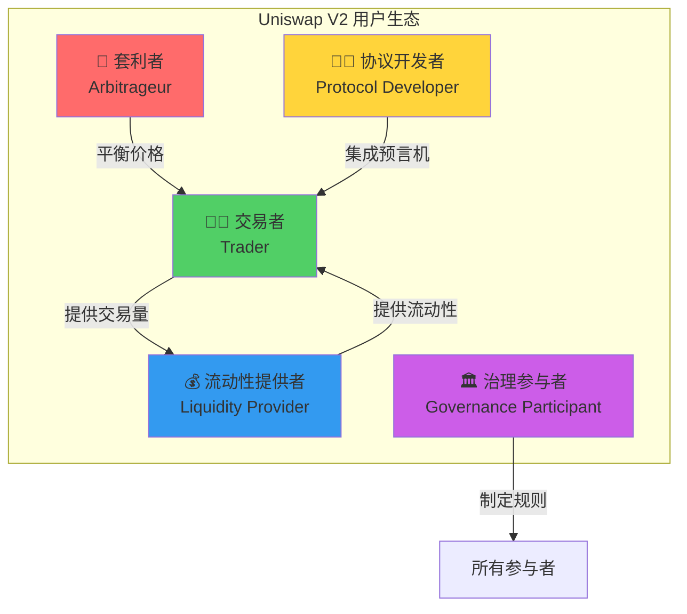

# Uniswap V2 业务问题提炼

> 💡 **从业务角度提炼核心问题**
> 
> 用产品思维分析：用户是谁？痛点是什么？如何解决？
> 
> ⏱️ 预计学习时间：2-3小时

---

## 📚 目录

1. [用户角色分析](#1-用户角色分析)
2. [核心业务问题](#2-核心业务问题)
3. [问题优先级](#3-问题优先级)
4. [解决方案映射](#4-解决方案映射)
5. [业务价值评估](#5-业务价值评估)
6. [产品设计权衡](#6-产品设计权衡)

---

## 1. 用户角色分析

### 1.1 用户画像矩阵



### 1.2 交易者（Trader）

**角色定义：**
```
谁：想要兑换代币的用户

典型场景：
- 将USDC换成ETH
- 将ETH换成WBTC
- 稳定币之间互换

使用频率：
高频：套利交易者（每天多次）
中频：活跃交易者（每周几次）
低频：普通用户（偶尔使用）
```

**核心需求：**
```
1. 低成本 💰
   → 手续费要低
   → Gas费要省
   → 滑点要小

2. 高效率 ⚡
   → 交易要快
   → 不要卡顿
   → 确认要及时

3. 安全性 🔒
   → 资金不被盗
   → 价格不被操纵
   → 交易不失败

4. 便捷性 📱
   → 操作要简单
   → 界面要友好
   → 不要复杂
```

**痛点问题：**

```
❌ 问题1：中转成本高
场景：用USDC买DAI
V1方式：USDC → ETH → DAI
痛点：
- 双倍手续费（0.6%）
- 双倍滑点
- 双倍Gas费
- 多一次风险

❌ 问题2：大额交易滑点大
场景：买价值$100万的ETH
V1表现：
- 滑点可能>10%
- 实际成本远超预期
痛点：
- 价格冲击大
- 资金效率低
- 无法做大额

❌ 问题3：抢跑风险
场景：提交交易后
攻击者行为：
- 看到交易在mempool
- 提高Gas抢跑
- 推高价格
痛点：
- 实际成交价更差
- 被MEV攻击
- 用户损失大
```

### 1.3 流动性提供者（LP）

**角色定义：**
```
谁：向池子提供流动性赚取手续费的用户

典型profile：
- 持有大量代币的巨鲸
- 寻求被动收益的投资者
- 做市商和机构

投资规模：
小型LP：$1K - $10K
中型LP：$10K - $100K
大型LP：$100K - $1M
巨鲸LP：$1M+
```

**核心需求：**
```
1. 高收益 📈
   → 年化收益率APY要高
   → 手续费收入要稳定
   → 复利效应要好

2. 低风险 🛡️
   → 无常损失要小
   → 本金要安全
   → 不要被攻击

3. 简单性 🎯
   → 不需要主动管理
   → 自动复利
   → 一键操作

4. 透明性 📊
   → 随时看到收益
   → 随时可以退出
   → 费用清晰
```

**痛点问题：**

```
❌ 问题1：无常损失
场景：提供ETH/USDC流动性
价格变化：ETH从$2000涨到$3000
结果：
- 如果直接持有：+50%
- 提供流动性：+38%
- 无常损失：-12%
痛点：
- 收益降低
- 被动承受
- 无法对冲

❌ 问题2：手续费收入不确定
场景：提供流动性
不确定性：
- 交易量波动大
- 手续费不稳定
- 难以预测收益
痛点：
- 无法规划
- 收益波动大
- 可能亏本

❌ 问题3：退出成本高
场景：想移除流动性
成本：
- Gas费高（尤其网络拥堵时）
- 可能有滑点
- 时机难把握
痛点：
- 灵活性差
- 成本高
- 被套牢
```

### 1.4 套利者（Arbitrageur）

**角色定义：**
```
谁：通过发现和利用价差获利的交易者

典型行为：
- 监控多个DEX和CEX的价格
- 发现价差立即交易
- 自动化执行套利

技术水平：
- 熟悉智能合约
- 运行自己的节点
- 编写套利机器人
```

**核心需求：**
```
1. 高效率 ⚡⚡⚡
   → 速度要快
   → 抢先执行
   → 低延迟

2. 低门槛 🚪
   → 不需要大量本金
   → 可以闪电贷
   → 杠杆套利

3. 低成本 💰
   → 手续费要低
   → Gas费要省
   → 滑点要小

4. 可组合性 🔗
   → 可以跨DEX套利
   → 可以闪电贷
   → 可以原子操作
```

**痛点问题：**

```
❌ 问题1：需要大量本金
场景：发现Uniswap和Sushiswap价差
V1方式：
- 需要先有本金
- 买100 ETH需要$200K
- 小玩家无法参与
痛点：
- 资本门槛高
- 机会被浪费
- 市场效率低

❌ 问题2：套利窗口短
场景：价差出现
时间：
- 可能只有几秒
- 其他人也在抢
- 竞争激烈
痛点：
- 需要极快速度
- 需要高gas费
- 成功率低

❌ 问题3：组合操作复杂
场景：跨多个池子套利
步骤：
1. 在UniswapUSDC换ETH
2. 在SushiswapETH换WBTC
3. 在CurveWBTC换USDC
问题：
- 需要多笔交易
- Gas费高
- 风险大（可能部分成功）
痛点：
- 执行成本高
- 失败风险大
- 利润被吞噬
```

### 1.5 协议开发者（Protocol Developer）

**角色定义：**
```
谁：构建依赖Uniswap的DeFi协议的开发者

典型协议：
- 借贷协议（Aave、Compound）
- 合成资产（Synthetix）
- 聚合器（1inch、Matcha）
- 衍生品（Opyn、Perpetual）
```

**核心需求：**
```
1. 可靠的价格源 📊
   → 价格要准确
   → 不能被操纵
   → 延迟要低

2. 可组合性 🔗
   → 易于集成
   → 标准接口
   → 无需许可

3. 安全性 🔒
   → 防止闪电贷攻击
   → 防止重入攻击
   → 经过审计

4. 文档完善 📚
   → API清晰
   → 示例丰富
   → 社区活跃
```

**痛点问题：**

```
❌ 问题1：没有安全的链上价格源
场景：借贷协议需要判断是否清算
V1方式：
- 直接读取reserves
- 计算即时价格
风险：
- 容易被闪电贷操纵
- 用户可能恶意操纵避免清算
- 协议承受损失
痛点：
- 不敢用Uniswap价格
- 需要依赖Chainlink（付费）
- 增加中心化风险

❌ 问题2：集成复杂
场景：想集成Uniswap交易功能
难点：
- 需要处理ETH包装
- 需要处理路径选择
- 需要处理滑点保护
痛点：
- 开发成本高
- 容易出错
- 维护困难

❌ 问题3：无法实现高级功能
场景：想实现TWAMM（时间加权做市商）
V1限制：
- 没有hooks机制
- 无法定制逻辑
- 只能fork
痛点：
- 创新受限
- 需要重复造轮子
- 流动性分散
```

---

## 2. 核心业务问题

### 2.1 问题分类框架

```
业务问题维度：

📊 效率问题
├── 资本效率低
├── 交易成本高
└── 路径不优化

🔒 安全问题
├── 价格可被操纵
├── 闪电贷攻击
└── 中心化风险

🎯 功能问题
├── 功能单一
├── 不够灵活
└── 可组合性差

💰 商业问题
├── 无协议收入
├── 难以持续发展
└── 竞争力不足
```

### 2.2 效率问题深度分析

**问题1：ETH中转效率低**

```
业务表现：
- 所有非ETH交易都需要经过ETH中转
- USDC→DAI需要两跳：USDC→ETH→DAI
- 稳定币交易占比40%+，全部被额外收费

量化影响：
成本对比：
├── V1两跳: 0.6%手续费 + 1%滑点 = 1.6%
└── 理想直接: 0.3%手续费 + 0.5%滑点 = 0.8%
    差异: 0.8% = 100%额外成本！

市场规模：
- 日稳定币交易量: $500M
- 额外成本损失: $4M/天
- 年化: $1.5B

用户流失：
- 竞争对手Curve针对稳定币优化
- Uniswap在稳定币市场份额下降
- 需要改进！
```

**问题2：资本效率低**

```
业务表现：
- 流动性分散在$0-$∞所有价格
- 实际交易只在当前价格±10%
- 90%资金闲置

量化分析：
池子A: $1M TVL
├── 有效流动性: ~$100K (10%)
└── 闲置资金: ~$900K (90%)

对比CEX:
├── Binance: $1M流动性 = ~$1M有效
└── Uniswap: $1M流动性 = ~$100K有效
    差距: 10倍！

影响：
- 大额交易滑点高
- LP收益相对低
- 竞争力不足
```

**问题3：交易路径不优化**

```
业务表现：
- V1只能ETH中转，路径固定
- 无法选择最优路径
- 效率受限

例子：
USDC → WBTC，可能路径：
├── 路径1: USDC → ETH → WBTC (V1只能这样)
├── 路径2: USDC → USDT → WBTC
└── 路径3: USDC → DAI → ETH → WBTC

最优路径可能不是路径1！

量化：
- 次优路径可能多花5-10%
- 年化浪费: 数亿美元
```

### 2.3 安全问题深度分析

**问题1：价格可被操纵**

```
业务风险：
- 其他协议想用Uniswap价格
- 直接读取reserves不安全
- 容易被闪电贷攻击

真实案例：
bZx攻击（2020年2月）
├── 攻击者用闪电贷操纵Uniswap价格
├── bZx读取错误价格进行清算
└── 损失: $350,000

影响：
- DeFi协议不敢用Uniswap价格
- 需要依赖Chainlink（付费，中心化）
- 限制了Uniswap的价值
```

**问题2：无防护机制**

```
业务风险：
- 用户交易可能被抢跑（Front-running）
- MEV机器人夹击用户交易
- 用户承受损失

攻击流程：
1. 用户提交交易：买10 ETH
2. MEV机器人看到交易
3. 机器人先买10 ETH（推高价格）
4. 用户交易以更高价成交
5. 机器人卖出10 ETH获利

量化：
- 每笔交易可能损失1-5%
- 日交易量$1B，潜在MEV $10-50M
- 用户体验极差
```

### 2.4 功能问题深度分析

**问题1：无价格预言机**

```
业务需求：
100+ DeFi协议需要价格数据：
├── 借贷协议: 清算判断
├── 合成资产: 锚定价格
├── 期权协议: 结算价格
└── 稳定币: 铸造销毁

V1现状：
❌ 没有内置预言机
❌ 直接读取不安全
❌ 需要依赖外部方案

机会成本：
- Chainlink年收入: $100M+（预言机费用）
- Uniswap错失了成为基础设施的机会
- 需要补齐！
```

**问题2：无闪电操作**

```
业务需求：
- 套利者想无本金套利
- 清算者想无本金清算
- 用户想原子操作

V1现状：
❌ 必须先付款
❌ 需要大量本金
❌ 限制了可组合性

影响：
- 套利效率低
- 价格偏离时间长
- 资本效率差
```

### 2.5 商业问题深度分析

**问题1：无协议收入**

```
业务困境：
- V1所有手续费100%给LP
- 协议0收入
- 依赖以太坊基金会资助

可持续性风险：
- 开发需要资金
- 维护需要资金
- 审计需要资金
- 营销需要资金

对比：
├── CEX: 手续费收入巨大
├── Synthetix: 有协议收入
├── Curve: 有CRV代币激励
└── Uniswap V1: 0收入

长期威胁：
- 难以持续创新
- 可能被竞争对手超越
- 需要收入模式
```

---

## 3. 问题优先级

### 3.1 优先级矩阵

```
影响力 vs 紧迫性矩阵：

高影响 │ P1: ERC20/ERC20      │ P0: 价格预言机
      │     (效率翻倍)        │     (安全基础)
      │                      │
────────┼──────────────────────┼─────────────────
      │                      │
低影响 │ P3: 技术优化         │ P2: Flash Swaps
      │     (体验改善)        │     (创新功能)
      │                      │
      └──────────────────────┴─────────────────
         低紧迫性                高紧迫性
```

### 3.2 P0级问题：价格预言机

```
为什么P0（最高优先级）：

✅ 安全基础
- 关系到整个DeFi生态安全
- 多个协议被闪电贷攻击
- 必须立即解决

✅ 战略价值
- 让Uniswap成为基础设施
- 扩大影响力
- 建立护城河

✅ 市场需求
- 100+协议急需安全价格源
- Chainlink收费高
- 去中心化需求强烈

解决方案：
→ V2内置TWAP机制
→ 时间加权平均价格
→ 防操纵设计
```

### 3.3 P1级问题：ERC20/ERC20交易对

```
为什么P1（高优先级）：

✅ 最大痛点
- 稳定币交易占比40%+
- 双倍成本，体验差
- 用户流失严重

✅ 市场机会
- 稳定币市场增长快
- Curve正在抢市场
- 必须反击

✅ 实施可行
- 技术难度中等
- 改动不算大
- 风险可控

解决方案：
→ 支持任意ERC20对
→ 取消ETH中转
→ 成本降低50%
```

### 3.4 P2级问题：Flash Swaps

```
为什么P2（中优先级）：

✅ 创新功能
- 开创新范式
- 差异化竞争
- 技术领先

✅ 提升效率
- 无本金套利
- 资本效率高
- 市场效率提升

✅ 可组合性
- 启发新应用
- 扩展可能性
- 生态繁荣

但：
⚠️ 不是核心痛点
⚠️ 技术复杂度高
⚠️ 可以后续添加

解决方案：
→ 实现Flash Swaps
→ 先取后付
→ 原子操作
```

### 3.5 P3级问题：协议费 + 技术优化

```
协议费开关：
✅ 长期重要
- 可持续发展需要
- 战略前瞻性
- 预留升级空间

但：
⚠️ 不紧急
⚠️ 可以默认关闭
⚠️ 未来再开启

解决方案：
→ 预留开关
→ 默认关闭
→ 治理决定

技术优化：
✅ 改善体验
- create2确定性部署
- UQ112.112定点数
- Gas优化

但：
⚠️ 不是核心问题
⚠️ 锦上添花
⚠️ 可以逐步改进

解决方案：
→ 多项技术改进
→ 提升质量
→ 增强体验
```

---

## 4. 解决方案映射

### 4.1 问题-方案对应表

| 核心问题 | V2解决方案 | 预期效果 |
|---------|-----------|---------|
| **ETH中转成本高** | ERC20/ERC20直接交易对 | 成本降低50% |
| **价格可被操纵** | TWAP价格预言机 | 安全性提升100倍 |
| **无法无本金操作** | Flash Swaps | 资本效率极致化 |
| **协议无收入** | 协议费开关（可选） | 可持续发展 |
| **Gas费较高** | 多项技术优化 | Gas降低15-20% |
| **地址不可预测** | create2部署 | 离线计算地址 |
| **无法表示小数** | UQ112.112定点数 | 精度极高 |

### 4.2 解决方案详解

**方案1：ERC20/ERC20交易对**

```
技术实现：
- Factory支持创建任意token0/token1对
- 不再限制必须有ETH
- 使用WETH代替ETH

业务价值：
- 稳定币交易成本降低50%
- 交易对数量增加50倍
- 市场规模扩大

用户体验：
- 交易更便宜
- 选择更多
- 体验更好
```

**方案2：TWAP价格预言机**

```
技术实现：
- 存储累积价格 price0CumulativeLast
- 每次交易更新累积价格
- 外部协议计算TWAP

业务价值：
- 为DeFi提供安全价格源
- Uniswap成为基础设施
- 建立生态护城河

安全保证：
- 攻击成本提升100倍
- 时间窗口越长越安全
- 几乎不可操纵
```

**方案3：Flash Swaps**

```
技术实现：
- 先转账，后验证
- 通过回调给用户使用代币的机会
- 最后检查k值

业务价值：
- 无本金套利成为可能
- 资本效率极大提升
- 创新应用涌现

应用场景：
- 跨DEX套利
- 无本金清算
- 抵押品互换
```

---

## 5. 业务价值评估

### 5.1 定量分析

**ERC20/ERC20交易对价值：**

```
市场规模：
- 日稳定币交易量: $500M
- 节省成本: 0.8%
- 日用户价值: $4M
- 年化价值: $1.5B ⭐⭐⭐⭐⭐

竞争力提升：
- 与Curve竞争稳定币市场
- 夺回市场份额
- 巩固领先地位
```

**TWAP价格预言机价值：**

```
生态价值：
- 100+协议可使用
- Chainlink年收入$100M+（参考）
- Uniswap战略价值: 无价 ⭐⭐⭐⭐⭐

安全价值：
- 防止闪电贷攻击
- 保护$10B+ DeFi资产
- 系统性风险降低
```

**Flash Swaps价值：**

```
资本效率：
- 套利从需要本金到无需本金
- 资本门槛: $100K → $0
- 市场效率提升: 10倍+ ⭐⭐⭐⭐

创新价值：
- 启发新应用场景
- 扩展可能性边界
- 技术领先性
```

### 5.2 定性分析

**品牌价值：**
```
V2让Uniswap从：
"一个DEX"
转变为：
"DeFi基础设施"

品牌定位提升 ⭐⭐⭐⭐⭐
```

**生态价值：**
```
V2启发了：
- 100+协议fork
- SushiSwap、PancakeSwap等
- AMM成为主流

行业领导地位 ⭐⭐⭐⭐⭐
```

**技术价值：**
```
V2展示了：
- 极致的Gas优化
- 优雅的架构设计
- 安全的实现方式

技术标杆 ⭐⭐⭐⭐⭐
```

---

## 6. 产品设计权衡

### 6.1 权衡分析框架

```
每个设计决策都有trade-off：

简单性 ↔ 功能性
安全性 ↔ 灵活性
效率 ↔ 成本
去中心化 ↔ 可升级性
```

### 6.2 具体权衡案例

**权衡1：Core不可升级**

```
决策：
Core合约部署后永不可变

利：
✅ 资金永远安全
✅ 规则永不改变
✅ 无后门风险
✅ 用户完全信任

弊：
❌ 发现bug无法修复
❌ 无法添加新功能
❌ 错过优化机会

V2选择：
→ Core不可变 + Periphery可升级
→ 平衡安全与灵活
→ 最佳方案 ✅
```

**权衡2：固定0.3%手续费**

```
决策：
所有池子固定0.3%手续费

利：
✅ 简单易懂
✅ 无需选择
✅ 公平一致

弊：
❌ 不够灵活
❌ 稳定币费率偏高（应该更低）
❌ 波动币费率偏低（应该更高）

V2选择：
→ 保持0.3%固定费率
→ 优先简单性
→ V3再引入多档费率
```

**权衡3：协议费默认关闭**

```
决策：
预留协议费开关，但默认关闭

利：
✅ 向下兼容V1
✅ LP收益不变
✅ 降低推出阻力
✅ 可治理决策

弊：
❌ 协议无收入
❌ 依赖社区捐赠
❌ 可持续性待验证

V2选择：
→ 先上线，后优化
→ 渐进式改进
→ 降低风险 ✅
```

**权衡4：Flash Swaps复杂度**

```
决策：
实现Flash Swaps功能

利：
✅ 创新功能
✅ 资本效率高
✅ 差异化竞争
✅ 启发新应用

弊：
❌ 代码复杂度增加
❌ 审计成本高
❌ 潜在bug风险
❌ 用户理解门槛高

V2选择：
→ 还是要做
→ 价值大于成本
→ 但需要充分测试 ✅
```

---

## ✅ 学习检查清单

### Level 1：基础理解
- [ ] 能说出V2的5类用户角色
- [ ] 能描述每类用户的核心需求
- [ ] 能列举每类用户的主要痛点
- [ ] 理解问题的优先级排序
- [ ] 知道每个问题的解决方案

### Level 2：深入分析
- [ ] 能量化分析业务问题的影响
- [ ] 理解问题之间的关联性
- [ ] 能评估解决方案的业务价值
- [ ] 理解产品设计的权衡考虑
- [ ] 能提出自己的改进建议

### Level 3：产品思维
- [ ] 能站在不同用户角色思考
- [ ] 能独立分析一个DeFi产品
- [ ] 理解需求到方案的转换过程
- [ ] 掌握业务分析方法论
- [ ] 能撰写产品需求文档

---

## 💡 思考题

1. **如果你是产品经理，你会如何排列V2功能的优先级？为什么？**

2. **Flash Swaps虽然创新，但也增加了复杂度。你认为值得吗？**

3. **V2选择不开启协议费。如果是你，你会怎么决策？**

4. **除了V2已有的改进，你还能想到哪些用户痛点？如何解决？**

5. **对比Uniswap和Curve的产品定位，各自的优势是什么？**

---

## 🎯 下一步

完成业务问题提炼后，继续：

**→ [03-竞品分析-V1-vs-V2](../03-竞品分析-V1-vs-V2/README.md)**

在那里你将：
- 详细对比V1和V2
- 分析竞争优势
- 理解市场定位

---

**恭喜你完成业务问题提炼！** 🎉

你现在能从业务角度思考产品设计了！💪
