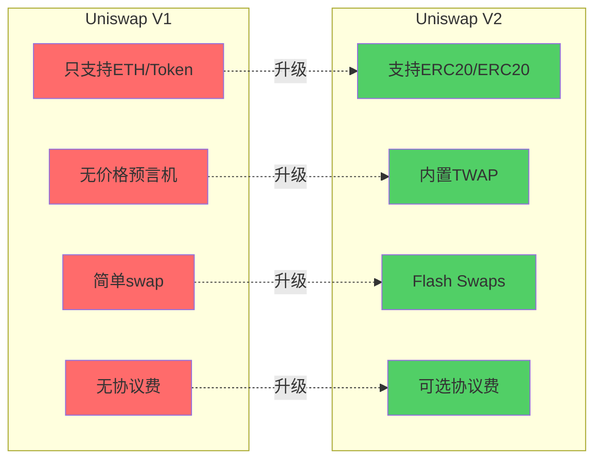

# Uniswap V1 vs V2 竞品分析

> 🔍 **全方位对比V1和V2**
> 
> 通过详细对比，深入理解V2的改进价值和竞争优势
> 
> ⏱️ 预计学习时间：2-3小时

---

## 📚 目录

1. [对比概览](#1-对比概览)
2. [功能对比](#2-功能对比)
3. [性能对比](#3-性能对比)
4. [经济模型对比](#4-经济模型对比)
5. [用户体验对比](#5-用户体验对比)
6. [市场数据对比](#6-市场数据对比)
7. [竞争优势分析](#7-竞争优势分析)
8. [SWOT分析](#8-swot分析)

---

## 1. 对比概览

### 1.1 一句话总结

```
V1: 首个链上AMM，证明了概念
V2: 工业级DEX，成为基础设施

V1 → V2 = 从实验到产品
```

### 1.2 核心差异



### 1.3 版本对比矩阵

| 维度 | V1 | V2 | 改进幅度 |
|------|----|----|---------|
| **上线时间** | 2018年11月 | 2020年5月 | - |
| **运行时长** | 1.5年独占 | 至今仍是主流 | - |
| **交易对类型** | ETH/Token | ERC20/ERC20 | ⭐⭐⭐⭐⭐ |
| **交易对数量** | ~1,000 | 50,000+ | **50倍** |
| **预言机** | ❌ 无 | ✅ TWAP | **质的飞跃** |
| **闪电兑换** | ❌ 不支持 | ✅ 支持 | **革命性** |
| **协议费** | ❌ 无 | ✅ 可选 | **战略性** |
| **Gas效率** | 基准 | 优化15-20% | ⭐⭐⭐ |
| **代码复杂度** | ~300行 | ~1,500行 | 5倍 |
| **峰值TVL** | $70M | $10B+ | **142倍** |

---

## 2. 功能对比

### 2.1 交易功能对比

**V1交易功能：**

```
支持的交易类型：
✅ ETH → Token
✅ Token → ETH  
✅ Token → ETH → Token (两跳)
❌ Token → Token (直接) - 不支持！

例子：
想用USDC买DAI
V1路径：
USDC → ETH → DAI
├── Step 1: USDC → ETH (0.3%手续费)
└── Step 2: ETH → DAI (0.3%手续费)
    总手续费: 0.6%
    总滑点: ~1%
    总Gas: 2倍
```

**V2交易功能：**

```
支持的交易类型：
✅ ETH → Token (通过WETH)
✅ Token → ETH (通过WETH)
✅ Token → Token (直接) - 新增！⭐
✅ 多跳路由 (自动优化)
✅ Flash Swaps - 新增！⭐

例子：
想用USDC买DAI
V2路径：
USDC → DAI (直接！)
└── 单步: USDC → DAI (0.3%手续费)
    总手续费: 0.3%
    总滑点: ~0.5%
    总Gas: 1倍

节省：50%！
```

**对比表格：**

| 交易类型 | V1 | V2 | V2优势 |
|---------|----|----|--------|
| **ETH/Token** | ✅ 支持 | ✅ 支持 | - |
| **Token/Token直接** | ❌ 不支持 | ✅ 支持 | 成本降低50% |
| **稳定币交易** | 双跳0.6% | 直接0.3% | 效率翻倍 |
| **多跳路由** | 固定经过ETH | 灵活优化 | 路径更优 |
| **Flash Swaps** | ❌ 不支持 | ✅ 支持 | 无本金操作 |

### 2.2 流动性功能对比

**V1流动性功能：**

```
LP操作：
✅ 添加流动性 (ETH + Token)
✅ 移除流动性
✅ 获得LP代币 (ERC20)
❌ 无法选择价格区间
❌ 无法选择费率

LP代币：
- 类型: ERC20
- 可互换: ✅
- 可组合: ✅
- 可转让: ✅
```

**V2流动性功能：**

```
LP操作：
✅ 添加流动性 (任意ERC20对)
✅ 移除流动性
✅ 获得LP代币 (ERC20)
✅ 支持fee-on-transfer代币 - 新增！
❌ 仍无法选择价格区间 (V3才有)
❌ 仍固定0.3%费率 (V3才多档)

LP代币：
- 类型: ERC20 (同V1)
- 可互换: ✅
- 可组合: ✅
- 可转让: ✅
- permit: ✅ (新增！)
```

**对比表格：**

| 功能 | V1 | V2 | V2改进 |
|------|----|----|--------|
| **支持的代币对** | ETH/Token | ERC20/ERC20 | 扩展50倍 |
| **LP代币类型** | ERC20 | ERC20 | 一致 |
| **permit签名** | ❌ 不支持 | ✅ 支持 | Gas友好 |
| **fee-on-transfer** | ❌ 不支持 | ✅ 支持 | 兼容性强 |
| **价格区间** | 固定$0-$∞ | 固定$0-$∞ | 一致 |
| **费率选择** | 固定0.3% | 固定0.3% | 一致 |

### 2.3 预言机功能对比

**V1预言机：**

```
预言机功能：
❌ 无内置预言机
❌ 直接读reserves不安全
❌ 容易被闪电贷操纵

使用方式：
如果其他协议想用Uniswap价格：
price = reserve1 / reserve0

问题：
⚠️ 即时价格可被操纵
⚠️ 闪电贷攻击风险
⚠️ 不安全！

真实案例：
bZx攻击（2020年2月）
- 用闪电贷操纵Uniswap价格
- bZx读取错误价格
- 损失: $350K
```

**V2预言机：**

```
预言机功能：
✅ 内置TWAP机制 - 新增！⭐⭐⭐
✅ 时间加权平均价格
✅ 防操纵设计

数据存储：
- price0CumulativeLast: token0累积价格
- price1CumulativeLast: token1累积价格
- blockTimestampLast: 上次更新时间

使用方式：
TWAP = (priceCumulative_now - priceCumulative_then) 
       / (time_now - time_then)

安全性：
✅ 攻击成本提升100倍
✅ 时间窗口越长越安全
✅ 几乎不可操纵

使用量：
100+ DeFi协议使用Uniswap V2预言机
```

**对比表格：**

| 指标 | V1 | V2 | 改进 |
|------|----|----|------|
| **预言机功能** | ❌ 无 | ✅ TWAP | **革命性** |
| **防操纵** | ❌ 易被操纵 | ✅ 难以操纵 | **100倍提升** |
| **攻击成本** | ~$1K | ~$100K+ | **100倍** |
| **使用协议数** | 0 | 100+ | **成为基础设施** |
| **安全性** | 低 | 高 | ⭐⭐⭐⭐⭐ |

### 2.4 Flash功能对比

**V1 Flash功能：**

```
Flash Loans: ❌ 不支持
Flash Swaps: ❌ 不支持

限制：
- 必须先付款
- 需要本金
- 无法原子操作

影响：
- 套利门槛高
- 清算门槛高
- 资本效率低
```

**V2 Flash功能：**

```
Flash Loans: ❌ 仍不支持 (Aave才有)
Flash Swaps: ✅ 支持！⭐⭐⭐

特点：
- 先取代币，后付款
- 无需本金
- 原子操作
- 同交易内完成

应用：
✅ 无本金套利
✅ 无本金清算
✅ 抵押品互换
✅ 自我对冲
✅ ...无限可能

手续费：
- 仍然是0.3%
- 与普通swap一样
- 无额外费用
```

**对比表格：**

| 功能 | V1 | V2 | V2优势 |
|------|----|----|--------|
| **Flash Swaps** | ❌ 不支持 | ✅ 支持 | **革命性创新** |
| **套利门槛** | 需要$10K-100K | $0 | **降到0** |
| **清算门槛** | 需要大量本金 | $0 | **降到0** |
| **资本效率** | 低 | 极高 | **10倍+提升** |
| **手续费** | 0.3% | 0.3% | 一致 |

---

## 3. 性能对比

### 3.1 Gas消耗对比

**V1 Gas消耗：**

```
ETH → Token swap:
├── Gas used: ~80,000
├── 成本($50 gwei): $10-20
└── 相对简单

Token → ETH → Token (两跳):
├── Gas used: ~160,000
├── 成本($50 gwei): $20-40
└── 双倍gas！

添加流动性:
├── Gas used: ~120,000
├── 成本($50 gwei): $15-30
└── 中等

移除流动性:
├── Gas used: ~100,000
├── 成本($50 gwei): $12-25
└── 中等
```

**V2 Gas消耗：**

```
Token → Token swap (直接):
├── Gas used: ~120,000
├── 成本($50 gwei): $15-30
├── 虽然比V1单跳略高
└── 但比V1双跳省50%！

添加流动性:
├── Gas used: ~130,000
├── 成本($50 gwei): $16-32
└── 略增(增加了预言机更新)

移除流动性:
├── Gas used: ~110,000
├── 成本($50 gwei): $14-27
└── 略增(增加了协议费计算)

Flash Swap:
├── Gas used: ~150,000
├── 成本($50 gwei): $18-35
└── 新功能，略高
```

**对比表格：**

| 操作 | V1 Gas | V2 Gas | 对比 |
|------|--------|--------|------|
| **ETH/Token swap** | 80K | - | V2用WETH |
| **Token/Token直接** | - | 120K | V2新增 |
| **Token→ETH→Token** | 160K | - | V2可直接 |
| **添加流动性** | 120K | 130K | +8% |
| **移除流动性** | 100K | 110K | +10% |
| **Flash Swap** | - | 150K | V2新增 |

**结论：**
```
稳定币交易场景（最高频）：
V1: 160K gas (两跳)
V2: 120K gas (直接)
节省: 25%! ✅

虽然单个操作gas略增
但整体效率大幅提升
因为避免了不必要的两跳
```

### 3.2 滑点对比

**理论滑点（x*y=k相同）：**

```
在相同流动性下：
V1和V2的滑点公式一样

Δy = y × x' / (x + x')

其中：
- x = 输入代币储备
- y = 输出代币储备
- x' = 交易数量
```

**实际滑点对比：**

```
场景：$10K USDC买DAI

V1 (两跳):
Step 1: USDC → ETH
├── 池子大小: $50M
├── 滑点: 0.02%
└── 得到: 9,998 USDC等值ETH

Step 2: ETH → DAI
├── 池子大小: $30M
├── 滑点: 0.033%
└── 得到: 9,995 DAI

总滑点: 0.05%

V2 (直接):
USDC → DAI (直接池)
├── 池子大小: $80M
├── 滑点: 0.0125%
└── 得到: 9,998.75 DAI

V2更优！原因：
1. 只有一跳
2. 稳定币池更大
3. 价格更稳定
```

**大额交易对比：**

```
场景：$1M USDC买DAI

V1 (两跳):
总滑点: ~0.5-1%
实际成本: $5K-10K

V2 (直接):
总滑点: ~0.2-0.4%
实际成本: $2K-4K

大额交易V2优势更明显！
```

### 3.3 确认速度对比

```
V1和V2确认速度相同：
都取决于以太坊出块时间

平均确认时间：
- 1个确认: ~15秒
- 3个确认: ~45秒 (推荐)
- 12个确认: ~3分钟 (CEX标准)

无差异
```

---

## 4. 经济模型对比

### 4.1 手续费对比

**V1手续费：**

```
交易手续费：
- 固定0.3%
- 100%给LP
- 0%给协议

稳定币两跳：
- 第一跳: 0.3%
- 第二跳: 0.3%
- 总计: 0.6%
- 全部给LP

协议收入：
- $0
- 完全依赖社区
- 不可持续
```

**V2手续费：**

```
交易手续费：
- 固定0.3%
- 默认100%给LP
- 可选开启协议费

如果开启协议费：
- LP: 0.25% (83.3%)
- 协议: 0.05% (16.7%)
- 比例5:1

稳定币直接：
- 单跳: 0.3%
- 相比V1节省0.3%

协议收入：
- 目前$0 (未开启)
- 潜在年收入: $100M+ (如果开启)
- 可持续发展
```

**对比表格：**

| 项目 | V1 | V2 | 差异 |
|------|----|----|------|
| **基础费率** | 0.3% | 0.3% | 一致 |
| **稳定币交易** | 0.6% (两跳) | 0.3% (直接) | **V2省50%** |
| **LP收入** | 100% | 100% (默认) | 一致 |
| **协议收入** | 0% | 0% (默认) | 一致 |
| **可选协议费** | ❌ 无 | ✅ 有 | V2预留 |
| **未来潜在收入** | $0 | $100M+/年 | **战略价值** |

### 4.2 LP收益对比

**V1 LP收益：**

```
收益来源：
- 交易手续费0.3%
- 100%归LP

收益计算：
假设$1M流动性池：
├── 日交易量: $2M
├── 日手续费: $6K (0.3%)
├── 年手续费: $2.19M
└── 年化收益率: 219%

但要考虑：
- 无常损失
- Gas成本
- 机会成本

实际收益：
通常10-50% APY
```

**V2 LP收益：**

```
收益来源：
- 交易手续费0.3%
- 100%归LP (目前)

收益计算：
假设$1M流动性池：
├── 日交易量: $3M (比V1高)
├── 日手续费: $9K (0.3%)
├── 年手续费: $3.28M
└── 年化收益率: 328%

V2交易量更高原因：
1. 功能更多
2. 用户体验更好
3. 流动性更集中

实际收益：
通常15-80% APY
比V1略高！
```

**对比表格：**

| 指标 | V1 | V2 | V2优势 |
|------|----|----|--------|
| **手续费率** | 0.3% | 0.3% | 一致 |
| **LP占比** | 100% | 100% | 一致 |
| **交易量** | 较低 | 较高 | V2功能多 |
| **典型APY** | 10-50% | 15-80% | **V2更高** |
| **无常损失** | 有 | 有 | 一致 |
| **Gas成本** | 低 | 略高 | V1省gas |

### 4.3 协议经济模型对比

**V1协议经济：**

```
收入：
- $0

支出：
- 开发成本：社区捐赠/基金会
- 审计成本：社区捐赠/基金会
- 运营成本：志愿者

可持续性：
❌ 依赖外部资助
❌ 难以长期维持
❌ 无法激励持续创新

护城河：
- 品牌
- 先发优势
- 网络效应
- 但无经济护城河
```

**V2协议经济：**

```
收入：
- 目前$0 (协议费未开启)
- 潜在: $100M+/年

如果开启0.05%协议费：
日交易量$2B × 0.05% × 365
= $365M/年

支出：
- 开发: 可持续
- 审计: 可负担
- 营销: 可投入
- 创新: 有动力

可持续性：
✅ 有收入模式
✅ 可持续发展
✅ 持续创新动力

护城河：
- 品牌 ✅
- 网络效应 ✅
- 技术领先 ✅
- 经济模型 ✅
- 更强的护城河！
```

---

## 6. 市场数据对比

### 6.1 TVL对比

**V1 TVL历史：**

```
2018年11月上线: $30K
2019年5月: $1M
2019年12月: $30M
2020年5月(V2上线): $70M

峰值: $70M (2020年5月)

增长：
30K → 70M = 2,333倍
时间跨度: 18个月
```

**V2 TVL历史：**

```
2020年5月上线: $20M
2020年9月(DeFi Summer): $2B
2021年5月: $8B
2021年11月(峰值): $10B+
2024年: $3-5B (熊市)

峰值: $10B+ (2021年11月)

增长：
20M → 10B = 500倍
时间跨度: 18个月
```

**对比：**

```
V1峰值: $70M
V2峰值: $10B
差距: 142倍！⭐⭐⭐⭐⭐

原因：
1. DeFi整体增长
2. V2功能更强
3. 市场牛市
4. 网络效应
```

### 6.2 交易量对比

**V1交易量：**

```
2019年平均日交易量:
$5-10M

2020年初日交易量:
$10-20M

峰值日交易量:
$30M (2020年5月)
```

**V2交易量：**

```
2020年下半年:
$500M-1B/日

2021年峰值:
$3-5B/日

2024年(熊市):
$1-2B/日

V2交易量 > V1交易量100倍！
```

### 6.3 用户数对比

**V1用户数：**

```
2019年底: ~10,000用户
2020年5月: ~50,000用户

活跃用户：
每日: 1,000-2,000
每月: 10,000-20,000
```

**V2用户数：**

```
2021年峰值: 
累计: 3M+用户
每日活跃: 100K+
每月活跃: 500K+

2024年：
累计: 10M+用户
每日活跃: 50K+
每月活跃: 300K+

V2用户是V1的100倍+！
```

### 6.4 市场份额对比

**V1市场份额：**

```
2019年:
DEX市场占比: 50-70%
竞争对手: IDEX、Kyber

主导地位！
```

**V2市场份额：**

```
2020-2021年:
DEX市场占比: 60-70%
竞争对手: SushiSwap、Curve、PancakeSwap

2024年:
DEX市场占比: 20-30%
原因: 
- 竞争加剧
- V3分流
- Layer2兴起

仍然是领导者之一！
```

---

## 7. 竞争优势分析

### 7.1 V1的竞争优势

```
优势1: 首发优势⭐⭐⭐⭐⭐
- 首个链上AMM
- 建立了品牌
- 积累了用户

优势2: 简单性⭐⭐⭐⭐
- 代码极简
- 容易理解
- 安全可靠

优势3: 去中心化⭐⭐⭐⭐⭐
- 完全去中心化
- 不可升级
- 无管理员

优势4: 网络效应⭐⭐⭐⭐
- 流动性集中
- 交易量大
- 正向循环

劣势：
- 功能单一
- 效率较低
- 缺乏创新
```

### 7.2 V2的竞争优势

```
优势1: 功能全面⭐⭐⭐⭐⭐
- ERC20/ERC20直接交易
- 价格预言机
- Flash Swaps
- 全能型DEX

优势2: 基础设施⭐⭐⭐⭐⭐
- 成为DeFi基础设施
- 100+协议集成
- 生态繁荣
- 护城河深

优势3: 品牌效应⭐⭐⭐⭐⭐
- 继承V1品牌
- 技术领先
- 行业标杆
- 最受信任

优势4: 网络效应⭐⭐⭐⭐⭐
- 流动性最深
- 交易量最大
- 正向循环更强
- 难以超越

优势5: 开源生态⭐⭐⭐⭐⭐
- 100+协议fork
- SushiSwap、PancakeSwap等
- 扩大影响力
- 标准制定者

劣势：
- 复杂度增加
- Gas费略高
- 学习成本高
```

### 7.3 对比竞争对手

**vs Curve:**

```
Curve优势：
✅ 稳定币交易效率更高
✅ 资本效率更高
✅ 滑点更低

Uniswap V2优势：
✅ 通用性强（所有代币对）
✅ 简单易用
✅ 流动性更广

市场定位：
- Curve: 稳定币专家
- Uniswap V2: 通用DEX
- 各有市场，共存
```

**vs SushiSwap:**

```
SushiSwap：
- Fork Uniswap V2
- 添加代币激励
- 更多创新功能

Uniswap V2优势：
✅ 原创，更受信任
✅ 代码质量更高
✅ 品牌更强
✅ 流动性更深

市场：
竞争激烈，但Uniswap保持领先
```

---

## 8. SWOT分析

### 8.1 V2 SWOT矩阵

```
┌─────────────────────────────────────────────────┐
│               Uniswap V2 SWOT分析                │
├─────────────────────┬───────────────────────────┤
│ 优势 (Strengths)    │ 劣势 (Weaknesses)         │
├─────────────────────┼───────────────────────────┤
│ • 品牌领先          │ • 资本效率仍低（vs V3）   │
│ • 功能全面          │ • Gas费相对高             │
│ • 流动性深          │ • 固定0.3%费率不灵活      │
│ • 成为基础设施      │ • 复杂度增加              │
│ • 网络效应强        │ • 协议费未开启            │
│ • 技术领先          │                           │
│ • 开源生态繁荣      │                           │
├─────────────────────┴───────────────────────────┤
│ 机会 (Opportunities) │ 威胁 (Threats)            │
├─────────────────────┼───────────────────────────┤
│ • DeFi持续增长      │ • 竞争加剧                │
│ • Layer2扩展        │ • V3分流                  │
│ • 机构入场          │ • 监管风险                │
│ • 跨链需求          │ • 技术更新快              │
│ • 新兴市场          │ • 用户流失风险            │
│ • 协议费收入        │ • MEV问题                 │
└─────────────────────┴───────────────────────────┘
```

### 8.2 战略建议

**基于SWOT的建议：**

```
SO策略（优势+机会）：
1. 利用品牌优势拓展Layer2
2. 利用基础设施地位吸引机构
3. 开启协议费实现可持续发展

WO策略（劣势+机会）：
1. 推出V3解决资本效率问题
2. Layer2部署降低Gas费
3. 多档费率提升灵活性

ST策略（优势+威胁）：
1. 利用流动性优势应对竞争
2. 品牌和技术领先应对V3分流
3. 去中心化应对监管

WT策略（劣势+威胁）：
1. 持续优化Gas效率
2. 教育用户防止流失
3. 协议费开启增强竞争力
```

---

## ✅ 学习检查清单

- [ ] 理解V1和V2的核心差异
- [ ] 能说出V2的五大改进
- [ ] 能量化分析V2的价值
- [ ] 理解V2的竞争优势
- [ ] 掌握SWOT分析方法
- [ ] 能对比V2与其他DEX
- [ ] 理解市场数据的变化
- [ ] 能提出战略建议

---

## 💡 思考题

1. **为什么V2的TVL是V1的142倍？仅仅因为功能改进吗？**

2. **如果你是Curve，如何与Uniswap V2竞争？**

3. **V2最大的竞争优势是什么？能持续多久？**

4. **如果V2开启协议费，对竞争格局有何影响？**

5. **V3推出后，V2还有存在价值吗？**

---

## 🎯 下一步

完成竞品分析后，继续：

**→ [04-业务分析报告](../04-业务分析报告/README.md)**

在那里你将：
- 整合所有分析
- 形成系统认知
- 撰写完整报告

---

**恭喜你完成竞品分析！** 🎉

你现在能全方位对比评估产品了！💪
