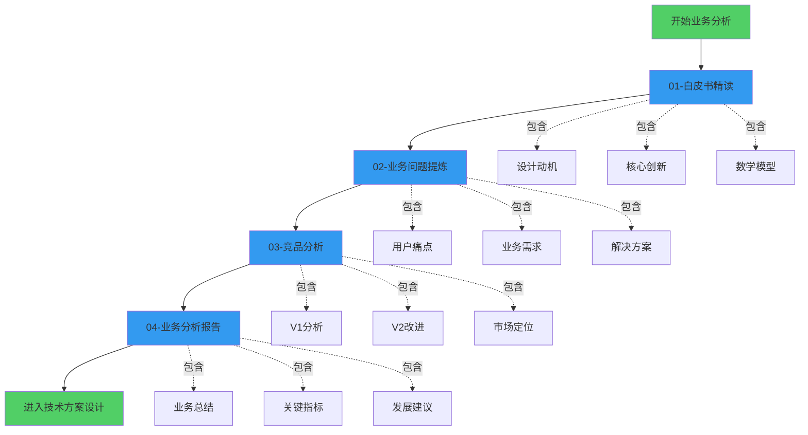

# 第1步：Uniswap V2 业务分析

> 💡 **从业务视角理解Uniswap V2**
> 
> 在深入代码之前，先从业务层面理解V2：为什么要做？解决什么问题？如何设计？
> 
> ⏱️ 预计学习时间：8-10小时

---

## 📚 学习目标

完成本章学习后，你将能够：

✅ **理解V2的商业逻辑**
- 为什么需要去中心化交易所
- Uniswap的商业模式是什么
- V2相对V1的业务改进点

✅ **掌握核心业务问题**
- DEX面临的核心挑战
- V2如何解决这些挑战
- 业务权衡与取舍

✅ **建立产品思维**
- 从用户需求出发
- 理解产品设计决策
- 竞品分析方法论

✅ **形成系统认知**
- AMM的商业价值
- DeFi的业务模式
- 区块链产品设计原则

---

## 🗺️ 学习路线图



---

## 📖 章节概览

### [01-白皮书精读](./01-白皮书精读/README.md) ⭐⭐⭐⭐⭐

**学习时间：3-4小时**

```
内容：
├── Uniswap V2白皮书完整解读
├── 设计动机与背景
├── 核心创新点详解
├── 数学模型推导
├── 安全性考虑
└── 未来展望

学习成果：
✅ 理解V2的设计哲学
✅ 掌握核心业务逻辑
✅ 建立全局认知

重要程度：⭐⭐⭐⭐⭐ 必读！
```

**关键问题：**
- 为什么V1不够好？V2要解决什么问题？
- ERC20/ERC20交易对的业务价值是什么？
- 价格预言机为什么重要？
- Flash Swaps的商业场景有哪些？

---

### [02-业务问题提炼](./02-业务问题提炼/README.md) ⭐⭐⭐⭐

**学习时间：2-3小时**

```
内容：
├── DEX行业痛点分析
├── 用户需求梳理
├── 核心业务问题提炼
├── V2的解决方案映射
├── 业务价值评估
└── 产品设计权衡

学习成果：
✅ 从业务角度看问题
✅ 理解需求到方案的转换
✅ 掌握产品思维

重要程度：⭐⭐⭐⭐ 建立产品思维
```

**分析框架：**
```
用户角色：
├── 交易者 → 需要低成本、低滑点交易
├── 流动性提供者 → 需要高收益、低风险
├── 套利者 → 需要高效率、低门槛
└── 开发者 → 需要可组合、易集成

每个角色的痛点 → V2的解决方案
```

---

### [03-竞品分析-V1-vs-V2](./03-竞品分析-V1-vs-V2/README.md) ⭐⭐⭐⭐

**学习时间：2-3小时**

```
内容：
├── V1完整业务分析
├── V2完整业务分析
├── 功能对比矩阵
├── 业务指标对比
├── 市场定位差异
└── 竞争优势分析

学习成果：
✅ 深入理解V1的局限
✅ 认识V2的改进价值
✅ 学会竞品分析方法

重要程度：⭐⭐⭐⭐ 对比学习
```

**对比维度：**
```
功能层面：
- 支持的交易对类型
- 手续费机制
- 特殊功能（预言机、闪电兑换）

体验层面：
- 交易成本
- 交易效率
- 操作复杂度

商业层面：
- 市场规模
- 收入模式
- 护城河
```

---

### [04-业务分析报告](./04-业务分析报告/README.md) ⭐⭐⭐⭐⭐

**学习时间：1-2小时**

```
内容：
├── 业务分析总结
├── 核心发现与洞察
├── 关键业务指标
├── SWOT分析
├── 商业模式画布
└── 发展建议

学习成果：
✅ 形成系统性认知
✅ 掌握分析方法论
✅ 建立战略思维

重要程度：⭐⭐⭐⭐⭐ 总结提升
```

**报告结构：**
```
1. 执行摘要
2. 市场与竞争分析
3. 产品与功能分析
4. 业务模式分析
5. 风险与机会
6. 战略建议
```

---

## 🎯 学习方法

### 推荐学习顺序

```
Day 1: 白皮书精读（3-4小时）
├── 上午：通读白皮书，标注疑问
├── 下午：精读核心章节
└── 晚上：总结关键点

Day 2: 业务问题提炼（2-3小时）
├── 上午：梳理用户角色和需求
├── 下午：提炼核心业务问题
└── 晚上：映射解决方案

Day 3: 竞品分析（2-3小时）
├── 上午：分析V1的业务逻辑
├── 下午：分析V2的改进
└── 晚上：制作对比表格

Day 4: 业务分析报告（1-2小时）
├── 上午：整理前三天的笔记
├── 下午：撰写分析报告
└── 晚上：复习巩固

总计：8-12小时
```

### 学习技巧

**1. 带着问题学习**

```
阅读前先思考：
❓ 这个功能解决什么问题？
❓ 为什么这样设计？
❓ 有没有更好的方案？
❓ 对用户的价值是什么？

不要被动接受
主动思考质疑
```

**2. 多角色思考**

```
站在不同角色思考：

👨‍💻 作为交易者：
- 我关心什么？
- V2对我有什么好处？

💰 作为LP：
- 我的收益如何？
- 风险是什么？

🏗️ 作为产品经理：
- 为什么做这个功能？
- 优先级如何排序？

👨‍💼 作为投资人：
- 商业模式是什么？
- 护城河在哪里？
```

**3. 对比学习**

```
不要孤立地学V2
要对比着学：

V1 vs V2:
- 功能差异
- 体验差异
- 商业差异

Uniswap vs Curve:
- 定位差异
- 技术路线
- 目标市场

DEX vs CEX:
- 优劣势对比
- 适用场景
- 发展趋势
```

**4. 数据驱动**

```
用数据说话：

不要说："V2更好"
要说："V2 TVL增长142倍"

不要说："手续费降低了"
要说："手续费从0.6%降到0.3%"

不要说："更安全"
要说："攻击成本提升100倍"

量化！量化！量化！
```

---

## 📊 业务分析框架

### 框架1：5W1H分析法

```
What（是什么）：
→ Uniswap V2是什么？
→ 是一个去中心化的自动做市商交易协议

Why（为什么）：
→ 为什么需要V2？
→ V1有局限，需要更高效的解决方案

Who（谁）：
→ 谁是用户？
→ 交易者、LP、套利者、开发者

When（什么时候）：
→ 什么时候上线？
→ 2020年5月，DeFi Summer前夕

Where（在哪里）：
→ 部署在哪里？
→ 以太坊主网及各种EVM兼容链

How（怎么做）：
→ 如何实现？
→ x*y=k + ERC20对 + TWAP + Flash Swap
```

### 框架2：用户旅程地图

```
交易者旅程：

1. 发现阶段
   痛点：CEX中心化风险
   触点：听说Uniswap
   情绪：😐 观望

2. 尝试阶段
   痛点：不知道怎么用
   触点：连接MetaMask
   情绪：😰 紧张

3. 使用阶段
   痛点：Gas费高、滑点大
   触点：完成第一笔交易
   情绪：😃 满意

4. 忠诚阶段
   痛点：偶尔失败
   触点：成为重度用户
   情绪：😍 热爱

优化机会：
→ 降低学习成本
→ 优化交易体验
→ 提供更多功能
```

### 框架3：商业模式画布

```
┌─────────────────────────────────────────────────┐
│           Uniswap V2 商业模式画布                │
├──────────┬──────────┬──────────┬────────────────┤
│核心合作伙伴│  核心活动  │  价值主张  │    客户关系     │
│          │          │          │                │
│• 流动性提供│• 自动做市 │• 去中心化 │• 无需许可       │
│• 聚合器   │• 价格发现 │• 无需托管 │• 开源透明       │
│• 钱包     │• 预言机   │• 永不停机 │• 社区驱动       │
│• 开发者   │• 治理     │• 可组合性 │                │
├──────────┴──────────┤          ├────────────────┤
│     核心资源         │          │   客户细分      │
│                      │          │                │
│• 流动性池            │          │• 交易者         │
│• 智能合约            │          │• LP             │
│• 品牌声誉            │          │• 套利者         │
│• 社区                │          │• 协议开发者     │
├──────────────────────┴──────────┴────────────────┤
│                   渠道通路                         │
│                                                   │
│• 官网 uniswap.org                                 │
│• 钱包集成（MetaMask、Trust Wallet等）              │
│• 聚合器（1inch、Matcha等）                        │
│• DApp                                             │
├───────────────────────┬───────────────────────────┤
│      成本结构          │        收入来源            │
│                       │                           │
│• 开发成本（初期）      │• 交易手续费0.3%（给LP）    │
│• 安全审计             │• 协议费0.05%（可选）       │
│• 运营成本（极低）      │• 未来：UNI代币价值         │
│• Gas费（用户承担）     │                           │
└───────────────────────┴───────────────────────────┘
```

---

## 🎓 业务分析能力提升

### 能力1：需求洞察力

```
练习：
看到一个功能，问自己：
1. 这解决了谁的什么问题？
2. 为什么现在需要？
3. 不做会怎样？
4. 做了带来什么价值？

例如：Flash Swaps
1. 解决套利者无本金套利的问题
2. V1时代套利门槛高，资金效率低
3. 不做：套利效率低，价格偏离时间长
4. 做了：资本效率极大提升，价格更稳定
```

### 能力2：产品设计力

```
练习：
看到一个设计，问自己：
1. 为什么这样设计？
2. 有哪些权衡？
3. 还有其他方案吗？
4. 如何改进？

例如：0.3%固定费率
1. 设计：简单、公平
2. 权衡：不够灵活，稳定币费率偏高
3. 其他：Curve的动态费率
4. 改进：V3引入多档费率
```

### 能力3：竞争分析力

```
练习：
对比两个产品，问自己：
1. 各自的优势是什么？
2. 目标用户是谁？
3. 为什么会有差异？
4. 谁会赢？

例如：Uniswap vs Curve
1. Uniswap：通用、简单
   Curve：稳定币专用、高效
2. Uniswap：所有用户
   Curve：稳定币交易者
3. 差异：专注点不同
4. 都会赢：各有市场
```

### 能力4：商业思维

```
练习：
看到一个协议，问自己：
1. 商业模式是什么？
2. 如何赚钱？
3. 护城河在哪里？
4. 可持续吗？

例如：Uniswap V2
1. 双边市场平台
2. 交易手续费（未来可能有协议费）
3. 品牌、流动性、网络效应
4. 需要开启协议费才可持续
```

---

## ✅ 业务分析检查清单

### Level 1：基础理解

完成后，你应该能够：

- [ ] 用3句话解释Uniswap V2是什么
- [ ] 说出V2的3个主要用户角色
- [ ] 列举V2解决的5个核心问题
- [ ] 解释AMM的商业逻辑
- [ ] 说明V2相对V1的主要改进

### Level 2：深入分析

完成后，你应该能够：

- [ ] 画出Uniswap的商业模式画布
- [ ] 分析各用户角色的痛点和需求
- [ ] 对比V1和V2的功能差异
- [ ] 评估V2的竞争优势
- [ ] 识别V2的业务风险

### Level 3：战略思维

完成后，你应该能够：

- [ ] 评估V2的市场定位
- [ ] 分析V2的可持续性
- [ ] 提出V2的改进建议
- [ ] 预测V2的发展方向
- [ ] 撰写完整的业务分析报告

---

## 📚 参考资料

### 官方文档
- [Uniswap V2 Whitepaper](https://uniswap.org/whitepaper.pdf) ⭐⭐⭐⭐⭐
- [Uniswap V2 Core Docs](https://docs.uniswap.org/contracts/v2/overview)
- [Uniswap Blog](https://blog.uniswap.org/)

### 深度分析
- [Uniswap V2: A Beginners Guide](https://www.youtube.com/watch?v=DLu35sIqVTM)
- [How Uniswap Works](https://docs.ethhub.io/guides/graphical-guide-for-understanding-uniswap/)
- [AMM: The DeFi Paradigm Shift](https://medium.com/dragonfly-research/what-explains-the-rise-of-amms-7d008af1c399)

### 数据分析
- [Uniswap Info](https://v2.info.uniswap.org/)
- [DeFi Pulse](https://www.defipulse.com/)
- [Dune Analytics](https://dune.com/browse/dashboards?q=uniswap)

---

## 🎯 学习成果

完成本章学习后，你将拥有：

```
✅ 业务分析能力
   从业务视角理解产品

✅ 产品思维
   知道为什么这样设计

✅ 竞争分析能力
   能对比分析不同方案

✅ 商业洞察力
   理解商业模式和价值

✅ 系统性认知
   建立完整的知识体系
```

**这些能力不仅适用于Uniswap，更适用于：**
- 分析任何DeFi协议
- 设计新的区块链产品
- 评估投资机会
- 求职面试准备

---

## 🚀 准备好了吗？

现在开始你的业务分析之旅：

**第一站** → [01-白皮书精读](./01-白皮书精读/README.md)

在那里，你将：
- 完整解读Uniswap V2白皮书
- 理解每个设计决策的动机
- 建立对V2的全面认知

**让我们开始吧！** 💪

---

## 💡 学习建议

```
1. 不要急于写代码
   先理解业务，再看技术
   
2. 做好笔记
   记录你的思考和疑问
   
3. 主动思考
   不要被动接受信息
   
4. 对比学习
   V1 vs V2, Uniswap vs Curve
   
5. 实践应用
   去Uniswap上实际操作
   
6. 讨论交流
   和朋友讨论你的理解

记住：理解业务比理解代码更重要！
```

**Good luck!** 🎉
