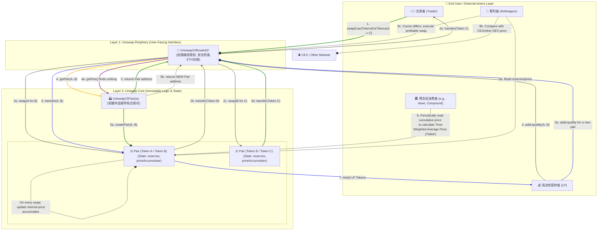

# TODO

```mermaid
graph TD
    %% Define Layers using Subgraphs for clarity
    subgraph "👤 End User / External Actors Layer"
        direction LR
        Trader["👨‍💻 交易者 (Trader)"]
        LP["💰 流动性提供者 (LP)"]
        Arbitrageur["🤖 套利者 (Arbitrageur)"]
        OracleConsumer["🏛️ 预言机消费者 (e.g., Aave, Compound)"]
    end

    subgraph "Layer 1: Uniswap Periphery (User-Facing Interface)"
        Router["🔁 UniswapV2Router02 <br> (处理路径规划, 安全检查, ETH封装)"]
    end

    subgraph "Layer 2: Uniswap Core (Immutable Logic & State)"
        Factory["🏭 UniswapV2Factory <br> (创建并追踪所有交易对)"]
        
        subgraph " "
            direction LR
            Pair_A_B["⚖️ Pair (Token A / Token B) <br> (State: reserves, priceAccumulator)"]
            Pair_B_C["⚖️ Pair (Token B / Token C) <br> (State: reserves, priceAccumulator)"]
        end

    end
    
    %% --- Define Interactions ---

    %% 1. Trading Flow (A -> C Multi-hop Swap)
    Trader -- "1. swapExactTokensForTokens(A -> C)" --o Router
    Router -- "2a. swap(A for B)" --> Pair_A_B
    Pair_A_B -- "2b. transfer(Token B)" --> Router
    Router -- "2c. swap(B for C)" --> Pair_B_C
    Pair_B_C -- "2d. transfer(Token C)" --> Router
    Router -- "2e. transfer(Token C)" --> Trader

    %% 2. Add Liquidity Flow
    LP -- "3. addLiquidity(A, B)" --o Router
    Router -- "4. getPair(A, B)" --> Factory
    Factory -- "5. returns Pair address" --> Router
    Router -- "6. transfer(A, B)" --> Pair_A_B
    Pair_A_B -- "7. mint() LP Tokens" --> LP

    %% 3. Create Pair Flow (A special case of Add Liquidity)
    LP -- "3a. addLiquidity for a new pair" --o Router
    Router -- "4a. getPair() finds nothing" --> Factory
    Factory -- "5a. createPair(A, B)" --o Pair_A_B
    Factory -- "5b. returns NEW Pair address" --> Router
    %% The flow then continues from step 6

    %% 4. Oracle Reading Flow
    Pair_A_B -- "On every swap: <br> update internal price accumulator" --o Pair_A_B
    OracleConsumer -- "8. Periodically read cumulative price <br> to calculate Time-Weighted Average Price (TWAP)" --> Pair_A_B

    %% 5. Arbitrage Flow
    Arbitrageur -- "9a. Read reserves/price" --> Pair_A_B
    Arbitrageur -- "9b. Compare with CEX/other DEX price" --o External["🌐 CEX / Other Markets"]
    Arbitrageur -- "9c. If price differs, execute profitable swap" --o Router
    
    %% Style links for better readability (CORRECTED)
    linkStyle 0,4,8,13 stroke-width:2px,fill:none,stroke:green
    linkStyle 1,2,3,5,6 stroke-width:1.5px,fill:none,stroke:#333
    linkStyle 9,10,11 stroke-width:1.5px,fill:none,stroke:blue
    linkStyle 7 stroke-width:2px,fill:none,stroke:orange
    linkStyle 12 stroke-width:2px,fill:none,stroke:purple
```

