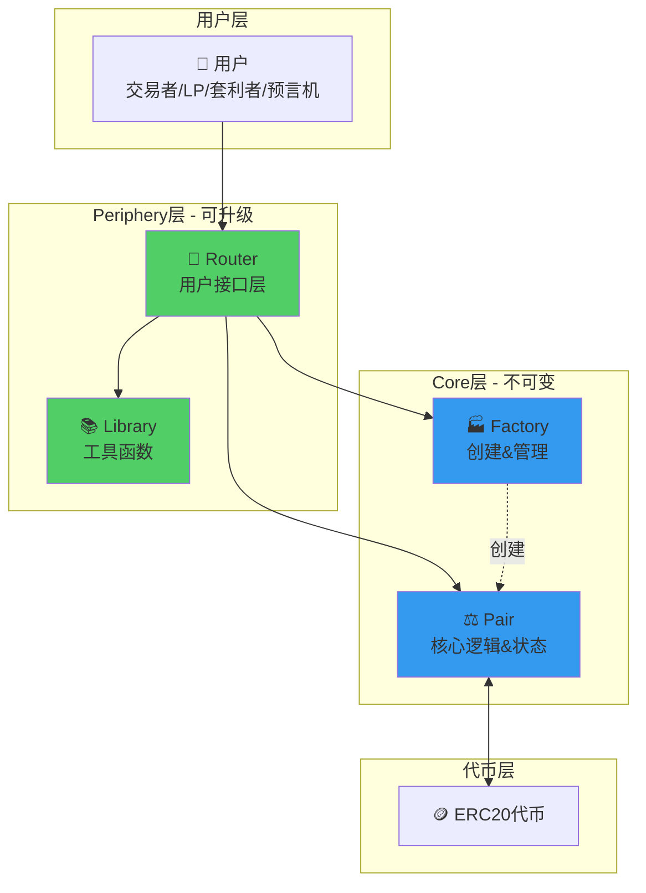
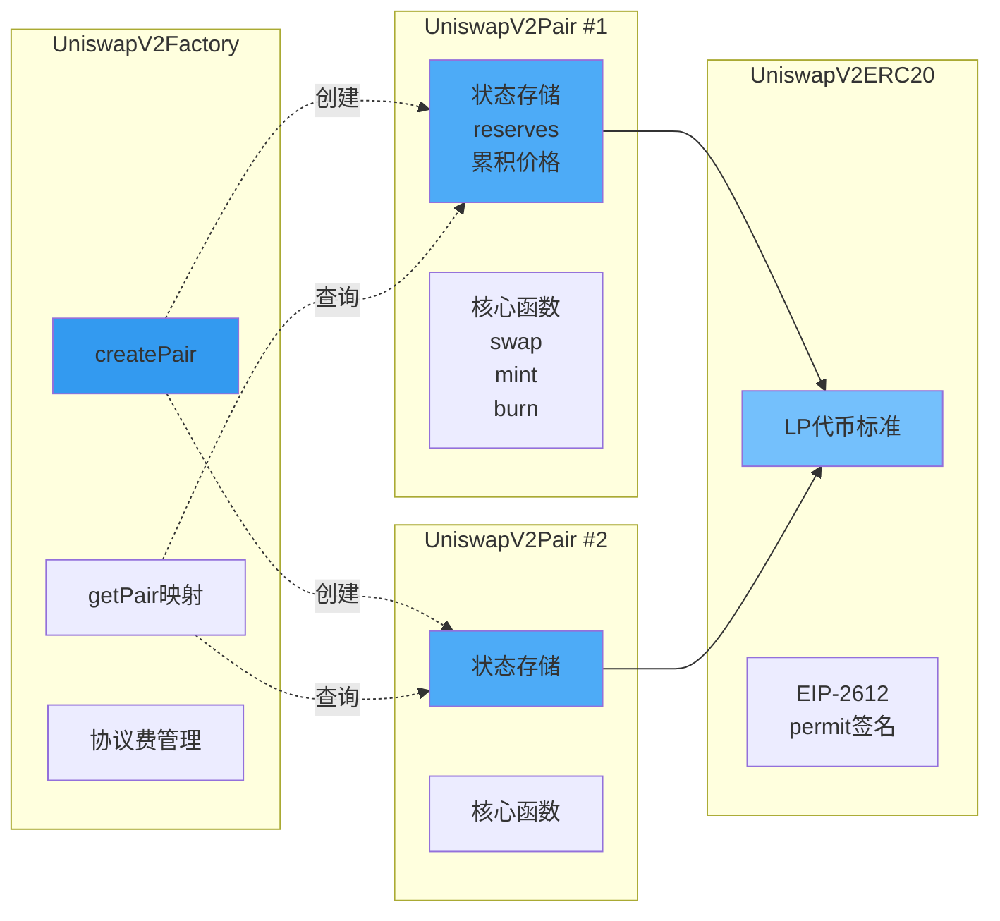
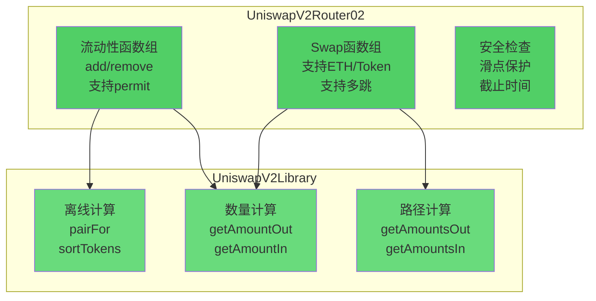
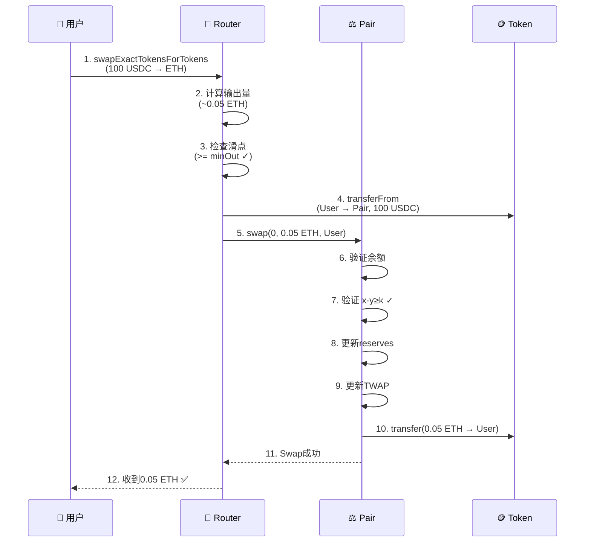
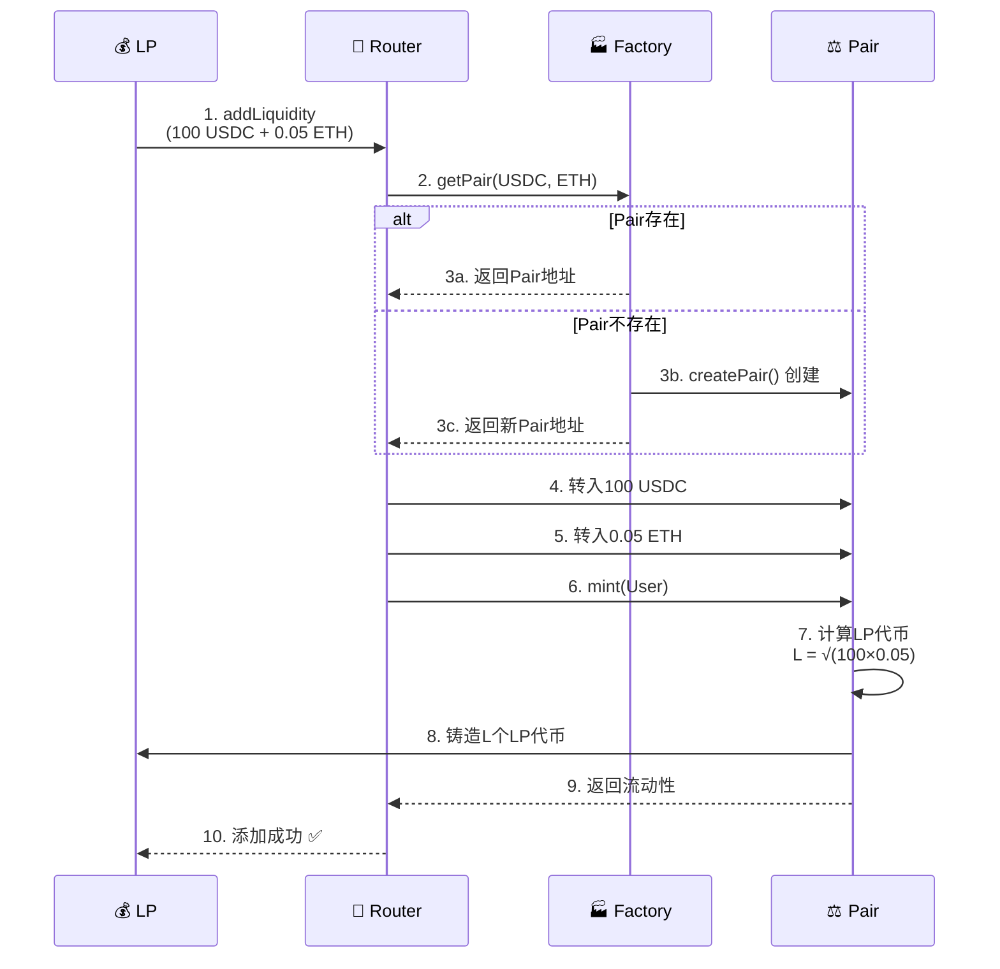
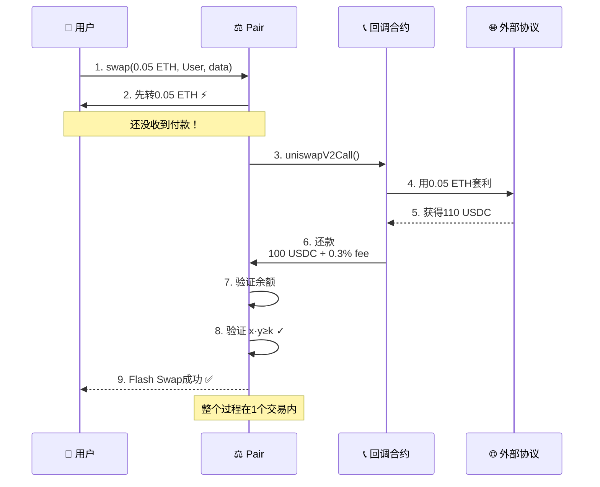

# Uniswap V2 黄皮书技术文档精读

> 📋 **技术白皮书的工程实现指南**
> 
> 将业务需求和数学模型转化为具体的技术规范
> 
> ⏱️ 预计学习时间：3-4小时

---

## 📚 目录

1. [技术文档概览](#1-技术文档概览)
2. [系统架构图](#2-系统架构图)
3. [技术需求分析](#3-技术需求分析)
4. [接口定义](#4-接口定义)
5. [数据结构设计](#5-数据结构设计)
6. [算法设计](#6-算法设计)

---

## 1. 技术文档概览

### 1.1 文档目的

```
黄皮书（Technical Specification）的作用：

vs 白皮书（Whitepaper）：
- 白皮书：业务、经济学、高层设计
- 黄皮书：技术规范、实现细节、工程方案

目标读者：
✅ 工程师实现时参考
✅ 审计员审计时核对
✅ 集成者理解接口
```

### 1.2 V2技术文档结构

```
1. 系统架构
   - 分层设计
   - 模块划分
   - 交互关系

2. 核心合约
   - Factory：创建管理
   - Pair：核心逻辑
   - Router：用户接口

3. 接口规范
   - 函数签名
   - 参数说明
   - 返回值

4. 算法设计
   - swap算法
   - mint/burn算法
   - TWAP计算

5. 安全考虑
   - 重入防护
   - 溢出检查
   - 价格操纵防护
```

---

## 2. 系统架构图

### 2.1 分层架构总览（简化版）



**核心理念：**
- 🔐 Core层：不可变，资金安全
- 🔄 Periphery层：可升级，功能灵活
- 🎯 分层解耦：职责清晰，易于扩展

---

### 2.2 Core层架构（核心不可变层）



**核心合约职责：**

| 合约 | 职责 | 特点 |
|------|------|------|
| **Factory** | 创建和注册Pair | 统一管理，create2部署 |
| **Pair** | 状态存储+核心逻辑 | x·y=k，TWAP，Flash Swaps |
| **ERC20** | LP代币功能 | 标准+permit签名授权 |

---

### 2.3 Periphery层架构（可升级接口层）



**Periphery优势：**
- ✅ 用户友好（处理ETH、多跳、滑点）
- ✅ 可以升级（修复bug、添加功能）
- ✅ 无资金风险（不持有用户资金）

---

### 2.4 典型交互流程

#### 流程1：Swap交易（单跳）



#### 流程2：添加流动性



#### 流程3：Flash Swap闪电兑换



---

### 2.5 架构设计亮点

**亮点1：分层架构的优势**

```
Core层（不可变）：
✅ 资金绝对安全
✅ 逻辑永不改变
✅ 审计一次永久有效

Periphery层（可升级）：
✅ 可以修复bug
✅ 可以添加功能
✅ 可以优化体验

两全其美！⭐⭐⭐⭐⭐
```

**亮点2：Factory模式的价值**

```
统一创建：
✅ 所有Pair由Factory创建
✅ 防止重复创建
✅ 便于发现和查询

create2确定性：
✅ 地址可离线计算
✅ 无需链上查询
✅ 节省Gas
```

**亮点3：Library的妙用**

```
代码复用：
✅ 多个合约共享逻辑
✅ 减少部署成本
✅ 便于升级（部署新Router）

离线计算：
✅ pairFor不需要链上查询
✅ getAmountOut可以预估
✅ 降低RPC调用
```

---

## 3. 技术需求分析

### 3.1 功能需求

**FR1：ERC20/ERC20直接交易**

```
需求描述：
支持任意两个ERC20代币直接交易对

技术要求：
- Factory.createPair(tokenA, tokenB)
- 双向映射存储
- create2确定性部署

验收标准：
✅ 任意两个不同的ERC20可创建Pair
✅ 不能重复创建
✅ 地址可离线计算
```

**FR2：TWAP价格预言机**

```
需求描述：
提供时间加权平均价格，防止价格操纵

技术要求：
- 存储累积价格
- 每次交易更新
- UQ112.112定点数编码

验收标准：
✅ 价格累积值正确更新
✅ 外部协议可计算TWAP
✅ 攻击成本提升100倍+
```

**FR3：Flash Swaps**

```
需求描述：
支持先取代币后付款的闪电兑换

技术要求：
- swap函数支持data参数
- 回调机制
- 最后验证k值

验收标准：
✅ 可以先获得代币
✅ 回调给用户时间操作
✅ 最后验证通过才成功
```

### 3.2 非功能需求

**NFR1：Gas效率**

```
目标：
交易Gas < 150K
添加流动性Gas < 200K

策略：
- 紧凑存储（uint112+uint112+uint32=32字节）
- 避免不必要的storage写入
- 优化算法复杂度
```

**NFR2：安全性**

```
目标：
无漏洞，资金安全

策略：
- 重入防护（lock modifier）
- 溢出检查（SafeMath或Solidity 0.8+）
- 多次专业审计
- Bug Bounty计划
```

**NFR3：可扩展性**

```
目标：
支持未来创新

策略：
- 分层架构
- 标准接口
- 开源生态
```

---

## 4. 接口定义

### 4.1 IUniswapV2Factory

```solidity
interface IUniswapV2Factory {
    // ===== 事件 =====
    event PairCreated(
        address indexed token0, 
        address indexed token1, 
        address pair, 
        uint
    );

    // ===== 查询函数 =====
    
    /// @notice 获取token对的Pair地址
    /// @param tokenA Token A地址
    /// @param tokenB Token B地址
    /// @return pair Pair合约地址，如果不存在返回address(0)
    function getPair(address tokenA, address tokenB) 
        external 
        view 
        returns (address pair);
    
    /// @notice 获取所有Pair地址数组
    /// @return 所有Pair地址数组
    function allPairs(uint) external view returns (address pair);
    
    /// @notice 获取Pair总数
    function allPairsLength() external view returns (uint);
    
    /// @notice 获取协议费接收地址
    function feeTo() external view returns (address);
    
    /// @notice 获取协议费设置者地址
    function feeToSetter() external view returns (address);

    // ===== 状态改变函数 =====
    
    /// @notice 创建一个新的交易对
    /// @param tokenA Token A地址
    /// @param tokenB Token B地址
    /// @return pair 新创建的Pair地址
    /// @dev 相同的token对只能创建一次
    function createPair(address tokenA, address tokenB) 
        external 
        returns (address pair);
    
    /// @notice 设置协议费接收地址
    /// @param _feeTo 新的接收地址
    function setFeeTo(address _feeTo) external;
    
    /// @notice 设置协议费设置者地址
    /// @param _feeToSetter 新的设置者地址
    function setFeeToSetter(address _feeToSetter) external;
}
```

### 4.2 IUniswapV2Pair

```solidity
interface IUniswapV2Pair {
    // ===== 事件 =====
    event Mint(address indexed sender, uint amount0, uint amount1);
    event Burn(address indexed sender, uint amount0, uint amount1, address indexed to);
    event Swap(
        address indexed sender,
        uint amount0In,
        uint amount1In,
        uint amount0Out,
        uint amount1Out,
        address indexed to
    );
    event Sync(uint112 reserve0, uint112 reserve1);

    // ===== 查询函数 =====
    
    function MINIMUM_LIQUIDITY() external pure returns (uint);
    function factory() external view returns (address);
    function token0() external view returns (address);
    function token1() external view returns (address);
    function getReserves() external view returns (uint112 reserve0, uint112 reserve1, uint32 blockTimestampLast);
    function price0CumulativeLast() external view returns (uint);
    function price1CumulativeLast() external view returns (uint);
    function kLast() external view returns (uint);

    // ===== 状态改变函数 =====
    
    /// @notice 添加流动性
    /// @param to LP代币接收地址
    /// @return liquidity 铸造的LP代币数量
    function mint(address to) external returns (uint liquidity);
    
    /// @notice 移除流动性
    /// @param to 代币接收地址
    /// @return amount0 返还的token0数量
    /// @return amount1 返还的token1数量
    function burn(address to) external returns (uint amount0, uint amount1);
    
    /// @notice 交换代币
    /// @param amount0Out 输出token0数量
    /// @param amount1Out 输出token1数量
    /// @param to 接收地址
    /// @param data 回调数据，如果长度>0则触发回调
    function swap(uint amount0Out, uint amount1Out, address to, bytes calldata data) external;
    
    /// @notice 强制储备量与余额同步
    function skim(address to) external;
    
    /// @notice 强制余额与储备量同步
    function sync() external;

    /// @notice 初始化Pair
    /// @param _token0 Token0地址
    /// @param _token1 Token1地址
    function initialize(address _token0, address _token1) external;
}
```

### 4.3 IUniswapV2Router02

```solidity
interface IUniswapV2Router02 {
    function factory() external pure returns (address);
    function WETH() external pure returns (address);

    // ===== 添加流动性 =====
    function addLiquidity(
        address tokenA,
        address tokenB,
        uint amountADesired,
        uint amountBDesired,
        uint amountAMin,
        uint amountBMin,
        address to,
        uint deadline
    ) external returns (uint amountA, uint amountB, uint liquidity);
    
    function addLiquidityETH(...) external payable returns (...);

    // ===== 移除流动性 =====
    function removeLiquidity(...) external returns (...);
    function removeLiquidityETH(...) external returns (...);
    function removeLiquidityWithPermit(...) external returns (...);
    
    // ===== Swap =====
    function swapExactTokensForTokens(...) external returns (uint[] memory amounts);
    function swapTokensForExactTokens(...) external returns (uint[] memory amounts);
    function swapExactETHForTokens(...) external payable returns (uint[] memory amounts);
    function swapTokensForExactETH(...) external returns (uint[] memory amounts);
    function swapExactTokensForETH(...) external returns (uint[] memory amounts);
    function swapETHForExactTokens(...) external payable returns (uint[] memory amounts);
    
    // ===== 查询函数 =====
    function quote(uint amountA, uint reserveA, uint reserveB) external pure returns (uint amountB);
    function getAmountOut(uint amountIn, uint reserveIn, uint reserveOut) external pure returns (uint amountOut);
    function getAmountIn(uint amountOut, uint reserveIn, uint reserveOut) external pure returns (uint amountIn);
    function getAmountsOut(uint amountIn, address[] calldata path) external view returns (uint[] memory amounts);
    function getAmountsIn(uint amountOut, address[] calldata path) external view returns (uint[] memory amounts);
}
```

---

## 5. 数据结构设计

### 5.1 Pair核心状态

```solidity
contract UniswapV2Pair {
    // ===== 紧凑存储（1个slot）=====
    uint112 private reserve0;           // 储备量0
    uint112 private reserve1;           // 储备量1
    uint32  private blockTimestampLast; // 最后更新时间
    
    // ===== 累积价格（2个slot）=====
    uint public price0CumulativeLast;  // token0累积价格
    uint public price1CumulativeLast;  // token1累积价格
    
    // ===== 协议费计算（1个slot）=====
    uint public kLast; // 上次mint/burn时的k值
    
    // ===== 代币地址（2个slot）=====
    address public token0;
    address public token1;
    
    // ===== 重入锁（1个slot）=====
    uint private unlocked = 1;
}
```

**设计考虑：**

```
1. 紧凑存储：
   reserve0 + reserve1 + blockTimestampLast = 32字节
   节省2个storage slot = 40,000 Gas！

2. uint112足够大：
   2^112 ≈ 5×10^33
   ETH总量 ≈ 1.2×10^8
   足够存储任何代币储备量

3. uint32时间戳：
   2^32秒 ≈ 136年
   从2020年到2156年
   足够使用
```

### 5.2 Factory核心状态

```solidity
contract UniswapV2Factory {
    // ===== Pair映射（双向）=====
    mapping(address => mapping(address => address)) public getPair;
    address[] public allPairs;
    
    // ===== 协议费控制 =====
    address public feeTo;
    address public feeToSetter;
}
```

---

## 6. 算法设计

### 6.1 Swap算法

**伪代码：**

```
函数 swap(amount0Out, amount1Out, to, data):
    // 1. 验证输入
    要求 amount0Out > 0 或 amount1Out > 0
    要求 to != token0 且 to != token1
    
    // 2. 获取当前储备
    (reserve0, reserve1, _) = getReserves()
    要求 amount0Out < reserve0 且 amount1Out < reserve1
    
    // 3. 先转账（Flash Swap关键）
    如果 amount0Out > 0:
        transferOut(token0, to, amount0Out)
    如果 amount1Out > 0:
        transferOut(token1, to, amount1Out)
    
    // 4. 回调（如果data非空）
    如果 data.length > 0:
        to.uniswapV2Call(msg.sender, amount0Out, amount1Out, data)
    
    // 5. 计算输入量
    balance0 = balanceOf(token0)
    balance1 = balanceOf(token1)
    amount0In = balance0 > reserve0 - amount0Out ? balance0 - (reserve0 - amount0Out) : 0
    amount1In = balance1 > reserve1 - amount1Out ? balance1 - (reserve1 - amount1Out) : 0
    
    要求 amount0In > 0 或 amount1In > 0
    
    // 6. 验证k值（含手续费）
    balance0Adjusted = balance0 * 1000 - amount0In * 3
    balance1Adjusted = balance1 * 1000 - amount1In * 3
    要求 balance0Adjusted * balance1Adjusted >= reserve0 * reserve1 * 1000^2
    
    // 7. 更新状态
    _update(balance0, balance1, reserve0, reserve1)
    
    // 8. 触发事件
    触发 Swap(msg.sender, amount0In, amount1In, amount0Out, amount1Out, to)
```

### 6.2 Mint算法

**伪代码：**

```
函数 mint(to):
    // 1. 获取储备和余额
    (reserve0, reserve1, _) = getReserves()
    balance0 = balanceOf(token0)
    balance1 = balanceOf(token1)
    amount0 = balance0 - reserve0
    amount1 = balance1 - reserve1
    
    // 2. 计算协议费
    feeOn = _mintFee(reserve0, reserve1)
    
    // 3. 计算LP代币数量
    _totalSupply = totalSupply()
    如果 _totalSupply == 0:
        // 首次添加流动性
        liquidity = sqrt(amount0 * amount1) - MINIMUM_LIQUIDITY
        _mint(address(0), MINIMUM_LIQUIDITY)  // 永久锁定
    否则:
        // 后续添加流动性
        liquidity = min(
            amount0 * _totalSupply / reserve0,
            amount1 * _totalSupply / reserve1
        )
    
    要求 liquidity > 0
    
    // 4. 铸造LP代币
    _mint(to, liquidity)
    
    // 5. 更新状态
    _update(balance0, balance1, reserve0, reserve1)
    如果 feeOn:
        kLast = reserve0 * reserve1
    
    // 6. 触发事件
    触发 Mint(msg.sender, amount0, amount1)
    
    返回 liquidity
```

### 6.3 TWAP更新算法

**伪代码：**

```
函数 _update(balance0, balance1, reserve0, reserve1):
    // 1. 检查溢出
    要求 balance0 <= uint112最大值
    要求 balance1 <= uint112最大值
    
    // 2. 计算时间差
    blockTimestamp = uint32(block.timestamp % 2^32)
    timeElapsed = blockTimestamp - blockTimestampLast
    
    // 3. 更新累积价格
    如果 timeElapsed > 0 且 reserve0 != 0 且 reserve1 != 0:
        price0CumulativeLast += (reserve1 / reserve0) * timeElapsed
        price1CumulativeLast += (reserve0 / reserve1) * timeElapsed
    
    // 4. 更新储备和时间戳
    reserve0 = uint112(balance0)
    reserve1 = uint112(balance1)
    blockTimestampLast = blockTimestamp
    
    // 5. 触发事件
    触发 Sync(reserve0, reserve1)
```

---

## ✅ 学习检查清单

- [ ] 理解技术文档的作用
- [ ] 能看懂系统架构图
- [ ] 理解功能需求和非功能需求
- [ ] 熟悉核心接口定义
- [ ] 理解数据结构设计
- [ ] 掌握核心算法逻辑
- [ ] 能根据技术文档实现代码

---

## 🎓 总结

技术文档是连接设计和实现的桥梁：

```
业务需求 → 技术文档 → 代码实现
   ↓           ↓           ↓
  What       How       Detail

技术文档定义"How"
- 架构如何设计
- 接口如何定义
- 算法如何实现

这是工程化的关键！
```

**下一步** → `第3步-源码实现/`

准备好阅读V2的实际代码了吗？💪🚀
