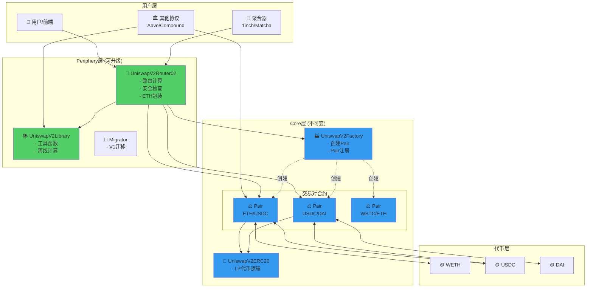
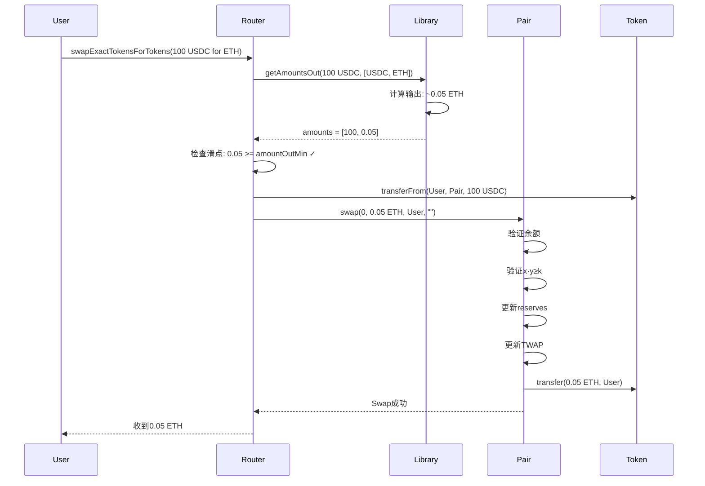
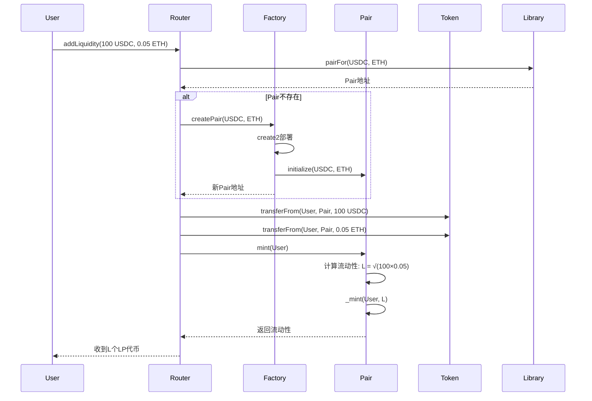
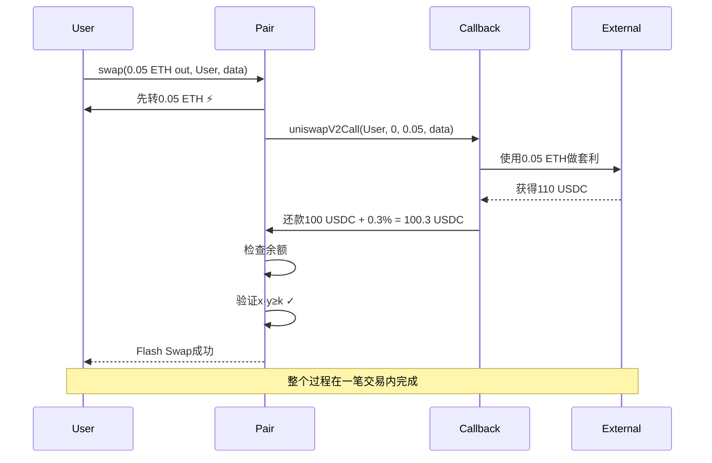

# Uniswap V2 架构设计 - 三合约模式

> 🏗️ **Core + Periphery 分层架构深度解析**
> 
> 理解系统架构是读懂源码的关键
> 

---

## 📚 目录

1. [架构总览](#1-架构总览)
2. [Core层设计](#2-core层设计)
3. [Periphery层设计](#3-periphery层设计)
4. [交互流程](#4-交互流程)
5. [设计模式](#5-设计模式)

---

## 1. 架构总览

### 1.1 分层架构



### 1.2 设计理念

**核心原则：**

```
1. 分层解耦 ✅
   Core: 不可变的核心逻辑
   Periphery: 可升级的辅助功能

2. 职责分离 ✅
   Factory: 创建和管理
   Pair: 状态和核心逻辑
   Router: 用户接口和路由

3. 安全优先 ✅
   Core极简，经过严格审计
   资金只在Core层

4. 可扩展性 ✅
   任何人可以写新的Periphery
   生态百花齐放
```

---

## 2. Core层设计

### 2.1 UniswapV2Factory

**职责：**

```
1. 创建Pair合约 ⭐
2. 注册和查询Pair
3. 管理协议费设置
```

**核心接口：**

```solidity
contract UniswapV2Factory {
    // 状态变量
    address public feeTo;           // 协议费接收地址
    address public feeToSetter;     // 协议费设置者
    
    // Pair映射（双向）
    mapping(address => mapping(address => address)) public getPair;
    address[] public allPairs;
    
    // 创建Pair
    function createPair(address tokenA, address tokenB) 
        external 
        returns (address pair);
    
    // 协议费管理
    function setFeeTo(address) external;
    function setFeeToSetter(address) external;
}
```

**create2确定性部署：**

```solidity
function createPair(address tokenA, address tokenB) 
    external 
    returns (address pair) 
{
    require(tokenA != tokenB, 'IDENTICAL_ADDRESSES');
    
    // 排序
    (address token0, address token1) = tokenA < tokenB 
        ? (tokenA, tokenB) 
        : (tokenB, tokenA);
    
    require(token0 != address(0), 'ZERO_ADDRESS');
    require(getPair[token0][token1] == address(0), 'PAIR_EXISTS');
    
    // ⭐ create2确定性部署
    bytes memory bytecode = type(UniswapV2Pair).creationCode;
    bytes32 salt = keccak256(abi.encodePacked(token0, token1));
    assembly {
        pair := create2(0, add(bytecode, 32), mload(bytecode), salt)
    }
    
    // 初始化
    IUniswapV2Pair(pair).initialize(token0, token1);
    
    // 双向存储
    getPair[token0][token1] = pair;
    getPair[token1][token0] = pair;
    allPairs.push(pair);
    
    emit PairCreated(token0, token1, pair, allPairs.length);
}
```

### 2.2 UniswapV2Pair

**职责：**

```
1. 存储状态（reserves, cumulative prices） ⭐⭐⭐
2. 实现核心逻辑（swap, mint, burn） ⭐⭐⭐
3. 维护x·y=k不变式 ⭐⭐⭐
4. 更新TWAP数据 ⭐⭐
```

**核心状态变量：**

```solidity
contract UniswapV2Pair is UniswapV2ERC20 {
    // 代币地址
    address public token0;
    address public token1;
    
    // 储备量（紧凑存储）
    uint112 private reserve0;
    uint112 private reserve1;
    uint32  private blockTimestampLast;
    
    // TWAP累积价格
    uint public price0CumulativeLast;
    uint public price1CumulativeLast;
    
    // 协议费计算
    uint public kLast;
}
```

**核心函数：**

```solidity
// 1. Swap - 交易
function swap(
    uint amount0Out, 
    uint amount1Out, 
    address to, 
    bytes calldata data
) external lock;

// 2. Mint - 添加流动性
function mint(address to) 
    external 
    lock 
    returns (uint liquidity);

// 3. Burn - 移除流动性
function burn(address to) 
    external 
    lock 
    returns (uint amount0, uint amount1);

// 4. Sync - 同步储备
function sync() external lock;

// 5. Skim - 提取多余代币
function skim(address to) external lock;
```

### 2.3 UniswapV2ERC20

**职责：**

```
实现LP代币的ERC20功能 + EIP-2612 permit
```

**核心功能：**

```solidity
contract UniswapV2ERC20 {
    string public constant name = 'Uniswap V2';
    string public constant symbol = 'UNI-V2';
    uint8 public constant decimals = 18;
    
    uint public totalSupply;
    mapping(address => uint) public balanceOf;
    mapping(address => mapping(address => uint)) public allowance;
    
    // EIP-2612 permit
    bytes32 public DOMAIN_SEPARATOR;
    mapping(address => uint) public nonces;
    
    // 标准ERC20
    function transfer(address to, uint value) external returns (bool);
    function approve(address spender, uint value) external returns (bool);
    function transferFrom(address from, address to, uint value) external returns (bool);
    
    // EIP-2612 签名授权
    function permit(
        address owner, address spender, uint value,
        uint deadline, uint8 v, bytes32 r, bytes32 s
    ) external;
}
```

---

## 3. Periphery层设计

### 3.1 UniswapV2Router02

**职责：**

```
1. 提供用户友好的接口 ⭐⭐⭐
2. 计算最优路径 ⭐⭐
3. 实施安全检查（滑点、截止时间） ⭐⭐⭐
4. 处理ETH包装/解包 ⭐⭐
```

**核心函数分类：**

```solidity
contract UniswapV2Router02 {
    // ===== Swap函数 =====
    
    // 精确输入
    function swapExactTokensForTokens(
        uint amountIn,
        uint amountOutMin,
        address[] calldata path,
        address to,
        uint deadline
    ) external returns (uint[] memory amounts);
    
    // 精确输出
    function swapTokensForExactTokens(
        uint amountOut,
        uint amountInMax,
        address[] calldata path,
        address to,
        uint deadline
    ) external returns (uint[] memory amounts);
    
    // 支持ETH
    function swapExactETHForTokens(...) external payable;
    function swapTokensForExactETH(...) external;
    
    // 支持fee-on-transfer代币
    function swapExactTokensForTokensSupportingFeeOnTransferTokens(...) external;
    
    // ===== 流动性函数 =====
    
    function addLiquidity(
        address tokenA,
        address tokenB,
        uint amountADesired,
        uint amountBDesired,
        uint amountAMin,
        uint amountBMin,
        address to,
        uint deadline
    ) external returns (uint amountA, uint amountB, uint liquidity);
    
    function addLiquidityETH(...) external payable;
    
    function removeLiquidity(...) external;
    function removeLiquidityETH(...) external;
    function removeLiquidityWithPermit(...) external;
}
```

**关键设计：**

```solidity
// 1. 路径计算
function getAmountsOut(uint amountIn, address[] memory path)
    public
    view
    returns (uint[] memory amounts)
{
    require(path.length >= 2, 'INVALID_PATH');
    amounts = new uint[](path.length);
    amounts[0] = amountIn;
    
    for (uint i; i < path.length - 1; i++) {
        (uint reserveIn, uint reserveOut) = getReserves(path[i], path[i + 1]);
        amounts[i + 1] = getAmountOut(amounts[i], reserveIn, reserveOut);
    }
}

// 2. 滑点保护
require(amounts[amounts.length - 1] >= amountOutMin, 'INSUFFICIENT_OUTPUT_AMOUNT');

// 3. 截止时间
modifier ensure(uint deadline) {
    require(deadline >= block.timestamp, 'EXPIRED');
    _;
}
```

### 3.2 UniswapV2Library

**职责：**

```
提供纯函数工具：
1. 离线计算Pair地址 ⭐
2. 计算交易数量 ⭐⭐
3. Quote函数 ⭐
```

**核心函数：**

```solidity
library UniswapV2Library {
    // 排序token
    function sortTokens(address tokenA, address tokenB)
        internal
        pure
        returns (address token0, address token1);
    
    // 计算Pair地址（离线）
    function pairFor(address factory, address tokenA, address tokenB)
        internal
        pure
        returns (address pair);
    
    // 获取储备量
    function getReserves(address factory, address tokenA, address tokenB)
        internal
        view
        returns (uint reserveA, uint reserveB);
    
    // 计算输出（给定输入）
    function getAmountOut(uint amountIn, uint reserveIn, uint reserveOut)
        internal
        pure
        returns (uint amountOut);
    
    // 计算输入（给定输出）
    function getAmountIn(uint amountOut, uint reserveIn, uint reserveOut)
        internal
        pure
        returns (uint amountIn);
    
    // Quote
    function quote(uint amountA, uint reserveA, uint reserveB)
        internal
        pure
        returns (uint amountB);
}
```

---

## 4. 交互流程

### 4.1 Swap流程



### 4.2 添加流动性流程



### 4.3 Flash Swap流程



---

## 5. 设计模式

### 5.1 Factory模式

**意图：** 统一创建和管理Pair

**实现：**

```solidity
// Factory负责创建
Factory.createPair(tokenA, tokenB) → Pair地址

// 统一管理
getPair[tokenA][tokenB] = pair
allPairs.push(pair)

// 好处：
✅ 中心化管理
✅ 防止重复创建
✅ 方便查询
```

### 5.2 Singleton模式

**意图：** Factory是唯一的

**实现：**

```
一个链上只有一个UniswapV2Factory
所有Pair都由它创建

好处：
✅ 避免碎片化
✅ 流动性集中
✅ 易于发现
```

### 5.3 Library模式

**意图：** 复用代码，节省Gas

**实现：**

```solidity
// Library的函数可以被多个合约调用
// 不需要部署多次

UniswapV2Library.getAmountOut(...)
UniswapV2Library.pairFor(...)

好处：
✅ 代码复用
✅ 节省部署成本
✅ 便于升级（部署新Router引用新Library）
```

### 5.4 Router模式

**意图：** 提供便利接口，封装复杂逻辑

**实现：**

```
用户 → Router → Pair

Router处理：
- 路径计算
- 滑点检查
- 截止时间
- ETH包装

用户无需关心细节
```

---

## ✅ 学习检查清单

- [ ] 理解Core + Periphery分层
- [ ] 知道Factory的作用
- [ ] 理解Pair的核心职责
- [ ] 掌握Router的功能
- [ ] 能画出交互流程图
- [ ] 理解create2的作用
- [ ] 知道为什么分层设计
- [ ] 理解各设计模式

---

## 🎯 总结

Uniswap V2的架构设计：

```
✅ 分层清晰（Core不可变、Periphery可升级）
✅ 职责分明（Factory、Pair、Router各司其职）
✅ 安全优先（资金只在Core）
✅ 易于扩展（任何人可写新Periphery）

这是教科书级的架构设计！
```

**下一步** → [04-技术权衡分析](../04-技术权衡分析/README.md)

在那里你将学习设计决策背后的权衡思考！💪
