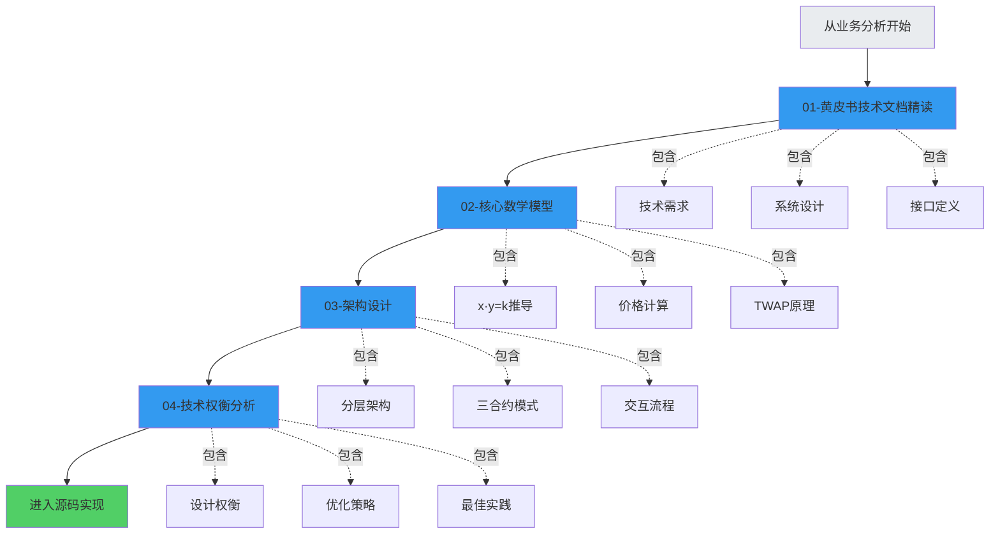

# 第2步：Uniswap V2 技术方案

> 🏗️ **从业务需求到技术实现**
> 
> 理解了业务需求后，深入技术方案设计：数学模型、架构设计、技术权衡
> 
> ⏱️ 预计学习时间：10-12小时

---

## 📚 学习目标

完成本章学习后，你将能够：

✅ **理解技术方案设计**
- 如何将业务需求转化为技术方案
- 核心数学模型的推导
- 系统架构的设计原则

✅ **掌握AMM数学原理**
- x·y=k公式的完整推导
- 价格计算机制
- 滑点和手续费的数学表达

✅ **理解架构设计**
- Core + Periphery分层架构
- Factory + Pair + Router模式
- 合约间的交互关系

✅ **学会技术权衡**
- 安全性 vs 灵活性
- 简单性 vs 功能性
- Gas效率 vs 代码可读性

---

## 🗺️ 学习路线图



---

## 📖 章节概览

### [01-黄皮书技术文档精读](./01-黄皮书技术文档精读/README.md) ⭐⭐⭐⭐⭐

**学习时间：3-4小时**

```
内容：
├── Uniswap V2技术白皮书解读
├── 系统需求分析
├── 技术方案设计
├── 接口定义
├── 数据结构设计
└── 安全性考虑

学习成果：
✅ 理解技术需求
✅ 掌握系统设计思路
✅ 了解接口规范

重要程度：⭐⭐⭐⭐⭐ 技术基础
```

**核心内容：**
```
1. 技术需求
   - ERC20/ERC20交易对的技术实现
   - TWAP预言机的技术方案
   - Flash Swaps的技术设计

2. 系统架构
   - Core层：不可变核心
   - Periphery层：可升级外围
   - 合约交互关系

3. 数据结构
   - reserves储备量
   - price累积价格
   - kLast协议费计算

4. 算法设计
   - swap算法
   - mint/burn算法
   - TWAP计算算法
```

---

### [02-核心数学模型-恒定乘积](./02-核心数学模型-恒定乘积/README.md) ⭐⭐⭐⭐⭐

**学习时间：3-4小时**

```
内容：
├── x·y=k公式完整推导
├── 价格计算机制
├── 滑点数学模型
├── 手续费数学处理
├── 无常损失数学分析
└── TWAP数学原理

学习成果：
✅ 完全理解AMM数学原理
✅ 能够手动推导公式
✅ 理解各参数之间关系

重要程度：⭐⭐⭐⭐⭐ 核心基础
```

**数学内容：**
```
1. 恒定乘积公式
   x · y = k
   - 推导过程
   - 几何意义
   - 经济学解释

2. 价格计算
   P = y / x
   - 边际价格
   - 平均价格
   - 价格影响

3. 滑点公式
   Δy = y · Δx / (x + Δx)
   - 滑点推导
   - 影响因素
   - 优化方法

4. 手续费处理
   k_new = k_old · (1 - 0.003)²
   - 手续费如何改变k
   - 对价格的影响
   - LP收益计算

5. TWAP原理
   price_cumulative += price · time
   - 时间加权
   - 累积机制
   - 安全性分析
```

---

### [03-架构设计-三合约模式](./03-架构设计-三合约模式/README.md) ⭐⭐⭐⭐⭐

**学习时间：2-3小时**

```
内容：
├── Core + Periphery分层架构
├── Factory工厂模式
├── Pair交易对模式
├── Router路由模式
├── 合约交互流程
└── 设计模式分析

学习成果：
✅ 理解分层架构设计
✅ 掌握Factory模式
✅ 理解合约交互

重要程度：⭐⭐⭐⭐⭐ 架构核心
```

**架构内容：**
```
1. 分层架构
   Core (核心层)
   ├── UniswapV2Factory
   ├── UniswapV2Pair
   └── UniswapV2ERC20
   
   Periphery (外围层)
   ├── UniswapV2Router02
   ├── UniswapV2Library
   └── UniswapV2Migrator

2. 职责划分
   Core: 状态存储 + 核心逻辑
   Periphery: 辅助功能 + 用户接口

3. 交互流程
   User → Router → Pair → Token
   ↓
   事件 ← 状态更新

4. 设计模式
   - Factory模式
   - Singleton模式  
   - Library模式
   - Router模式
```

---

### [04-技术权衡分析](./04-技术权衡分析/README.md) ⭐⭐⭐⭐

**学习时间：2-3小时**

```
内容：
├── 安全性 vs 灵活性
├── 简单性 vs 功能性
├── Gas效率 vs 代码质量
├── 去中心化 vs 可升级性
├── 设计决策分析
└── 最佳实践总结

学习成果：
✅ 理解技术权衡思维
✅ 学会评估设计决策
✅ 掌握优化方法

重要程度：⭐⭐⭐⭐ 设计思维
```

**权衡内容：**
```
1. 安全 vs 灵活
   Core不可升级 ✅ 安全
   Periphery可升级 ✅ 灵活

2. 简单 vs 功能
   V2保持简单 ✅
   但功能比V1多 ✅

3. Gas vs 可读
   极致优化 ⚠️
   但保持可读 ✅

4. 去中心化 vs 升级
   Core完全去中心化 ✅
   Periphery可升级 ✅

每个决策都有深思熟虑！
```

---

## 🎯 学习方法

### 推荐学习顺序

```
Week 1: 技术文档精读（3-4小时）
├── Day 1-2: 精读技术白皮书
├── 理解技术需求
└── 了解系统设计

Week 2: 数学模型（3-4小时）
├── Day 3-4: 推导x·y=k
├── 手动计算价格、滑点
└── 理解TWAP原理

Week 3: 架构设计（2-3小时）
├── Day 5: 学习三合约模式
├── 画出架构图
└── 理解交互流程

Week 4: 技术权衡（2-3小时）
├── Day 6: 分析设计决策
├── 理解权衡思维
└── 总结最佳实践

总计：10-14小时
```

### 学习技巧

**1. 动手推导**

```
不要只看公式
要自己推导：

例如：为什么是x·y=k？
1. 从需求出发
2. 列出约束条件
3. 推导数学模型
4. 验证合理性

只有自己推导过
才算真正理解！
```

**2. 画图理解**

```
画图是理解架构的最好方法：

1. 画合约关系图
2. 画交互流程图
3. 画状态转换图
4. 画数据流向图

Mermaid很好用！
```

**3. 对比学习**

```
对比不同方案：

例如：为什么用Factory模式？
- 方案A: 每个Pair独立部署
- 方案B: Factory统一管理
- 对比优劣
- 理解选择

通过对比加深理解
```

**4. 实战验证**

```
理论要结合实践：

1. 用计算器验证公式
2. 在Remix中部署测试
3. 观察真实交易
4. 验证理论计算

知行合一！
```

---

## 📊 技术方案框架

### 框架1：需求-方案-实现

```
业务需求 → 技术方案 → 具体实现

例子：ERC20/ERC20直接交易

需求：
- 降低交易成本
- 避免ETH中转
- 支持所有代币对

技术方案：
- Factory支持任意token对
- 使用create2确定性部署
- 双向映射存储

具体实现：
- createPair函数
- getPair映射
- salt = hash(token0, token1)

层层递进！
```

### 框架2：问题-约束-解决

```
问题定义 → 约束条件 → 解决方案

例子：价格预言机设计

问题：
- 如何提供安全的价格？

约束：
- 不能被瞬时操纵
- 不能依赖外部预言机
- Gas费要低

解决方案：
- TWAP时间加权
- 累积价格存储
- 外部协议自己计算

满足所有约束！
```

### 框架3：权衡-选择-优化

```
识别权衡 → 做出选择 → 持续优化

例子：Core是否可升级？

权衡：
- 可升级：灵活 vs 不可升级：安全

选择：
- Core不可升级（安全优先）
- Periphery可升级（保持灵活）

优化：
- 分层架构平衡两者
- 最佳解决方案

没有完美方案
只有最优权衡！
```

---

## 🎓 技术能力提升

### 能力1：数学建模

```
练习：
给定一个业务场景
如何建立数学模型？

例如：自动做市商
1. 定义变量：x, y储备量
2. 确定约束：k保持恒定
3. 推导公式：x·y=k
4. 验证合理性

这是工程师必备技能！
```

### 能力2：架构设计

```
练习：
如何设计一个系统架构？

步骤：
1. 识别核心功能
2. 划分模块职责
3. 定义接口
4. 设计交互流程

Uniswap的架构是典范！
```

### 能力3：技术权衡

```
练习：
面对一个技术决策
如何权衡利弊？

框架：
1. 列出所有选项
2. 分析每个pros/cons
3. 评估优先级
4. 做出选择
5. 持续优化

这是高级工程师的标志！
```

### 能力4：文档阅读

```
练习：
如何高效阅读技术文档？

技巧：
1. 先看整体结构
2. 识别关键部分
3. 深入核心章节
4. 做笔记和总结

不要逐字逐句读
抓住核心即可！
```

---

## ✅ 技术方案检查清单

### Level 1：基础理解

- [ ] 理解技术需求来源
- [ ] 知道系统整体架构
- [ ] 了解核心合约职责
- [ ] 掌握x·y=k公式
- [ ] 理解TWAP原理

### Level 2：深入掌握

- [ ] 能够推导AMM数学公式
- [ ] 理解分层架构设计
- [ ] 掌握Factory模式原理
- [ ] 能画出合约交互图
- [ ] 理解技术权衡思维

### Level 3：融会贯通

- [ ] 能独立设计AMM系统
- [ ] 能评估不同技术方案
- [ ] 能提出优化建议
- [ ] 理解为什么这样设计
- [ ] 能应用到其他项目

---

## 📚 参考资料

### 官方文档
- [Uniswap V2 Whitepaper](https://uniswap.org/whitepaper.pdf) ⭐⭐⭐⭐⭐
- [Uniswap V2 Core Docs](https://docs.uniswap.org/contracts/v2/overview)
- [Uniswap V2 SDK](https://docs.uniswap.org/sdk/2.0.0/)

### 技术文章
- [Understanding Automated Market Makers](https://medium.com/dragonfly-research)
- [AMM Math Explained](https://www.paradigm.xyz/)
- [Uniswap V2 Deep Dive](https://ethereum.org/en/developers/tutorials/)

### 视频教程
- [Smart Contract Programmer - Uniswap V2](https://www.youtube.com/watch?v=Eh3faq2OcoI)
- [Finematics - AMM Explained](https://www.youtube.com/watch?v=1PbZMudPP5E)

---

## 🎯 学习成果

完成本章学习后，你将拥有：

```
✅ 技术方案设计能力
   从需求到方案的转换

✅ 数学建模能力
   建立并推导数学模型

✅ 架构设计能力
   设计分层、模块化系统

✅ 技术权衡能力
   评估并选择最优方案

✅ 系统性技术认知
   理解Uniswap V2技术全貌
```

**这些能力让你：**
- 能够设计DeFi协议
- 能够评估技术方案
- 能够优化现有系统
- 能够通过高级技术面试

---

## 🚀 准备好了吗？

现在开始你的技术方案学习之旅：

**第一站** → [01-黄皮书技术文档精读](./01-黄皮书技术文档精读/README.md)

在那里，你将：
- 理解V2的技术需求
- 掌握系统设计思路
- 了解技术实现方案

**Let's dive into the technical world!** 💪🚀

---

## 💡 学习建议

```
1. 先理解业务
   如果没完成第1步业务分析
   建议先完成
   
2. 准备好纸笔
   数学推导需要手写
   架构设计需要画图
   
3. 保持耐心
   技术内容较深
   需要反复理解
   
4. 多做练习
   不要只看不做
   动手推导、画图、计算
   
5. 联系实际
   结合真实数据验证
   在Uniswap上观察
   
记住：理论必须结合实践！
```

**Good luck with your technical journey!** 🎉
