# UniswapV2Pair 核心源码深度解析

> 📖 **逐行解读Uniswap V2最核心的合约**
> 
> 理解Pair合约是理解整个V2的关键
> 
> ⏱️ 预计学习时间：4-6小时

---

## 📚 目录

1. [合约概述](#1-合约概述)
2. [继承关系](#2-继承关系)
3. [状态变量详解](#3-状态变量详解)
4. [核心函数：swap](#4-核心函数swap)
5. [核心函数：mint](#5-核心函数mint)
6. [核心函数：burn](#6-核心函数burn)
7. [辅助函数](#7-辅助函数)
8. [安全机制](#8-安全机制)
9. [完整源码注释版](#9-完整源码注释版)

---

## 1. 合约概述

### 1.1 Pair合约的职责

```
UniswapV2Pair是V2的核心合约：

核心职责：
1. 💰 存储两种代币的储备量
2. 🔄 实现swap交易逻辑
3. ➕ 实现mint添加流动性
4. ➖ 实现burn移除流动性
5. 📊 维护TWAP价格数据
6. ⚡ 支持Flash Swaps
7. 🪙 管理LP代币（继承ERC20）

它是：
- 状态存储者（reserves, prices）
- 逻辑执行者（swap, mint, burn）
- 不变式守护者（x·y≥k）
```

### 1.2 文件结构

```
UniswapV2Pair.sol
├── 继承
│   ├── UniswapV2ERC20 (LP代币功能)
│   └── Math (数学库)
├── 状态变量
│   ├── reserves (储备量)
│   ├── prices (累积价格)
│   └── kLast (协议费计算)
├── 核心函数
│   ├── swap() (交易)
│   ├── mint() (添加流动性)
│   └── burn() (移除流动性)
├── 辅助函数
│   ├── _update() (更新状态)
│   ├── _mintFee() (协议费)
│   ├── sync() (同步)
│   └── skim() (提取)
└── 安全机制
    ├── lock (重入锁)
    └── SafeMath (溢出保护)
```

---

## 2. 继承关系

### 2.1 继承图

```mermaid
graph TD
    IUniswapV2Pair[IUniswapV2Pair<br/>接口定义] -.实现.-> Pair
    UniswapV2ERC20[UniswapV2ERC20<br/>LP代币功能] --> Pair[UniswapV2Pair<br/>核心逻辑]
    Math[Math<br/>数学库] --> Pair
    UQ112x112[UQ112x112<br/>定点数库] --> Pair
    
    IERC20[IERC20<br/>ERC20接口] -.实现.-> UniswapV2ERC20
    
    style Pair fill:#339af0,stroke:#1971c2,stroke-width:3px
    style UniswapV2ERC20 fill:#4dabf7
    style Math fill:#74c0fc
    style UQ112x112 fill:#74c0fc
```



### 2.2 各部分职责

**UniswapV2ERC20：**
```solidity
// LP代币的ERC20功能
- name, symbol, decimals
- totalSupply, balanceOf
- transfer, approve, transferFrom
- permit (EIP-2612签名授权)
```

**Math库：**
```solidity
// 数学工具函数
function min(uint x, uint y) returns (uint z) {
    z = x < y ? x : y;
}

function sqrt(uint y) returns (uint z) {
    // 平方根计算（牛顿法）
}
```

**UQ112x112库：二进制定点数（Binary Fixed Point Number）**

这个库实现了 **`UQ112.112`** 定点数格式，用于TWAP价格累积计算。

**什么是UQ112.112？**

```
Q = Q number format（定点数格式）
U = Unsigned（无符号，只支持正数）
112.112 = 用uint224存储，前112位存整数部分，后112位存小数部分

格式：|← 112 bits 整数 →|← 112 bits 小数 →|
      |__________________|__________________|
                  uint224 (224 bits)
```

**核心常数：Q112**

```solidity
uint224 constant Q112 = 2**112;  // 缩放因子
```

所有数字都会乘以 2^112 来存储：
- **1.0** 存储为：`1 × 2^112`
- **2.0** 存储为：`2 × 2^112`
- **0.5** 存储为：`0.5 × 2^112 = 2^111`
- **5.0** 存储为：`5 × 2^112`

**函数1：encode() - 整数编码为定点数**

```solidity
function encode(uint112 y) internal pure returns (uint224 z) {
    z = uint224(y) * Q112;  // never overflows
}
```

作用：将整数转换为UQ112.112格式

例子：
```
输入：y = 5
计算：z = 5 × 2^112
结果：z 代表定点数 5.0
```

为什么永远不溢出？
```
最大输入：uint112最大值 = 2^112 - 1
最大结果：(2^112 - 1) × 2^112 = 2^224 - 2^112
uint224最大值：2^224 - 1

因为 (2^224 - 2^112) < (2^224 - 1)
所以永远不会溢出 ✅
```

**函数2：uqdiv() - 定点数除法**

```solidity
function uqdiv(uint224 x, uint112 y) internal pure returns (uint224 z) {
    z = x / uint224(y);
}
```

作用：用定点数除以整数，结果仍是定点数

例子：
```
计算：10.0 ÷ 4 = ?

输入 x：10.0 在UQ112.112中 = 10 × 2^112
输入 y：4（整数）

计算：z = (10 × 2^112) / 4 = 2.5 × 2^112

结果：z 代表定点数 2.5 ✅
```

**在TWAP中的应用：**

```solidity
// 计算价格（reserve1 / reserve0）并编码
price0Cumulative += UQ112x112.encode(reserve1).uqdiv(reserve0) × timeElapsed;

步骤拆解：
1. encode(reserve1)     → reserve1 × 2^112
2. uqdiv(reserve0)      → (reserve1 × 2^112) / reserve0
                        = price × 2^112  (定点数格式的价格)
3. × timeElapsed        → 累积价格增量
```

**为什么使用定点数？**

```
问题：Solidity不支持浮点数
例如：价格 = 2000.5678 USDC/ETH

传统方案A：只存整数 = 2000 ❌ 精度损失
传统方案B：乘以10^18 ✅ 但是会溢出

UQ112.112方案：
✅ 高精度：112位小数 ≈ 77位十进制小数
✅ 足够大：112位整数可以存任何代币数量
✅ 不溢出：精心设计的位数分配
✅ 高效：只用整数运算，Gas便宜

完美方案！⭐⭐⭐⭐⭐
```

---

## 3. 状态变量详解

### 3.1 完整状态变量列表

```solidity
contract UniswapV2Pair is UniswapV2ERC20 {
    using SafeMath  for uint;
    using UQ112x112 for uint224;

    // ===== 常量 =====
    uint public constant MINIMUM_LIQUIDITY = 10**3;
    
    // ===== 不可变变量 =====
    address public factory;
    address public token0;
    address public token1;
    
    // ===== 储备量（紧凑存储）=====
    uint112 private reserve0;           // 32字节slot的前112位
    uint112 private reserve1;           // 32字节slot的中间112位
    uint32  private blockTimestampLast; // 32字节slot的最后32位
    
    // ===== TWAP价格 =====
    uint public price0CumulativeLast;   // token0的累积价格
    uint public price1CumulativeLast;   // token1的累积价格
    
    // ===== 协议费计算 =====
    uint public kLast;                  // 上次mint/burn时的k值
    
    // ===== 重入锁 =====
    uint private unlocked = 1;
}
```

### 3.2 紧凑存储设计

**为什么这样设计？**

```
传统方式（96字节，3个slot）：
slot 1: uint256 reserve0        (32字节)
slot 2: uint256 reserve1        (32字节)
slot 3: uint256 blockTimestamp  (32字节)

V2方式（32字节，1个slot）：
slot 1: |reserve0 (14字节)|reserve1 (14字节)|timestamp (4字节)|
        |112 bits        |112 bits        |32 bits         |

节省：64字节 = 2个storage slot
Gas节省：约 40,000 Gas！
```

**uint112够用吗？**

```
uint112最大值：
2^112 = 5,192,296,858,534,827,628,530,496,329,220,096
      ≈ 5.19 × 10^33

实际对比：
ETH总量：120,000,000 (1.2 × 10^8)
USDC总量：40,000,000,000 (4 × 10^10)

完全够用！甚至溢出可能性为0
```

**uint32时间戳够用吗？**

```
uint32最大值：2^32 = 4,294,967,296秒
            ≈ 136年

从2020年到2156年
完全够用！

而且使用 block.timestamp % 2^32
循环使用，永远不会溢出
```

### 3.3 MINIMUM_LIQUIDITY的作用

```solidity
uint public constant MINIMUM_LIQUIDITY = 10**3;

// 为什么需要？
问题：如果第一个LP移除所有流动性
会导致：totalSupply = 0
风险：第二个LP添加时除以0

解决方案：
首次mint时：
1. 计算 liquidity = sqrt(amount0 * amount1)
2. 铸造 liquidity - MINIMUM_LIQUIDITY 给LP
3. 永久锁定 MINIMUM_LIQUIDITY 到 address(0)

效果：
✅ totalSupply永远 >= 1000
✅ 避免除以0
✅ 防止价格操纵攻击
```

---

## 4. 核心函数：swap

### 4.1 函数签名

```solidity
function swap(
    uint amount0Out,        // 输出token0的数量
    uint amount1Out,        // 输出token1的数量
    address to,             // 接收地址
    bytes calldata data     // 回调数据（Flash Swap）
) external lock;
```

### 4.2 完整实现（带详细注释）

```solidity
function swap(
    uint amount0Out, 
    uint amount1Out, 
    address to, 
    bytes calldata data
) external lock {
    // ===== 步骤1：输入验证 =====
    require(
        amount0Out > 0 || amount1Out > 0, 
        'UniswapV2: INSUFFICIENT_OUTPUT_AMOUNT'
    );
    
    // 获取当前储备量（从storage读取）
    (uint112 _reserve0, uint112 _reserve1,) = getReserves();
    
    // 验证输出量不超过储备量
    require(
        amount0Out < _reserve0 && amount1Out < _reserve1, 
        'UniswapV2: INSUFFICIENT_LIQUIDITY'
    );

    // ===== 步骤2：防止价格操纵 =====
    uint balance0;
    uint balance1;
    {
        // 使用作用域避免stack too deep错误
        address _token0 = token0;
        address _token1 = token1;
        
        // 防止将代币转给代币合约自己（会导致锁死）
        require(to != _token0 && to != _token1, 'UniswapV2: INVALID_TO');
        
        // ===== 步骤3：乐观转账（Flash Swap关键！）=====
        if (amount0Out > 0) _safeTransfer(_token0, to, amount0Out);
        if (amount1Out > 0) _safeTransfer(_token1, to, amount1Out);
        
        // ===== 步骤4：回调（如果有data）=====
        if (data.length > 0) {
            IUniswapV2Callee(to).uniswapV2Call(
                msg.sender, 
                amount0Out, 
                amount1Out, 
                data
            );
        }
        
        // ===== 步骤5：读取当前余额 =====
        balance0 = IERC20(_token0).balanceOf(address(this));
        balance1 = IERC20(_token1).balanceOf(address(this));
    }
    
    // ===== 步骤6：计算实际输入量 =====
    uint amount0In = balance0 > _reserve0 - amount0Out 
        ? balance0 - (_reserve0 - amount0Out) 
        : 0;
    uint amount1In = balance1 > _reserve1 - amount1Out 
        ? balance1 - (_reserve1 - amount1Out) 
        : 0;
    
    // 必须有输入（要么是普通swap，要么是flash swap还款）
    require(
        amount0In > 0 || amount1In > 0, 
        'UniswapV2: INSUFFICIENT_INPUT_AMOUNT'
    );
    
    // ===== 步骤7：验证k值（含手续费）=====
    {
        // 计算扣除手续费后的余额
        // 手续费 = 0.3% = 3/1000
        // 所以保留 = 1000/1000 - 3/1000 = 997/1000
        uint balance0Adjusted = balance0.mul(1000).sub(amount0In.mul(3));
        uint balance1Adjusted = balance1.mul(1000).sub(amount1In.mul(3));
        
        // 验证：新的k >= 旧的k
        // balance0Adjusted * balance1Adjusted >= reserve0 * reserve1 * 1000^2
        require(
            balance0Adjusted.mul(balance1Adjusted) >= 
            uint(_reserve0).mul(_reserve1).mul(1000**2), 
            'UniswapV2: K'
        );
    }
    
    // ===== 步骤8：更新储备量和TWAP =====
    _update(balance0, balance1, _reserve0, _reserve1);
    
    // ===== 步骤9：触发事件 =====
    emit Swap(msg.sender, amount0In, amount1In, amount0Out, amount1Out, to);
}
```

### 4.3 Swap关键设计解析

**设计1：乐观转账（Optimistic Transfer）**

```
传统方式：
1. 用户先转入
2. 合约计算输出
3. 合约转出

V2方式（支持Flash Swap）：
1. 合约先转出 ⚡
2. 回调用户合约
3. 验证余额和k值

优势：
✅ 支持闪电贷
✅ 支持即时套利
✅ 提升资本效率
```

**设计2：k值验证（含手续费）**

```solidity
// 验证公式：
balance0Adjusted * balance1Adjusted >= reserve0 * reserve1 * 1000^2

// 为什么乘1000^2？
因为：
balance0Adjusted = balance0 * 1000 - amount0In * 3
balance1Adjusted = balance1 * 1000 - amount1In * 3

所以右边也要乘1000^2保持平衡

// 为什么是 >=  而不是 == ？
因为：
1. 手续费会让k增长
2. 有人可能直接转入代币（捐赠）
3. 所以k只会增长，不会减少
```

**设计3：作用域限制（避免Stack Too Deep）**

```solidity
{
    address _token0 = token0;
    address _token1 = token1;
    // ... 使用 _token0, _token1
}
// 出了作用域，_token0和_token1被释放

原因：
Solidity有最多16个局部变量的限制
使用{}限制作用域可以复用stack空间
```

---

## 5. 核心函数：mint

### 5.1 函数签名

```solidity
function mint(address to) 
    external 
    lock 
    returns (uint liquidity);
```

### 5.2 完整实现（带详细注释）

```solidity
function mint(address to) external lock returns (uint liquidity) {
    // ===== 步骤1：获取当前状态 =====
    (uint112 _reserve0, uint112 _reserve1,) = getReserves();
    
    // 读取当前余额（用户已经转入代币）
    uint balance0 = IERC20(token0).balanceOf(address(this));
    uint balance1 = IERC20(token1).balanceOf(address(this));
    
    // 计算用户转入的数量
    uint amount0 = balance0.sub(_reserve0);
    uint amount1 = balance1.sub(_reserve1);

    // ===== 步骤2：计算并铸造协议费 =====
    bool feeOn = _mintFee(_reserve0, _reserve1);
    
    // ===== 步骤3：计算LP代币数量 =====
    uint _totalSupply = totalSupply; // 节省gas
    
    if (_totalSupply == 0) {
        // 首次添加流动性
        liquidity = Math.sqrt(amount0.mul(amount1)).sub(MINIMUM_LIQUIDITY);
        
        // 永久锁定最小流动性到地址0
        _mint(address(0), MINIMUM_LIQUIDITY);
        
    } else {
        // 后续添加流动性
        // 按比例计算LP代币
        liquidity = Math.min(
            amount0.mul(_totalSupply) / _reserve0,
            amount1.mul(_totalSupply) / _reserve1
        );
    }
    
    // ===== 步骤4：铸造LP代币 =====
    require(liquidity > 0, 'UniswapV2: INSUFFICIENT_LIQUIDITY_MINTED');
    _mint(to, liquidity);

    // ===== 步骤5：更新储备量 =====
    _update(balance0, balance1, _reserve0, _reserve1);
    
    // ===== 步骤6：更新kLast（如果开启协议费）=====
    if (feeOn) kLast = uint(reserve0).mul(reserve1);
    
    // ===== 步骤7：触发事件 =====
    emit Mint(msg.sender, amount0, amount1);
}
```

### 5.3 Mint关键设计解析

**设计1：首次流动性计算**

```
首次添加流动性：
liquidity = √(amount0 × amount1) - MINIMUM_LIQUIDITY

为什么用几何平均数？
1. 不依赖价格
   - 如果用 amount0 + amount1，价格影响太大
   - √(amount0 × amount1) 对两个代币一视同仁

2. 对称性
   - √(x × y) = √(y × x)
   - 无论哪个是token0都一样

3. 数学性质好
   - 平滑增长
   - 与k值的平方根一致

例子：
添加 100 USDC + 0.05 ETH
liquidity = √(100 × 0.05) = √5 ≈ 2.236 LP代币
```

**设计2：后续流动性计算**

```solidity
liquidity = min(
    amount0 * totalSupply / reserve0,
    amount1 * totalSupply / reserve1
);

为什么用min？
保证不改变池子价格！

例子：
池子：1000 USDC + 0.5 ETH，100 LP代币
价格：1 ETH = 2000 USDC

用户想添加：200 USDC + 0.1 ETH

按USDC计算：200/1000 * 100 = 20 LP
按ETH计算：0.1/0.5 * 100 = 20 LP

✅ 完全匹配！获得20 LP

如果用户添加：200 USDC + 0.05 ETH（比例不对）

按USDC计算：200/1000 * 100 = 20 LP
按ETH计算：0.05/0.5 * 100 = 10 LP

取min = 10 LP ✅

多余的USDC会留在池子
相当于"捐赠"给其他LP
所以要保证比例正确！
```

**设计3：协议费计算**

```solidity
function _mintFee(uint112 _reserve0, uint112 _reserve1) 
    private 
    returns (bool feeOn) 
{
    address feeTo = IUniswapV2Factory(factory).feeTo();
    feeOn = feeTo != address(0);
    
    uint _kLast = kLast;
    if (feeOn) {
        if (_kLast != 0) {
            // 计算k的增长
            uint rootK = Math.sqrt(uint(_reserve0).mul(_reserve1));
            uint rootKLast = Math.sqrt(_kLast);
            
            if (rootK > rootKLast) {
                // k增长了（因为交易手续费）
                uint numerator = totalSupply.mul(rootK.sub(rootKLast));
                uint denominator = rootK.mul(5).add(rootKLast);
                uint liquidity = numerator / denominator;
                
                // 铸造协议费给feeTo
                if (liquidity > 0) _mint(feeTo, liquidity);
            }
        }
    } else if (_kLast != 0) {
        kLast = 0;
    }
}

协议费公式推导：
如果k从k0增长到k1
增长部分的1/6归协议

为什么是1/6？
因为0.3%手续费，协议分1/6 = 0.05%
LP获得5/6 = 0.25%
```

---

## 6. 核心函数：burn

### 6.1 函数签名

```solidity
function burn(address to) 
    external 
    lock 
    returns (uint amount0, uint amount1);
```

### 6.2 完整实现（带详细注释）

```solidity
function burn(address to) 
    external 
    lock 
    returns (uint amount0, uint amount1) 
{
    // ===== 步骤1：获取当前状态 =====
    (uint112 _reserve0, uint112 _reserve1,) = getReserves();
    address _token0 = token0;
    address _token1 = token1;
    
    // 读取当前余额
    uint balance0 = IERC20(_token0).balanceOf(address(this));
    uint balance1 = IERC20(_token1).balanceOf(address(this));
    
    // 读取要燃烧的LP代币数量（Router已转入）
    uint liquidity = balanceOf[address(this)];

    // ===== 步骤2：计算并铸造协议费 =====
    bool feeOn = _mintFee(_reserve0, _reserve1);
    
    // ===== 步骤3：计算返还代币数量 =====
    uint _totalSupply = totalSupply;
    
    // 按比例计算
    amount0 = liquidity.mul(balance0) / _totalSupply;
    amount1 = liquidity.mul(balance1) / _totalSupply;
    
    require(
        amount0 > 0 && amount1 > 0, 
        'UniswapV2: INSUFFICIENT_LIQUIDITY_BURNED'
    );
    
    // ===== 步骤4：燃烧LP代币 =====
    _burn(address(this), liquidity);
    
    // ===== 步骤5：转出代币 =====
    _safeTransfer(_token0, to, amount0);
    _safeTransfer(_token1, to, amount1);
    
    // ===== 步骤6：更新余额 =====
    balance0 = IERC20(_token0).balanceOf(address(this));
    balance1 = IERC20(_token1).balanceOf(address(this));

    // ===== 步骤7：更新储备量 =====
    _update(balance0, balance1, _reserve0, _reserve1);
    
    // ===== 步骤8：更新kLast =====
    if (feeOn) kLast = uint(reserve0).mul(reserve1);
    
    // ===== 步骤9：触发事件 =====
    emit Burn(msg.sender, amount0, amount1, to);
}
```

### 6.3 Burn关键设计解析

**设计1：按比例返还**

```
公式：
amount0 = liquidity × balance0 / totalSupply
amount1 = liquidity × balance1 / totalSupply

例子：
池子：1000 USDC + 0.5 ETH
总LP：100个
用户持有：10个LP（10%）

移除流动性：
amount0 = 10 × 1000 / 100 = 100 USDC
amount1 = 10 × 0.5 / 100 = 0.05 ETH

✅ 获得池子的10%
```

**设计2：为什么读取balance而不是reserve？**

```
因为可能有人直接转入代币（捐赠）

情况1：正常池子
balance = reserve
正常返还

情况2：有捐赠
balance > reserve
LP获得额外收益！

这是一个feature，不是bug
鼓励"捐赠"给LP
```

---

## 7. 辅助函数

### 7.1 _update函数

```solidity
function _update(
    uint balance0, 
    uint balance1, 
    uint112 _reserve0, 
    uint112 _reserve1
) private {
    // ===== 步骤1：防止溢出 =====
    require(
        balance0 <= uint112(-1) && balance1 <= uint112(-1), 
        'UniswapV2: OVERFLOW'
    );
    
    // ===== 步骤2：计算时间差 =====
    uint32 blockTimestamp = uint32(block.timestamp % 2**32);
    uint32 timeElapsed = blockTimestamp - blockTimestampLast;
    
    // ===== 步骤3：更新TWAP（如果时间过了）=====
    if (timeElapsed > 0 && _reserve0 != 0 && _reserve1 != 0) {
        // 使用UQ112x112编码价格
        // price0 = reserve1 / reserve0
        // price1 = reserve0 / reserve1
        price0CumulativeLast += uint(UQ112x112.encode(_reserve1).uqdiv(_reserve0)) * timeElapsed;
        price1CumulativeLast += uint(UQ112x112.encode(_reserve0).uqdiv(_reserve1)) * timeElapsed;
    }
    
    // ===== 步骤4：更新储备量 =====
    reserve0 = uint112(balance0);
    reserve1 = uint112(balance1);
    blockTimestampLast = blockTimestamp;
    
    // ===== 步骤5：触发事件 =====
    emit Sync(reserve0, reserve1);
}
```

**TWAP更新详解：**

```
TWAP公式：
price_cumulative += price × time_elapsed

例子：
时刻t0: price = $2000, cumulative = 1,000,000
等待1小时（3600秒）...
时刻t1: price = $2100, cumulative = ?

更新：
cumulative = 1,000,000 + 2000 × 3600
           = 1,000,000 + 7,200,000
           = 8,200,000

外部协议计算TWAP：
TWAP = (cumulative_t1 - cumulative_t0) / (t1 - t0)
     = (8,200,000 - 1,000,000) / 3600
     = 7,200,000 / 3600
     = 2000

注意：这里简化了，实际要用UQ112x112解码
```

### 7.2 sync和skim函数

```solidity
// 强制储备量与余额同步
function sync() external lock {
    _update(
        IERC20(token0).balanceOf(address(this)),
        IERC20(token1).balanceOf(address(this)),
        reserve0,
        reserve1
    );
}

// 提取多余代币
function skim(address to) external lock {
    address _token0 = token0;
    address _token1 = token1;
    
    _safeTransfer(
        _token0, 
        to, 
        IERC20(_token0).balanceOf(address(this)).sub(reserve0)
    );
    _safeTransfer(
        _token1, 
        to, 
        IERC20(_token1).balanceOf(address(this)).sub(reserve1)
    );
}
```

**使用场景：**

```
sync() - 强制同步：
用于：代币合约有bug，余额异常时
例如：deflationary token (转账扣费)
效果：强制reserve = balance

skim() - 提取多余：
用于：有人不小心转入代币
例如：有人误转了100 USDC
效果：提取 (balance - reserve)，保持reserve不变

这两个函数是"救急"函数
正常情况不需要调用
```

---

## 8. 安全机制

### 8.1 重入锁

```solidity
uint private unlocked = 1;

modifier lock() {
    require(unlocked == 1, 'UniswapV2: LOCKED');
    unlocked = 0;
    _;
    unlocked = 1;
}

// 所有状态改变函数都加lock
function swap(...) external lock { }
function mint(...) external lock { }
function burn(...) external lock { }
```

**为什么需要重入锁？**

```
重入攻击场景：
1. 攻击者调用swap
2. 在uniswapV2Call回调中
3. 再次调用swap
4. 状态混乱，可能盗取资金

重入锁防护：
1. 第一次调用：unlocked = 1 → 0
2. 重入调用：unlocked = 0 → require失败 ❌
3. 函数结束：unlocked = 0 → 1

✅ 彻底阻止重入
```

### 8.2 溢出保护

```solidity
// V2使用Solidity 0.5
// 需要手动使用SafeMath

using SafeMath for uint;

amount.add(value);    // 替代 amount + value
amount.sub(value);    // 替代 amount - value
amount.mul(value);    // 替代 amount * value
amount.div(value);    // 替代 amount / value

// Solidity 0.8+ 自动检查溢出
// V2如果用0.8+可以去掉SafeMath
```

### 8.3 k值验证

```solidity
// 每次swap都验证k值
require(
    balance0Adjusted * balance1Adjusted >= 
    reserve0 * reserve1 * 1000^2, 
    'UniswapV2: K'
);

// 防止：
1. ❌ 用户不付款就取代币
2. ❌ 手续费被绕过
3. ❌ k值被恶意降低

// 保证：
✅ x·y ≥ k 永远成立
✅ 资金数学安全
```

---

## 9. 完整源码注释版

### 9.1 完整Pair合约

```solidity
// SPDX-License-Identifier: MIT
pragma solidity =0.5.16;

import './interfaces/IUniswapV2Pair.sol';
import './UniswapV2ERC20.sol';
import './libraries/Math.sol';
import './libraries/UQ112x112.sol';
import './interfaces/IERC20.sol';
import './interfaces/IUniswapV2Factory.sol';
import './interfaces/IUniswapV2Callee.sol';

/**
 * @title UniswapV2Pair
 * @notice Uniswap V2核心交易对合约
 * @dev 负责：
 *      1. 存储储备量和TWAP数据
 *      2. 实现swap/mint/burn核心逻辑
 *      3. 维护x·y=k不变式
 *      4. 支持Flash Swaps
 */
contract UniswapV2Pair is IUniswapV2Pair, UniswapV2ERC20 {
    using SafeMath  for uint;
    using UQ112x112 for uint224;

    // ==================== 常量 ====================
    
    /// @notice 最小流动性，永久锁定到address(0)
    /// @dev 防止totalSupply为0，避免除以0和价格操纵
    uint public constant MINIMUM_LIQUIDITY = 10**3;
    
    /// @dev transfer函数选择器（用于_safeTransfer）
    bytes4 private constant SELECTOR = bytes4(keccak256(bytes('transfer(address,uint256)')));

    // ==================== 状态变量 ====================
    
    /// @notice Factory合约地址
    address public factory;
    
    /// @notice 代币0地址（地址较小的）
    address public token0;
    
    /// @notice 代币1地址（地址较大的）
    address public token1;

    /// @notice 代币0储备量（紧凑存储）
    uint112 private reserve0;
    
    /// @notice 代币1储备量（紧凑存储）
    uint112 private reserve1;
    
    /// @notice 最后更新时间戳（紧凑存储）
    uint32  private blockTimestampLast;

    /// @notice 代币0累积价格（TWAP用）
    /// @dev price0 = reserve1 / reserve0
    uint public price0CumulativeLast;
    
    /// @notice 代币1累积价格（TWAP用）
    /// @dev price1 = reserve0 / reserve1
    uint public price1CumulativeLast;
    
    /// @notice 上次mint/burn时的k值（协议费计算用）
    uint public kLast;

    /// @dev 重入锁标志
    uint private unlocked = 1;
    
    // ==================== 修饰器 ====================
    
    /// @notice 重入锁
    modifier lock() {
        require(unlocked == 1, 'UniswapV2: LOCKED');
        unlocked = 0;
        _;
        unlocked = 1;
    }

    // ==================== 查询函数 ====================
    
    /// @notice 获取储备量
    /// @return _reserve0 代币0储备量
    /// @return _reserve1 代币1储备量
    /// @return _blockTimestampLast 最后更新时间
    function getReserves() public view returns (
        uint112 _reserve0, 
        uint112 _reserve1, 
        uint32 _blockTimestampLast
    ) {
        _reserve0 = reserve0;
        _reserve1 = reserve1;
        _blockTimestampLast = blockTimestampLast;
    }

    /// @dev 安全转账（处理非标准ERC20）
    function _safeTransfer(address token, address to, uint value) private {
        (bool success, bytes memory data) = token.call(
            abi.encodeWithSelector(SELECTOR, to, value)
        );
        require(
            success && (data.length == 0 || abi.decode(data, (bool))), 
            'UniswapV2: TRANSFER_FAILED'
        );
    }

    // ==================== 初始化 ====================
    
    /// @notice 初始化交易对
    /// @dev 只能由Factory调用一次
    constructor() public {
        factory = msg.sender;
    }

    /// @notice 设置代币地址
    /// @dev 只能由Factory在创建时调用
    function initialize(address _token0, address _token1) external {
        require(msg.sender == factory, 'UniswapV2: FORBIDDEN');
        token0 = _token0;
        token1 = _token1;
    }

    // ==================== 核心函数 ====================

    /// @notice 交换代币
    /// @param amount0Out 输出代币0数量
    /// @param amount1Out 输出代币1数量  
    /// @param to 接收地址
    /// @param data 回调数据（Flash Swap）
    function swap(
        uint amount0Out, 
        uint amount1Out, 
        address to, 
        bytes calldata data
    ) external lock {
        // 1. 验证输出量
        require(
            amount0Out > 0 || amount1Out > 0, 
            'UniswapV2: INSUFFICIENT_OUTPUT_AMOUNT'
        );
        
        // 2. 获取储备量
        (uint112 _reserve0, uint112 _reserve1,) = getReserves();
        require(
            amount0Out < _reserve0 && amount1Out < _reserve1, 
            'UniswapV2: INSUFFICIENT_LIQUIDITY'
        );

        uint balance0;
        uint balance1;
        {
            address _token0 = token0;
            address _token1 = token1;
            require(to != _token0 && to != _token1, 'UniswapV2: INVALID_TO');
            
            // 3. 乐观转账
            if (amount0Out > 0) _safeTransfer(_token0, to, amount0Out);
            if (amount1Out > 0) _safeTransfer(_token1, to, amount1Out);
            
            // 4. Flash Swap回调
            if (data.length > 0) {
                IUniswapV2Callee(to).uniswapV2Call(
                    msg.sender, 
                    amount0Out, 
                    amount1Out, 
                    data
                );
            }
            
            // 5. 获取余额
            balance0 = IERC20(_token0).balanceOf(address(this));
            balance1 = IERC20(_token1).balanceOf(address(this));
        }
        
        // 6. 计算输入量
        uint amount0In = balance0 > _reserve0 - amount0Out 
            ? balance0 - (_reserve0 - amount0Out) 
            : 0;
        uint amount1In = balance1 > _reserve1 - amount1Out 
            ? balance1 - (_reserve1 - amount1Out) 
            : 0;
        require(
            amount0In > 0 || amount1In > 0, 
            'UniswapV2: INSUFFICIENT_INPUT_AMOUNT'
        );
        
        // 7. 验证k值（含手续费）
        {
            uint balance0Adjusted = balance0.mul(1000).sub(amount0In.mul(3));
            uint balance1Adjusted = balance1.mul(1000).sub(amount1In.mul(3));
            require(
                balance0Adjusted.mul(balance1Adjusted) >= 
                uint(_reserve0).mul(_reserve1).mul(1000**2), 
                'UniswapV2: K'
            );
        }

        // 8. 更新储备和TWAP
        _update(balance0, balance1, _reserve0, _reserve1);
        emit Swap(msg.sender, amount0In, amount1In, amount0Out, amount1Out, to);
    }

    /// @notice 添加流动性（铸造LP代币）
    /// @dev 需要先将代币转入合约
    /// @param to LP代币接收地址
    /// @return liquidity 铸造的LP代币数量
    function mint(address to) external lock returns (uint liquidity) {
        // 1. 获取状态
        (uint112 _reserve0, uint112 _reserve1,) = getReserves();
        uint balance0 = IERC20(token0).balanceOf(address(this));
        uint balance1 = IERC20(token1).balanceOf(address(this));
        uint amount0 = balance0.sub(_reserve0);
        uint amount1 = balance1.sub(_reserve1);

        // 2. 协议费
        bool feeOn = _mintFee(_reserve0, _reserve1);
        
        // 3. 计算LP代币
        uint _totalSupply = totalSupply;
        if (_totalSupply == 0) {
            // 首次添加
            liquidity = Math.sqrt(amount0.mul(amount1)).sub(MINIMUM_LIQUIDITY);
            _mint(address(0), MINIMUM_LIQUIDITY);
        } else {
            // 后续添加
            liquidity = Math.min(
                amount0.mul(_totalSupply) / _reserve0,
                amount1.mul(_totalSupply) / _reserve1
            );
        }
        require(liquidity > 0, 'UniswapV2: INSUFFICIENT_LIQUIDITY_MINTED');
        
        // 4. 铸造LP代币
        _mint(to, liquidity);

        // 5. 更新状态
        _update(balance0, balance1, _reserve0, _reserve1);
        if (feeOn) kLast = uint(reserve0).mul(reserve1);
        
        emit Mint(msg.sender, amount0, amount1);
    }

    /// @notice 移除流动性（燃烧LP代币）
    /// @dev 需要先将LP代币转入合约
    /// @param to 代币接收地址
    /// @return amount0 返还代币0数量
    /// @return amount1 返还代币1数量
    function burn(address to) external lock returns (uint amount0, uint amount1) {
        // 1. 获取状态
        (uint112 _reserve0, uint112 _reserve1,) = getReserves();
        address _token0 = token0;
        address _token1 = token1;
        uint balance0 = IERC20(_token0).balanceOf(address(this));
        uint balance1 = IERC20(_token1).balanceOf(address(this));
        uint liquidity = balanceOf[address(this)];

        // 2. 协议费
        bool feeOn = _mintFee(_reserve0, _reserve1);
        
        // 3. 计算返还量
        uint _totalSupply = totalSupply;
        amount0 = liquidity.mul(balance0) / _totalSupply;
        amount1 = liquidity.mul(balance1) / _totalSupply;
        require(
            amount0 > 0 && amount1 > 0, 
            'UniswapV2: INSUFFICIENT_LIQUIDITY_BURNED'
        );
        
        // 4. 燃烧LP代币
        _burn(address(this), liquidity);
        
        // 5. 转出代币
        _safeTransfer(_token0, to, amount0);
        _safeTransfer(_token1, to, amount1);
        
        // 6. 更新状态
        balance0 = IERC20(_token0).balanceOf(address(this));
        balance1 = IERC20(_token1).balanceOf(address(this));
        _update(balance0, balance1, _reserve0, _reserve1);
        if (feeOn) kLast = uint(reserve0).mul(reserve1);
        
        emit Burn(msg.sender, amount0, amount1, to);
    }

    // ==================== 辅助函数 ====================

    /// @dev 更新储备量和TWAP
    function _update(
        uint balance0, 
        uint balance1, 
        uint112 _reserve0, 
        uint112 _reserve1
    ) private {
        require(
            balance0 <= uint112(-1) && balance1 <= uint112(-1), 
            'UniswapV2: OVERFLOW'
        );
        
        uint32 blockTimestamp = uint32(block.timestamp % 2**32);
        uint32 timeElapsed = blockTimestamp - blockTimestampLast;
        
        // 更新TWAP
        if (timeElapsed > 0 && _reserve0 != 0 && _reserve1 != 0) {
            price0CumulativeLast += 
                uint(UQ112x112.encode(_reserve1).uqdiv(_reserve0)) * timeElapsed;
            price1CumulativeLast += 
                uint(UQ112x112.encode(_reserve0).uqdiv(_reserve1)) * timeElapsed;
        }
        
        reserve0 = uint112(balance0);
        reserve1 = uint112(balance1);
        blockTimestampLast = blockTimestamp;
        emit Sync(reserve0, reserve1);
    }

    /// @dev 计算并铸造协议费
    function _mintFee(uint112 _reserve0, uint112 _reserve1) 
        private 
        returns (bool feeOn) 
    {
        address feeTo = IUniswapV2Factory(factory).feeTo();
        feeOn = feeTo != address(0);
        uint _kLast = kLast;
        if (feeOn) {
            if (_kLast != 0) {
                uint rootK = Math.sqrt(uint(_reserve0).mul(_reserve1));
                uint rootKLast = Math.sqrt(_kLast);
                if (rootK > rootKLast) {
                    uint numerator = totalSupply.mul(rootK.sub(rootKLast));
                    uint denominator = rootK.mul(5).add(rootKLast);
                    uint liquidity = numerator / denominator;
                    if (liquidity > 0) _mint(feeTo, liquidity);
                }
            }
        } else if (_kLast != 0) {
            kLast = 0;
        }
    }

    /// @notice 强制储备量与余额同步
    /// @dev 用于处理异常情况（如deflationary token）
    function sync() external lock {
        _update(
            IERC20(token0).balanceOf(address(this)),
            IERC20(token1).balanceOf(address(this)),
            reserve0,
            reserve1
        );
    }

    /// @notice 提取多余代币
    /// @dev 用于提取误转入的代币
    /// @param to 接收地址
    function skim(address to) external lock {
        address _token0 = token0;
        address _token1 = token1;
        _safeTransfer(
            _token0, 
            to, 
            IERC20(_token0).balanceOf(address(this)).sub(reserve0)
        );
        _safeTransfer(
            _token1, 
            to, 
            IERC20(_token1).balanceOf(address(this)).sub(reserve1)
        );
    }
}
```

---

## 10. UniswapV2ERC20 深度解析

### 10.1 为什么需要自定义ERC20？

```
Uniswap V2的LP代币不是普通的ERC20，而是：

特殊需求：
1. ✅ 标准ERC20功能（transfer, approve等）
2. ✅ EIP-2612 permit（链下签名授权）⭐
3. ✅ 极致Gas优化
4. ✅ 域分隔符（Domain Separator）防重放

为什么不用OpenZeppelin？
- V2追求极致优化
- 减少外部依赖
- 精简到只需要的功能
- 每个字节都精打细算
```

### 10.2 完整合约源码

```solidity
// SPDX-License-Identifier: MIT
pragma solidity =0.5.16;

import './interfaces/IUniswapV2ERC20.sol';
import './libraries/SafeMath.sol';

/**
 * @title UniswapV2ERC20
 * @notice Uniswap V2的LP代币实现
 * @dev 实现标准ERC20 + EIP-2612 permit
 */
contract UniswapV2ERC20 is IUniswapV2ERC20 {
    using SafeMath for uint;

    // ==================== ERC20基础信息 ====================
    
    string public constant name = 'Uniswap V2';
    string public constant symbol = 'UNI-V2';
    uint8 public constant decimals = 18;
    
    // ==================== ERC20状态变量 ====================
    
    uint  public totalSupply;
    mapping(address => uint) public balanceOf;
    mapping(address => mapping(address => uint)) public allowance;
    
    // ==================== EIP-2612状态变量 ====================
    
    bytes32 public DOMAIN_SEPARATOR;
    // keccak256("Permit(address owner,address spender,uint256 value,uint256 nonce,uint256 deadline)");
    bytes32 public constant PERMIT_TYPEHASH = 0x6e71edae12b1b97f4d1f60370fef10105fa2faae0126114a169c64845d6126c9;
    mapping(address => uint) public nonces;

    // ==================== 事件 ====================
    
    event Approval(address indexed owner, address indexed spender, uint value);
    event Transfer(address indexed from, address indexed to, uint value);

    // ==================== 构造函数 ====================
    
    constructor() public {
        uint chainId;
        assembly {
            chainId := chainid
        }
        DOMAIN_SEPARATOR = keccak256(
            abi.encode(
                keccak256('EIP712Domain(string name,string version,uint256 chainId,address verifyingContract)'),
                keccak256(bytes(name)),
                keccak256(bytes('1')),
                chainId,
                address(this)
            )
        );
    }

    // ==================== 内部函数 ====================

    function _mint(address to, uint value) internal {
        totalSupply = totalSupply.add(value);
        balanceOf[to] = balanceOf[to].add(value);
        emit Transfer(address(0), to, value);
    }

    function _burn(address from, uint value) internal {
        balanceOf[from] = balanceOf[from].sub(value);
        totalSupply = totalSupply.sub(value);
        emit Transfer(from, address(0), value);
    }

    function _approve(address owner, address spender, uint value) private {
        allowance[owner][spender] = value;
        emit Approval(owner, spender, value);
    }

    function _transfer(address from, address to, uint value) private {
        balanceOf[from] = balanceOf[from].sub(value);
        balanceOf[to] = balanceOf[to].add(value);
        emit Transfer(from, to, value);
    }

    // ==================== ERC20标准函数 ====================

    function approve(address spender, uint value) external returns (bool) {
        _approve(msg.sender, spender, value);
        return true;
    }

    function transfer(address to, uint value) external returns (bool) {
        _transfer(msg.sender, to, value);
        return true;
    }

    function transferFrom(address from, address to, uint value) external returns (bool) {
        if (allowance[from][msg.sender] != uint(-1)) {
            allowance[from][msg.sender] = allowance[from][msg.sender].sub(value);
        }
        _transfer(from, to, value);
        return true;
    }

    // ==================== EIP-2612 permit函数 ====================

    function permit(
        address owner, 
        address spender, 
        uint value, 
        uint deadline, 
        uint8 v, 
        bytes32 r, 
        bytes32 s
    ) external {
        require(deadline >= block.timestamp, 'UniswapV2: EXPIRED');
        bytes32 digest = keccak256(
            abi.encodePacked(
                '\x19\x01',
                DOMAIN_SEPARATOR,
                keccak256(abi.encode(PERMIT_TYPEHASH, owner, spender, value, nonces[owner]++, deadline))
            )
        );
        address recoveredAddress = ecrecover(digest, v, r, s);
        require(recoveredAddress != address(0) && recoveredAddress == owner, 'UniswapV2: INVALID_SIGNATURE');
        _approve(owner, spender, value);
    }
}
```

### 10.3 EIP-2612 Permit 深度解析

**什么是EIP-2612？**

```
传统ERC20授权流程（2笔交易）：
1. 用户调用 token.approve(spender, amount)  💰 Gas费
2. spender调用 token.transferFrom(user, to, amount)  💰 Gas费

问题：
❌ 用户要支付2次Gas
❌ 用户体验差
❌ 新用户门槛高

EIP-2612解决方案（1笔交易）：
1. 用户在链下签名授权消息  ✅ 免费！
2. spender调用 permit(签名) + transferFrom  💰 只需1次Gas

优势：
✅ 用户省Gas（只需签名，不需要链上交易）
✅ 更好的UX（一步完成）
✅ 支持元交易（meta-transaction）
```

**permit函数详解：**

```solidity
function permit(
    address owner,      // 代币所有者（签名者）
    address spender,    // 被授权者
    uint value,         // 授权额度
    uint deadline,      // 截止时间
    uint8 v,           // 签名参数v
    bytes32 r,         // 签名参数r
    bytes32 s          // 签名参数s
) external {
    // 步骤1：检查截止时间
    require(deadline >= block.timestamp, 'UniswapV2: EXPIRED');
    
    // 步骤2：构造EIP-712消息摘要
    bytes32 digest = keccak256(
        abi.encodePacked(
            '\x19\x01',                    // EIP-191前缀
            DOMAIN_SEPARATOR,              // 域分隔符
            keccak256(abi.encode(
                PERMIT_TYPEHASH,           // permit类型哈希
                owner,                     // 所有者
                spender,                   // 被授权者
                value,                     // 额度
                nonces[owner]++,          // nonce（防重放）
                deadline                   // 截止时间
            ))
        )
    );
    
    // 步骤3：恢复签名者地址
    address recoveredAddress = ecrecover(digest, v, r, s);
    
    // 步骤4：验证签名
    require(
        recoveredAddress != address(0) && recoveredAddress == owner, 
        'UniswapV2: INVALID_SIGNATURE'
    );
    
    // 步骤5：执行授权
    _approve(owner, spender, value);
}
```

### 10.4 EIP-712 域分隔符（Domain Separator）

**什么是Domain Separator？**

```
作用：防止签名在不同场景下被重放

包含信息：
1. 合约名称（name）
2. 版本（version）
3. 链ID（chainId）
4. 合约地址（verifyingContract）

为什么需要？
假设没有域分隔符：
- 攻击者可以在Uniswap V2复制签名到Uniswap V3 ❌
- 攻击者可以在以太坊主网复制签名到测试网 ❌
- 攻击者可以在不同Pair间复制签名 ❌

有了域分隔符：
- 签名绑定到特定合约 ✅
- 签名绑定到特定链 ✅
- 签名不可跨合约使用 ✅
```

**构造Domain Separator：**

```solidity
constructor() public {
    // 获取当前链ID
    uint chainId;
    assembly {
        chainId := chainid()  // 使用assembly获取链ID
    }
    
    // 计算域分隔符
    DOMAIN_SEPARATOR = keccak256(
        abi.encode(
            // EIP712Domain类型哈希
            keccak256('EIP712Domain(string name,string version,uint256 chainId,address verifyingContract)'),
            keccak256(bytes(name)),        // 'Uniswap V2'
            keccak256(bytes('1')),         // 版本 '1'
            chainId,                       // 链ID（1=主网, 5=Goerli等）
            address(this)                  // 当前合约地址
        )
    );
}

例子：
主网Pair A: DOMAIN_SEPARATOR_A = hash(name, version, 1, 0xAAA...)
主网Pair B: DOMAIN_SEPARATOR_B = hash(name, version, 1, 0xBBB...)
测试网Pair: DOMAIN_SEPARATOR_TEST = hash(name, version, 5, 0xAAA...)

全都不同！✅ 签名无法跨合约使用
```

### 10.5 Nonce防重放攻击

**什么是Nonce？**

```
Nonce = Number used once（只使用一次的数字）

作用：防止签名被重复使用

例子：
用户签名授权：
- owner: Alice
- spender: Bob  
- value: 100 LP
- nonce: 0  ← 第一次授权
- deadline: 未来时间

没有nonce的问题：
1. Bob使用签名调用permit  ✅
2. Alice撤销授权（allowance = 0）
3. Bob再次使用相同签名调用permit  ❌ 又授权了！

有nonce的解决：
1. Bob使用签名调用permit（nonce: 0）✅
2. nonce自增为1
3. Bob再次使用相同签名（nonce: 0）❌ 签名无效！

每次permit后nonce++，旧签名失效！
```

**Nonce实现：**

```solidity
mapping(address => uint) public nonces;

// 在permit中使用
nonces[owner]++  // 先使用，后自增

// 用户签名时需要包含当前nonce
// 下次签名需要用新的nonce
```

### 10.6 签名格式标准：EIP-191 + EIP-712

**为什么是这个格式？**

```solidity
bytes32 digest = keccak256(
    abi.encodePacked(
        '\x19\x01',           // ← 这是什么？
        DOMAIN_SEPARATOR,     // ← 为什么这样组合？
        structHash            // ← 这个顺序有什么讲究？
    )
);
```

这是 **EIP-191** + **EIP-712** 两个标准的组合！

---

#### EIP-191：签名数据标准

**标准地址：** [EIP-191](https://eips.ethereum.org/EIPS/eip-191)

**问题背景：**

```
以太坊早期签名混乱：
❌ eth_sign可以签任意数据
❌ 钱包不知道签的是什么
❌ 可能签了交易、消息、或其他

风险：
用户以为签的是消息
实际签的是交易
→ 资金被盗！
```

**EIP-191解决方案：**

```
定义签名数据格式前缀：0x19

完整格式：0x19 <1 byte version> <version specific data>

三种版本：
0x19 0x00：带validator地址
0x19 0x01：结构化数据（EIP-712使用） ← 我们用的这个
0x19 0x45：个人签名（eth_personal_sign）
```

**为什么用0x19？**

```
0x19是一个"不可能"的字节：

以太坊交易RLP编码规则：
- 如果第一个字节 < 0x7f，表示单字节数据
- 如果第一个字节 = 0x19，不符合任何RLP规则

所以：
✅ 0x19开头 = 肯定不是交易
✅ 防止签名被误认为交易
✅ 安全隔离签名和交易

这是一个聪明的设计！
```

---

#### EIP-712：结构化数据签名

**标准地址：** [EIP-712](https://eips.ethereum.org/EIPS/eip-712)

**完整签名格式：**

```
签名数据 = keccak256(
    abi.encodePacked(
        '\x19',              // EIP-191前缀（防止是交易）
        '\x01',              // EIP-191版本号（结构化数据）
        domainSeparator,     // 域分隔符（防止跨合约重放）
        structHash           // 数据哈希（实际内容）
    )
)

拆解：
0x19        = "这是签名，不是交易"
0x01        = "这是结构化数据签名"
domain      = "只在这个合约/链有效"
structHash  = "签名的具体内容"
```

**为什么用`\x01`？**

```
EIP-191定义的三种版本：

0x00: 带validator
格式：0x19 0x00 <validatorAddress> <data>
用途：需要特定验证者的签名

0x01: 结构化数据（EIP-712）← 我们用这个
格式：0x19 0x01 <domainSeparator> <structHash>
用途：人类可读的结构化签名

0x45: 个人签名（等于'E'）
格式：0x19 0x45 <"thereum Signed Message:\n" + len(message)> <data>
用途：eth_personal_sign，添加前缀防止签交易

V2的permit用0x01 = 结构化数据 ✅
```

---

#### 完整的Permit签名构造

**步骤1：构造structHash**

```solidity
// 定义permit的类型哈希
bytes32 public constant PERMIT_TYPEHASH = keccak256(
    "Permit(address owner,address spender,uint256 value,uint256 nonce,uint256 deadline)"
);

// 构造structHash
bytes32 structHash = keccak256(
    abi.encode(
        PERMIT_TYPEHASH,
        owner,
        spender,
        value,
        nonces[owner]++,
        deadline
    )
);

为什么用abi.encode？
✅ 固定长度编码
✅ 每个参数32字节
✅ 避免碰撞
```

**步骤2：构造digest（最终哈希）**

```solidity
bytes32 digest = keccak256(
    abi.encodePacked(         // 用encodePacked节省gas
        '\x19\x01',           // EIP-191 + EIP-712标识
        DOMAIN_SEPARATOR,     // 域分隔符
        structHash            // 数据哈希
    )
);

为什么用abi.encodePacked？
因为这3个部分都是32字节的哈希
不需要padding，直接拼接即可
节省Gas ✅
```

**步骤3：恢复签名者**

```solidity
address recoveredAddress = ecrecover(digest, v, r, s);
require(recoveredAddress == owner, 'INVALID_SIGNATURE');
```

---

#### 可视化：签名数据结构

```
最终签名的数据（digest）：

┌─────────────────────────────────────────────────┐
│  keccak256(                                     │
│    ┌──────────────────────────────────────┐   │
│    │ '\x19\x01'  (2 bytes)                │   │
│    │    ↓                                  │   │
│    │  0x19: "这不是交易"                    │   │
│    │  0x01: "这是EIP-712结构化签名"         │   │
│    └──────────────────────────────────────┘   │
│    ┌──────────────────────────────────────┐   │
│    │ DOMAIN_SEPARATOR (32 bytes)          │   │
│    │    ↓                                  │   │
│    │  包含：name, version, chainId, addr   │   │
│    │  作用：防止跨合约/跨链重放            │   │
│    └──────────────────────────────────────┘   │
│    ┌──────────────────────────────────────┐   │
│    │ structHash (32 bytes)                │   │
│    │    ↓                                  │   │
│    │  keccak256(abi.encode(               │   │
│    │    PERMIT_TYPEHASH,                  │   │
│    │    owner, spender, value,            │   │
│    │    nonce, deadline                   │   │
│    │  ))                                  │   │
│    │  包含：签名的具体内容                 │   │
│    └──────────────────────────────────────┘   │
│  )                                             │
└─────────────────────────────────────────────────┘
          ↓
    最终32字节digest
          ↓
    ecrecover(digest, v, r, s)
          ↓
    恢复出签名者地址
```

---

#### 为什么这样设计？

**多层防护：**

```
第1层：0x19前缀
✅ 防止签名被当作交易

第2层：0x01版本号
✅ 标识为结构化数据
✅ 与其他签名类型区分

第3层：DOMAIN_SEPARATOR
✅ 防止跨合约重放
✅ 防止跨链重放
✅ 绑定到特定应用

第4层：structHash
✅ 包含具体签名内容
✅ 使用类型哈希避免碰撞
✅ 包含nonce防止重放

多层防护 = 极高安全性！⭐⭐⭐⭐⭐
```

---

#### 与其他签名方式对比

**1. eth_sign（最原始，最危险）**

```solidity
// 直接签名任意数据
signature = eth_sign(keccak256(data))

问题：
❌ 没有前缀保护
❌ 可能签了交易
❌ 钱包无法显示内容
❌ 容易被钓鱼

已被废弃！
```

**2. eth_personal_sign（个人签名）**

```solidity
// 添加以太坊前缀
prefix = "\x19Ethereum Signed Message:\n" + len(message)
signature = sign(keccak256(prefix + message))

// 对应EIP-191的0x45版本
digest = keccak256(abi.encodePacked('\x19\x45', prefix, message))

优势：
✅ 有前缀保护
✅ 不会被当作交易

劣势：
❌ 不是结构化数据
❌ 钱包显示不友好
❌ 没有域分隔

用途：简单消息签名
```

**3. eth_signTypedData（EIP-712）**

```solidity
// 结构化签名（V2用的就是这个）
digest = keccak256(abi.encodePacked(
    '\x19\x01',
    DOMAIN_SEPARATOR,
    structHash
))

优势：
✅ 结构化数据
✅ 钱包可以清晰显示
✅ 域分隔防重放
✅ 类型安全

这是最安全、最先进的方式！⭐⭐⭐⭐⭐
```

---

#### 实际例子对比

**场景：授权100 LP代币**

**如果用eth_sign：**
```
钱包显示：
签名数据：0x6e71edae12b1b97f4d1f60370fef10105fa2faae0126114a169c64845d6126c9000000000...

用户：❓❓❓ 这是什么？？
风险：可能签了危险数据
```

**用EIP-712：**
```
钱包显示：

📋 Uniswap V2 Permit
━━━━━━━━━━━━━━━━━━━━━━
授权给：     0xRouter...
授权额度：   100 UNI-V2
过期时间：   2024-01-01 12:00
Nonce：     5
━━━━━━━━━━━━━━━━━━━━━━
⚠️ 仅在以太坊主网此合约有效

用户：✅ 清晰明了，可以安全签名
```

---

#### 总结

```
permit签名格式 = EIP-191 + EIP-712

0x19 0x01 = 固定前缀（标准要求）
  ↓    ↓
  │    └─ EIP-712结构化数据标识
  └────── EIP-191签名数据标识

DOMAIN_SEPARATOR = 域绑定（防重放）
structHash = 具体内容（带类型）

这个格式是：
✅ 工业标准
✅ 广泛采用（Dai, USDC, Uniswap等）
✅ 经过充分验证
✅ 安全性最高

不是随意设计的，而是社区经过深思熟虑的标准！
```

### 10.7 完整使用流程

**场景：用户移除流动性（使用permit）**

```javascript
// ===== 步骤1：用户构造permit签名 =====
const domain = {
  name: 'Uniswap V2',
  version: '1',
  chainId: 1,
  verifyingContract: pairAddress
};

const types = {
  Permit: [
    { name: 'owner', type: 'address' },
    { name: 'spender', type: 'address' },
    { name: 'value', type: 'uint256' },
    { name: 'nonce', type: 'uint256' },
    { name: 'deadline', type: 'uint256' }
  ]
};

const value = {
  owner: userAddress,
  spender: routerAddress,
  value: lpAmount.toString(),
  nonce: await pair.nonces(userAddress),
  deadline: Math.floor(Date.now() / 1000) + 3600  // 1小时后过期
};

// 用户签名（钱包弹窗，免费）
const signature = await signer._signTypedData(domain, types, value);
const { v, r, s } = ethers.utils.splitSignature(signature);

// ===== 步骤2：调用removeLiquidityWithPermit（1笔交易）=====
await router.removeLiquidityWithPermit(
  tokenA,
  tokenB,
  lpAmount,
  amountAMin,
  amountBMin,
  userAddress,
  deadline,
  false,  // approveMax
  v, r, s  // 签名参数
);

// Router内部会先调用permit，再调用removeLiquidity
// 用户只支付1次Gas！✅
```

### 10.8 安全性分析

**为什么安全？**

```
1. 域分隔符绑定
   ✅ 签名只在特定合约有效
   ✅ 不能跨链使用
   ✅ 不能跨Pair使用

2. Nonce防重放
   ✅ 每个签名只能用一次
   ✅ 旧签名自动失效

3. 截止时间
   ✅ 过期签名无效
   ✅ 限制攻击窗口

4. 签名验证
   ✅ ecrecover恢复签名者
   ✅ 验证签名者=owner

5. EIP-712结构化
   ✅ 用户看得懂签名内容
   ✅ 防止钓鱼攻击
```

**潜在风险：**

```
⚠️ 风险1：永久授权
如果value = uint(-1)（最大值）
等于永久授权！
建议：只授权需要的额度

⚠️ 风险2：deadline设置太长
如果deadline = 很远的未来
签名长期有效
建议：合理设置截止时间（如1小时）

⚠️ 风险3：签名泄露
如果签名泄露给恶意第三方
在deadline前可以被使用
建议：不要分享签名数据
```

### 10.9 与标准ERC20的对比

| 特性 | 标准ERC20 | UniswapV2ERC20 |
|------|-----------|----------------|
| **transfer** | ✅ | ✅ |
| **approve** | ✅ | ✅ |
| **transferFrom** | ✅ | ✅ 优化版 |
| **permit** | ❌ | ✅ EIP-2612 |
| **Domain Separator** | ❌ | ✅ 防重放 |
| **Nonce** | ❌ | ✅ 防重放 |
| **链下签名授权** | ❌ | ✅ 省Gas |
| **元交易支持** | ❌ | ✅ |
| **优化程度** | 一般 | 极致优化 |

**transferFrom优化：**

```solidity
// 标准ERC20
function transferFrom(address from, address to, uint value) external returns (bool) {
    allowance[from][msg.sender] = allowance[from][msg.sender].sub(value);
    _transfer(from, to, value);
    return true;
}

// V2优化（支持无限授权）
function transferFrom(address from, address to, uint value) external returns (bool) {
    if (allowance[from][msg.sender] != uint(-1)) {  // 如果不是最大值
        allowance[from][msg.sender] = allowance[from][msg.sender].sub(value);
    }
    // 如果是uint(-1)，不减少allowance，永久授权！
    _transfer(from, to, value);
    return true;
}

优势：
✅ 永久授权只需approve一次
✅ 后续transferFrom不消耗Gas更新allowance
✅ 常用于Router等可信合约
```

### 10.10 实战：如何使用permit

**前端集成示例：**

```javascript
// 1. 获取Pair合约
const pair = new ethers.Contract(pairAddress, pairABI, provider);

// 2. 准备签名数据
const owner = await signer.getAddress();
const spender = routerAddress;
const value = ethers.utils.parseEther("100");  // 100 LP
const nonce = await pair.nonces(owner);
const deadline = Math.floor(Date.now() / 1000) + 1800;  // 30分钟

// 3. 构造EIP-712消息
const domain = {
  name: await pair.name(),
  version: '1',
  chainId: (await provider.getNetwork()).chainId,
  verifyingContract: pairAddress
};

const types = {
  Permit: [
    { name: 'owner', type: 'address' },
    { name: 'spender', type: 'address' },
    { name: 'value', type: 'uint256' },
    { name: 'nonce', type: 'uint256' },
    { name: 'deadline', type: 'uint256' }
  ]
};

const message = {
  owner,
  spender,
  value: value.toString(),
  nonce: nonce.toString(),
  deadline
};

// 4. 请求用户签名
const signature = await signer._signTypedData(domain, types, message);
const sig = ethers.utils.splitSignature(signature);

// 5. 调用permit（链上）
await pair.permit(owner, spender, value, deadline, sig.v, sig.r, sig.s);

console.log("✅ 授权成功，无需approve交易！");
```

---

## ✅ 学习检查清单

### Level 1：基础理解
- [ ] 理解Pair合约的职责
- [ ] 知道继承关系
- [ ] 理解状态变量的作用
- [ ] 知道swap/mint/burn的流程
- [ ] 理解紧凑存储的设计

### Level 2：深入掌握
- [ ] 能解释乐观转账机制
- [ ] 理解k值验证公式
- [ ] 掌握LP代币计算
- [ ] 理解TWAP更新机制
- [ ] 知道协议费如何计算

### Level 3：融会贯通
- [ ] 能独立实现简化版Pair
- [ ] 能发现潜在的安全问题
- [ ] 理解每个设计决策的原因
- [ ] 能优化Gas消耗
- [ ] 能解释所有边界情况

---

## 🎓 总结

UniswapV2Pair是V2的核心：

```
核心特性：
✅ 极简设计（<500行代码）
✅ 极致优化（紧凑存储节省40K gas）
✅ 功能强大（swap/mint/burn/TWAP/Flash）
✅ 安全可靠（重入锁/k值验证/溢出检查）

设计亮点：
✅ 乐观转账（支持Flash Swaps）
✅ 紧凑存储（3个变量1个slot）
✅ TWAP预言机（防操纵）
✅ 协议费预留（可持续发展）

这是教科书级的智能合约！⭐⭐⭐⭐⭐
```

**下一步** → `02-UniswapV2Factory源码/`

在那里你将学习Factory如何创建和管理所有Pair！💪🚀

---

## 📚 扩展阅读

- [Uniswap V2 Whitepaper](https://uniswap.org/whitepaper.pdf)
- [Uniswap V2 Core Source Code](https://github.com/Uniswap/v2-core)
- [Smart Contract Programmer - Uniswap V2](https://www.youtube.com/watch?v=Eh3faq2OcoI)
