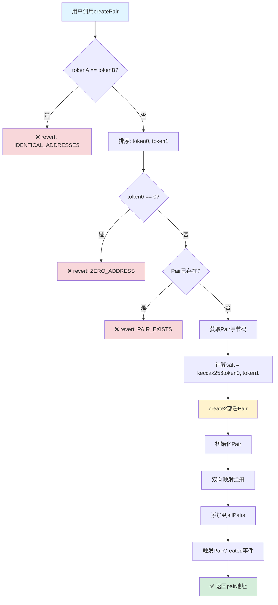
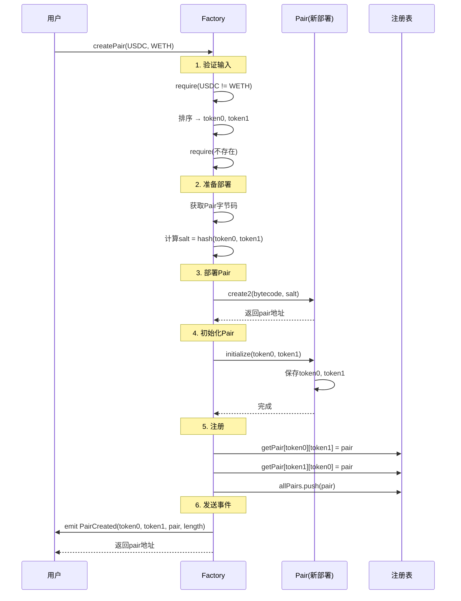
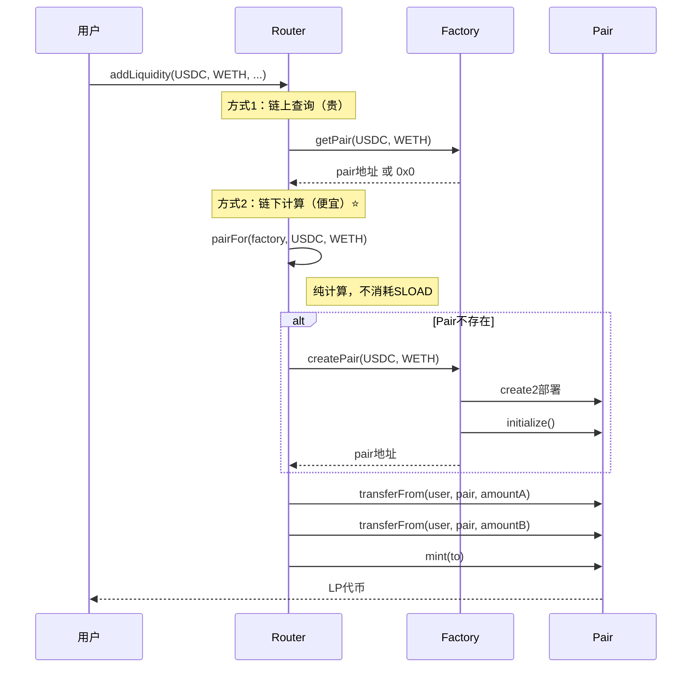
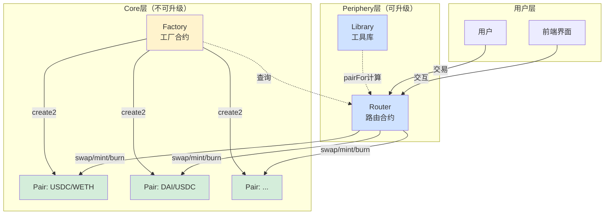

# UniswapV2Factory 核心源码深度解析

> 📖 **Factory是Uniswap V2的"造物主"**
> 
> 负责创建和管理所有交易对（Pair）
> 
> ⏱️ 预计学习时间：3-4小时

---

## 📚 目录

1. [合约概述](#1-合约概述)
2. [完整源码注释版](#2-完整源码注释版)
3. [核心功能：createPair](#3-核心功能createpair)
4. [create2深度解析](#4-create2深度解析)
5. [Pair地址计算（预测）](#5-pair地址计算预测)
6. [合约交互图](#6-合约交互图)
7. [Gas优化技巧](#7-gas优化技巧)
8. [安全机制](#8-安全机制)
9. [实战案例](#9-实战案例)

---

## 1. 合约概述

### 1.1 Factory的职责

```
UniswapV2Factory是V2的核心管理合约：

核心职责：
1. 🏭 创建新的Pair合约（使用create2）
2. 📋 维护所有Pair的注册表
3. 🔍 提供Pair地址查询
4. 💰 管理协议费配置
5. 🛡️ 确保每个代币对只有一个Pair

特点：
- 极简设计（<100行代码）
- 不可升级（去中心化）
- 任何人都可以创建Pair
- 使用create2实现地址预测
```

### 1.2 为什么需要Factory？

```
没有Factory的问题：
❌ 每个Pair都需要手动部署
❌ 无法统一管理
❌ 无法查询所有Pair
❌ 可能出现重复的Pair
❌ 无法预测Pair地址

有Factory的优势：
✅ 统一创建入口
✅ 自动去重（一个token对只有一个Pair）
✅ 全局注册表
✅ 可预测的Pair地址（create2）
✅ 统一的协议费管理
```

### 1.3 文件结构

```
UniswapV2Factory.sol
├── 状态变量
│   ├── feeTo (协议费接收者)
│   ├── feeToSetter (管理员)
│   ├── getPair (Pair地址映射)
│   └── allPairs (所有Pair数组)
├── 核心函数
│   ├── createPair() (创建Pair)
│   ├── setFeeTo() (设置费用)
│   └── setFeeToSetter() (设置管理员)
└── 查询函数
    └── allPairsLength() (Pair总数)
```

---

## 2. 完整源码注释版

```solidity
// SPDX-License-Identifier: MIT
pragma solidity =0.5.16;

import './interfaces/IUniswapV2Factory.sol';
import './UniswapV2Pair.sol';

/**
 * @title UniswapV2Factory
 * @notice Uniswap V2工厂合约
 * @dev 负责创建和管理所有交易对
 */
contract UniswapV2Factory is IUniswapV2Factory {
    
    // ==================== 状态变量 ====================
    
    /// @notice 协议费接收地址
    /// @dev 如果不为address(0)，则开启协议费
    address public feeTo;
    
    /// @notice 协议费设置者地址（管理员）
    /// @dev 只有这个地址可以修改feeTo和feeToSetter
    address public feeToSetter;

    /// @notice 获取两个代币的Pair地址
    /// @dev tokenA => tokenB => pair地址
    /// @dev 双向映射：getPair[tokenA][tokenB] = getPair[tokenB][tokenA]
    mapping(address => mapping(address => address)) public getPair;
    
    /// @notice 所有Pair的数组
    /// @dev 用于遍历所有Pair
    address[] public allPairs;

    // ==================== 事件 ====================
    
    /// @notice 创建新Pair时触发
    /// @dev indexed参数可以在链外高效过滤
    event PairCreated(
        address indexed token0,
        address indexed token1,
        address pair,
        uint
    );

    // ==================== 构造函数 ====================
    
    /// @notice 初始化Factory
    /// @param _feeToSetter 初始管理员地址
    constructor(address _feeToSetter) public {
        feeToSetter = _feeToSetter;
    }

    // ==================== 查询函数 ====================
    
    /// @notice 获取所有Pair的数量
    /// @return 当前已创建的Pair总数
    function allPairsLength() external view returns (uint) {
        return allPairs.length;
    }

    // ==================== 核心函数 ====================

    /// @notice 创建新的Pair
    /// @dev 任何人都可以调用
    /// @param tokenA 第一个代币地址
    /// @param tokenB 第二个代币地址
    /// @return pair 新创建的Pair地址
    function createPair(address tokenA, address tokenB) 
        external 
        returns (address pair) 
    {
        // ===== 步骤1：输入验证 =====
        
        // 检查：两个代币地址不能相同
        require(tokenA != tokenB, 'UniswapV2: IDENTICAL_ADDRESSES');
        
        // 排序：确保token0 < token1（地址数值小的在前）
        (address token0, address token1) = tokenA < tokenB 
            ? (tokenA, tokenB) 
            : (tokenB, tokenA);
        
        // 检查：token0不能是零地址
        require(token0 != address(0), 'UniswapV2: ZERO_ADDRESS');
        
        // 检查：该Pair不能已经存在
        require(getPair[token0][token1] == address(0), 'UniswapV2: PAIR_EXISTS');
        
        // ===== 步骤2：获取Pair创建字节码 =====
        
        // 获取UniswapV2Pair的字节码
        bytes memory bytecode = type(UniswapV2Pair).creationCode;
        
        // ===== 步骤3：计算salt（盐） =====
        
        // 使用两个token地址计算确定性的salt
        bytes32 salt = keccak256(abi.encodePacked(token0, token1));
        
        // ===== 步骤4：使用create2部署Pair =====
        
        // 内联汇编，使用create2操作码
        assembly {
            // create2(v, p, n, s)
            // v = 发送的ETH数量 (0)
            // p = 内存中字节码的起始位置
            // n = 字节码的长度
            // s = salt值
            pair := create2(0, add(bytecode, 32), mload(bytecode), salt)
        }
        
        // ===== 步骤5：初始化Pair =====
        
        // 调用Pair的initialize函数
        IUniswapV2Pair(pair).initialize(token0, token1);
        
        // ===== 步骤6：注册Pair =====
        
        // 双向映射：token0=>token1 和 token1=>token0 都指向同一个pair
        getPair[token0][token1] = pair;
        getPair[token1][token0] = pair;
        
        // 添加到数组
        allPairs.push(pair);
        
        // ===== 步骤7：触发事件 =====
        
        emit PairCreated(token0, token1, pair, allPairs.length);
    }

    // ==================== 管理函数 ====================

    /// @notice 设置协议费接收地址
    /// @dev 只能由feeToSetter调用
    /// @param _feeTo 新的接收地址
    function setFeeTo(address _feeTo) external {
        require(msg.sender == feeToSetter, 'UniswapV2: FORBIDDEN');
        feeTo = _feeTo;
    }

    /// @notice 设置管理员地址
    /// @dev 只能由当前feeToSetter调用
    /// @param _feeToSetter 新的管理员地址
    function setFeeToSetter(address _feeToSetter) external {
        require(msg.sender == feeToSetter, 'UniswapV2: FORBIDDEN');
        feeToSetter = _feeToSetter;
    }
}
```

---

## 3. 核心功能：createPair

### 3.1 函数流程图



### 3.2 关键步骤详解

#### 步骤1：代币排序

```solidity
(address token0, address token1) = tokenA < tokenB 
    ? (tokenA, tokenB) 
    : (tokenB, tokenA);
```

**为什么要排序？**

```
没有排序的问题：
- createPair(USDC, WETH) → Pair1
- createPair(WETH, USDC) → Pair2
- 两个相同的Pair！❌

排序的好处：
- 无论顺序如何，总是 token0 < token1
- createPair(USDC, WETH) → token0=USDC, token1=WETH
- createPair(WETH, USDC) → token0=USDC, token1=WETH
- 同一个Pair！✅

地址比较：
0x1111... < 0x2222...  (数值比较)
```

#### 步骤2：获取字节码

```solidity
bytes memory bytecode = type(UniswapV2Pair).creationCode;
```

**什么是creationCode？**

```
合约有两种字节码：

1. creationCode (创建字节码)
   - 包含构造函数
   - 用于部署合约
   - 执行后返回runtimeCode

2. runtimeCode (运行时字节码)
   - 不包含构造函数
   - 部署后存储在链上
   - 实际的合约逻辑

Factory使用creationCode来部署新的Pair
```

#### 步骤3：计算salt

```solidity
bytes32 salt = keccak256(abi.encodePacked(token0, token1));
```

**salt的作用：**

```
create2需要一个salt（盐值）
作用：让相同字节码可以部署到不同地址

例子：
salt1 = keccak256(USDC, WETH)
  → Pair地址1（固定）

salt2 = keccak256(WETH, DAI)
  → Pair地址2（固定）

关键：相同的salt会得到相同的地址！
```

#### 步骤4：create2部署

```solidity
assembly {
    pair := create2(0, add(bytecode, 32), mload(bytecode), salt)
}
```

**为什么用assembly（内联汇编）？**

```
Solidity 0.5没有原生的create2语法
需要用assembly调用create2操作码

create2(value, offset, size, salt)
- value: 发送的ETH（0）
- offset: 字节码在内存的位置
- size: 字节码的长度
- salt: 盐值

add(bytecode, 32): 跳过前32字节（长度前缀）
mload(bytecode): 读取字节码长度
```

#### 步骤5：双向映射

```solidity
getPair[token0][token1] = pair;
getPair[token1][token0] = pair;
```

**为什么双向映射？**

```
用户可能用任意顺序查询：

// 两种查询都应该返回同一个Pair
getPair[USDC][WETH]  → 0xPair123...
getPair[WETH][USDC]  → 0xPair123...

双向映射让查询更方便！
```

---

## 4. create2深度解析

### 4.1 create vs create2

```
传统create:
- 地址 = hash(sender地址, nonce)
- 不可预测（nonce会变）
- 每次部署地址不同

create2:
- 地址 = hash(0xFF, sender地址, salt, bytecode_hash)
- 完全确定性
- 相同参数 = 相同地址
```

### 4.2 create2地址计算公式

```
Pair地址 = keccak256(
    0xFF,                              // 固定前缀
    factory地址,                       // Factory合约地址
    keccak256(token0, token1),        // salt
    keccak256(Pair_creationCode)      // Pair字节码哈希
)[12:]  // 取后20字节
```

**完整计算流程：**

```solidity
address pair = address(uint160(uint256(keccak256(abi.encodePacked(
    bytes1(0xff),
    factoryAddress,
    keccak256(abi.encodePacked(token0, token1)),  // salt
    keccak256(type(UniswapV2Pair).creationCode)   // initCodeHash
)))));
```

### 4.3 为什么Uniswap V2使用create2？

```
优势1：地址可预测 ⭐⭐⭐⭐⭐
- 不需要链上查询就能知道Pair地址
- Router可以离线计算地址
- 节省Gas（不需要先查询）

优势2：跨链一致性 ⭐⭐⭐⭐
- 同样的token对，在不同链上地址相同
- 方便跨链应用

优势3：安全性 ⭐⭐⭐⭐
- 地址与代码绑定
- 无法伪造Pair合约

优势4：Gas优化 ⭐⭐⭐
- Router不需要调用getPair查询
- 直接计算地址，节省SLOAD
```

### 4.4 create2实战例子

```solidity
// ===== 链上部署（Factory） =====
function createPair(address tokenA, address tokenB) returns (address pair) {
    (address token0, address token1) = tokenA < tokenB 
        ? (tokenA, tokenB) 
        : (tokenB, tokenA);
    
    bytes32 salt = keccak256(abi.encodePacked(token0, token1));
    
    assembly {
        pair := create2(0, add(bytecode, 32), mload(bytecode), salt)
    }
}

// ===== 链下计算（Router/前端） =====
function pairFor(
    address factory,
    address tokenA,
    address tokenB
) internal pure returns (address pair) {
    (address token0, address token1) = tokenA < tokenB 
        ? (tokenA, tokenB) 
        : (tokenB, tokenA);
    
    pair = address(uint160(uint256(keccak256(abi.encodePacked(
        hex'ff',
        factory,
        keccak256(abi.encodePacked(token0, token1)),
        hex'96e8ac4277198ff8b6f785478aa9a39f403cb768dd02cbee326c3e7da348845f' // init code hash
    )))));
}

// ===== 验证 =====
// 链上地址 == 链下计算地址 ✅
```

### 4.5 init code hash的计算

```solidity
// 部署Factory前，需要先计算init code hash
bytes32 initCodeHash = keccak256(type(UniswapV2Pair).creationCode);

// Uniswap V2主网的init code hash:
// 0x96e8ac4277198ff8b6f785478aa9a39f403cb768dd02cbee326c3e7da348845f

// 注意：
// 1. 不同的Solidity版本会生成不同的字节码
// 2. init code hash必须与实际部署的Pair字节码匹配
// 3. 如果Pair合约改变，hash也会改变
```

---

## 5. Pair地址计算（预测）

### 5.1 UniswapV2Library中的pairFor函数

```solidity
library UniswapV2Library {
    // 计算Pair地址（不需要链上查询）
    function pairFor(
        address factory,
        address tokenA,
        address tokenB
    ) internal pure returns (address pair) {
        (address token0, address token1) = sortTokens(tokenA, tokenB);
        pair = address(uint160(uint256(keccak256(abi.encodePacked(
            hex'ff',
            factory,
            keccak256(abi.encodePacked(token0, token1)),
            hex'96e8ac4277198ff8b6f785478aa9a39f403cb768dd02cbee326c3e7da348845f'
        )))));
    }
    
    // 排序函数
    function sortTokens(
        address tokenA,
        address tokenB
    ) internal pure returns (address token0, address token1) {
        require(tokenA != tokenB, 'IDENTICAL_ADDRESSES');
        (token0, token1) = tokenA < tokenB ? (tokenA, tokenB) : (tokenB, tokenA);
        require(token0 != address(0), 'ZERO_ADDRESS');
    }
}
```

### 5.2 使用场景

```solidity
// ===== 传统方式：需要2次调用 =====
address pair = factory.getPair(tokenA, tokenB);  // SLOAD (昂贵)
uint reserves = IUniswapV2Pair(pair).getReserves();

// ===== create2方式：只需1次调用 =====
address pair = UniswapV2Library.pairFor(factory, tokenA, tokenB);  // 纯计算（便宜）
uint reserves = IUniswapV2Pair(pair).getReserves();

// Gas节省：约2100 Gas（一次SLOAD）
```

---

## 6. 合约交互图

### 6.1 创建Pair完整流程



### 6.2 Router使用Factory创建/查询Pair



### 6.3 Factory、Pair、Router三者关系



---

## 7. Gas优化技巧

### 7.1 优化1：使用create2预计算地址

**传统方式（贵）：**

```solidity
// 需要1次SLOAD（2100 Gas）
address pair = factory.getPair(tokenA, tokenB);
```

**优化方式（便宜）：**

```solidity
// 纯计算（几乎免费）
address pair = UniswapV2Library.pairFor(factory, tokenA, tokenB);
```

**Gas节省：约2100 Gas/次查询**

### 7.2 优化2：双向映射

```solidity
getPair[token0][token1] = pair;
getPair[token1][token0] = pair;  // 多花2100 Gas创建时

// 但查询时不需要排序：
function getPair(address tokenA, address tokenB) public view returns (address) {
    return getPair[tokenA][tokenB];  // 直接返回，不需要if判断
}
```

**权衡：**
- 创建时多花：2100 Gas（1次SSTORE）
- 查询时节省：200 Gas（避免排序判断）
- 由于查询频率 >> 创建频率，总体节省！

### 7.3 优化3：内联汇编使用create2

```solidity
// Solidity 0.8+可以直接用：
pair = new UniswapV2Pair{salt: salt}();

// 但V2用0.5，只能用assembly：
assembly {
    pair := create2(0, add(bytecode, 32), mload(bytecode), salt)
}
```

**为什么用assembly？**
- Solidity 0.5没有原生create2语法
- assembly更接近底层，Gas更优化
- 完全控制内存布局

### 7.4 优化4：事件indexed参数

```solidity
event PairCreated(
    address indexed token0,   // indexed：可以高效过滤
    address indexed token1,   // indexed：可以高效过滤
    address pair,             // 不indexed：节省Gas
    uint                      // 不indexed：节省Gas
);
```

**indexed的作用：**
```
indexed参数：
- 存储在日志的topics中
- 可以用于高效过滤
- 每个indexed参数额外消耗约375 Gas

不indexed参数：
- 存储在日志的data中
- 不能过滤，但便宜

V2选择：
- token0, token1 indexed → 方便查询特定token的Pair
- pair, length 不indexed → 节省Gas
```

### 7.5 Gas对比表

| 操作 | 传统方式 | V2优化方式 | 节省 |
|------|----------|------------|------|
| 查询Pair地址 | `factory.getPair()` (2100) | `pairFor()` (200) | 1900 Gas |
| 创建Pair | `new Pair()` (~250k) | `create2` (~245k) | 5k Gas |
| 双向映射查询 | 排序+查询 (2300) | 直接查询 (2100) | 200 Gas |

---

## 8. 安全机制

### 8.1 防止重复创建

```solidity
require(getPair[token0][token1] == address(0), 'UniswapV2: PAIR_EXISTS');
```

**为什么需要？**

```
没有检查的后果：
1. createPair(USDC, WETH) → Pair1
2. createPair(USDC, WETH) → Pair2
3. 流动性分散！❌
4. 价格不统一！❌

有检查的好处：
1. 每个token对只有一个Pair
2. 流动性集中
3. 价格发现更高效
```

### 8.2 代币排序

```solidity
(address token0, address token1) = tokenA < tokenB 
    ? (tokenA, tokenB) 
    : (tokenB, tokenA);
```

**安全性：**

```
防止创建重复Pair：
createPair(A, B) → 排序后 (A, B) → Pair1
createPair(B, A) → 排序后 (A, B) → 已存在！

确保一致性：
getPair[A][B] = pair
getPair[B][A] = pair
两个映射指向同一个Pair
```

### 8.3 零地址检查

```solidity
require(token0 != address(0), 'UniswapV2: ZERO_ADDRESS');
```

**为什么检查token0就够了？**

```
因为已经排序了：
- token0 < token1
- 如果token0 != 0，那么token1也必然 != 0
- 只需要检查一次！
```

### 8.4 权限控制

```solidity
function setFeeTo(address _feeTo) external {
    require(msg.sender == feeToSetter, 'UniswapV2: FORBIDDEN');
    feeTo = _feeTo;
}
```

**去中心化vs管理：**

```
Factory的权限设计：
✅ 任何人都可以创建Pair（无需许可）
✅ 不可升级（去中心化）
❌ 只有feeToSetter可以设置费用（中心化）

权衡：
- 创建Pair无需许可 → 去中心化
- 协议费需要治理 → 轻度中心化
- 后期可以转移给DAO → 逐步去中心化
```

---

## 9. 实战案例

### 9.1 案例1：创建新Pair

```solidity
// SPDX-License-Identifier: MIT
pragma solidity ^0.8.0;

interface IUniswapV2Factory {
    function createPair(address tokenA, address tokenB) 
        external 
        returns (address pair);
}

contract PairCreator {
    address constant FACTORY = 0x5C69bEe701ef814a2B6a3EDD4B1652CB9cc5aA6f;
    
    function createUSDCWETHPair() external returns (address) {
        address USDC = 0xA0b86991c6218b36c1d19D4a2e9Eb0cE3606eB48;
        address WETH = 0xC02aaA39b223FE8D0A0e5C4F27eAD9083C756Cc2;
        
        address pair = IUniswapV2Factory(FACTORY).createPair(USDC, WETH);
        
        // pair现在可以用于添加流动性
        return pair;
    }
}
```

### 9.2 案例2：链下计算Pair地址

```javascript
const { ethers } = require('ethers');

// 配置
const FACTORY = '0x5C69bEe701ef814a2B6a3EDD4B1652CB9cc5aA6f';
const INIT_CODE_HASH = '0x96e8ac4277198ff8b6f785478aa9a39f403cb768dd02cbee326c3e7da348845f';

// 计算Pair地址
function computePairAddress(tokenA, tokenB) {
    // 排序
    const [token0, token1] = tokenA.toLowerCase() < tokenB.toLowerCase()
        ? [tokenA, tokenB]
        : [tokenB, tokenA];
    
    // 计算salt
    const salt = ethers.utils.keccak256(
        ethers.utils.solidityPack(['address', 'address'], [token0, token1])
    );
    
    // 计算地址
    const pair = ethers.utils.getCreate2Address(
        FACTORY,
        salt,
        INIT_CODE_HASH
    );
    
    return pair;
}

// 使用
const USDC = '0xA0b86991c6218b36c1d19D4a2e9Eb0cE3606eB48';
const WETH = '0xC02aaA39b223FE8D0A0e5C4F27eAD9083C756Cc2';

const pairAddress = computePairAddress(USDC, WETH);
console.log('Pair地址:', pairAddress);
// 输出: 0xB4e16d0168e52d35CaCD2c6185b44281Ec28C9Dc
```

### 9.3 案例3：批量查询所有Pair

```solidity
contract PairExplorer {
    IUniswapV2Factory factory;
    
    constructor(address _factory) {
        factory = IUniswapV2Factory(_factory);
    }
    
    // 获取所有Pair地址
    function getAllPairs() external view returns (address[] memory) {
        uint length = factory.allPairsLength();
        address[] memory pairs = new address[](length);
        
        for (uint i = 0; i < length; i++) {
            pairs[i] = factory.allPairs(i);
        }
        
        return pairs;
    }
    
    // 分页查询（Gas优化）
    function getPairsPaginated(uint start, uint limit) 
        external 
        view 
        returns (address[] memory) 
    {
        uint length = factory.allPairsLength();
        uint end = start + limit > length ? length : start + limit;
        uint resultLength = end - start;
        
        address[] memory pairs = new address[](resultLength);
        
        for (uint i = 0; i < resultLength; i++) {
            pairs[i] = factory.allPairs(start + i);
        }
        
        return pairs;
    }
}
```

### 9.4 案例4：监听Pair创建事件

```javascript
const { ethers } = require('ethers');

const provider = new ethers.providers.JsonRpcProvider(RPC_URL);
const factory = new ethers.Contract(FACTORY_ADDRESS, FACTORY_ABI, provider);

// 监听PairCreated事件
factory.on('PairCreated', (token0, token1, pair, pairIndex) => {
    console.log('新Pair创建:');
    console.log('  Token0:', token0);
    console.log('  Token1:', token1);
    console.log('  Pair:', pair);
    console.log('  索引:', pairIndex.toString());
});

// 查询历史事件
async function getHistoricalPairs() {
    const filter = factory.filters.PairCreated();
    const events = await factory.queryFilter(filter, 0, 'latest');
    
    events.forEach(event => {
        console.log('历史Pair:', {
            token0: event.args.token0,
            token1: event.args.token1,
            pair: event.args.pair,
            index: event.args[3].toString()
        });
    });
}
```

---

## ✅ 学习检查清单

### Level 1：基础理解
- [ ] 理解Factory的职责
- [ ] 知道createPair的流程
- [ ] 理解代币排序的作用
- [ ] 知道双向映射的用途

### Level 2：深入掌握
- [ ] 理解create2的工作原理
- [ ] 能计算Pair地址
- [ ] 理解init code hash
- [ ] 知道为什么使用create2

### Level 3：融会贯通
- [ ] 能解释所有Gas优化技巧
- [ ] 理解Factory/Pair/Router交互
- [ ] 能实现链下地址计算
- [ ] 掌握create2的安全性

---

## 🎓 总结

Factory合约是Uniswap V2的核心：

```
核心特性：
✅ 使用create2实现地址预测
✅ 极简设计（<100行代码）
✅ 任何人都可以创建Pair
✅ 一个token对只有一个Pair

设计亮点：
✅ create2节省Gas（无需链上查询）
✅ 双向映射方便查询
✅ 代币排序防止重复
✅ 事件indexed优化过滤

Gas优化：
✅ pairFor比getPair节省2100 Gas
✅ 双向映射避免排序判断
✅ assembly优化create2
✅ indexed参数精心选择

这是工业级的Factory设计！⭐⭐⭐⭐⭐
```

**下一步** → `03-UniswapV2Router源码/`

在那里你将学习Router如何使用Factory和Pair！💪🚀

---

## 📚 扩展阅读

- [EIP-1014: CREATE2](https://eips.ethereum.org/EIPS/eip-1014)
- [Uniswap V2 Whitepaper](https://uniswap.org/whitepaper.pdf)
- [Uniswap V2 Core Source Code](https://github.com/Uniswap/v2-core)
- [Understanding CREATE2](https://docs.openzeppelin.com/cli/2.8/deploying-with-create2)
