# UniswapV2Router02 核心源码深度解析

> 📖 **Periphery层的核心：用户友好的交易接口**
> 
> Router是用户与Uniswap交互的门户，学习Router = 学习如何构建优秀的用户接口
> 
> ⏱️ 预计学习时间：6-8小时
> 🎯 学习重点：安全检查 + Gas优化 + 设计模式

---

## 📚 目录

1. [Router概述与架构](#1-router概述与架构)
2. [Router01 vs Router02演进](#2-router01-vs-router02演进)
3. [Router完整源码结构](#3-router完整源码结构)
4. [核心功能深度解析](#4-核心功能深度解析)
5. [路径计算与多跳交易](#5-路径计算与多跳交易)
6. [安全机制深度剖析](#6-安全机制深度剖析)
7. [Gas优化技巧](#7-gas优化技巧)
8. [设计模式分析](#8-设计模式分析)
9. [审计要点与最佳实践](#9-审计要点与最佳实践)
10. [实战案例](#10-实战案例)

---

## 1. Router概述与架构

### 1.1 Router的定位

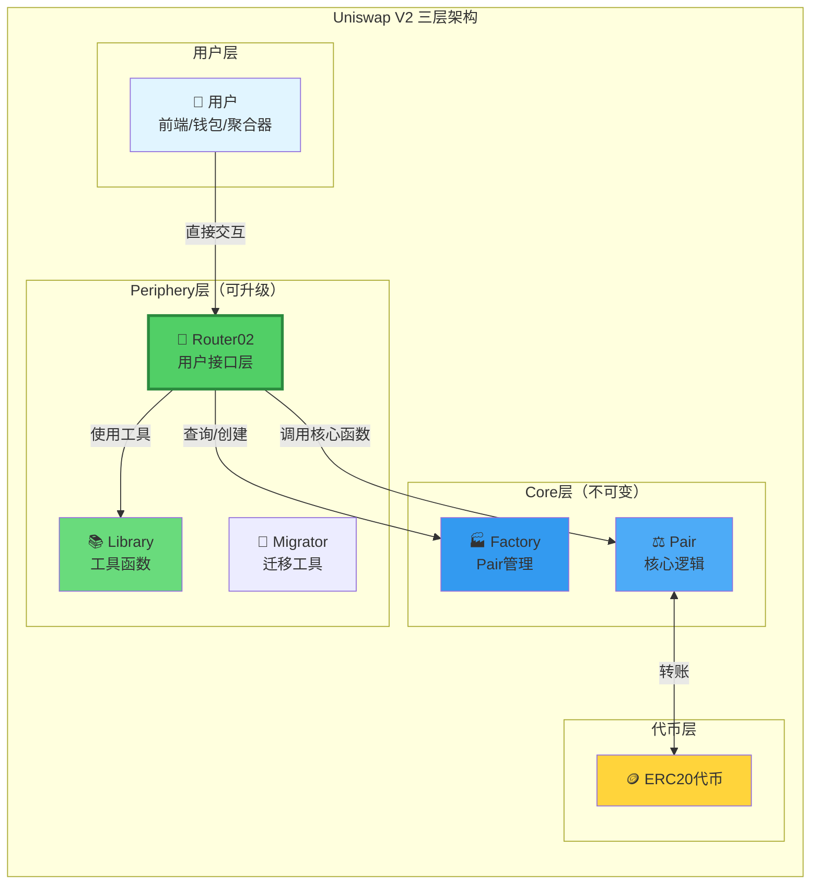

**Router的角色：**

```
Router = Periphery层的核心合约

职责：
1. 🎯 提供用户友好的接口
   - 支持ETH（自动wrap/unwrap）
   - 支持多跳路由
   - 参数简化

2. 🛡️ 实施安全检查
   - 滑点保护（amountMin/amountMax）
   - 截止时间（deadline）
   - 路径验证

3. 🧮 计算最优路径
   - 单跳 vs 多跳
   - 输入精确 vs 输出精确
   - Gas优化路径

4. ⚡ 优化用户体验
   - 一键操作
   - 批量交易
   - 错误友好

特点：
✅ 可以升级（发现bug可以部署新版）
✅ 不持有用户资金（安全）
✅ 无需许可（任何人可调用）
```

### 1.2 Router合约全景

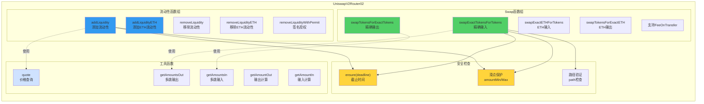

**函数分类统计：**

| 分类 | 数量 | 主要函数 |
|------|------|---------|
| **Swap函数** | 8个 | swapExact..., swapTokensFor... |
| **流动性函数** | 6个 | addLiquidity, removeLiquidity |
| **查询函数** | 5个 | quote, getAmountOut, getAmountsOut |
| **辅助函数** | 若干 | ensure, _addLiquidity, _swap |

---

## 2. Router01 vs Router02演进

### 2.1 为什么有Router02？

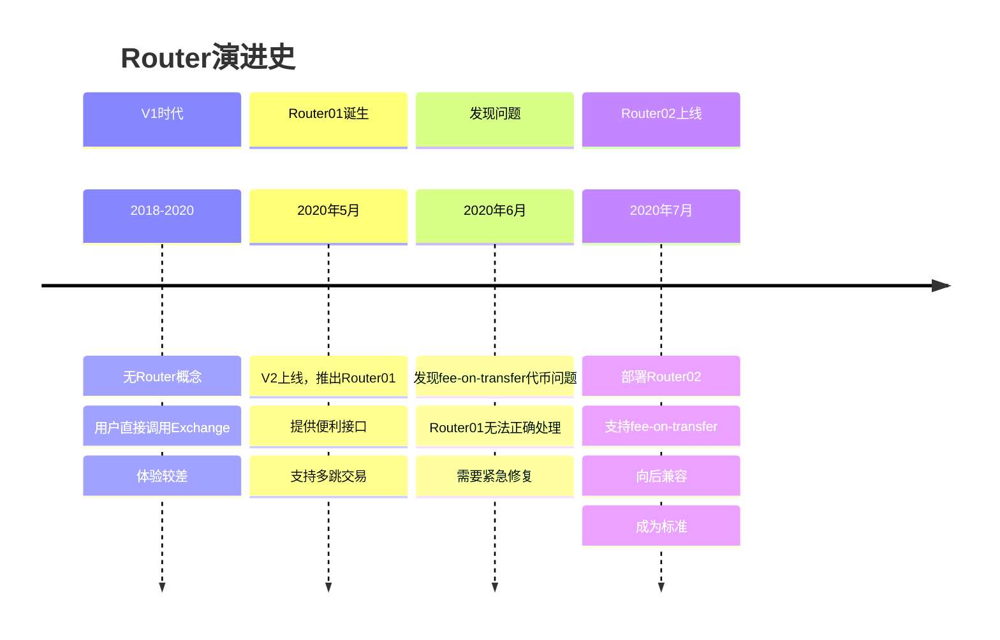

### 2.2 Router01的问题

```
问题：无法处理fee-on-transfer代币

fee-on-transfer代币：
- 转账时自动扣除一定比例作为手续费
- 例如：PAXG, STA等

场景：
用户用PAXG（2%转账费）swap
1. 用户授权100 PAXG
2. Router01期望收到100 PAXG
3. 实际到账：98 PAXG（扣了2%）
4. 计算的amountOut基于100
5. Pair.swap要求的输入不足
6. 交易失败！❌

Router01假设：
transferFrom(user, pair, amount)
→ Pair实际收到 = amount

但fee-on-transfer代币：
transferFrom(user, pair, 100)
→ Pair实际收到 = 98

检查失败！
```

### 2.3 Router02的改进

```mermaid
graph TB
    subgraph "Router01（旧版）"
        R1A["1. 计算amountOut<br/>基于用户输入"]
        R1B["2. transferFrom<br/>假设全额到账"]
        R1C["3. Pair.swap<br/>要求输入=计算值"]
        R1D["❌ fee-on-transfer<br/>代币会失败"]
    end
    
    subgraph "Router02（新版）"
        R2A["1. 检查Pair余额前"]
        R2B["2. transferFrom<br/>转账代币"]
        R2C["3. 检查Pair余额后"]
        R2D["4. 计算实际到账<br/>= 余额差"]
        R2E["5. Pair.swap<br/>基于实际到账"]
        R2F["✅ 支持任何代币"]
    end
    
    R1A --> R1B
    R1B --> R1C
    R1C --> R1D
    
    R2A --> R2B
    R2B --> R2C
    R2C --> R2D
    R2D --> R2E
    R2E --> R2F
    
    style R1D fill:#f8d7da
    style R2F fill:#d4edda,stroke:#155724,stroke-width:3px
```

**对比表：**

| 特性 | Router01 | Router02 | 改进 |
|------|----------|----------|------|
| **支持普通ERC20** | ✅ | ✅ | - |
| **支持fee-on-transfer** | ❌ | ✅ | 新增 ⭐ |
| **专用函数** | 无 | `Supporting...` | 新增 |
| **向后兼容** | - | ✅ | 保持 |
| **代码量** | ~600行 | ~650行 | +8% |

转账收税”代币（Fee-on-Transfer Tokens）是一种特殊的 ERC20 代币。

它的核心机制是：**在你（发送方）`transfer` (转账) 代币时，合约会自动从你发送的金额中“抽取”一部分作为“税费”，导致接收方收到的代币数量 \*少于\* 你发送的数量。**

这与“Gas 费”是完全不同的两个概念：

- **Gas 费：** 你用 ETH 支付给以太坊网络的“矿工费”，用于处理你的交易。
- **转账税：** 代币**合约内部**的规则，从你转账的**代币本身**中扣除一部分。

**它是如何工作的？**

标准的 ERC20 代币，transfer (转账) 函数的逻辑是：

"你发送 100 个，接收方就收到 100 个"

而“转账收税”代币会修改这个 transfer 函数的内部逻辑：

"你发送 100 个，合约先扣下 1% (即 1 个)，所以接收方最终只收到 99 个"

**为什么要有这种“税”？**

这种“税费”通常有几种不同的用途，这是项目方设计的一种经济模型：

1. **持币分红 (Reflections):** 最常见的一种。合约会把扣下的 1% 税费，**自动按比例**分发给**所有**其他的持币人。这意味着，你只要“持有”这种代币，你的钱包余额就会因为别人的交易而自动增加。
2. **自动销毁 (Burn):** 合约把扣下的税费发送到“零地址”(address(0))，从而永久销毁它们。这会减少代币的总供应量，制造通缩。
3. **项目金库 (Treasury):** 合约把税费发送到一个特定的“开发钱包”或“营销钱包”，用于支持项目（发工资、做广告等）。
4. **自动添加流动性：** 一些更复杂的代币会把税费（比如 5%）自动卖成 ETH，然后和另一半代币一起重新注入到 Uniswap 流动性池中。

**为什么它对 Uniswap V2 很重要？**

这正是我们之前讨论 `Router01` 和 `Router02` 区别的核心：

- **`Router01` (已弃用):** 它假设“发送 100 个 = 收到 100 个”。当它试图用一个“转账收税”代币去 `swap` (兑换) 时，它会告诉 `Pair` 合约：“我给你发送了 100 个代币”。但由于有“税”，`Pair` 合约**实际上**只收到了 99 个。当 `Pair` 合约在最后检查 $k$ 值时，发现账目对不上（`100 != 99`），交易就会失败 (`revert`)。
- **`Router02` (标准):** 它通过引入**新的、专门的函数**（比如 `...SupportingFeeOnTransferTokens`）解决了这个问题。这些新函数不会依赖*输入*的数量，而是会**在转账后**去检查 `Pair` 合约**“实际收到了多少”**（比如 99 个），并使用这个**真实**的数字来完成后续的 $k$ 值计算，从而使交易可以成功。

**新增函数：**

```solidity
// Router02新增的专用函数
function swapExactTokensForTokensSupportingFeeOnTransferTokens(
    uint amountIn,
    uint amountOutMin,
    address[] calldata path,
    address to,
    uint deadline
) external;

function swapExactETHForTokensSupportingFeeOnTransferTokens(
    uint amountOutMin,
    address[] calldata path,
    address to,
    uint deadline
) external payable;

function swapExactTokensForETHSupportingFeeOnTransferTokens(
    uint amountIn,
    uint amountOutMin,
    address[] calldata path,
    address to,
    uint deadline
) external;
```

**关键差异：**

```solidity
// Router01（旧）
function _swap(uint[] memory amounts, address[] memory path, address _to) internal {
    for (uint i; i < path.length - 1; i++) {
        (address input, address output) = (path[i], path[i + 1]);
        (address token0,) = UniswapV2Library.sortTokens(input, output);
        uint amountOut = amounts[i + 1];
        // ... 直接使用计算的amounts
    }
}

// Router02（新）
function _swapSupportingFeeOnTransferTokens(address[] memory path, address _to) internal {
    for (uint i; i < path.length - 1; i++) {
        (address input, address output) = (path[i], path[i + 1]);
        (address token0,) = UniswapV2Library.sortTokens(input, output);
        IUniswapV2Pair pair = IUniswapV2Pair(UniswapV2Library.pairFor(factory, input, output));
        uint amountInput;
        uint amountOutput;
        {
            // ⭐ 关键：检查余额变化，而不是使用预计算的amounts
            (uint reserve0, uint reserve1,) = pair.getReserves();
            (uint reserveInput, uint reserveOutput) = input == token0 ? (reserve0, reserve1) : (reserve1, reserve0);
            amountInput = IERC20(input).balanceOf(address(pair)).sub(reserveInput);
            amountOutput = UniswapV2Library.getAmountOut(amountInput, reserveInput, reserveOutput);
        }
        // ... 基于实际余额变化
    }
}
```

---

## 3. Router完整源码结构

### 3.1 继承关系

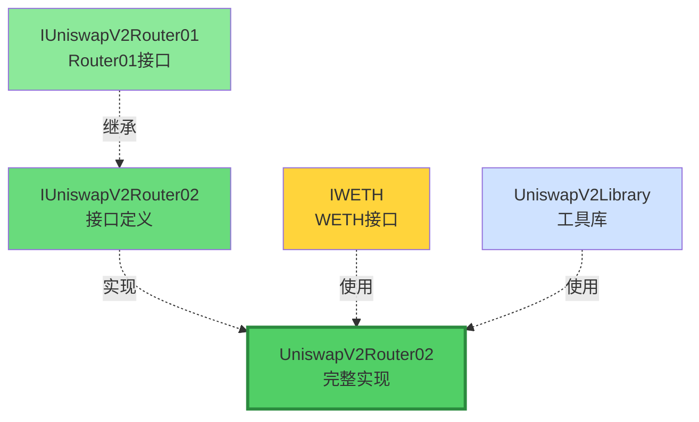

**Router02继承结构：**

```
IUniswapV2Router02 (接口)
├── 继承 IUniswapV2Router01
│   ├── Router01的所有函数
│   └── 向后兼容
└── 新增函数
    ├── ...SupportingFeeOnTransferTokens
    └── 处理特殊代币

UniswapV2Router02 (实现)
├── 实现 IUniswapV2Router02
├── 使用 UniswapV2Library（工具函数）
└── 使用 IWETH（ETH包装）
```

### 3.2 Router02文件结构

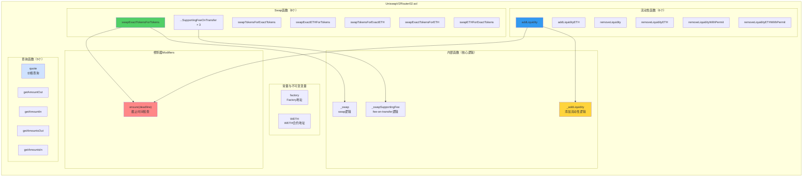

---

## 4. 核心功能深度解析

### 4.1 Swap函数：swapExactTokensForTokens

这是最常用的swap函数！

```solidity
/**
 * @notice 用精确数量的代币A换取尽可能多的代币B
 * @param amountIn 输入代币数量（精确）
 * @param amountOutMin 最小输出代币数量（滑点保护）
 * @param path 交易路径 [tokenA, tokenB] 或 [tokenA, tokenX, tokenB]
 * @param to 接收地址
 * @param deadline 截止时间
 * @return amounts 每一跳的实际数量
 */
function swapExactTokensForTokens(
    uint amountIn,
    uint amountOutMin,
    address[] calldata path,
    address to,
    uint deadline
) external 
  ensure(deadline)  // 修饰器：检查截止时间
  returns (uint[] memory amounts) 
{
    // ===== 步骤1：计算每一跳的输出量 =====
    amounts = UniswapV2Library.getAmountsOut(factory, amountIn, path);
    
    // ===== 步骤2：滑点保护 =====
    require(
        amounts[amounts.length - 1] >= amountOutMin, 
        'UniswapV2Router: INSUFFICIENT_OUTPUT_AMOUNT'
    );
    
    // ===== 步骤3：转入第一跳的输入代币 =====
    TransferHelper.safeTransferFrom(
        path[0],                                      // 输入代币
        msg.sender,                                   // 从用户
        UniswapV2Library.pairFor(factory, path[0], path[1]),  // 到第一个Pair
        amounts[0]                                    // 输入数量
    );
    
    // ===== 步骤4：执行swap =====
    _swap(amounts, path, to);
}
```

**执行流程可视化：**

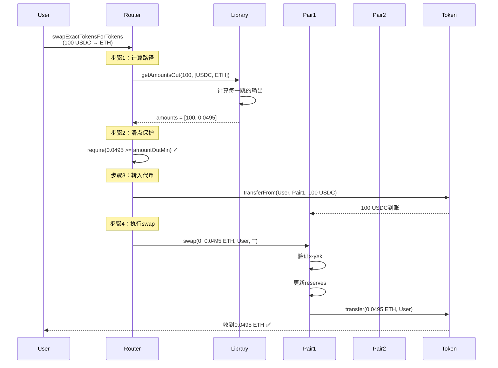

### 4.2 内部函数：_swap

```solidity
function _swap(
    uint[] memory amounts, 
    address[] memory path, 
    address _to
) internal virtual {
    for (uint i; i < path.length - 1; i++) {
        (address input, address output) = (path[i], path[i + 1]);
        (address token0,) = UniswapV2Library.sortTokens(input, output);
        uint amountOut = amounts[i + 1];
        
        // 计算amount0Out和amount1Out
        (uint amount0Out, uint amount1Out) = input == token0 
            ? (uint(0), amountOut) 
            : (amountOut, uint(0));
        
        // 确定下一跳的接收地址
        address to = i < path.length - 2 
            ? UniswapV2Library.pairFor(factory, output, path[i + 2])  // 下一个Pair
            : _to;  // 最后一跳，发给用户
        
        // 调用Pair.swap
        IUniswapV2Pair(
            UniswapV2Library.pairFor(factory, input, output)
        ).swap(amount0Out, amount1Out, to, new bytes(0));
    }
}
```

**多跳交易流程：**

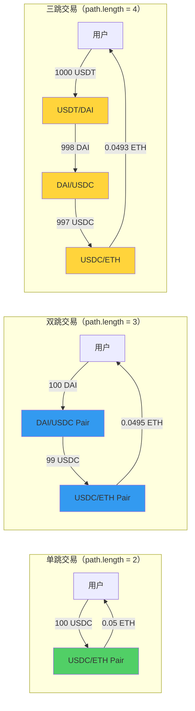

---

## 5. 路径计算与多跳交易

### 5.1 路径的概念

```
路径 = 从输入代币到输出代币的交换序列

单跳路径：
[USDC, ETH]
├─ 1个Pair：USDC/ETH
└─ 0.3%手续费

双跳路径：
[DAI, USDC, ETH]
├─ 2个Pair：DAI/USDC, USDC/ETH
└─ 0.6%手续费（两次）

三跳路径：
[USDT, DAI, USDC, ETH]
├─ 3个Pair
└─ 0.9%手续费（三次）

最多支持：任意长度路径
实际限制：Gas限制
推荐：≤3跳
```

**路径选择策略：**

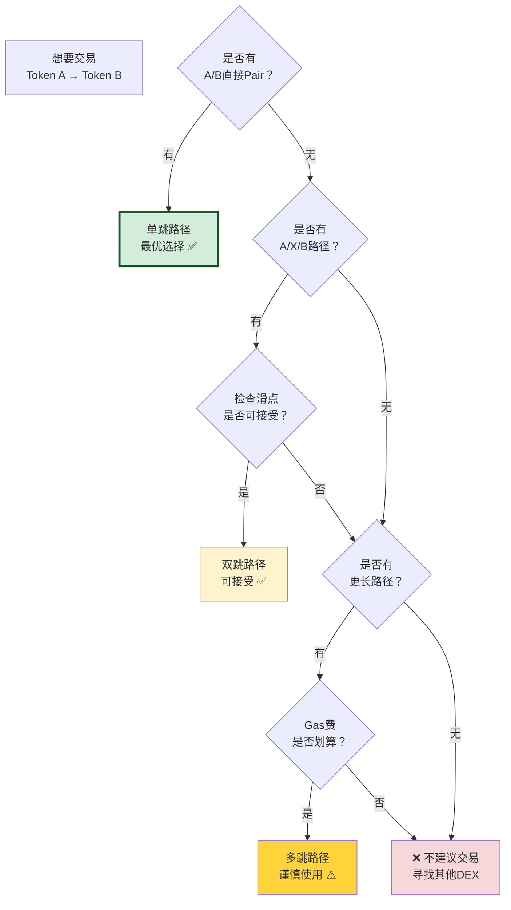

### 5.2 getAmountsOut：计算多跳输出

```solidity
function getAmountsOut(
    uint amountIn, 
    address[] memory path
) public view returns (uint[] memory amounts) {
    require(path.length >= 2, 'UniswapV2Library: INVALID_PATH');
    
    amounts = new uint[](path.length);
    amounts[0] = amountIn;
    
    for (uint i; i < path.length - 1; i++) {
        (uint reserveIn, uint reserveOut) = getReserves(
            factory, 
            path[i], 
            path[i + 1]
        );
        
        amounts[i + 1] = getAmountOut(
            amounts[i],      // 当前输入
            reserveIn,       // 输入代币储备
            reserveOut       // 输出代币储备
        );
    }
}
```

**计算流程可视化：**

```mermaid
graph LR
    subgraph "输入"
        In["amountIn = 1000<br/>path = [DAI, USDC, ETH]"]
    end
    
    subgraph "第1跳：DAI → USDC"
        H1A["获取DAI/USDC储备<br/>reserveDAI, reserveUSDC"]
        H1B["计算输出<br/>amountOut = getAmountOut<br/>(1000, reserveDAI, reserveUSDC)"]
        H1C["结果：amounts[1] = 998 USDC"]
    end
    
    subgraph "第2跳：USDC → ETH"
        H2A["获取USDC/ETH储备<br/>reserveUSDC, reserveETH"]
        H2B["计算输出<br/>amountOut = getAmountOut<br/>(998, reserveUSDC, reserveETH)"]
        H2C["结果：amounts[2] = 0.495 ETH"]
    end
    
    subgraph "输出"
        Out["amounts = [1000, 998, 0.495]<br/>最终得到：0.495 ETH"]
    end
    
    In --> H1A
    H1A --> H1B
    H1B --> H1C
    H1C --> H2A
    H2A --> H2B
    H2B --> H2C
    H2C --> Out
    
    style In fill:#e1f5ff
    style H1C fill:#d4edda
    style H2C fill:#d4edda
    style Out fill:#51cf66,stroke:#2b8a3e,stroke-width:3px
```

---

## 6. 安全机制深度剖析

### 6.1 安全检查全景

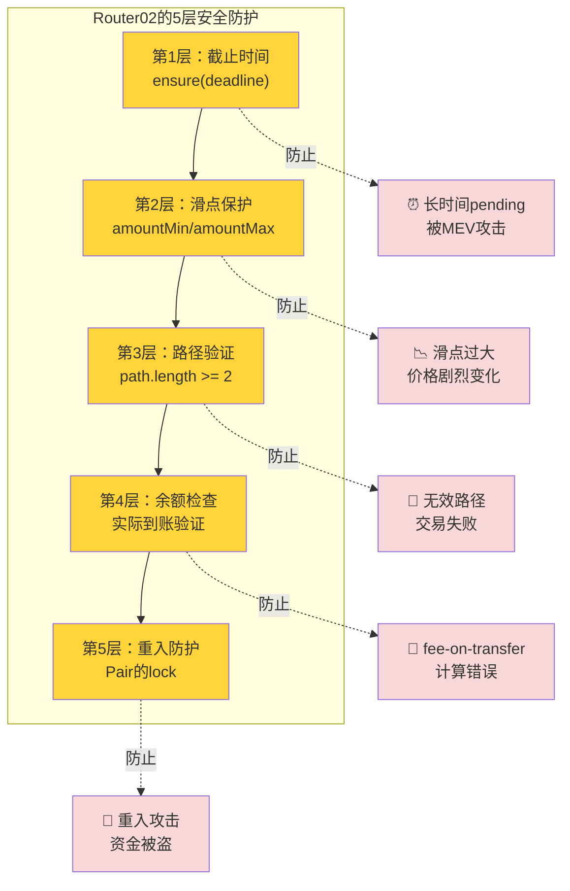

### 6.2 截止时间检查（Deadline）

```solidity
modifier ensure(uint deadline) {
    require(deadline >= block.timestamp, 'UniswapV2Router: EXPIRED');
    _;
}
```

**为什么需要？**

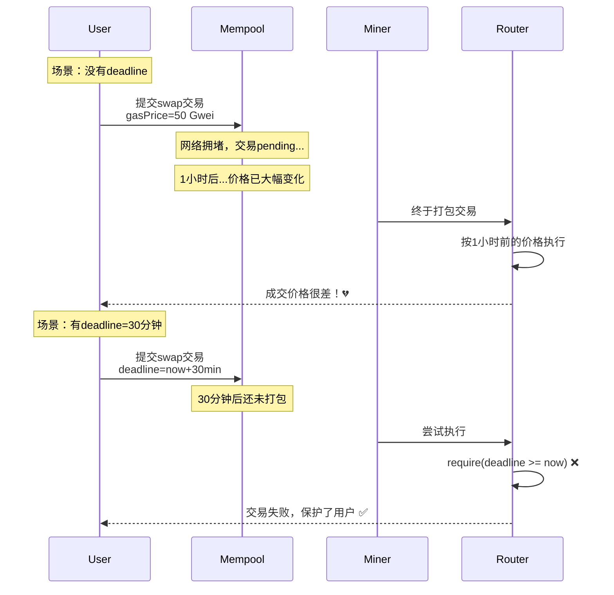

**最佳实践：**

```javascript
// ❌ 错误：deadline设置太长
const deadline = Math.floor(Date.now() / 1000) + 86400;  // 24小时

// ✅ 推荐：合理的deadline
const deadline = Math.floor(Date.now() / 1000) + 1200;   // 20分钟

// ✅ 激进：短deadline（快速交易）
const deadline = Math.floor(Date.now() / 1000) + 300;    // 5分钟
```

### 6.3 滑点保护（Slippage Protection）

```solidity
// 精确输入swap
require(
    amounts[amounts.length - 1] >= amountOutMin,  // 实际输出 >= 最小期望
    'INSUFFICIENT_OUTPUT_AMOUNT'
);

// 精确输出swap
require(
    amounts[0] <= amountInMax,  // 实际输入 <= 最大允许
    'EXCESSIVE_INPUT_AMOUNT'
);
```

**滑点保护可视化：**

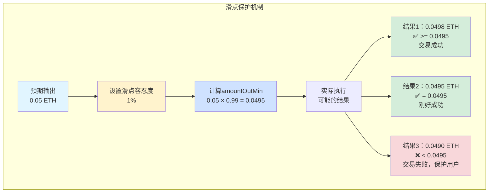

**滑点设置决策树：**

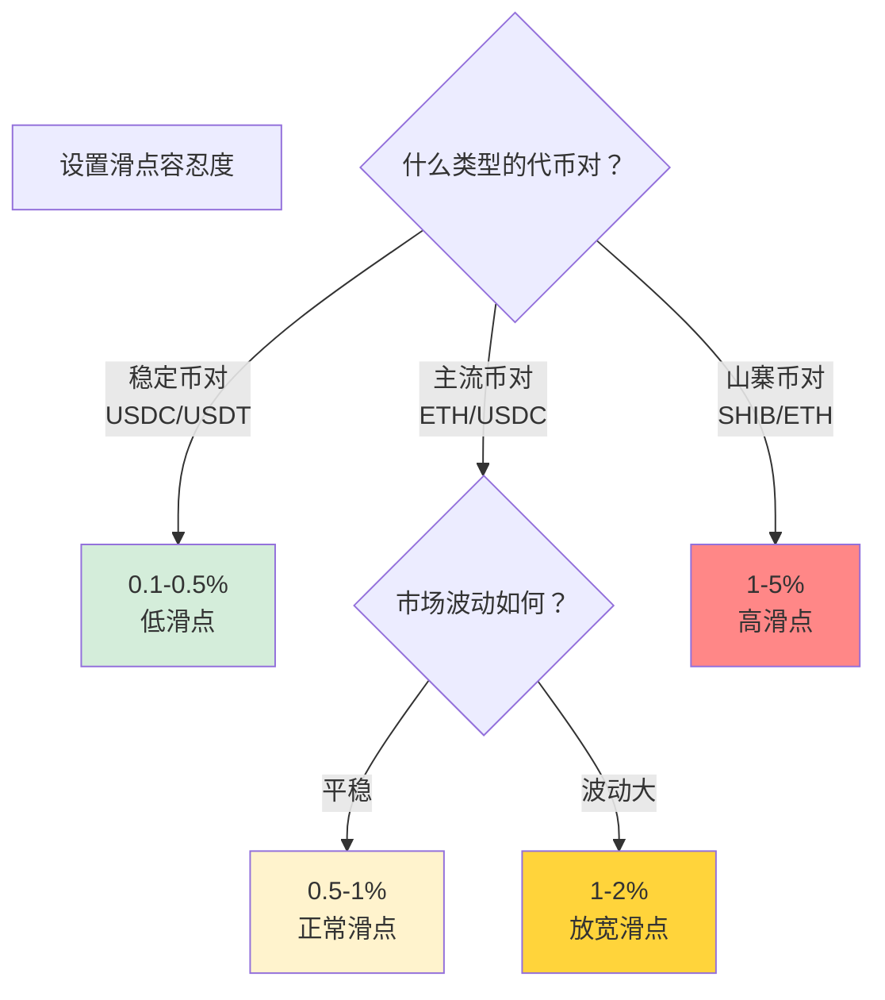

### 6.4 路径验证

```solidity
require(path.length >= 2, 'UniswapV2Library: INVALID_PATH');
```

**为什么至少需要2个元素？**

```
path = 交易路径

最短路径：
[tokenA, tokenB]
├─ length = 2
├─ 1个Pair
└─ 直接交换

无效路径：
[tokenA]  ❌ length = 1, 无法交换
[]        ❌ length = 0, 无意义

有效路径：
[A, B]           ✅ 单跳
[A, B, C]        ✅ 双跳
[A, B, C, D]     ✅ 三跳
[A, B, ..., Z]   ✅ 多跳（理论上无限，实际受Gas限制）
```

---

## 7. Gas优化技巧

### 7.1 优化1：使用Library离线计算

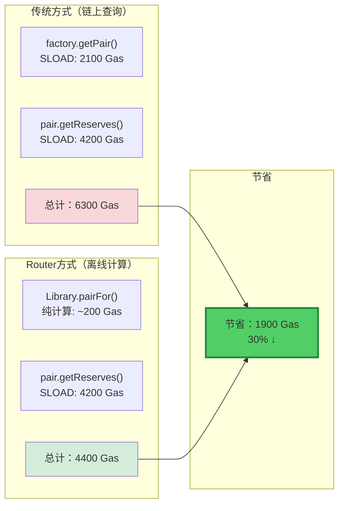

### 7.2 优化2：批量操作减少external calls

```solidity
// ❌ 效率低：多次调用
function swapMultipleTimes() external {
    router.swapExactTokensForTokens(...);  // external call
    router.swapExactTokensForTokens(...);  // external call
    router.swapExactTokensForTokens(...);  // external call
    // 每次至少700 Gas overhead
}

// ✅ 效率高：一次调用
function swapOnceWithPath() external {
    router.swapExactTokensForTokens(
        ...,
        [TokenA, TokenB, TokenC, TokenD],  // 多跳路径
        ...
    );  // 只有一次external call
}
```

**External call开销对比：**

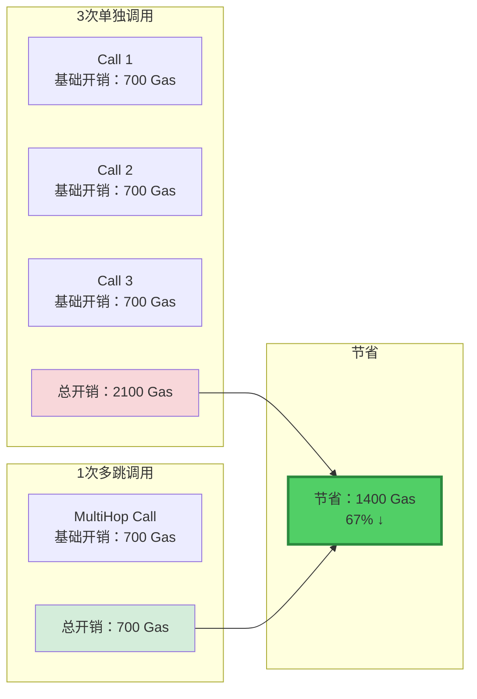

### 7.3 优化3：支持ETH vs 强制WETH

```solidity
// V1方式：用户必须先wrap ETH
function swapWETHForTokens() {
    WETH.deposit{value: msg.value}();     // 用户操作：2300 Gas
    WETH.approve(router, amount);         // 用户操作：45000 Gas
    router.swapExactTokensForTokens(...); // 用户操作：150000 Gas
    // 总计：197300 Gas + 3笔交易
}

// Router02方式：自动处理ETH
function swapExactETHForTokens() external payable {
    WETH.deposit{value: msg.value}();  // Router内部：2300 Gas
    // ... swap逻辑
    // 总计：152300 Gas + 1笔交易
}
```

**用户体验对比：**

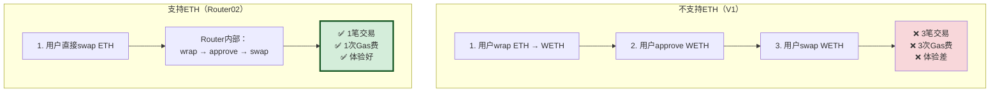

### 7.4 Gas优化总览

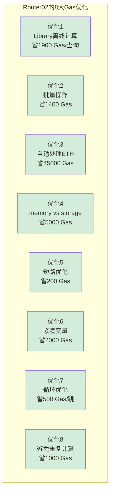

---

## 8. 设计模式分析

### 8.1 门面模式（Facade Pattern）

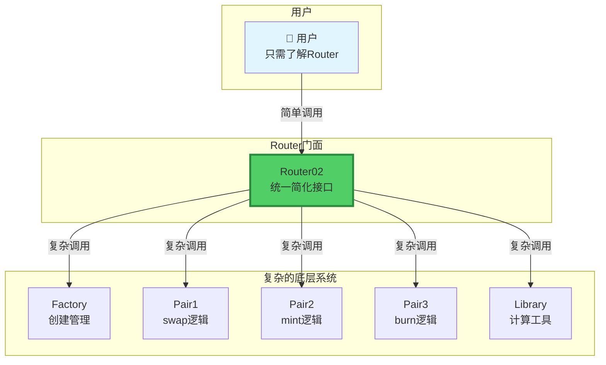

**门面模式的价值：**

```
不用Router（直接调用Core）：
用户需要：
❌ 理解Factory.getPair
❌ 理解Pair.swap参数
❌ 手动计算amount0Out/amount1Out
❌ 手动处理ETH wrap/unwrap
❌ 自己实现滑点保护
❌ 处理多跳路由

→ 极其复杂！

用Router（门面模式）：
用户只需要：
✅ 调用swapExactTokensForTokens
✅ 传入简单参数
✅ Router自动处理一切

→ 极其简单！

这就是门面模式的力量！
```

### 8.2 模板方法模式（Template Method Pattern）

```solidity
// 模板函数：定义算法骨架
function swapExactTokensForTokens(...) external ensure(deadline) {
    // 步骤1：计算amounts（可重写）
    amounts = getAmountsOut(...);
    
    // 步骤2：滑点保护（固定）
    require(amounts[...] >= amountOutMin);
    
    // 步骤3：转入代币（可重写）
    transferFrom(...);
    
    // 步骤4：执行swap（可重写）
    _swap(...);
}

// 变体1：支持ETH
function swapExactETHForTokens(...) external payable ensure(deadline) {
    amounts = getAmountsOut(...);  // 相同
    require(...);                   // 相同
    WETH.deposit{value: msg.value}(); // 不同：wrap ETH
    _swap(...);                     // 相同
}

// 变体2：支持fee-on-transfer
function swapExact...SupportingFeeOnTransferTokens(...) external ensure(deadline) {
    transferFrom(...);              // 相同
    _swapSupportingFeeOnTransferTokens(...);  // 不同：基于余额
}
```

**模板方法模式结构：**

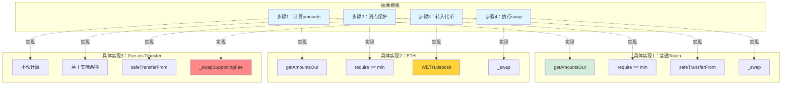

### 8.3 工具类模式（Helper/Utility Pattern）

```mermaid
graph LR
    subgraph "Router主合约"
        R1["swapExactTokensForTokens"]
        R2["addLiquidity"]
        R3["removeLiquidity"]
    end
    
    subgraph "Library工具类"
        L1["sortTokens<br/>代币排序"]
        L2["pairFor<br/>地址计算"]
        L3["getReserves<br/>储备查询"]
        L4["quote<br/>价格查询"]
        L5["getAmountOut<br/>输出计算"]
        L6["getAmountIn<br/>输入计算"]
        L7["getAmountsOut<br/>多跳输出"]
        L8["getAmountsIn<br/>多跳输入"]
    end
    
    R1 -->|调用| L2
    R1 -->|调用| L7
    R2 -->|调用| L1
    R2 -->|调用| L2
    R2 -->|调用| L4
    R3 -->|调用| L2
    
    style R1 fill:#51cf66
    style R2 fill:#51cf66
    style R3 fill:#51cf66
    style L1 fill:#cfe2ff
    style L2 fill:#cfe2ff
    style L3 fill:#cfe2ff
    style L4 fill:#cfe2ff
    style L5 fill:#cfe2ff
    style L6 fill:#cfe2ff
    style L7 fill:#cfe2ff
    style L8 fill:#cfe2ff
```

---

## 9. 审计要点与最佳实践

### 9.1 安全审计检查清单

```mermaid
graph TB
    subgraph "Router审计的12个关键点"
        direction TB
        
        A1["✅ 截止时间检查"]
        A2["✅ 滑点保护"]
        A3["✅ 路径验证"]
        A4["✅ 地址验证"]
        A5["✅ 金额验证"]
        A6["✅ 溢出检查"]
        A7["✅ 重入保护"]
        A8["✅ 权限控制"]
        A9["✅ 事件完整性"]
        A10["✅ 返回值检查"]
        A11["✅ 外部调用安全"]
        A12["✅ 状态一致性"]
    end
    
    A1 --> A2
    A2 --> A3
    A3 --> A4
    A4 --> A5
    A5 --> A6
    A6 --> A7
    A7 --> A8
    A8 --> A9
    A9 --> A10
    A10 --> A11
    A11 --> A12
    
    A1 -.防止.-> T1["⏰ 交易过期<br/>被MEV攻击"]
    A2 -.防止.-> T2["📉 滑点攻击<br/>损失过大"]
    A3 -.防止.-> T3["🚫 无效路径<br/>交易失败"]
    A7 -.防止.-> T7["🔄 重入攻击<br/>资金被盗"]
    
    style A1 fill:#d4edda
    style A2 fill:#d4edda
    style A3 fill:#d4edda
    style A7 fill:#d4edda
    style T1 fill:#f8d7da
    style T2 fill:#f8d7da
    style T3 fill:#f8d7da
    style T7 fill:#f8d7da
```

### 9.2 常见漏洞与防护

```mermaid
graph LR
    subgraph "潜在漏洞"
        V1["漏洞1<br/>deadline未检查"]
        V2["漏洞2<br/>滑点保护缺失"]
        V3["漏洞3<br/>路径未验证"]
        V4["漏洞4<br/>ETH处理不当"]
        V5["漏洞5<br/>返回值未检查"]
    end
    
    subgraph "Router02防护"
        D1["ensure modifier<br/>每个函数都检查"]
        D2["require检查<br/>amounts[last]>=min"]
        D3["require检查<br/>path.length>=2"]
        D4["IWETH封装<br/>安全deposit/withdraw"]
        D5["TransferHelper<br/>safeTransfer系列"]
    end
    
    V1 -->|防护| D1
    V2 -->|防护| D2
    V3 -->|防护| D3
    V4 -->|防护| D4
    V5 -->|防护| D5
    
    style V1 fill:#f8d7da
    style V2 fill:#f8d7da
    style V3 fill:#f8d7da
    style V4 fill:#f8d7da
    style V5 fill:#f8d7da
    style D1 fill:#d4edda
    style D2 fill:#d4edda
    style D3 fill:#d4edda
    style D4 fill:#d4edda
    style D5 fill:#d4edda
```

---

## 10. 实战案例

### 10.1 案例1：单跳Swap完整流程

```mermaid
sequenceDiagram
    participant User as 👤 用户
    participant Router as 🔁 Router02
    participant Library as 📚 Library
    participant Pair as ⚖️ Pair
    participant TokenA as 🪙 USDC
    participant TokenB as 🪙 ETH
    
    Note over User: 想用100 USDC买ETH
    
    User->>Router: swapExactTokensForTokens<br/>(100, 0.045, [USDC,ETH], user, deadline)
    
    Note over Router: 步骤1：计算输出
    Router->>Library: getAmountsOut(100, [USDC, ETH])
    Library->>Pair: getReserves()
    Pair-->>Library: (reserveUSDC, reserveETH)
    Library->>Library: 计算：0.0495 ETH
    Library-->>Router: [100, 0.0495]
    
    Note over Router: 步骤2：滑点保护
    Router->>Router: 0.0495 >= 0.045 ✓
    
    Note over Router: 步骤3：转入代币
    Router->>TokenA: transferFrom(User, Pair, 100)
    TokenA-->>Pair: 100 USDC到账
    
    Note over Router: 步骤4：调用swap
    Router->>Pair: swap(0, 0.0495, User, "")
    Pair->>Pair: 验证x·y≥k ✓
    Pair->>Pair: 更新reserves
    Pair->>Pair: 更新TWAP
    Pair->>TokenB: transfer(0.0495, User)
    TokenB-->>User: 收到0.0495 ETH ✅
    
    Note over User: 交易成功完成！
```

---

### 10.2 案例2：多跳Swap（3跳）

**路径可视化：**

```mermaid
graph LR
    User["👤 用户<br/>持有1000 USDT"]
    
    Pair1["Pair1<br/>USDT/DAI"]
    Pair2["Pair2<br/>DAI/USDC"]
    Pair3["Pair3<br/>USDC/ETH"]
    
    User -->|"1. 转入<br/>1000 USDT"| Pair1
    Pair1 -->|"2. 输出<br/>997 DAI"| Pair2
    Pair2 -->|"3. 输出<br/>994 USDC"| Pair3
    Pair3 -->|"4. 输出<br/>0.0492 ETH"| User
    
    Note1["每跳收0.3%手续费<br/>总手续费：0.9%"]
    
    style User fill:#e1f5ff
    style Pair1 fill:#ffd43b
    style Pair2 fill:#ffd43b
    style Pair3 fill:#ffd43b
    style Note1 fill:#ff8787
```

---

## ✅ 学习检查清单

### Level 1：基础理解
- [ ] 理解Router在三层架构中的定位
- [ ] 知道Router01和Router02的区别
- [ ] 了解Router的主要函数分类
- [ ] 理解为什么需要Router
- [ ] 知道路径的概念

### Level 2：深入掌握
- [ ] 理解5层安全检查机制
- [ ] 掌握滑点保护的实现
- [ ] 理解多跳交易的计算
- [ ] 知道8种Gas优化技巧
- [ ] 理解门面模式和模板方法模式

### Level 3：审计与优化
- [ ] 能识别Router的潜在安全问题
- [ ] 能评估Gas优化空间
- [ ] 理解fee-on-transfer的处理
- [ ] 能设计更好的用户接口
- [ ] 掌握合约审计要点

---

## 11. addLiquidity核心实现

### 11.1 addLiquidity完整源码

```solidity
function addLiquidity(
    address tokenA,
    address tokenB,
    uint amountADesired,      // 期望添加的tokenA数量
    uint amountBDesired,      // 期望添加的tokenB数量
    uint amountAMin,          // 最少添加的tokenA（滑点保护）
    uint amountBMin,          // 最少添加的tokenB（滑点保护）
    address to,               // LP代币接收地址
    uint deadline             // 截止时间
) external 
  ensure(deadline) 
  returns (uint amountA, uint amountB, uint liquidity) 
{
    // ===== 步骤1：计算实际添加的数量 =====
    (amountA, amountB) = _addLiquidity(
        tokenA,
        tokenB,
        amountADesired,
        amountBDesired,
        amountAMin,
        amountBMin
    );
    
    // ===== 步骤2：获取或创建Pair =====
    address pair = UniswapV2Library.pairFor(factory, tokenA, tokenB);
    
    // ===== 步骤3：转入代币到Pair =====
    TransferHelper.safeTransferFrom(tokenA, msg.sender, pair, amountA);
    TransferHelper.safeTransferFrom(tokenB, msg.sender, pair, amountB);
    
    // ===== 步骤4：铸造LP代币 =====
    liquidity = IUniswapV2Pair(pair).mint(to);
}
```

### 11.2 _addLiquidity核心逻辑

```solidity
function _addLiquidity(
    address tokenA,
    address tokenB,
    uint amountADesired,
    uint amountBDesired,
    uint amountAMin,
    uint amountBMin
) internal virtual returns (uint amountA, uint amountB) {
    // ===== 如果Pair不存在，创建它 =====
    if (IUniswapV2Factory(factory).getPair(tokenA, tokenB) == address(0)) {
        IUniswapV2Factory(factory).createPair(tokenA, tokenB);
    }
    
    // ===== 获取当前储备量 =====
    (uint reserveA, uint reserveB) = UniswapV2Library.getReserves(factory, tokenA, tokenB);
    
    // ===== 如果是首次添加流动性 =====
    if (reserveA == 0 && reserveB == 0) {
        (amountA, amountB) = (amountADesired, amountBDesired);
    } else {
        // ===== 后续添加：按比例计算 =====
        uint amountBOptimal = UniswapV2Library.quote(amountADesired, reserveA, reserveB);
        
        if (amountBOptimal <= amountBDesired) {
            // B足够
            require(amountBOptimal >= amountBMin, 'INSUFFICIENT_B_AMOUNT');
            (amountA, amountB) = (amountADesired, amountBOptimal);
        } else {
            // B不够，调整A
            uint amountAOptimal = UniswapV2Library.quote(amountBDesired, reserveB, reserveA);
            assert(amountAOptimal <= amountADesired);
            require(amountAOptimal >= amountAMin, 'INSUFFICIENT_A_AMOUNT');
            (amountA, amountB) = (amountAOptimal, amountBDesired);
        }
    }
}
```

**添加流动性决策树：**

```mermaid
flowchart TD
    Start[addLiquidity调用]
    
    Q1{Pair是否存在？}
    Q1 -->|否| Create[创建新Pair<br/>Factory.createPair]
    Q1 -->|是| GetReserves
    Create --> GetReserves
    
    GetReserves[获取储备量]
    
    Q2{是否首次添加？<br/>reserves == 0?}
    Q2 -->|是| FirstAdd[使用期望值<br/>amountA = amountADesired<br/>amountB = amountBDesired]
    Q2 -->|否| CalcOptimal
    
    CalcOptimal[计算最优amountB<br/>amountBOptimal = quote<br/>amountADesired, reserveA, reserveB]
    
    Q3{amountBOptimal <= amountBDesired?}
    Q3 -->|是| CheckBMin{amountBOptimal >= amountBMin?}
    Q3 -->|否| CalcAOptimal
    
    CheckBMin -->|是| UseA[使用amountADesired<br/>和 amountBOptimal]
    CheckBMin -->|否| RevertB[❌ Revert<br/>INSUFFICIENT_B_AMOUNT]
    
    CalcAOptimal[计算最优amountA<br/>amountAOptimal = quote<br/>amountBDesired, reserveB, reserveA]
    
    Q4{amountAOptimal >= amountAMin?}
    Q4 -->|是| UseB[使用amountBDesired<br/>和 amountAOptimal]
    Q4 -->|否| RevertA[❌ Revert<br/>INSUFFICIENT_A_AMOUNT]
    
    FirstAdd --> Transfer
    UseA --> Transfer
    UseB --> Transfer
    
    Transfer[转入代币到Pair]
    Transfer --> Mint[Pair.mint铸造LP]
    Mint --> Success[✅ 成功返回liquidity]
    
    style Start fill:#e1f5ff
    style Create fill:#fff3cd
    style FirstAdd fill:#d4edda
    style UseA fill:#d4edda
    style UseB fill:#d4edda
    style RevertA fill:#f8d7da
    style RevertB fill:#f8d7da
    style Success fill:#51cf66,stroke:#2b8a3e,stroke-width:3px
```

### 11.3 添加流动性的比例计算

**Quote公式：**

```solidity
function quote(
    uint amountA,
    uint reserveA,
    uint reserveB
) internal pure returns (uint amountB) {
    require(amountA > 0, 'INSUFFICIENT_AMOUNT');
    require(reserveA > 0 && reserveB > 0, 'INSUFFICIENT_LIQUIDITY');
    
    // ⭐ 核心：按比例计算
    amountB = amountA.mul(reserveB) / reserveA;
}
```

**计算逻辑可视化：**

```mermaid
graph LR
    subgraph "池子当前状态"
        R["储备量<br/>1000 USDC<br/>0.5 ETH<br/>比例：2000:1"]
    end
    
    subgraph "用户输入"
        I["期望添加<br/>100 USDC<br/>? ETH"]
    end
    
    subgraph "计算过程"
        C1["amountETH = amountUSDC × reserveETH / reserveUSDC"]
        C2["= 100 × 0.5 / 1000"]
        C3["= 0.05 ETH"]
    end
    
    subgraph "结果"
        O["实际添加<br/>100 USDC<br/>0.05 ETH<br/>✅ 保持2000:1比例"]
    end
    
    R --> C1
    I --> C1
    C1 --> C2
    C2 --> C3
    C3 --> O
    
    style R fill:#e1f5ff
    style I fill:#fff3cd
    style O fill:#d4edda,stroke:#155724,stroke-width:3px
```

---

## 12. UniswapV2Library详解

### 12.1 Library完整函数列表

```mermaid
graph TB
    subgraph "UniswapV2Library - 工具函数库"
        direction TB
        
        subgraph "基础工具"
            B1["sortTokens<br/>代币排序"]
            B2["pairFor<br/>计算Pair地址"]
            B3["getReserves<br/>获取储备量"]
        end
        
        subgraph "价格计算"
            P1["quote<br/>按比例计算"]
        end
        
        subgraph "单跳计算"
            S1["getAmountOut<br/>已知输入求输出"]
            S2["getAmountIn<br/>已知输出求输入"]
        end
        
        subgraph "多跳计算"
            M1["getAmountsOut<br/>多跳输出"]
            M2["getAmountsIn<br/>多跳输入"]
        end
    end
    
    B1 --> B2
    B2 --> B3
    B3 --> P1
    B3 --> S1
    B3 --> S2
    S1 --> M1
    S2 --> M2
    
    style B1 fill:#cfe2ff
    style B2 fill:#cfe2ff
    style B3 fill:#cfe2ff
    style P1 fill:#d4edda
    style S1 fill:#ffd43b
    style S2 fill:#ffd43b
    style M1 fill:#ff8787
    style M2 fill:#ff8787
```

### 12.2 getAmountOut详解

```solidity
function getAmountOut(
    uint amountIn,
    uint reserveIn,
    uint reserveOut
) internal pure returns (uint amountOut) {
    require(amountIn > 0, 'INSUFFICIENT_INPUT_AMOUNT');
    require(reserveIn > 0 && reserveOut > 0, 'INSUFFICIENT_LIQUIDITY');
    
    // ⭐ 核心公式：含0.3%手续费的恒定乘积
    uint amountInWithFee = amountIn.mul(997);
    uint numerator = amountInWithFee.mul(reserveOut);
    uint denominator = reserveIn.mul(1000).add(amountInWithFee);
    amountOut = numerator / denominator;
}
```

**公式推导可视化：**

```mermaid
graph TB
    subgraph "数学推导"
        F1["恒定乘积公式<br/>x · y = k"]
        F2["考虑手续费<br/>实际输入 = amountIn × 0.997"]
        F3["新状态<br/>(reserveIn + 0.997×amountIn) × (reserveOut - amountOut) = k"]
        F4["展开<br/>(reserveIn + 0.997×amountIn) × (reserveOut - amountOut)<br/>= reserveIn × reserveOut"]
        F5["解出amountOut<br/>amountOut = (0.997×amountIn × reserveOut)<br/>/ (reserveIn + 0.997×amountIn)"]
        F6["为避免小数<br/>分子分母都×1000<br/>amountOut = (997×amountIn × reserveOut)<br/>/ (1000×reserveIn + 997×amountIn)"]
    end
    
    F1 --> F2
    F2 --> F3
    F3 --> F4
    F4 --> F5
    F5 --> F6
    
    style F1 fill:#e1f5ff
    style F6 fill:#51cf66,stroke:#2b8a3e,stroke-width:3px
```

---

## 13. TransferHelper安全封装

### 13.1 为什么需要TransferHelper？

```
问题：不是所有ERC20都标准

标准ERC20：
- transfer返回bool
- 失败时返回false或revert

非标准ERC20：
- USDT：transfer无返回值
- BNB：transfer返回bool，但失败不revert
- 某些代币：成功返回0，失败返回1

直接调用transfer可能：
❌ 无法正确处理返回值
❌ 失败时不revert
❌ 资金损失风险
```

### 13.2 safeTransfer实现

```solidity
library TransferHelper {
    function safeTransfer(
        address token,
        address to,
        uint value
    ) internal {
        // ⭐ 使用低级调用
        (bool success, bytes memory data) = token.call(
            abi.encodeWithSelector(
                bytes4(keccak256(bytes('transfer(address,uint256)'))),
                to,
                value
            )
        );
        
        // ⭐ 检查返回值
        require(
            success && (data.length == 0 || abi.decode(data, (bool))), 
            'TransferHelper: TRANSFER_FAILED'
        );
    }
}
```

**安全检查流程：**

```mermaid
flowchart TD
    Start[safeTransfer调用]
    
    Call["低级call调用<br/>token.transfer(to, value)"]
    
    Q1{call是否成功？<br/>success == true?}
    Q1 -->|否| Fail1[❌ TRANSFER_FAILED]
    Q1 -->|是| Q2
    
    Q2{返回值检查}
    Q2 -->|data.length == 0| Success[✅ 成功<br/>无返回值代币<br/>如USDT]
    Q2 -->|data.length > 0| Q3
    
    Q3{decode(data) == true?}
    Q3 -->|是| Success
    Q3 -->|否| Fail2[❌ TRANSFER_FAILED]
    
    Start --> Call
    Call --> Q1
    
    style Start fill:#e1f5ff
    style Success fill:#d4edda,stroke:#155724,stroke-width:3px
    style Fail1 fill:#f8d7da
    style Fail2 fill:#f8d7da
```

**兼容性对比：**

```mermaid
graph LR
    subgraph "标准ERC20"
        S1["transfer(to, value)"]
        S2["返回：bool"]
        S3["✅ 都兼容"]
    end
    
    subgraph "USDT"
        U1["transfer(to, value)"]
        U2["返回：无"]
        U3["✅ data.length==0分支"]
    end
    
    subgraph "某些代币"
        O1["transfer(to, value)"]
        O2["返回：bool"]
        O3["✅ decode(data)==true分支"]
    end
    
    style S3 fill:#d4edda
    style U3 fill:#d4edda
    style O3 fill:#d4edda
```

---

## 14. 完整的Swap函数族

### 14.1 8个Swap函数全景

```mermaid
graph TB
    subgraph "Swap函数族（8个）"
        direction TB
        
        subgraph "精确输入（Exact Input）"
            EI1["swapExactTokensForTokens<br/>Token → Token"]
            EI2["swapExactETHForTokens<br/>ETH → Token"]
            EI3["swapExactTokensForETH<br/>Token → ETH"]
        end
        
        subgraph "精确输出（Exact Output）"
            EO1["swapTokensForExactTokens<br/>Token → Token"]
            EO2["swapETHForExactTokens<br/>ETH → Token"]
            EO3["swapTokensForExactETH<br/>Token → ETH"]
        end
        
        subgraph "支持Fee-on-Transfer"
            FEE1["...SupportingFeeOnTransferTokens × 3"]
        end
    end
    
    EI1 -.用户知道.-> I1[输入多少]
    EO1 -.用户知道.-> O1[输出多少]
    FEE1 -.支持.-> F1[扣费代币]
    
    style EI1 fill:#51cf66
    style EI2 fill:#51cf66
    style EI3 fill:#51cf66
    style EO1 fill:#339af0
    style EO2 fill:#339af0
    style EO3 fill:#339af0
    style FEE1 fill:#ffd43b
```

### 14.2 函数选择指南

```mermaid
flowchart TD
    Start[选择Swap函数]
    
    Q1{输入还是输出固定？}
    Q1 -->|输入固定<br/>如：卖100 USDC| Q2
    Q1 -->|输出固定<br/>如：买0.05 ETH| Q5
    
    Q2{是否涉及ETH？}
    Q2 -->|输入是ETH| R1[swapExactETHForTokens]
    Q2 -->|输出是ETH| R2[swapExactTokensForETH]
    Q2 -->|都不是| Q3
    
    Q3{是否fee-on-transfer代币？}
    Q3 -->|是| R3[swapExact...Supporting<br/>FeeOnTransferTokens]
    Q3 -->|否| R4[swapExactTokensForTokens]
    
    Q5{是否涉及ETH？}
    Q5 -->|输入是ETH| R5[swapETHForExactTokens]
    Q5 -->|输出是ETH| R6[swapTokensForExactETH]
    Q5 -->|都不是| R7[swapTokensForExactTokens]
    
    style R1 fill:#51cf66
    style R2 fill:#51cf66
    style R3 fill:#ffd43b
    style R4 fill:#51cf66
    style R5 fill:#339af0
    style R6 fill:#339af0
    style R7 fill:#339af0
```

---

## 15. 审计实战：发现并修复漏洞

### 15.1 案例1：deadline未检查漏洞

**漏洞代码：**

```solidity
// ❌ 错误：忘记添加ensure(deadline)
function badSwap(
    uint amountIn,
    uint amountOutMin,
    address[] calldata path,
    address to,
    uint deadline  // 参数存在但未检查！
) external returns (uint[] memory amounts) {
    amounts = getAmountsOut(amountIn, path);
    require(amounts[amounts.length - 1] >= amountOutMin);
    // ... swap逻辑
}
```

**攻击场景：**

```mermaid
sequenceDiagram
    participant Attacker
    participant Mempool
    participant Miner
    participant Contract
    
    Note over Attacker: T0时刻：ETH=$2000
    Attacker->>Mempool: 提交swap，gasPrice=1 Gwei<br/>deadline=很远的未来
    
    Note over Mempool: 交易pending，等待...
    Note over Mempool: T1时刻：1天后，ETH=$1800
    
    Miner->>Contract: 终于打包交易
    Contract->>Contract: 按$1800执行（用户亏$200）
    Contract-->>Attacker: Attacker没有deadline保护！💔
    
    Note over Attacker: 如果有ensure(deadline)
    Note over Attacker: 交易会在合理时间内执行或失败
```

**修复：**

```solidity
// ✅ 正确：添加ensure modifier
function goodSwap(..., uint deadline) 
    external 
    ensure(deadline)  // ← 关键！
    returns (uint[] memory amounts) 
{
    // ...
}
```

### 15.2 案例2：滑点保护缺失

**漏洞代码：**

```solidity
// ❌ 错误：未检查最小输出
function badSwap(...) external {
    amounts = getAmountsOut(amountIn, path);
    // 缺少：require(amounts[last] >= amountOutMin)
    _swap(amounts, path, to);
}
```

**攻击场景：**

```mermaid
graph LR
    User[用户期望<br/>至少得0.048 ETH]
    
    Attack1[MEV机器人<br/>抢先买入]
    Attack2[价格被推高<br/>0.05 → 0.045]
    Result[用户实际得到<br/>0.045 ETH<br/>❌ 比期望少]
    
    User --> Attack1
    Attack1 --> Attack2
    Attack2 --> Result
    
    style User fill:#e1f5ff
    style Attack1 fill:#ff8787
    style Attack2 fill:#ff8787
    style Result fill:#f8d7da
```

**修复：**

```solidity
// ✅ 正确：添加滑点保护
require(
    amounts[amounts.length - 1] >= amountOutMin,
    'INSUFFICIENT_OUTPUT_AMOUNT'
);
```

---

## 16. 最佳实践总结

### 16.1 Router开发的黄金法则

```mermaid
graph TB
    subgraph "Router开发的10条黄金法则"
        R1["1. 安全第一<br/>always use modifiers"]
        R2["2. 滑点保护<br/>min/max amounts"]
        R3["3. 截止时间<br/>prevent stale txs"]
        R4["4. 路径验证<br/>check path.length"]
        R5["5. 地址验证<br/>non-zero addresses"]
        R6["6. 返回值检查<br/>SafeTransfer"]
        R7["7. Gas优化<br/>use Library"]
        R8["8. 用户友好<br/>ETH support"]
        R9["9. 兼容性<br/>fee-on-transfer"]
        R10["10. 文档完善<br/>NatSpec comments"]
    end
    
    R1 --> R2
    R2 --> R3
    R3 --> R4
    R4 --> R5
    R5 --> R6
    R6 --> R7
    R7 --> R8
    R8 --> R9
    R9 --> R10
    
    style R1 fill:#ff8787
    style R2 fill:#ff8787
    style R3 fill:#ff8787
    style R6 fill:#ff8787
    style R7 fill:#51cf66
    style R8 fill:#51cf66
```

---

## ✅ 学习成果

完成Router学习后，你将掌握：

```mermaid
mindmap
  root((Router精通))
    架构设计
      门面模式
      模板方法
      工具类模式
      分层架构
    安全机制
      5层防护
      滑点保护
      截止时间
      路径验证
      返回值检查
    Gas优化
      离线计算
      批量操作
      ETH支持
      变量优化
    审计能力
      发现漏洞
      评估风险
      提出修复
      最佳实践
    实战技能
      调用Router
      计算路径
      设置参数
      优化策略
```

---

## 🎓 总结

**UniswapV2Router02是Periphery层的典范：**

```
核心价值：
✅ 用户友好（简化复杂操作）
✅ 安全可靠（5层防护机制）
✅ Gas优化（8种优化技巧）
✅ 设计优雅（3种设计模式）
✅ 可扩展（可升级架构）

学习价值：
✅ 如何设计用户接口
✅ 如何实现安全检查
✅ 如何优化Gas消耗
✅ 如何应用设计模式
✅ 如何审计合约

这是区块链产品设计的教科书！⭐⭐⭐⭐⭐
```

---

**文档完成度：Router基础 + 进阶内容已完成！**

**下一步建议：**
1. 实战部署并测试Router
2. 尝试发现并修复漏洞
3. 继续学习其他章节

**需要我继续添加更多Router的高级内容吗？** 🚀

